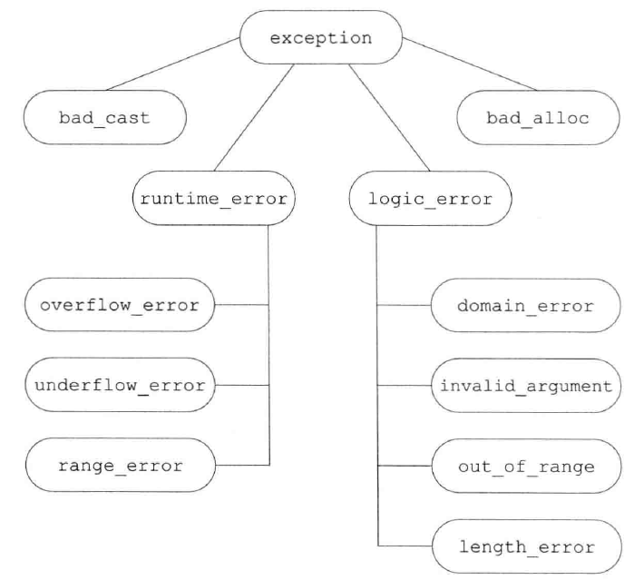

> 2019-06-15 21:38:56 

## 第18章 用于大型程序的工具

### 18.1 异常处理

_参考链接：_ [C++异常处理（try catch）从入门到精通](http://c.biancheng.net/cplus/exception/);

注意： 

- 一个异常如果没有被捕获，则它将终止当前的程序
- 在钱展开的过程中，运行类类型的局部叶象的析构函数，因为这些析构函数是自动执行的，所以它们不应该抛出异常_一旦在钱展开的过程中析构函数抛出了异常，并且析构函数自身没能捕获到该异常，则程序将被终止。
- 抛出指针要求在任何时应的处理代码存在的地方，指针所指的对象都必须存在。
- 通常情况下，如果catch接收的异常与额某个继承体系有关，则最好将该catch的参数定义成类型引用
- 如果在多个catch语句的类型之间存在着继承关系，则我们应该把继承链最底端的类(most derived type )放在前面，而将继承链最顶端的类(least derivedtype)放在后面。

异常类型和catch声明的类型是精确匹配的：

- 允许从非常量向常量的类型转换
- 允许派生类向基类的转换
- 数组被转换成指向数组(元素)类型的指针，函数被转换成指向该函数类型的指针。
- 处理构造函数初始值异常的唯一方法是讲构造函数写成try语句块

`catch(...)`可以匹配任意的异常类型。其通常与重新抛出语句一起使用，其中catch执行当前局部能完成的工作，随后重新抛出异常;当其与其它几个`catch`语句一起出现的时候，必须放在最后否则后面的语句永远不会被执行。

```c++
void manip(){
    try{
        //这里的操作将引发并抛出一个异常
    }
    catch (...){
        //处理异常的某些特殊操作
        
        throw;
    }
}
```

注意： 由于构造函数执行的时候，try语句可能还未能成功初始化，所以不能正常的抛出异常。我们必须将构造函数携程 **函数try语句块**的形式。才能正真使用。例：

```c++
temlate <typename T>
Blob<T>::Blob(std::initializer_list<T> il) try :
    data(std::make_shared<std::vector<T>>(il)){
        // 函数体
        
    } catch (const std:bad_alloc &e){handle_out_of_memory(e);}

```
##### 18.1.4 noexcept 异常说明

C++11新标准中，可以通过提供noexceot说明，指定某个函数不会抛出异常。使用时关键字紧跟函数的参数列表后面。

```c++
void recoup(int) noexcept; //不会抛出异常

void alloc(int);  //可能抛出异常

```

注意：

- 通常情况下，编译器不能也不必在编译时验证异常说明。
- noexcept有两层含义:当跟在函数参数列表后面时它是异常说明符;而当作为noexcept异常说明的bool实参出现时，它是一个运算符。

##### 18.1.5 异常类层次



### 18.2 命名空间

#### 18.2.2 命名空间的定义
```
namespcae cplusplus_primer{
    ...
}
```

注意：

- 命名空间作用域后面无须分号；每个命名空间都是一个作用域
- 命名空间可以是不连续的
    + 命名空间的部分成员的作川是定义类，以及声明作为类接口的函数及对象，则这个 成员应该放置几头文件中，这namespace,头文件将被包含在使用了这些成员的文件中。
    + 命名空间成员的z义部分则置于另外的源文件中。
    + 在程序III某此实体只能定义一次:如非内联函数、静态数据成员、变量等。
- 定义多个类型不相关的命名空间应该使用单独的文件分别表示每个类型(或关联类型构成的集合)。
- 对于多个命名空间使用时可以使用`::spcaename::subspacename`的方式来寻找命名空间。
- 模板特例化必须定义在原始模板所属的命名空间中。
- 使用`::`全局作用域，隐式的将函数添加到全局作用域中。
- 未命名的命名空间仅仅在特定的文件内部有效，其作用范围不会横跨多个文件。

**内联命名空间**

内联命名空间和普通的嵌套命名空间不同，内联命名空间可以被外层命名空间直接使用。无需使用外层命名空间名字，就可以直接访问它。

```c++
inline namespace FifthEd{
    //使用内联命名空间
    
}

namespace FifthEd{ //隐式内联

    class Query_base{
        /**/

    };
    //其它相关命名
    
}
```

#### 18.2.2 使用命名空间成员

可以使用通用赋值给命名空间别名,例如：
```c++
namespace primer=cplusplus

namespace Qlib=cplusplus_primer::Querylib;
```
注意避免使用using 指示

#### 18.2.3 类、命名空间与作用域

对命名空间内部名字的查找遵循常规的查找规则:即由内向外依次查找每个外层作川域。外层作川域也可能是一个或多个嵌套的命名空间，直到最外层的个局命名空间查找过程终止。只有位于开放的块中且在使用点之前声的名字才被考虑:

可以从函数的限定名推断出查找名字时检查作用域的次序，限定名以相反次序指出被查找的作用域。

#### 18.2.4 重载与命名空间

 一个。using明引入的函数将重载声明语句所属作作用域已有的其他同名函数。如果using声明出现在局部作川域中，则引入的名字将隐藏外层作用域的相关声明。如果using声明所在的作用域中已经有一个函数与新引入的函数同名且形参列表相同，则该using声明将引发错误。除此之外，using声明将为引入的名字添加额外的重载实例，并最终扩充候选函数集的规模。

using指示将命名空间的成员提升到外层作用域中，如果命名空间的某个函数与该命名空间所属作用域的函数同名，则命名空间的函数将被添加到重载集合。

如果存在多个using指示，则来自每个命名空间的名字都会成为候选函数集的一部分。

### 18.3 多重继承与虚继承

注意：

- 如果从多个基类中继承了相同的构造函数（即形参列表完全相同），则程序将产生错误。
- 当一个类拥有多个基类时，有可能出现派生类从两个或更多基类中继承了同名成员的情况、此时，不加前缀限定符直接使用该名字将引发二义性。

#### 18.3.4 虚继承

- 在默认情况下，派生类中含有继承链上每个类对应的f-部分.如果某个类派生类，中出现了多次，则派之卜类中将包含该类的多个子对象。
- 为了解决上述多次继承的情况，设置了 **虚继承**它的是令某个类做出声明，承诺愿意共享它的基类。其中，共享的基类子对象称为虚基类( virtual base class ) 。在这种机制下，不论虚基类在继承体系中出现了多少次，在派生中都只包含唯一一个共享的虑基类子对象。
- 虚派生只影响从指定了虚基类的派生类中进一步派生出的类，它不会影响派生类本身。
- 虚继承在后续的派生类中共享虚基类的同一份实例。
- 对于相同虚函数的继承，可能存在二义性，最好的办法是在派生类中自定义实例。

#### 18.3.5 构造函数与虚继承

含有虚基类的对象的构造书序与一般的顺序稍有叙别：首先使用提供给最低层派生类（最低层公共部分）构造函数的初始值初始化该对象的虚基类子部分，接下来按照直接基类在派生表中出现的次序从左向右对其进行初始化。

虚基类总是先于非虚基类构造，与它们在继承体系中的次序和位置无关。


## 第 19 章 特殊工具与技术

### 19.1 控制内存分配

new 的过程：

- 分配内存空间
- 赋予初值。
- 指向该指针。

delete过程

- 执行指针所指对象的析构函数
- 调用标准函数库，释放指针。

**当只传入一个指针类型的实参时，定位new表达式构造对象但是不分配内存。**
**调用析构函数会销毁对象，但是不会释放内存。**

### 19.2 运行时类型识别

运行时类型识别(run-time type identification,  RTTI)的功能由两个运算符实现:

- typeid 运算符，用于返回表达式的类型；可以作用于任意类型的表达式。
- dynamic_cast 运算符，用于将基类的指针或引用安全的转换成派生类的指针或者引用。
- 在条件部分执行dynamic cast操作可以确保类型转换和结果检查在同一条表达式中完成。
- 当typeid作用于指针时(而非指针所指的对象)，返回的结果是该指针的静态编译时类型。

`type_info`类，用来鉴定类型是否相同。

type_info类在不同的编译器上有所区别。有的编译器提供了额外的成员函数以提供程序中所用类型的额外信息。读者应该仔细阅读你所用编译器的使用手册，从而获取关于type-info的更多细节。

### 19.3 枚举类型

C++包含两种枚举类型：限定作用域的和不限定作用域的。
限定作用域的枚举类型： enum class(struct) {...}。不限定枚举可以省略掉关键字class，枚举类型名字可选。

```c++
enum color {red,yellow,green};   //不限定作用域的枚举类型

enum stoplight {red,yellow,green};  //错误：重复定义了枚举成员

enum class peppers {red,yellow,green}; //正确：枚举成员被隐藏了

color eyes=green;  //正确： 不限定作用域的枚举类型位于有效的作用域中

pepper p=green;   // 错误：pepper的枚举成员不在有效的作用域中

color hair=color::red;  //正确：允许显式地访问枚举成员

peppers p2=pepper::red;  //正确：使用pappers的red

//指定序号

enum class intType{
    charTyp=8,shortTyp=16,intTyp=16,
    longTyp=32,long_longTyp=64
}

//利用冒号指定类型

enum intValues:unsigned long long {
    charType=255,shortTyp=65535,
    ......
}
```

注意： 

- 即使某个整型值恰好与枚举成员的值相等，它也不能作为函数的enum实参使用。
- 但是可以使用强制类型转换，将enum提升成int或更大的整型。

### 19.4 指针类成员

**成员指针** 是指可以指向类的排静态成员的指针。类的静态成员不属于任何对象。

我们令其指向类的某个成员，但是不指定该成员所属的对象；直到使用成员指针时，才提供成员所属的对象。

#### 19.4.1 数据成员指针

与普通指针不同的是成员指针必须包含成员所属的类

```c++
//pdata可以指向一个常量(非常量)Screen对象的string成员

const string Screen::*pdata;

pdata=&Screen::contents;//获取成员对象

auto pdata=&Screen::contents;
//使用成员指针

Screen myScreen,*pScreen=&myScreen;
//.*解引用pdata以获得myScreen对象的contents成员

auto s=primaryScreen.*pdata;
//->*解引用pdata以获得pScreen所指对象的contents成员

s=pScreen->*pdata;

```

#### 19.4.2 成员函数指针

```c++
//利用auto关键字指向一个常量成员函数
//前提是该函数不接受任何实参，并且返回一个char

auto pmf=&Screen::get_cursor;
//指向含有两个形参的get

char (Screen::*pmf2)(Screen::pos,Screen::pos) const;
pmf2=&Screen::get;
//成员函数的使用

Screen myScreen，*pScreen=&myScreen;
//通过pScreen 所指的对象pmf所指的函数

char c1=(pScreen->*pmf)();
//通过myScreen对象将实参0,0传给含有两个形参的get函数

char c2=(myScreen.*pmf2)(0,0);
//使用成员指针的类型别名

//Action 是一种可以指向Screen成员函数的指针，它接受两个pos实参，返回一个char

using Action=char (Screen::*)(Screen::pos,Screen::pos) const;

Action get=&Screen::get;  //指向Screen的get成员。

//使用函数指针成员表
class Screen{
public:
    Screen& home();  //光标移动函数

    Screen& forward();
    Screen& back();
    Screen& up();
    Screen& down();

    //Action 是一个指针，可以用任意一个光标移动函数对其赋值

    using Action=Screen& (Screen::*)();
    //具体移动方向指定
    
    enum Directions {HOME,FORWARD,BACK,UP,DOWN};
    Screen& move(Directions){
        //运行this对象中索引值为cm的元素
        
        return (this->*Menu[cm])();  //Menu[cm]指向一个函数成员

    };
private:
    static Action Menu[];  //函数表

}

Screen myScreen;

myScreen.move(Screen::HOME);  //调用myScreen.home

myScreen.move(Screen::DOWN);  //调用myScreen.down

//初始化函数表

Screen::Action Screen::Menu[]={
    &Screen::home,
    &Screen::forword,
    ...
};
```

#### 19.4.3 将成员函数用作可调用对象

**使用function生成一个可调用对象**

使用标准模板库function 可以凶函数指针获取可调用对象。

```c++
function<bool (const string&)> fcn=&string::empty;
find_if(svec.begin(),svec.end(),fcn);
```

**使用mem_fn生成一个可调用对象**

```c++
auto f=mem_fn(&string::empty);
```

**使用bind生成一个可调用对象**

```c++
auto it=find_if(svec.begin(),svec.end(),bind(&string::empty,_1));

```


### 19.5 嵌套类

一个类可以定义在另外一个类的内部。可以在类之外声明一个类内的嵌套类：
`class class1_name::class2_name{}`

- 在嵌套类在其外层类之外完成真正的定义之前，它都是一个不完全类型。
- 嵌套类的作用域查找，比一般类多了一个外层类作用域的查找。
- 外层类可以直接使用嵌套类的名字。
- 外层类和嵌套类相互独立，都各自只包含自己的成员名字。

### 19.6 union: 一种节省空间的类

 联合(( union )是一种特殊的类一个union 可以有多个数据成员，但是在仟愈时刻只有一个数据成员可以有直。当我们给union的某个成员赋值之后, 该union的其它成员就变成末定义的状态了。分配给一个union对象的存储空间至少要能容纳它的最大的数据成员。和其他类一样，一个union定义了一种新类型。

**匿名union**

是一个未命名的union,并且在符号之间没有任何声明。一旦我们定义了一个匿名union，编译器自动地位该union创建一个未命名的对象。在union的定义所在的作用域内该union的成员都是可以直接访问的。

注意：

- 匿名union不能包含受保护的成员或者私有成员，也不能定义成员函数。
- union中成员类中成员没有定义默认构造函数，则编译器删除类中的该成员。

### 19.7 局部类

定义在某个函数内部的类称为，局部类。局部类定义的类型只在定义它的作用域内可见。

注意：

- 局部类的所有成员(包括函数在内)都必须完整定义在类的内部。因此，局部类的作用与嵌套类相比相差很远。
- 局部类只能访问外层作用域定义的类型名、静态变量以及枚举成员。
- 局部类不能使用函数作用域中的变量。
- 常规的访问保护规则对局部类同样适用。

### 19.8 固有的不可移植的特性

是指因机器而异常的特性，当机器转移时，需要重新编写该程序。

#### 19.8.1 位域

**位域在内存中的布局是与机器相关的**

位域的类型必须是整型或枚举类型。因为带符号位域的行为是由具体实现确定的。
位域的声明形式是成员名字后紧跟一个冒号以及一个常量表达式，该表达式用于指定成员所占的二进制位数。

```c++
typedef unsigned int Bit;

class File{
    Bit mode: 2;  //mode占2位
    
    Bit modified:1;  //占1位
    
    ...

public:
    //文件类型以八进制表示
    
    enum modes{READ=01,WRITE=02,EXECUTE=03};
}
```
注意： 通常情况下最好将位域设为无符号类型，存储在带符号类型中的位域的行为将因具体实现而定。

#### 19.8.2 volatile 限定符

volatile的确切含义与机器有关，只能通过阅读编译器文档来理解、要想让使用了volatile的程序在移植到新机器或新编译器后仍然有效，通常需要对该程序进行某些改变。关键字volatile告诉编译器不应对这样的对象进行优化。

注意：

- 关键字volatile告诉编译器不应对这样的对象进行优化。
- 合成的拷贝对volatile对象无效。
- volatile 不能使用合成的拷贝/移动构造函数和赋值运算符初始化。

#### 19.8.3 链接指示: extern "C"

要想把c++代码和其他语言(包括c语言)编写的代码放在一起使用.要求我们必须有权访问该语言的编译器，并且这个编译器与当前的c++编译器是兼容的。

当一个#include指示被放置在复合链接指示的花括号中时，文件中的所有普通函数声明都被认为是由链接指示的语言编写的。链接指示可以嵌套，因此如果头文件包含自带链接指示的函数，则该函数的链接不受影响。

```c++
ectern "C"{
    #include <string.h>
}
```

**指向extern "C"函数的指针**

```c++
//pf指向一个c函数，该函数接受一个int返回void

extern "C" void (*pf)(int);

void (*pf1)(int);  //指向一个c++函数
```

注意：

- 有的C++编译器会接受之前的这种赋值操作并将其作为对语言的扩展，尽管从严格意义上来看它是非法的。
- 链接指示对整个声明都有效。当我们使用链接指示时，它不仅仅对函数有效，而且对作为返回内省或形参类型的函数指针也有效。

**导出C++函数到其他语言**
通过使用链接器指示对函数进行定义，我们可以令一个C++函数在其它语言编写的程序中使用

```c++
//calc 函数可以被C程序调用

extern "C" double calc(double dparm){
    /**/
}
```
**有时可以使用预处理器定义`__cplusplus`来有条件的包含代码**
```c++

#if defined(__cplusplus) || defined (c_plusplus)
extern "C"
{
#endif
#include <stdio.h>
#include <stdlib.h>
#include "libavcodec/avcodec.h"
#include "libavformat/avformat.h"
#include "libavutil/pixfmt.h"
#include "libavutil/mathematics.h"
#include "libavutil/time.h"
#include "libswscale/swscale.h"

#if defined(__cplusplus) || defined (c_plusplus)
}
#endif
```

注意：extern "..."的重载和链接与语言本身有关。

