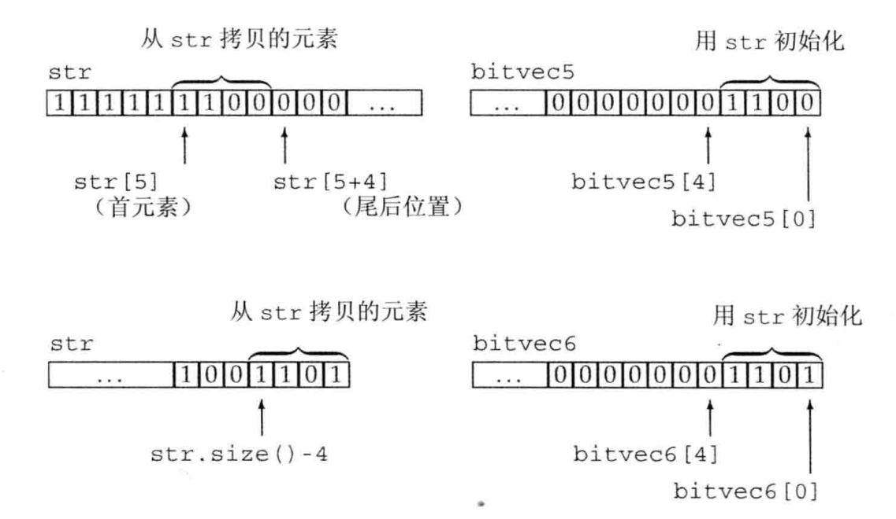

> 2019-06-08 18:25:56

# 第IV部分高级主题

## 第17 章标准库特殊设施
标准库设施是:`tuple` 、`bittest`、随机生成数及正则表达式。

### 17.1 tuple 类型
tuple类似于pair是将一些数据组合成单一的对象。可以将其看做一个“快速随意”的数据结构

**tuple支持的操作**

|操作|含义|
|:---|:---|
|`tuple<T1,T2,...,Tn> t;`|t是一个tuple，成员数为n，第i个成员的类型为Ti。所有成员都进行值初始化|
|`tuple<T1,T2,...,Tn> t(v1,v2,...,vn);`|t是一个tuple，成员数为n，第i个成员的类型为Ti。所有成员都使用vi进行值初始化|
|`make_tuple(v1,v2,...,vn)`|返回一个给定初始值初始化的tuple。tuple的类型从初始值的类型推断|
|`t1=t2`|当两个tuple具有相同数量的成员且成员对应相等时|
|`t1!=t2`|当两个tuple具有相同数量的成员且成员对应相等时之外的情况|
|`t1 relop t2`|tuple的关系运算符使用字典序。两个tuple必须具有相同数量的成员。使用<运算符比较t1的成员和t2中的对应成员|
|`get<i>(t)`|返回t的第i个数据成员的引用；如果t是一个左值，结果是一个左值引用；否则，结果是一个右值引用。tuple的所有成员都是public的|
|`tuple_size<tupleType>::value`|一个类模板，可以通过一个tuple类型来初始化。它有一个名为value的public constecpr static 数据成员，类型为size_t,表示给定tuple类型中成员的数量。|
|`tuple_element<i,tupleType>::type`|一个类模板，可以通过一个整形常量和一个tuple类型来初始化。它有一个名为`type`的`public`成员，表示给定`tuple`类型中指定成员的类型。|

使用示例：

```c++
//定义和初始化

tuple<size_t,size_t,size_t> threeD;  //成员都初始化为0

tuple<string,vector<double>,int,list<int> > someVal("constants",{3.14,2.718},42,{0,1,2,3,4,5});

tuple<size_t,size_t,size_t> threeD2{1,2,3};

auto item=make_tuple("0-999-78345-X",x,20.00); 

//成员的访问

auto book=get<0>(item);  //返回第一个成员

//细节信息访问

typedef decltype(item) trans;  // trans 是item的类型

//返回trans类型对象中成员的数量

size_t sz=tuple_size<trans>::value; //返回3

//获取第二个成员的类型

tuple_element<1,trans>::type cnt=get<1>(item);  // cnt 是一个int

```

**tuple常见用法是，函数返回多个值**

### 17.2 bitset类型
标准库定义了`bitset`类，使得位运算的使用更为容易，并且能够处理超过最长整形类型大小的位集合。`bitset`类定义在头文件`bitset`中。`bitset`类是一个模板，它类似`array`类，具有固定的大小。可以在定义时声明：

```c++
bit<32> bitvec(1U);  // 32位；低位为1，其他位为0
```
**大小必须是一个常量表达式**

**初始化bitset方法**

|操作|含义|
|:---|:---|
|`bitset<n> b;`|b有n位；每位均为0.此构造函数是一个`constexpr`|
|`bitset<n> b(u);`|b是`unsigned long long`值u的低n位的拷贝。如果n大于`unsigned long long `的大小，则b中超出的高位被置为0.此构造函数是一个`constexpr`|
|`bitset<n> b(s,pos,m,zero,one);`|b是`string s`从位置`pos`开始m个字符符拷贝。s只能包含字符`zero`或`one`;如果s包含任何其它字符，构造函数会抛出`invalid_argument`异常。字符在b中分别保存为`zero`和`one`。pos默认为0，m默认为string::npos,zero 默认为`0`,`one`默认为`1`|
|`bitset<n> b(cp,pos,m,zero,one);`|与上一个构造函数相同，但从`cp`指向的字符串数组中拷贝字符，如果m未提供，则cp必须指向一个c风格字符串，如果提供了m,则从cp开始必须至少有m个zero或one字符|

使用示例:

```c++
// bitvec1初始值小；初始值中的高位被丢弃

bitset<13> bitvec1(0xbeef);  // 二进制位序列为 1111011101111

//比初始值大；高位被置为0

bitset<20> bitvec2(0xbeef); // 二进制位序列为 0000101111011101111

//64 位机中， long long 0ULL 是64个0比特，因此～0ULL是64个1

bitset<128> bitvec3(~0ULL); // 0~63 位为1; 63~127位为0

//string 初始化 bitset

bitset<32> bitvec4("1100"); //2、3 两位为1，剩余两位为0；高位被置为0。

```

注意：

string 的下标编号习惯与bitset恰好相反；string中下标最大的字符(最右字符)用来初始化`bitset`中的低位(下标为0的二进制位)。

```c++
string str("1111111000000011001101");

bitset<32> bitvec5(str,5,4); // 从str[5]开始的四个二进制位，1100

bitset<32> bitvec6(str,str.size()-4); //使用最后四个字符
```



#### 17.2.2 bitset操作

**bitset操作表**

|操作|含义|
|:---|:---|
|`b.any()`|b中是否存在置位的二进制位|
|`b.all()`|b中所有位都置位了吗|
|`b.none()`|b中不存在位置的二进制位吗|
|`b.count()`|b中置位的位数|
|`b.size()`|一个`constexpr`函数，返回b中的位数|
|`b.test(pos)`|若pos位是置位的，则返回true,否则返回false|
|`b.set(pos,v)`|将位置pos处的位设置为bool值v。v默认为true。如果未传递实参，将b中所有位置复位|
|`b.set()`||
|`b.reset(pos)`|将位置pos处的位复位或将b中所有位复位|
|`b.reset()`||
|`b.flip(pos)`|改变位置`pos`处的位的状态或改变b中每一位的状态|
|`b.flip()`||
|b[pos]|访问b中位置pos处的位，如果b是const的，则当该位置位时b[pos]返回一个bool值true,否则返回`fasle`|
|`b.to_ulong()/b.to_ullong()`|返回一个unsigned long 或者一个unsigned long long值，其位模式与b相同。如果b中位模式不能放入指定的结果类型，则抛出一个`overflow_error`异常|
|`b.to_string(zero,one)`|返回一个string,表示b中的位模式。zero和one的默认值分别为0和1，用来表示b中的0和1|
|`os<<b`|将b中二进制位打印为字符1或者0，打印到流`os`|
|`is>>b`|从is读取字符存入b。当下一个字符不是1或者0时，或是已经读入b.size()个位时，读取过程停止|

**提取bitset的值**

```c++
unsigned long ulong=bitvec3.to_ulong();

cout<<"ulong ="<<ulong<<endl;

```
注意：

如果bitset中的值不能放入给定类型中，则这两个操作会抛出一个`overflow_error异常`

**bitset的IO运算符**

```c++
bitset<16> bits;
cin>> bits;  // 从cin读取最多16个0或1

cout<<"bits: "<<bits<<endl; //打印刚刚读取的内容

```


