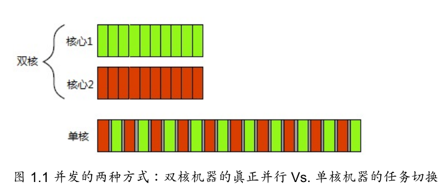

> 2019-7-3 20:56:48 

# C++并发编程阅读笔记

## 第1章 你好，C++的并发世界

### 1.1.1  何谓并发

**并发**：CPU交替使用时钟，模拟并发

**并行**：线程的真正并行执行



#### 1.1.2  并发的途径

- 多进程并发：将应用程序分为多个独立的进程,它们在同一时刻运行,就像同
时进行网页浏览和文字处理一样。
- 多线程并发：在单个进程中运行多个线程。线程很像轻量级的进程:每个线程相互独
立运行,且线程可以在不同的指令序列中运行。进程中的所有线程都共享地址空间,
并且所有线程访问到大部分数据———全局变量仍然是全局的,指针、对象的引用或数据可
以在线程之间传递。

程序并发的方式有2种：

- 程序执行并行：不同的线程执行，不同的过程
- 数据并行：不同的线程执行相同的程序，处理不同的数据。

### 1.4 开始入门
开始多线程编程的一个简单例子：

```c++
#include <iostream>
#include <thread>
void hello()
{
    std::out<<"Hello Concurrent World\n";
}
int main()
{
    std::thread t(hello);
    t.join();
}
```

