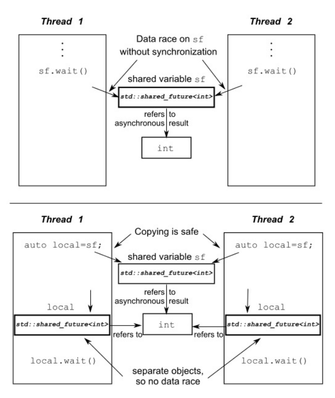
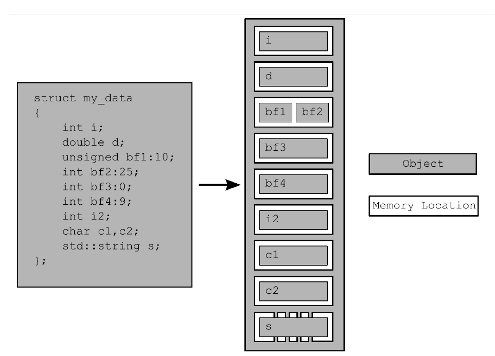

> 2019-7-06 17:11:52

### 第4章 同步并发操作

### 4.1 等待一个事件或其他条件

在多线程同步过程中，很多时候需要进行同步等待，可以使用`std::this_thread::sleep_for()`方法来进行周期性的间歇。如下：

```c++

bool flag;
std::mutex m;

void wait_for_flag()
{
    std::unique_lock<std::mutex> lk(m);
    while(!flag) {
        //解锁互斥量

        lk.unlock();
        //休眠 100ms

        std::this_thread::sleep_for(std::chrono::milliseconds(100));
        //解锁互斥量

        lk.lock();
    }
}

```

标准库使用相关条件达成来，进行线程同步。

|方法|区别|
|:---|:---|
|`std::condition_variable`|仅限于与`std::mutex`一起工作|
|`std::condition_variable_any`|任何条件上工作，但是会产生额外的开销|

使用示例：

```c++
std::mutex mut;
//数据队列

std::queue<data_chunk> data_queue;
//环境检测变量

std::condition_variable data_cond;

void data_preparation_thread()
{
    while(more_data_to_prepare())
    {
        //准备数据

        data_chunk const  data=prepare_data();
        //当前线程加锁操作

        std::lock_guard<std::mutex> lk(mut);
        //发生环境改变信号

        data_cond.ontify_one();
    }
}

void data_processing_thread()
{
    while(true) {
        //信号量加锁

        std::unique_lock<std::mutex> lk(mut);
        //等待，直到获得响应

        data_cond.wait(
            lk,[]{return !data_queue.empty();}
            );
        //获取头部数据

        data_chunk data=data_queue.front();
        //弹出

        data_queue.pop();
        //解锁

        lk.lock();

    }
}
```

#### 4.1.2 使用条件变量构建线程安全队列

线程安全的基本操作`push()`和`wait_and_pop()`：

```c++

#include <queue>

#include <memory>

#include <mutex>

#include <condition_variable>

template <typename T>
class threadsafe_queue
{
private:
    //互斥量必须是可变的

    mutable std::mutex mut;
    std::queue<T> data_queue;
    std::condition_variable data_cond;

public:
    threadsafe_queue(){}
    threadsafe_queue(threadsafe_queue const& other)
    {
        //为其它类的信号量，加锁

        std::lock_guard<std::mutex> lk(other.mut);
        //进行拷贝

        data_queue=other.data_queue;
    }
    ~threadsafe_queue();
    void push(T new_value)
    {
        //添加锁

        std::lock_guard<std::mutex> lk(mut);
        data_queue.push(new_value);
        //发射改变环境变量,触发一个正在等待的线程，取检查wait函数的返回状态

        data_cond.notify_one();
    }
    
    void wait_and_pop(T& value)
    {
        //添加锁

        std::unique_lock<std::mutex> lk(mut);
        //等待队列中存在数据

        data_cond.wait(lk,[this]{return !data_queue.empty();});
        //获取数据

        value=data_queue.front();
        //取出数据

        data_queue.pop();
    }
    std::shared_ptr<T> wait_and_pop()
    {
        std::unique_lock<std::mutex> lk(mut);
        //等待直到数据为空

        data_cond.wait(lk,[this]{return !data_queue.empty();});
        //返回队列中的引用指针

        std::shared_ptr<T> res(std::make_shared<T>(data_queue.front()));
        data_queue.pop();
        return res;

    }
    //非线程安全的存取函数

    bool try_pop(T& value)
    {
        std::lock_guard<std::mutex> lk(mut);
        if(data_queue.empty())
            return  false;
        value=data_queue.front();
        data_queue.pop();
        return  true;
    }
    //元素出栈

    std::shared_ptr<T> try_pop()
    {
        std::lock_guard<std::mutex> lk(mut);
        if(data_queue.empty())
        {
            return std::shared_ptr<T>();
        }
        std::shared_ptr<T> res(std::make_shared<T>(data_queue.front()));
        data_queue.pop();
        return res;
    }

    bool empty() const
    {
        std::lock_guard<std::mutex> lk(mut);
        return data_queue.empty();
    }


};

```

### 4.2 使用期望等待一次性时间

_参考链接：_ [C++11多线程future的使用](https://blog.csdn.net/u011726005/article/details/78266706);[std::future , std::promise和线程的返回值](https://blog.csdn.net/lijinqi1987/article/details/78507623);[std::future](https://zh.cppreference.com/w/cpp/thread/future);[std::thread](https://zh.cppreference.com/w/cpp/thread/thread);

C++ 中的`future`用来表示等待中的一次性事件。它的主要功能是将多线程同步或者异步的数据作为结果保存，在执行操作之后进行提取

```c++
//cppreferencr 示例
//

#include <iostream>

#include <future>

#include <thread>
 
int main()
{
    // 来自 packaged_task 的 future

    // 包装函数

    std::packaged_task<int()> task([](){ return 7; }); 
    // 获取 future

    std::future<int> f1 = task.get_future(); 
    // 在线程上运行

    std::thread(std::move(task)).detach(); 
    // 来自 async() 的 future

    std::future<int> f2 = std::async(std::launch::async, [](){ return 8; });
    // 来自 promise 的 future

    std::promise<int> p;
    std::future<int> f3 = p.get_future();
    std::thread( [&p]{ p.set_value_at_thread_exit(9); }).detach();
 
    std::cout << "Waiting..." << std::flush;
    f1.wait();
    f2.wait();
    f3.wait();
    std::cout << "Done!\nResults are: "
              << f1.get() << ' ' << f2.get() << ' ' << f3.get() << '\n';
}
//result

//Waiting...Done!

//Results are: 7 8 9


```

使用`std::async`异步向函数传递参数,`std::launch::defered`调用方线程上首次请求其结果时执行任务（惰性求值)；`std::launch::async`运行新线程，以异步执行任务

```c++
#include <string>

#include <future>
//创建函数结构体

struct X
{
    void foo(int,std::string const&);
    std:string bar(std::string const&);
};
X x;
//调用x中的函数x->foo(42,"hello");

auto f1=std::async(&X::foo,&x,42,"hello");
//调用 bar函数

auto f2=std::async(&X::bar,x,"goodbye");

struct Y
{
    double operator()(double);
};

Y y;
//先构造Y，再进行一次拷贝构造，条用 拷贝的operator()操作

auto f3=std::async(Y(),3.141);

auto f4=std::async(std::ref(y),2.718);

X baz(X&);
// 调用 baz(x)

std::async(baz,std::ref(x));
class   move_only
{
public:
    move_only();
    move_only(move_only&&);
    move_only(move_only const&)=delete;
    move_only& operator=(move_only&&);
    move_only& operator=(move_only const&)=delete;
    void operator()();
}
//调用tmp(),tmp是通过std::move(move_only())构造得到

auto f5=std::async(move_only());     
//在新线程上执行

auto f6=std::async(std::launch::async,Y(),1.2);
//调用wait()或者get()进行同步

auto f7=std::async(std::launch::deferred,baz,std::ref(x));
//实现选择执行方式

auto f8=std::async(std::launch::deferred|std::launch::async,baz,std::ref(x));

auto f9=std::async(baz,std::ref(x));
//调用延迟函数

f7.wait();
```

#### 4.2.2 任务与期望

_参考链接：_ [std::packaged_task](https://zh.cppreference.com/w/cpp/thread/packaged_task);

```c++

#include <iostream>

#include <cmath>

#include <thread>

#include <future>

#include <functional>
 
// 避免对 std::pow 重载集消歧义的独有函数

int f(int x, int y) { return std::pow(x,y); }
 
void task_lambda()
{
    std::packaged_task<int(int,int)> task([](int a, int b) {
        return std::pow(a, b); 
    });
    std::future<int> result = task.get_future();
 
    task(2, 9);
 
    std::cout << "task_lambda:\t" << result.get() << '\n';
}
 
void task_bind()
{
    std::packaged_task<int()> task(std::bind(f, 2, 11));
    std::future<int> result = task.get_future();
 
    task();
 
    std::cout << "task_bind:\t" << result.get() << '\n';
}
 
void task_thread()
{
    std::packaged_task<int(int,int)> task(f);
    std::future<int> result = task.get_future();
 
    std::thread task_td(std::move(task), 2, 10);
    task_td.join();
 
    std::cout << "task_thread:\t" << result.get() << '\n';
}
 
int main()
{
    task_lambda();
    task_bind();
    task_thread();
}
//结果

// task_lambda: 512 

// task_bind:   2048

// task_thread: 1024
```

使用 `std::packaged_task`执行一个图形界面的线程

```c++
#include    <deque>

#include    <mutex>

#include    <future>

#include    <thread>

#include    <utility>

std::mutex  m;
std::deque<std::packaged_task<void()>   >   tasks;
bool    gui_shutdown_message_received();
void    get_and_process_gui_message();
//GUI线程

void    gui_thread()
{
    //是否收到对应信息

        while(!gui_shutdown_message_received())
        {
                get_and_process_gui_message();
                //创建任务线程

                std::packaged_task<void()>  task;
                {
                        //数据信号量加锁

                        std::lock_guard<std::mutex> lk(m);
                        if(tasks.empty())
                                continue;
                        //移动权柄

                        task=std::move(tasks.front());
                        //取出首元素

                        tasks.pop_front();
                }
                //执行任务

                task();
        }
}

std::thread gui_bg_thread(gui_thread);

template<typename   Func>

std::future<void> post_task_for_gui_thread(Func   f)
{
    //创建任务
    
    std::packaged_task<void()>  task(f);
    //获取任务返回结果

    std::future<void>   res=task.get_future();
    //当前线程上锁

    std::lock_guard<std::mutex> lk(m); 
    //转移任务权柄，将当前任务，添加到列表

    tasks.push_back(std::move(task));
    //返回执行结果

    return  res;
}

```

#### 4.2.3 使用 std::promises

_参考链接：_ [std::promise](https://zh.cppreference.com/w/cpp/thread/promise);

`std::promises`有且只使用一次

使用示例:

```c++
#include <vector>

#include <thread>

#include <future>

#include <numeric>

#include <iostream>

#include <chrono>
 
void accumulate(std::vector<int>::iterator first,
                std::vector<int>::iterator last,
                std::promise<int> accumulate_promise)
{
    int sum = std::accumulate(first, last, 0);
    // 提醒 future

    accumulate_promise.set_value(sum);
}
 
void do_work(std::promise<void> barrier)
{
    std::this_thread::sleep_for(std::chrono::seconds(1));
    barrier.set_value();
}
 
int main()
{
    // 演示用 promise<int> 在线程间传递结果。
    
    std::vector<int> numbers = { 1, 2, 3, 4, 5, 6 };
    std::promise<int> accumulate_promise;
    std::future<int> accumulate_future = accumulate_promise.get_future();
    //创建工作线程

    std::thread work_thread(accumulate, numbers.begin(), numbers.end(),
                            std::move(accumulate_promise));
    // 等待结果

    accumulate_future.wait();
    std::cout << "result=" << accumulate_future.get() << '\n';
    // wait for thread completion

    work_thread.join();
    // 演示用 promise<void> 在线程间对状态发信号

    std::promise<void> barrier;
    std::future<void> barrier_future = barrier.get_future();
    std::thread new_work_thread(do_work, std::move(barrier));
    barrier_future.wait();
    new_work_thread.join();
}

```

#### 4.2.4 为“期望”存储“异常”

可以使用`std::future`实现对与异常的捕获，在使用`std::promise`的时候可以，使用`set_exception()`成员函数进行异常的捕获。

```c++
extern  std::promise<double>    some_promise;
try
{
    some_promise.set_value(calculate_value());
}
catch(...)
{
    some_promise.set_exception(std::current_exception());
    //std::copy_exception()   会直接存储一个新的异常而不抛出

    some_promise.set_exception(std::copy_exception(std::logic_error("foo")));

}
```

#### 4.2.5 多个线程的等待

_参考链接：_ [std::shared_future](https://zh.cppreference.com/w/cpp/thread/shared_future);

因为`std::future`的`get()`方法，可以获取最终结果，但这些都是一次性的，也就说明，不能被多个线程同时使用--一个线程获取之后就结束了。这是因为:`std::future`模型独享同步结果的所有权。

使用`std::shared_future`可以让多个线程等待同一个事件。`std::future`是只移动的，在不同实例中相互传递的只是其所有权限。而`std::shared_future`实例是可拷贝的,所以多个对象可以引用同一关联“期望”的结果。但是因为，每个独立对象上，成员函数调用返回的结果是不同步的，需要加锁进行数据保护。

;

使用示例：

```c++
#include <iostream>

#include <future>

#include <chrono>
 
int main()
{   
    std::promise<void> ready_promise, t1_ready_promise, t2_ready_promise;
    std::shared_future<void> ready_future(ready_promise.get_future());
 
    std::chrono::time_point<std::chrono::high_resolution_clock> start;
 
    auto fun1 = [&, ready_future]() -> std::chrono::duration<double, std::milli> 
    {
        t1_ready_promise.set_value();
        // 等待来自 main() 的信号

        ready_future.wait();
        return std::chrono::high_resolution_clock::now() - start;
    };
 
 
    auto fun2 = [&, ready_future]() -> std::chrono::duration<double, std::milli> 
    {
        t2_ready_promise.set_value();
        // 等待来自 main() 的信号

        ready_future.wait();
        return std::chrono::high_resolution_clock::now() - start;
    };
 
    auto result1 = std::async(std::launch::async, fun1);
    auto result2 = std::async(std::launch::async, fun2);
    // 等待线程变为就绪

    t1_ready_promise.get_future().wait();
    t2_ready_promise.get_future().wait();
    // 线程已就绪，开始时钟

    start = std::chrono::high_resolution_clock::now();
    // 向线程发信使之运行
    
    ready_promise.set_value();
 
    std::cout << "Thread 1 received the signal "
              << result1.get().count() << " ms after start\n"
              << "Thread 2 received the signal "
              << result2.get().count() << " ms after start\n";
}
```
### 4.3 限定等待时间

之前的所有苏塞调用，将会阻塞一段不确定的时间，将线程挂起直到等待的事件发
生。可以使用`std::condition_variable`成员函数的`wait_for()`和`wait_until`进行相对时间和绝对时间的等待。

#### 4.3.1 时钟
_参考链接：_ [标准库头文件 <chrono>](https://zh.cppreference.com/w/cpp/header/chrono);

注意：`std::chrono::system_clock`是不稳定的，`std::chrono::steady_clock`是稳定的。

#### 4.3.2 时延
`std::chrono::duration<>` 函数模板能够对时延进行处理(线程库使
用到的所有C++时间处理工具,都在   std::chrono  命名空间内)([std::chrono::duration](https://zh.cppreference.com/w/cpp/chrono/duration))。

简单的等待示例：

```c++

std::future<int> f=std::async(some_task);
//如果等待结果是期望状态改变，而不是超时，则执行下面的操作。

if(f.wait_for(std::chrono::milliseconds(35))==std::future_status::ready)
    do_something_with(f.get());

```
#### 4.3.3 时间点
使用`std::chrono::time_point<>`来获取时间点。

```c++
auto  start=std::chrono::high_resolution_clock::now();
do_something();
auto    stop=std::chrono::high_resolution_clock::now();
std::cout<<”do_something()  took    “
        <<std::chrono::duration<double,std::chrono::seconds>(stop-
start).count()
        <<” seconds”<<std::endl;

```

#### 4.3.4 具有超时功能的函数

可接受超时的函数


|类型/命名空间|函数|返回值|
|:---|:---|:---|
|`std::this_thread[namespace]`|`sleep_for(duration)`|N/A|
||`sleep_for(duration)`||
|`std::condition_variable`或`std::condition_variable_any`|`wait_for(lock,duration)`|`std::cv_status::time_out`|
||`wait_until(lock,time_point)`|`std::cv_status::no_timeout`|
||`wait_for(lock,duration,predicate)`||
||`wait_until(lock,duration,predicate)`|bool--当唤醒时，返回谓词的结果|
|`std::timed_mutex`或`std::recuresive_timed_mutex`|`try_lock_for(duration)`|bool--获取锁时返回true,否则返回false|
||`try_lock_until(time_point)`||
|`std::unique_lock<TimedLockable>`|`unique_lock(lockable,duration)`|N/A——对新构建的对象调用owns_lock();|
||`unique_lock(lockable,time_point)`|当获取锁时返回true,否则返回false|
||`try_lock_for(duration)`|bool--当获取锁时返回true，否则返回false|
||`try_lock_until(time_point)`||
|`std::future<ValueType>或std::shared_future<ValueType>`|`wait_for(duration)`|当等待超时,返回`std::future_status::timeout`|
||`wait_until(time_point)`|当“期望”准备就绪时,返回`std::future_status::ready`|
|||当“期望”持有一个为启动的延迟函数,返回`std::future_status::defer`|

### 4.4 使用同步操作简化代码

#### 4.4.1 使用“期望”的函数话编程

函数式编程(functional programming)：编程结果只依赖于传入的参数，并不依赖外部状态。当输入相同时，输出结果仅仅和输入有关与次数无关。

快速排序：

```c++
template<typename T>
std::list<T> sequential_quick_sort(std::list<T> input)
{
    if(input.empty())
    {
        return input;
    }
    std::list<T> result;
    //将input的首个元素，赋值给result

    result.splice(result.begin(),input,input.begin());

    T const& pivot=*result.begin();
    //重置矩阵并返回首部元素,指向大于中间值的最接近的元素

    auto divide_point=std::partition(input.begin(),input.end(),[&](T const& t){
        return t<pivot;
    });
    std::list<T> lower_part;
    //将小于divide_point的数，传递给lower_part;

    lower_part.splice(lower_part.end(),input,input.begin(),divide_point);
    //递归调用排序，使用move避免大量的拷贝操作

    auto new_lower(sequential_quick_sort(std::move(lower_part)));
    auto new_higher(sequential_quick_sort(std::move(input)));
    //将数据进行拼接

    result.splice(result.end(),new_higher);

    result.splice(result.begin(),new_lower);

    return result;
}
```
快速排序“期望” 并行版

```c++

template <T>
std::list<T> parallel_quick_sort(std::list<T> input)
{
    if(input.empty())
    {
        return input;
    }
    std::list<T> result;
    result.splice(result.begin(),input,input.begin());
    T const& pivot=*result.begin();

    auto divide_point=std::partition(input.begin(),input.end(),
                    [&](T const& t){return t<pivot;});

    std::list<T> lower_part;
    lower_part.splice(lower_part.end(),input,input.begin(),divide_point);
    //开启异步线程执行程序

    std::future<std::list<T>> new_lower(std::async(&parallel_quick_sort<T>,std::move(lower_part)));

    auto new_higher(parallel_quick_sort(std::move(input)));

    result.splice(result.end(),new_higher);
    result.splice(result.begin(),new_lower.get());
    return result
}

```
注意:这里多线程的时间统计一定不要用`clock()`它是根据cpu时钟执行次数来的，对于多线程不准确。更改之后时间仍旧感人；多线程没有单线程块。初步估计是编译器优化原因。这里更改之后发现线程开始的开销要大的多，建议使用openmp来进行更改。


## 第5章  C++内存模型和原子类型操作

### 5.1.1 对象和内存位置

这个之前在c++primer学习笔记中有详细介绍，不过多叙述。



四个原则：

- 每个变量都是一个对象，包括作为其成员变量的对象
- 每个对象至少占有一个内存位置
- 基本类型都有确定的内存位置(无论大小类型如何，即使他们是相邻的，或是数组的一部分)
- 相邻位域是相同内存中的一部分

### 5.2 c++中的原子操作和原子类型
_参考链接：_ [C++ 原子操作（6种原子顺序）](https://blog.csdn.net/what951006/article/details/78273903);[如何理解 C++11 的六种 memory order](https://www.zhihu.com/question/24301047);[C++11之atomic原子操作](https://blog.csdn.net/qq_34199383/article/details/79990986); [理解 C++ 的 Memory Order ](http://senlinzhan.github.io/2017/12/04/cpp-memory-order/);
#### 5.2.1 标准原子类型

标准原子类型定义在头文件`<atomic>`中。这些类型上的所有操作都是原子的,在语言定义中只有这些类型的操作是原子的,不过你可以用互斥锁来模拟原子操作。

标准原子类型的备选名和与其相关的`std::atomic<>`特化类

|原子类型 |相关特化类|
|:---|:---|
|`atomic_bool` |`std::atomic<bool>`|
|`atomic_char` | `std::atomic<char>`|
|`atomic_schar` | `std::atomic<signed char>`|
|`atomic_uchar` | `std::atomic<unsigned char>`|
|`atomic_int `| `std::atomic<int>`|
|`atomic_uint` | `std::atomic<unsigned>`|
|`atomic_short`  |  `std::atomic<short>` |
|`atomic_ushort` |  `std::atomic<unsigned short>` |
|`atomic_long` | `std::atomic<long>` |
|`atomic_ulong`  |  `std::atomic<unsigned long>` |
|`atomic_llong`  |  `std::atomic<long long>`|
|`atomic_ullong` |  `std::atomic<unsigned long long>`|
|`atomic_char16_t`| `std::atomic<char16_t>`|
|`atomic_char32_t` |`std::atomic<char32_t>`|
|`atomic_wchar_t` | `std::atomic<wchar_t>`|


标准原子类型定义(typedefs)和对应的内置类型定义(typedefs)

|原子类型定义 | 标准库中相关类型定义|
|:----|:----|
|atomic_int_least8_t |int_least8_t|
|atomic_uint_least8_t |   uint_least8_t|
|atomic_int_least16_t  |  int_least16_t|
|atomic_uint_least16_t |  uint_least16_t|
|atomic_int_least32_t   | int_least32_t|
|atomic_uint_least32_t  | uint_least32_t|
|atomic_int_least64_t   | int_least64_t|
|atomic_uint_least64_t  | uint_least64_t|
|atomic_int_fast8_t | int_fast8_t|
|atomic_uint_fast8_t| uint_fast8_t|
|atomic_int_fast16_t| int_fast16_t|
|atomic_uint_fast16_t |   uint_fast16_t|
|atomic_int_fast32_t |int_fast32_t|
|atomic_uint_fast32_t  |  uint_fast32_t|
|atomic_int_fast64_t |int_fast64_t|
|atomic_uint_fast64_t |   uint_fast64_t|
|atomic_intptr_t |intptr_t|
|atomic_uintptr_t |   uintptr_t|
|atomic_size_t |  size_t|
|atomic_ptrdiff_t  |  ptrdiff_t|
|atomic_intmax_t |intmax_t|
|atomic_uintmax_t |   uintmax_t|

它们有一个相当简单的模式；对于标准类型进行typedef T，相关的原子类型就在原来的类型名前加上atomic_的前缀：atomic_T。除了singed类型的缩写是s，unsigned的缩写是u，和long long的缩写是llong之外，这种方式也同样适用于内置类型。对于std::atomic<T>模板，使用对应的T类型去特化模板的方式，要好于使用别名的方式。

一般情况下，标准原子类型不能拷贝和赋值，他们没有拷贝构造函数和拷贝赋值函数。但是可以隐式转化为对应的内置类型。

std::atomic<>类模板不仅仅一套特化的类型，其作为一个原发模板也可以使用用户定义类型创建对应的原子变量。因为，它是一个通用类模板，操作被限制为load(),store()(赋值和转换为用户类型), exchange(), compare_exchange_weak()和compare_exchange_strong()。
每种函数类型的操作都有一个可选内存排序参数，这个参数可以用来指定所需存储的顺序。在5.3节中，会对存储顺序选项进行详述。现在，只需要知道操作分为三类：

1. Store操作，可选如下顺序：memory_order_relaxed, memory_order_release, memory_order_seq_cst。
2. Load操作，可选如下顺序：memory_order_relaxed, memory_order_consume, memory_order_acquire, memory_order_seq_cst。
3. Read-modify-write(读-改-写)操作，可选如下顺序：memory_order_relaxed, memory_order_consume, memory_order_acquire, memory_order_release, memory_order_acq_rel, memory_order_seq_cst。
所有操作的默认顺序都是memory_order_seq_cst。

#### 5.2.2 `std::atomic_flag`的相关操作

_参考链接：_ [C++11实现自旋锁](https://blog.csdn.net/sharemyfree/article/details/47338001);[C++互斥量、原子锁、自旋锁等比较](https://blog.csdn.net/qccz123456/article/details/81329261);[C++11线程中的几种锁](https://blog.csdn.net/xy_cpp/article/details/81910513);

`std::atomic_flag`是最简单的标准原子类型,它表示了一个布尔标志。这个类型的对象可以
在两个状态间切换:设置和清除。`std::atomic_flag` 类型的对象必须被ATOMIC_FLAG_INIT初始化。当初始化完成之后，能够进行的操作就是销毁/清除`clear()`、设置（查询之前的值）`test_and_set()`。例如

```c++
//使用释放语义清除标志

f.clear(std::memory_order_release);
//使用默认内存顺序设置表示，检索旧值

bool x=f.test_and_set();

```

注意：`std::atomic_flag`操作不允许拷贝，因为当拷贝两个对象时操作不在作为原子性操作。

使用`std::atomic_flag`实现自旋锁

```c++
class spinlock_mutex
{
    //标准原子信号

    std::atomic_flag flag;
public:
    spinlock_mutex():flag(ATOMIC_FLAG_INIT){}
    void lock()
    {
        // 等待释放

        while(flag.test_and_set(std::memory_order_acquire)) {
            /* code */
        }
    }
    void unlock()
    {
        //清除释放数据

        flag.clear(std::memory_order_release);
    }
}
```

#### 5.2.3 `std::atomic`的相关操作

使用`store()`写入(true或者false)还是浩宇`std::atomic_flag`中限制性很强的`clear()`；使用`exchange()`成员函数允许你使用新选的值替换已经存储的值，并且自动的检索原始值。

```c++
std::atomic<bool> b;
//加载值
bool x=b.load(std::memory_order_acquire);
b.store(true);
//交换值

x=b.exchange(false,std::memory_order_acq_rel);

```


#### 5.2.4 std::atomic 指针运算


`std::atomic`提供`fetch_add`和`fetch_sub`操作，在存储地址上做原子加减法。`+=`等操作也是直接在地址上进行加减操作。因为fetch_add()和fetch_sub()都是“读-改-写”操作,它们可以拥有任意的内存顺序标签,以及加入到一个释放序列中。指定的语序不可能是操作符的形式,因为没办法提供必要的信息:
这些形式都具有memory_order_seq_cst语义。

#### 5.2.5 标准的原子整型的相关操作


在`std::atomic<int>`和 `std::atomic<unsigned long long>` 也
是有一套完整的操作可以供使用:`fetch_add()`, `fetch_sub()`,`fetch_and()`,`fetch_or()`,
`fetch_xor()`,还有复合赋值方式((+=,-=, &=,|=和^=),以及++和--(++x, x++,--x和x--)。

#### 5.2.6 std::atomic<>主要类的模板

为了使用`std::atomic<UDT>`(UDT是用户定义类型),这个类型必须有拷贝赋值运算符。这就意味着这
个类型不能有任何虚函数或虚基类,以及必须使用编译器创建的拷贝赋值操作。


