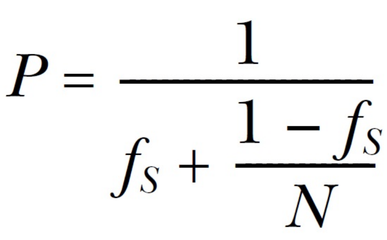

>2019-07-17 22:16:53

## 第八章 并发代码设计

### 8.1 线程间划分工作的技术

一般的线程划分会，直接将数据划分线程；但是最后的多线程之间的结果数据同步会造成较多的麻烦，数据和算法符划分方式，在多线程编程中较为重要。

#### 8.1.2 递归划分

第四章中的`std::async()`方式的快速排序，在对于大量数据进行排序的时候，每一层递归都会产生一个新线程，最终会产生大量的线程；线程的性能开销反而会让程序的执行时间上升，不如单线程的快速排序。

可以通过将数据打包后，交给固定线程处理，或者使用`std::thread::hardware_concurrency()`函数来确定线程的数量。

使用栈的并行快速排序算法--等待数据块排序

```c++

template<typename T>
struct sorter
{
    //准备排序的数据块

    struct chunk_to_sort
    {
        //排序数据

        std::list<T> data;
        //预期结果

        std::promise<std::list<T> > promise;
    };
    //线程安全的排序栈

    thread_safe_stack<chunk_to_sort> chunks;
    //工作线程列表

    std::vector<std::thread> threads;
    //最大线程数量

    unsigned const max_thread_count;
    //原子变量，是否达到数据末尾

    std::atomic<bool> end_of_data;

    sorter():max_thread_count(std::thread::hardware_concurrency()-1),
            end_of_data(false){}
    ~sorter()
    {
        end_of_data=true;
        for(unsigned i=0;i<threads.size();++i)
        {
            //等待线程结束

            threads[i].join();
        }
    }
    void try_sort_chunk()
    {
        //获取排序线程

        boost::shared_ptr<chunk_to_sort > chunk=chunks.pop();
        if(chunk)
        {
            //开始排序

            sort_chunk(chunk);
        }
    }
    std::list<T> do_sort(std::list<T>& chunk_data)
    {
        if(chunk_data.empty())
        {
            return chunk_data;
        }
        std::list<T> result;
        //拷贝数据的头指针

        result.splice(result.begin(),chunk_data,chunk_data.begin());
        //获取开头的数据

        T const& partition_val=*result.begin();
        //根据partition_val进行分组，获取中间分组的迭代器

        typename std::list<T>::iterator divide_point=std::partition(chunk_data.begin(),chunk_data.end(),[&](T const& val){return val<partition_val;});
        chunk_to_sort new_lower_chunk;
        //截取分组的前半段到new_lower_chunk

        new_lower_chunk.data.splice(new_lower_chunk.data.end(),
            chunk_data,
            chunk_data.begin(),
            divide_point
            );
        //获取new_chunk的future值

        std::future<std::list<T> > new_lower=new_lower_chunk.promise.get_future();
        //压入排序栈

        chunks.push(std::move(new_lower_chunk));
        //如果线程小于最大线程数

        if(threads.size()<max_thread_count)
        {
            //创建排序线程

            threads.push(std::thread(&sorter<T>::sort_thread,this));

        }
        //获取大于的一部分，并返回排序结果

        std::list<T> new_higher(do_sort(chunk_data));
        //接上new_higher

        result.splice(result.end(),new_higher);
        //循环执行排序线程，直到结束

        while(new_lower.wait_for(std::chrono::seconds(0))!=std::future_status::ready)
        {
            try_sort_chunk();
        }
        //将前面排序结果放到result中

        result.splice(result.begin(),new_lower.get());
    }
    void sort_thread()
    {
        while(!end_of_data)
        {
            //没有到达数据末尾，尝试快排

            try_sort_chunk();
            //线程休眠

            std::this_thread::yield();
        }
    }

};
template<typename T>
std::list<T> parallel_quick_sort(std::list<T> input)
{
    if(input.empty())
    {
        return input;
    }
    sorter<T> s;
    return s.do_sort(input);
}

```

#### 8.1.3 通过人去类型划分工作

当通过任务类型对线程间的任务进行划分时,不应该让线程处于完全隔离的状态。当多个输入数据集需要使用同样的操作序列,可以将序列中的操作分成多个阶段,来让每个线程执行。

这里可以使用cpu的流水先工作方式，对于CPU数据的处理有加好的平均性能

### 8.2 影响并发代码性能的因素

#### 处理器数量

首先线程是操作系统上的概念，在CPU中是不存在线程这个说法的，所以需要注意的时，在多线程编程，不等同于多核编程，中间操作系统起到了非常重要的作用。之间的调度并不明了。需要谨慎使用。

#### 8.2.2 数据争用与乒乓缓存

当两个线程并发的在不同处理器上执行时，对同意数据进行读取，通常不会出现问题；数据将会拷贝到每个线程的缓存中，可以让两个处理器同事进行处理。但是当有线程对数据进行修改的时候，修改数据需要更新到其它核芯的缓存中取，需要耗费一定的时间。通常会让工作中的CPU进行等待，直到缓存中的数据得到更新。

**高竞争(high contention)**:一个处理器准备更新这个值,另一个处理器正在修改这个值,所以该处理器就不得不等,待第二个处理器更新完成,并且完成更新传递时,才能执行更新。
**低竞争(low contention)**: 如果处理器很少需要相互等待。

**乒乓缓存(cache ping-pong)**: 数据在每个缓存中传递若干次。

在多线程编程中，互斥量，通常需要另外一个线程将数据进行转移，保证处理器之间的互斥性。当线程进行完修改后，其它线程对互斥量进行修改，并对线程进行解锁，再将互斥数据传递到下一个需要互斥量的线程上去。这个过程就是互斥量的获取和释放。

**当多个线程高竞争访问时，会造成大量的资源浪费**

注意：

- 互斥量的竞争通常不同于原子操作的竞争,最简单的原因是,互斥量通常使用操作系统级别的序列化线程,而非处理器级别的。因此不会影响操作系统中的其它线程，但是会影响本程序的线程。
- 尽量避免乒乓现象，减少两个线程对同一个内存位置的竞争。

**缓存行**：由处理器cache大小，决定的一次读取内存块的一行，内存块通常大小为32或64字节。在内存中称为缓存行(cache line);

**伪共享**: 即使给定内存位置被一个线程所访问,可能还是会有乒乓缓存的存在,是因为另一种叫做伪共享(false sharing)的效应。即使数据存储在缓存行中，多个线程对数据中的成员进行访问时，硬件缓存还是会产生乒乓缓存。缓存行是多个线程共享的，但实际并不被多个CPU共享，因此使用伪共享来声明这种方式。

**伪共享发生的原因**: 某个线程所要访问的数据过于接近另一线程的数据,另一个是与数据布局相关的陷阱会直接影响单线程的性能。
**避免伪共享**：避免伪共享的方法是，实现数据分离，努力让不同线程访问不同缓存行。

#### 8.2.4 紧凑的数据

当CPU中线程的关键数据分散在内存中时，会增加内存访问的次数和内存的延迟。因此尽量紧凑的内存设计会降低延迟。

当处理器切换线程时，对不同内存上的数据进行重新加载(当不同线程使用的数据跨越了多个缓存行时)，而非对缓存中的数据保持原样(当线程中的数据都在同一缓存行时)。

当线程数量对一二内核处理器数量，操作系统可能也会选择将一个线程更换芯核，缓存行从一个内核上，转移到另外一个内核上；这样对性能损害比较大。

#### 8.2.5  超额认购和频繁的任务切换

当有超级多的线程准备运行时(非等待状态),任务切换问题就会频繁发生。这个问题我们之前也接触过:超额认购。


### 8.3 为多线程性能设计数据结构

多线程性能设计考虑因素：

- 竞争
- 伪共享
- 数据距离

#### 8.3.1 为复杂操作划分数组元素

这里主要探究的是矩阵的乘法问题，比较建议的是将矩阵进行分块来，进行计算

#### 8.3.2 其它数据结构中的数据访问模式

当使用的互斥量和数据项在内存中很接近，对于一个需要获取互斥量的线程来说，比较理想；所需要的数据可能早就存入处理器的缓存中了；但是当其他线程尝试锁住互斥量时，线程就能对对应的数据进行访问。对于相同位置的操作都需要先获取互斥量，如果互斥量已锁，那就会调用系统内核。而原子的互斥量操作("读，写，改")，可能会让数据存储在缓存中，让线程获取的互斥量变得毫无作用。当互斥量共享同一缓存行时，其中存储的是线程已使用的数据，这时拥有互斥量的线程会遭受到性能打击，因为其他线程也在尝试锁住互斥量。

### 8.4 设计并发代码的注意事项

注意代码在物理硬件改变时的可扩展性，避免因为物理硬件的改变，造成代码错误。

#### 8.4.1 并行算法中的异常安全

在串行算法中抛出一个异常，算法只需要考虑其本身的处理，多线程中需要考虑到多个线程之间的相互影响。

之前实现的线程安全的求和函数在执行线程创建时并不安全。因此在此基础之上改良线程安全函数。

```c++


class join_threads
{
    std::vector<std::thread>& threads;
public:
    explicit join_threads(std::vector<std::thread>& threads_):threads(threads_){}
    ~join_threads()
    {
        for(unsigned long i=0;i<threads.size();++i)
        {
            if(threads[i].joinable())
                threads[i].join();
        }
    }
};


template<typename iterator ,typename T>
struct accumulate_block
{
    //构造操作

    T operator()(Iterator first,Iterator last)
    {
        //返回所有数据和

        return std::accumulate(first,last,T());
    }
};
template<typename Iterator,typename T>
T parallel_accumulate(Iterator first,Iterator last,T init)
{
    unsigned long const length=std::distance(first,last);
    if(!length)
        return init;
    unsigned long const min_pre_thread=25;
    unsigned long const max_thread=(length+min_pre_thread-1)/min_pre_thread;
    unsigned long const hardware_threads=std::thread::hardware_concurrency();
    unsigned long const num_threads=std::min(hardware_threads!=0?hardware_threads:2,max_threads);
    //分块的大小

    unsigned long const block_size=length/num_threads;
    std::vector<std::future<T> > futures(num_threads-1);
    std::vector<std::thread> threads(num_threads-1);
    //安全线程类

    join_threads joiner(threads);


    Iterator block_start=first;
    for(unsigned long i=0;i<(num_threads-1);++i)
    {
        Iterator block_end=block_start;
        std::advance(block_end,block_size);
        std::packaged_tack<T(Iterator,Iterator)> task(accumulate_block<Iterator,T>());
        futures[i]=task.get_future();
        threads[i]=std::thread(std::move(task),block_start,block_end);
        block_start=block_end;
    }
    T last_result=accumulate_block()(block_start,last);
    std::for_each(
        thread.begin(),
        thread.end(),
        std::mem_fn(&std::thread::join)
        );

    T result=init;
    for(unsigned long i=0;i<(num_threads-1);++i)
    {
        result+=futures[i].get();
    }
    result+=last_result;
    return result;

}
```

#### 8.4.2 可扩展性和Amdahl定律

将程序划分为"串行"和"并行"部分。可以使用下面的公式对程序性能的增益进行估计：




