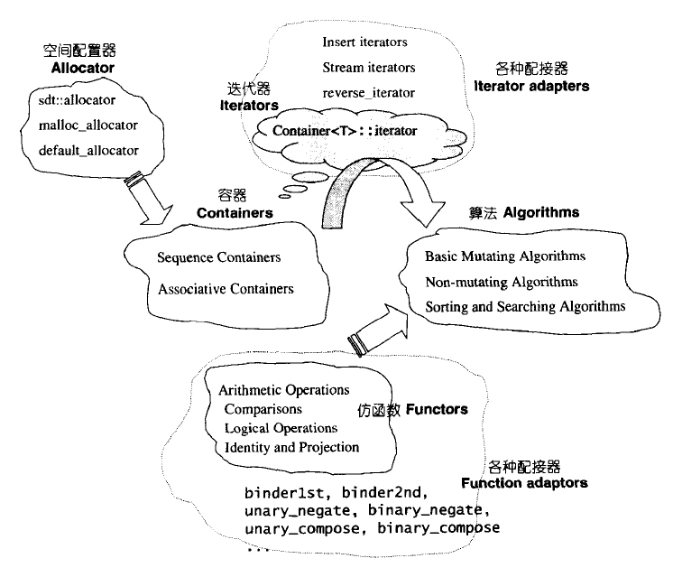

> 2019-7-21 16:46:53 
> 

# STL 源码剖析 --侯捷

## STL概论与版本简介

STL六大组件

- 容器(containers):vector.list.deque,set,map等数据存放的类。
- 算法(algorithms):各种排序算法;sort、search、copy、erase..等
- 迭代器(iterators)：扮演容器与算法之间的胶合剂，即泛型指针
- 功能函数(functors)：行为类似函数，可以视为算法的某种策略
- 配接器(adapters)：一种用来修饰容器(containers)或仿函数(functors)或迭代器(iterators)借口的东西
- 配置器(allocators):负责空间配置与管理

