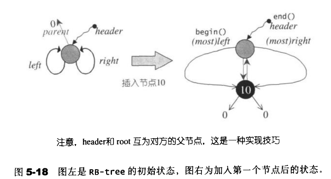
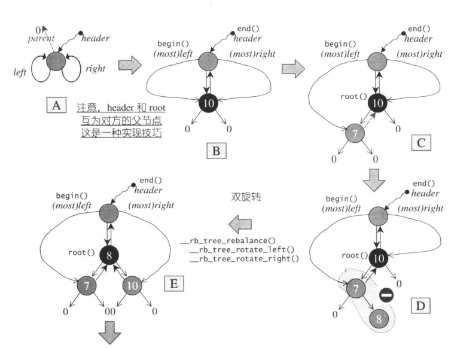
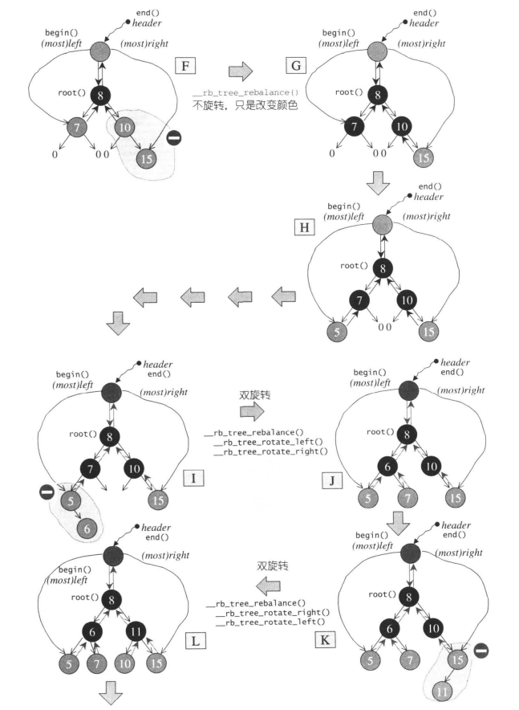
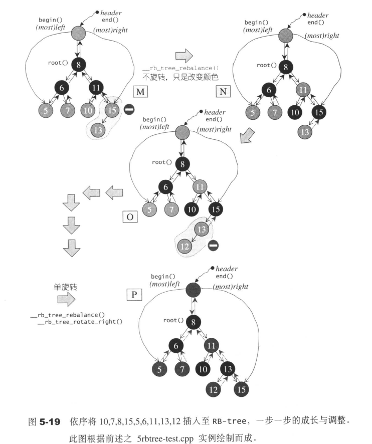

> 2019-7-28 19:46:53 

## 序列式容器

### 4.1 容器的概观与分类

容器主要分为两类： 
- 序列式容器：数据的有序存放如list、vector
- 关联式容器：数据的相互关联如map和pair等


第四章主要讲述序列容器

### 4.2 vector

#### 4.2.1 vector概述

vector与array非常想死，但是array是静态空间，一旦配置了就不嫩改变，vector是动态空间，可以自己动态增长；

vector本质还是使用的allocator来进行内存空间的分配，因此它的内存模式是由allocator来决定的。所以vector是一个连续的空间，但是每次分配的过于小的时候，会造成数据的搬移，比较浪费时间。而vector的迭代器是普通的指针。([指针和引用的区别](https://www.cnblogs.com/LLD-3/p/9664100.html);[C++中指针和引用区别---详解版](https://blog.csdn.net/qq_39539470/article/details/81273179));

**数据结构**

vector所采用的数据结构非常简单：线性连续空间。它以两个迭代器start和finish分别指向配置得来的连续空间中目前已经被使用的范围，并以迭代器end_of_storage指向整块连续空间(含备用空间)的尾端，并且为了方便扩充，vector实际配置的大小(capacity)可能比客户端需求更大一些，以备将来可能的扩充。vector的容量永远大于或等于其大小。一旦容量等于大小，便是满载，下次再有新增元素，整个vector就要进行搬移。即capacity>size永远成立

```c++
template <class T,class Alloc=alloc>
class vector
{
    ...
protected:
    //目前使用的空间的头部

    iterator start;
    //目前使用的空间的尾部

    iterator finish;
    //目前可用空间的尾部

    iterator end_of_storage;  

}
```


这里内存分配的关键函数代码如下
```c++
template <class T,class Alloc>
void vector<T,Alloc>::insert_aux(iterator position,const T& x)
{   
    //检查是否还有备用空间

    if(finish!=end_of_storage){
        //在备用空间起始处构造一个元素，并以vector最后一个元素为其初始值

        construct(finish,*(finish-1));
        //移动finish指针
        
        ++finish;
        //拷贝内容

        T x_copy=x;
        //执行拷贝

        copy_backward(position,finish-2,finish-1);
        *position=x_copy；
    }else {
        //进入这里表示已经不存在可用空间

        const size_type old_size=size();
        //决定分配空间的大小

        const size_type len=old_size!=0?2*old_size:1;
        //实际分配

        iterator new_start=data_allocator::allocate(len);
        iterator new_finish=new_start;
        try{
            //拷贝元素

            new_finish=uninitialized_copy(start,position,new_start);
            //为新元素设定初值x
            
            construct(new_finish,x);
            //调整指针位置

            ++new_finish;
            //将备用空间中的内容拷贝过来，这里主要是为了，后面的容量指针和相关信息

            new_finish=uninitialized_copy(position,finish,new_finish);
        }catch(...){
            destroy(new_start,new_finish);
            data_allocator::deallocate(new_start,len);
            throw;
        }
        //释放原来的内存
        destroy(begin(),end());
        deallocate();

        //调整迭代器，指向新vector
        start=new_start;
        finish=new_finish;
        end_of_storage=new_start+len;
    }
}
```


注意这里的迭代器失效。

### 4.3 list

相较于vector的连续线性空间，list相对复杂很多，但是，它的好处是每次插入或者删除一个元素就配置或者释放一个元素空间，因此list对空间的运用有绝对的精准，一点也不浪费。并且任何元素的插入或者删除，list永远是常数运行时间。

list不能像vector那样使用普通指针作为迭代器，因为其节点不保证子啊存储空间中连续存在。迭代器在递增时指向下一个节点，递减时指向上一个节点。

list的插入和接合(splice)都不会造成原有的list迭代失效，这在vector中是不成立的。但是它会使得操作指向的迭代器失效。

SGI的list不仅是一个双向链表，而且还是一个环状双向链表。


**list的构造和内存管理**

list为了方便空间配置器，额外定义了一个list_node_allocator，为的就是更方便地以节点大小为配置单位；

```c++
protected:
    //配置一个节点并传回

    link_type get_node() {return list_node_allocator::allocate();}
    //释放一个节点

    void put_node(link_type p){list_node_allocator::deallocate(p);}
    //产生(配置并构造)一个节点，带有元素值

    link_type create_node(const T& x)
    {
        link_type p=get_node();
        //全局函数，构造/析构函数

        construct(&p->data,x);
        return p;
    }
    //销毁一个节点

    void destroy_node(link_type p)
    {
        //析构函数

        destroy(&p->data);
        put_node(p);
    }
```
list提供多个构造函数，default constructor允许我们不指定任何参数做出一个空的list出来。


注意这里的插入是先产生在插入，并且是头插法。这样可以避免尾部迭代器的变动，减少工作量。

list内部提供一个transfer操作；将某个连续范围的元素迁移到某个特定位置之前。操作比较复杂。

```c++
//transfer

// typedef list_node* link_type;
void transfer(iterator position,iterator first,iterator last)
{
    if(position!=last)
    {
        (*(link_type((*last.node).prev))).next=position.node;
        (*(link_type((*first.node).prev))).next=last.node;
        (*(link_type((*position.node).prev))).next=first.node;
        link_type tmp=link_type((*position.node).prev);
        (*last.node).prev=(*first.node).prev;
        (*first.node).prev=tmp;
    }
}

```


list的splice()结合函数，有许多版本，便便指针的重新链接；但是因为链表的链接特性，因此链表无法使用sort()算法，必须使用自己的sort()

### 4.4 deque

deque是双向开口的连续性空间；


deque允许常数时间内对端进行匀速的插入或者移除操作，并且没有所谓的容量(capacity)的概念，因为他是动态地以分段连续空间组合而成的，随时可以增加一段新的空间并链接起来。因此deque的迭代器并不是普通的指针；因此除非必要，我们应该尽可能选择使用vector而非deque，为了操作的高效，可将deque先完整复制到一个vector身上，将vector排序后，再复制回去。

deque避开了vector中的反复内存搬移，但是迭代器架构却异常复杂。

deque采用一块所谓的map(一小块连续内存空间)作为主空。其中每个元素都是指针，指向另外一段较大的连续线性空间，称为缓冲区，缓冲区才是deqeue的存储空间主体。

```c++
protected:
    //指向元素的指针

    typedef pointer* map_pointer;

protected:
    //指向的map节点指针

    map_pointer map;
    //map指针数量

    size_type map_size;
```


下面是deque中的迭代器关键代码

```c++
struct _deque_iterator
{
    typedef __deque_iterator<T,T&,T*,BufSize> iterator;
    static size_t buffer_size(){return __deque_buf_size(BufSize,sizeof(T));}
    //保持与容器的联结
    //此迭代器所指缓冲区中的当前行(current)元素

    T* cur;
    //缓冲区的头部元素

    T* first;
    //缓冲区的尾部元素

    T* last;
    //缓冲区管理中心

    map_pointer node;

    inline size_t __deque_buf_size(size_t n,size_t sz)
    {
        return n!=0?n:(sz<512?size_t(512/sz):size_t(1));
    }

};

```


deque数据结构

```c++
template <class T,class Alloc=alloc,size_t BufSiz=0>
class deque
{
public:
    typedef T value_type;
    typedef value_type* pointer;
    typedef size_t size_type;
    ...
protected:
    //元素的指针的指针

    typedef pointer* map_pointer;
    //第一个节点

    iterator start;
    //最后一个节点

    iterator finish;
    //指向mao,mao是连续空间

    map_pointer map;
    //map内指针数量

    size_type map_size;
}

```


### 4.5 stack

stack允许新增元素、移除元素、取得最顶端元素。但是不允许遍历行为。
stack没有迭代器，所有元素都是靠存取函数进行操作。
stack以list作为底层容器，键list作为底层结构并封闭其头端口。

### 4.6 queue

queue是一种先进先出的数据结构。有两个出口，允许新增元素、移除元素、从最低端加入元素、取得最顶端元素。

queue主要是用deque作为双向开口的数据结构，作为缺省的情况下作为queue底部结构。

queue没有迭代器，符合“先进先出”的条件，只有queue顶端的元素，才有机会被外界取用。queue不提供遍历功能，也不提供迭代器。

### 4.7 heap(隐式表示，implicit representation)


可以使用arry的i表示某一个节点，那么左子节点就必须位于array的2i处，右子节点必须位于array的2i+1处。
根据元素排列方式，heap可以分为：
- max-heap: 每个节点键值都大于或者等于其子节点的键值
- min-heap: 每个节点键值都小于或者等于其子节点的键值


下面是进行插入排序的关键代码

```c++
template <class RandomAccessIterator>
inline void push_heap(RandomAccessIterator first,
                        RandomAccessIterator last)
{
    //调用此函数时，新元素应该已经置于底部容器的最尾端

    __push_heap_aux(first,last,distance_type(first),value_type(first));
}

template <class RandomAccessIterator,class Distance,class T>

inline void __push_heap_aux(RandomAccessIterator first,RandomAccessIterator last,Distance*,T*)
{
    //将新值置于底部容器的最底端

    __push_heap(first,Distance((last-first)-1),Distance(0),T(*(last-1)));
}

template <class RandomAccessIterator,class Distance,class T>
void __push_heap(RandomAccessIterator first,Distance holeIndex,Distance topIndex,T value)
{
    //找到父节点

    Distance parent=(holeIndex-1)/2;
    //这里使用while循环，循环调节插入的节点位置

    while(holeIndex>topIndex&&
        *(first+parent)<value) {
        //当尚未达到顶端，且父节点小鱼新值(于是不符合heap的次序特性)

        //令当前值为父值

        *（first+holeIndex）=*(first+parent);
        holeIndex=parent;
        //更新parent index

        parent=(holeIndex-1)/2;
    }
    //令洞值为新值，完成插入操作

    *(first+holeIndex)=value;

}
```
对于heap_pop：将根节点取走后，填入上述失去声明空间的叶节点值，再将它拿来和其它两个子节点比较值，并与较大子节点对调位置，直到根节点的键值大于左右两个子节点，或者直到放至叶节点为止。


```c++
template <class RandomAccessIterator>
inline void pop_heap(RandomAccessIterator first,
                        RandomAccessIterator last)
{
    //调用此函数时，新元素应该已经置于底部容器的最尾端

    __pop_heap_aux(first,last,value_type(first));
}

template <class RandomAccessIterator,class Distance,class T>

inline void __pop_heap_aux(RandomAccessIterator first,RandomAccessIterator last,Distance*,T*)
{
    //pop操作应该为容器的第一个元素，因此，首先设定欲调整值为尾值，然后将首值调至尾节点(所以以上将迭代器result设为last-1)。然后重整[first,last-1)，使之重新形成一个合格的heap

    __pop_heap(first,last-1,T(*(last-1)),distance_type(first));
}

template <class RandomAccessIterator,class Distance,class T>
void __pop_heap(RandomAccessIterator first,
        RandomAccessIterator last,
        RandomAccessIterator result,
        T value,
        Distance*
        )
{
    //设定尾值为首值，于是尾值即为欲求结果，可由客户端稍后再以底层容器之pop_back()取出尾值

    *result=*first;
    //重新调整heap,洞号为0(亦即树根处)，欲调整值为value(原尾值)；

    __adjust_heap(first,Distance(0),Distance(last-first),value);

}
//一下这个__adjust_head()不允许指定“大小比较标准”
template <class RandomAccessIterator,class Distance,class T>
void __adjust_heap(
    RandomAccessIterator first,
    Distance holeIndex,
    Distance len,
    T value
    )
{
    Distance topIndex=holeIndex;
    //洞节点的右节点

    Distance secondchild=2*holeIndex+2;
    while(secondchild<len) {
        //使secondchild代表较大节点

        if(*(first+secondchild)<*(first+(secondchild-1)))
        {
            secondchild--;
        }
        //令较大子值为洞值，再令洞号下移至较大子节点处

        *(first+holeIndex)=*(first+secondchild);
        holeIndex=secondchild;
        //找出新洞节点的右子节点

        secondchild=2*(secondchild+1);
    }
    //没有右子节点，只有左子节点

    if(secondchild==len){
        //Percolate down:令左子值为洞值，再令洞号下移至左子节点处。

        *(first+holeIndex)=*(first+(secondchild-1));
        holeIndex=secondchild-1;
    }
    //将欲调整值填入目前的洞号内，注意，此时肯定满足次序特性

    __push_heap(first,holeIndex,topIndex,value);
}

```

**sort_heap算法**

可以通过每次取得heap的最大值来进行pop_heap操作，对，每次操作将操作范围从后向前缩减一个元素(因为pop_heap会把键值最大的元素放在底部容器的最尾端)，当整个程序执行完毕时，我们便有了一个递增序列

```c++
template <class RandomAccessIterator>
void sort_heap(RandomAccessIterator first,
                RandomAccessIterator last)
{
    //以下，每执行一次pop_heap(),极值(在STL heap中为极大值)即被放在尾端。这样一直下去，最后得到排序结果

    while(last-first>1) {
        //每执行pop_heap()一次，操作范围即退缩一格

        pop_heap(first,last--);
    }
}
```


**make_heap算法**

```c++
template <class RandomAccessIterator>
inline void make_heap(
    RandomAccessIterator first,
    RandomAccessIterator last
    )
{
    __make_heap(first,last,value_type(first),distance_type(first));
}
template <class RandomAccessIterator ,class T,class Distance>
void __make_heap(RandomAccessIterator first,
                RandomAccessIterator last,
                T*,
                Distance)
{
    //长度不够直接跳出

    if(last-first<2) return;
    //获取数据的长度

    Distance len=last-first;
    //找出第一个需要重排的子树头部，以parent标出。由于任何叶节点都不需要执行 perlocate down,所以有一下计算。parent命名佳，以holeIndex更好

    Distance parent=(len-2)/2;

    while(true)
    {
        //重新排列以parent为首的子树。len是为了让__adjust_heap()判断操作范围

        __adjust_heap(first,parent,len,T(*(first+parent)));
        
        if(parent==0) return;
        //移动头部节点

        parent--;
    }
}
```
注意heap没有迭代器

### 4.8 priority_queue

priority_queue是一个具有权值观念的queue，它允许加入新元素、移除旧元素、审视元素值等功能。其内部的函数是按照权值进行排序的。


### 4.9 slist

STL list是一个双向链表(double linked list)。SGI STL 另外提供了一个单项链表(slist)。这个容器并不再标准规格之内。


## 第五章 关联式(associative)容器

当元素被插入到关联式容器中时，容器内部结构(可能是RB-tree或者hash-table)便依照其键值大小，以某种特定规则将这个元素放置于合适的位置，关联式容器没有所谓头尾(只有最大元素和最小元素)；所以不会有所谓`push_back()`、`push_front()`等行为的操作。
一般而言关联式容器的内部结构是一个二叉平衡树，以便获得良好的搜寻效率。二叉平衡树有许多变形包括：AVL-tree、RB-tree、AA-tree；其中RB-tree被广泛应用于关联式容器。

### 5.1 树的导览

这里可以去看数据结构与算法中关于树的描述，在此不做过多叙述。


### 5.2 RB-tree(红黑树)
_参考链接：_ [红黑树(四)之 C++的实现](https://www.cnblogs.com/skywang12345/p/3624291.html)

AVL-tree基本规则：

- 每个节点不是红色就是黑色(图中深色底纹代表黑色，浅色底纹代表红色，同下)。
- 根节点为黑色
- 如果节点为红，其子节点必须为黑色
- 任一节点至NULL(树尾端)的任何路径，所含之黑节点数木必须相同

关于它的特性，需要注意的是：
- 特性(3)中的叶子节点，是只为空(NIL或null)的节点。
- 特性(5)，确保没有一条路径会比其他路径长出俩倍。因而，红黑树是相对是接近平衡的二叉树。


#### 5.2.1 插入节点

因为红黑树的规则对于不同的插入存在以下四种情况：

- 状况1：s为黑色x为外侧插入，对此情况，先对P,G做一次单旋转，再更改P,G颜色，即可重新满足红黑树的规则3。


- 状况2:S为黑且x为内侧插入，对此情况，我们必须先对P,X做一次单旋转并更改G,X颜色，再将结果对G做一次单旋转，级可再次满足红黑树规则3.


- 状况3:S为红色且X为外侧插入，对此情况，先对P和G做一次单旋转，并改变X的颜色。此时如果GG为黑，一切搞定，如果GG为红，则是状况4


- 状况4:S为红且X为外侧插入。对此情况，先对P和G做一次单旋转，并改变X的颜色。此时如果GG亦为红，还得持续往上做，直到不再有父子连续为红的情况发生。


#### 5.2.2 一个由上而下的程序

一个由上而下的程序，假设新增节点为A,那么就沿着A的路径，只要看到某个节点X的两个子节点皆为红色，就把X该为红色，并把两个子节点改为黑色。然后在进行旋转变换。


#### 5.2.3 RB-tree的节点设计

```c++
typedef bool __rb_tree_color_type;
//红色为0

const __rb_tree_color_type __rb_tree_red=false;
const __rb_tree_color_type __rb_tree_black=true;

struct __rb_tree_node_base
{
    typedef __rb_tree_color_type color_type;
    typedef __rb_tree_node_base* base_ptr;
    //节点颜色，非红即黑

    color_type color;
    //节点的父节点指针

    base_ptr parent;
    //左节点指针

    base_ptr left;
    //右节点指针

    base_ptr right;
    static base_ptr minimum(base_ptr x)
    {
        while(x->left!=0)x=x->left;
        return x;
    }
    static base_ptr maximum(base_ptr x)
    {
        while(x->right!=0)x=x->right;
        return x;
    }
};

template <class Value>
struct  _rb_tree_node:public __rb_tree_node_base
{
    typedef __rb_tree_node<Value>* link_type;
    //节点值

    Value value_field;
    
};
```

#### 5.2.4 RB-tree的迭代器


```c++

struct __rb_tree_base_iterator
{
    typedef __rb_tree_node_base::base_ptr base_ptr;
    typedef bidirectional_iterator_tag iterator_category;
    typedef ptrdiff_t difference_type;
    //用来与容器之间产生一个连接关系

    base_ptr node;
    void increment()
    {
        //状况1

        if(node->right!=0)
        {
            //存在右节点，就往右节点走
            
            node=node->right;
            //然后一直往左子树，走到底

            while(node->left!=0) {
                node=node->left;
            }
            //状况2

        }else{
            //没有右子节点，先找出父节点

            base_ptr y=node->parent;
            //如果现行节点本身就是个右子节点,就一直上朔，直到"不为右子节点"为止

            while(node==y->right)
            {
                node=y;
                y=y->node;
            }
            //如果此时右子节点不等于次吃的父节点状况3，此时的父节点即为解答，否则此时的node为解答状况4

            if(node->right!=y)
            {
                node=y;
            }
        }
    }
    //注意：以上判断"若此时的右子节点不等于次吃的父节点"，是为了应付一种特殊情况：
    //我们欲寻找根节点的下一个节点，而恰巧根节点无左右子节点
    //以上的特殊做法必须配合RB-tree根节点与特殊之header之间的特殊关系

    //以下可以实现于operator--内，因为再无他处会调用此函数了

    void decrement()
    {
        //如果是红节点，且父节点的父节点等于自己,即node为head或者end节点的时候

        if(node->color==__rb_tree_red&&
            node->parent->parent==node){
            node=node->right;
        }else if(node->left!=0)
        {
            base_ptr y=node->left;
            //一直向右循环查找下去，直到没有右子节点

            while(y->right!=0){
                y=y->right;
            }
            node=y; 
        }else{
            //即非根节点，亦无左子节点
            //先找到符节点

            base_ptr y=node->parent;
            //找寻父节点的左子节点直到node不是左子节点

            while(node==y->left)
            {
                //这里主要是一直上朔

                node=y;
                y=y->parent;
            }
        }
    }

};
//RB-tree的正规迭代器

template <class Value,class Ref,class Ptr>
struct __rb_tree_iteraror:public __rb_tree_base_iterator
{
    typedef Value value_type;
    typedef Ref reference;
    typedef Ptr pointer;
    typedef __rb_tree_iterator<Value,Value&,Value*> iterator;
    typedef __rb_tree_iterator<Value,const Value&,const Value*> const_iterator;
    typedef __rb_tree_iterator<Value,Ref,Ptr> self;
    typedef __rb_tree_node<Value>* link_type;

    __rb_tree_iterator() {}
    __rb_tree_iterator(link_type x){node=x;}
    __rb_tree_iterator(const iterator& it){node=it.node;}

    reference operator*() const {return link_type(node)->value_field;}
#ifndef __SGI_STL_NO_ARROW_OPERATOR
    pointer operator->() const {return &(operator*());}
#endif
    self& operator++() {increment(); return *this;}
    self operator++(int){
        self tmp=*this;
        increment();
        return tmp;
    }
    self& operator--() {decrement();return *this;}
    self operator--(int){
        self tmp=*this;
        decrement();
        return tmp;
    }
};

```


这里主要是因为当红黑数中为空的时候，head与end互为父节点

**RB-tree的数据结构**

```c++

template <class Key,class Value,class KeyOfValue,class Compare,class Alloc=alloc>
class rb_tree{
protected:
    typedef void*  void_pointer;
    typedef __rb_tree_node_base* base_ptr;
    typedef __rb_tree_node<Value> rb_tree_node;
    typedef simple_alloc<rb_tree_node,Alloc> rb_tree_node_allocator;
    typedef __rb_tree_color_type color_type;
public:
    typedef key key_type;
    typedef Value value_type;
    typedef value_type* pointer;
    typedef const value_type* const_pointer;
    typedef value_type& reference;
    typedef const value_type& const_reference;
    typedef rb_tree_node* link_type;
    typedef size_t size_type;
    typedef ptrdiff_t difference_type;
protected:
    link_type get_node(){return rb_tree_node_allocator::allocate();}
    void put_node(link_type p){rb_tree_node_allocator::deallocate(p);}

    link_type create_node(const value_type& x)
    {
        link_type tmp=get_node();
        __STL_TRY{
            //构造内容

            construct(&tmp->value_field,x);
        }
        __STL_UNWIND(put_node(tmp));
        return tmp;
    }
    //复制一个节点(的值和颜色)

    link_type clone_node(link_type x)
    {
        link_type tmp=create_node(x->value_field);
        tmp->color=x->color;
        tmp->left=0;
        tmp->right=0;
        return tmp;
    }
    void destroy_node(link_type p)
    {
        //析构内容

        destroy(&p->value_field);
        //释放内存

        put_node(p);
    }
protected:
    //节点数目

    size_type node_count;
    link_type header;
    //节点的键值大小比较准则，应该会是一个function object;

    Compare key_compare;
    //方便的header成员取用

    link_type& root() const {return (link_type&) header->parent;}
    link_type& leftmost() const {return (link_type&) header->left;}
    link_type& rightmost() const {return (link_type&) header->right;}
    //获取节点x的成员变量

    static link_type& left(link_type x){return (link_type&)(x->left);}
    static link_type& right(link_type x){return (link_type&)(x->right);}
    static link_type& parent(link_type x){return (link_type&)(x->parent);}
    static reference value(link_type x){return x->value_field;}
    static const Key& key(link_type x){return KeyOfValue()(value(x));}
    static color_type& color(link_type x){return (color_type&)(x->color);}
    //求取极大值和极小值
    static link_type minimum(link_type x){
        return (link_type) __rb_tree_node_base::minimum(x);
    }
    static link_type maximum(link_type x){
        return (link_type)__rb_tree_node_base::maximum(x);
    }
public:
    typedef __rb_tree_iterator<value_type,reference,pointer> iterator;
private:
    iterator __insert(base_ptr x,base_ptr y,const value_type& v);
    link_type __copy(link_type x,link_type p);
    void __erase(link_type x);
    void init(){
        //产生一个节点空间，令header指向它

        header=get_node();
        //令header为红色，用来区分header和root
        
        color(header)=__rb_tree_red;
        root()=0;
        //header的左右子节点都为自己

        leftmost()=header;
        rightmost()=header;
    }
public:
    rb_tree(const Compare& comp=Compare()):node_count(0),key_compare(comp){init();}
    ~rb_tree(){
        clear();
        put_node(header);
    }
    rb_tree<Key,Value,KeyOfValue,Compare,Alloc>& operator=(const rb_tree<Key,Value,KeyOfValue,Compare,Alloc>& x);
    //相关的基本函数

    Compare key_comp() const {return key_compare;}
    iterator begin() {return leftmost();}
    iterator end() {return header;}
    bool empty() const {return node_count==0;}
    size_type size() const {return node_count;}
    size_type max_size() const {return size_type(-1);}
public:
    //将x插入到红黑树中,保持节点独一无二

    pair<iterator,bool> insert_unique(const value_type& x);
    //插入，允许值重复

    iterator insert_equal(const value_type& x);
}

```
RB-tree的构造方式有两种，一种是拷贝构造，一种是空值构造。下面是其init()的关键函数

```c++
private:
    void init()
    {
        header=get_node();
        color(header)=rb_tree_redl

        root()=0;
        leftmost()=header;
        rightmost()=header;
    }
```



**RB-tree的关键操作**

**元素插入 insert_equal()**

```c++
template <class Key,class Value,class KeyOfValue,class Compare,class Alloc>

typename rb_tree<Key,Value,KeyOfValue,Compare,Alloc>::iterator 

rb_tree<Key,Value,KeyOfValue,Compare,Alloc>::insert_equal(const Value& v)
{
    link_type y=header;
    link_type x=root();
    //从根节点开始向下寻找适当的传播节点，直到到根节点，注意这里y为x的parent节点

    while(x!=0) {
        y=x;
        //遇大则左，遇小或者等于就右--v<x向左，v>=x向右

        x=key_compare(KeyOfValue()(v),key(x))?left(x):right(x);
    }
    //x为新值插入点，y为插入点之父节点，v为新值

    return __insert(x,y,v);
}

```

**元素插入操作insert_unique()**

元素插入操作--不允许重复值存在，否则插入无效
函数返回的元素是一个pair值，第一个个是RB-tree迭代器，指向新增节点，第二个元素表示是否插入成功。

```c++
template <Class Key,class Value,class KeyOfValue,class Compare, class Alloc>

pair<typename rb_tree<Key,Value,KeyOfValue,Compare,Alloc>::iterator,bool>

rb_tree<Key,Value,KeyOfValue,Compare,Alloc>::insert_unique(const Value& v)
{
    link_type y=header;
    //从根节点开始

    link_type x=root();
    //判断是否相同

    bool comp=true;
    //一直遍历到根节点

    while(x!=0)
    {
        y=x;
        //v是否小于目前节点的键值

        comp=key_compare(KeyOfValue()(v),key(x));
        //遇“大”向左，否则向右

        x=comp?left(x):right(x);
    }
    //离开while循环之后，即插入父节点
    //令迭代器j指向插入点的父节点

    iterator j=iterator(y);
    //如果在左边插入

    if(comp)
    {
        //如果插入节点为最左节点

        if(j==begin())
        {
            return pair<iterator,bool>(__insert(x,y,v),true); 
        }else{
            //调整j准备回头进行测试

            --j;
        }
    }
    //如果小于新值，将插入右侧
    //比较是否存在重复的值

    if(key_compare(key(j.node),KeyOfValue()(v))){
        return pair<iterator,bool>(__insert(x,y,v),true);
    }
    return pair<iterator,bool>(j,false);

}
//关键插入程序

template <class Key,class Value,class KeyOfValue,class Compare,class Alloc>
typename rb_tree<Key,Value,KeyOfValue,Compare,Alloc>::iterator

rb_tree<Key,Value,KeyOfValue,Compare,Alloc>::__insert(base_ptr x_,base_ptr y_,const Value& v)
{
    //将值隐式转换为节点指针，x插入位置，y插入父节点，v插入的值

    link_type x=(link_type)x_;
    link_type y=(link_type)y_;
    link_type z;
    //判断是否为首节点

    if(y==header||x!=0||key_compare(KeyOfValue()(v),key(y)))
    {
        //产生一个新节点

        z=create_node(v);
        //重新调整最由节点

        left(y)=z;
        if(y==header){
            root()=z;
            rightmost()=z;
            //如果y为最左节点

        }else if(y==leftmost()){
            //让最左节点永远指向z

            leftmost()=z;
        }

        //不是head节点或者空节点

    }else{
        //产生一个新节点

        z=create_node(v);
        //令新节点作为插入节点的右兄弟节点

        right(y)=z;
        //更新最右指针位置

        if(y==rightmost()){
            rightmost()=z;
        }
    }
    //设置新节点的父节点,右子节点和左子节点

    parent(z)=y;
    left(z)=0;
    right(z)=0;
    //调整和设置新节点的颜色

    __rb_tree_rebalance(z,header->parent);
    ++node_count;
    //返回插入的迭代器

    return iterator(z);
}
//调整rb-tree(旋转和改变颜色)，节点和节点的父节点

inline void __rb_tree_rebalance(__rb_tree_node_base* x,__rb_tree_node_base*& root)
{
    //新节点毕为红

    x->color=__rb_tree_red;
    //假设父节点为红色,按照之前的4种情况进行判断然后调整

    while(x!=root&&x->parent->color==__rb_tree_red){
        //判断父节点是否为左子节点

        if(x->parent==x->parent->parent->left){
            //y指向右伯节点

            __rb_tree_node_base* y=x->parent->parent->right;
            //如果y存在并且也为红色

            if(y&&y->color==__rb_tree_red)
            {
                //更改父节点为黑色

                x->parent->color=__rb_tree_black;
                //更改父节点为黑色

                y->color=__rb_tree_black;
                //更改祖父节点为红

                x->parent->parent->color=__rb_tree_red;
                //x重新指向祖节点,再次循环迭代更改

                x=x->parent->parent;
                //无伯父节点，或者伯父节点为黑

            }else{
                //如果新节点为右子节点

                if(x==x->parent->right){
                    //x重新指向父节点

                    x=x->parent;
                    //第一参数为左旋点进行左旋

                    __rb_tree_rotate_left(x,root);
                }
                //改变颜色
                x->parent->color=__rb_tree_black;
                x->parent->parent->color=__rb_tree_red;
                //第一参数为右旋点

                __rb_tree_rotate_right(x->parent->parent,root);
            }
        //父节点为祖父节点之右子节点

        }else{
            //y为左伯父节点

            __rb_tree_node_base* y=x->parent->parent->left;
            //左伯父节点存在且为红色

            if(y&&y->color==__rb_tree_red)
            {
                //更改父节点为黑

                x->parent->color=__rb_tree_black;
                //伯父节点为黑色

                y->color=__rb_tree_black;
                //更改祖父节点为红色

                x->parent->parent->color=__rb_tree_red;
                //移动指针准备继续向上查
                
                x=x->parent->parent;
            //无伯父节点或伯父节点为黑

            }else{
                //如果新节点为父节点之左子节点

                if(x==x->parent->left){
                    x=x->parent;
                    //第一参数为右旋点

                    __rb_tree_rotate_right(x,root);
                }
                x->parent->color=__rb_tree_black;
                x->parent->parent->color=__rb_tree_red;
                //第一参数为左旋点

                __rb_tree_rotate_left(x->parent->parent,root);
            }
        }
    }//end while
    //root节点永远为黑

    root->color=__rb_tree_black;
}
//左旋函数，主要是将x和它的右子节点进行交换

inline void __rb_tree_rotate_left(__rb_tree_bode_base* x,__rb_tree_bode_base*& root)
{
    //x为旋转点，y为旋转点的右子节点

    __rb_tree_node_base* y=x->right;
    //将x的右子节点为其右子节点的左节点

    x->right=y->left;
    //存在且不为0，则交换指针位置，指直接将x的右子节点与x交换位置

    if(y->left!=0){
        //更新x指针位置

        y->left->parent=x;
    }
    y->parent=x->parent;
    //这里分空节点和单左/右节点进行讨论

    if(x==root){
        root=y;
    }else if(x==x->parent->left){
        x->parent->left=y;
    }else{
        x->parent->right=y;
    }
    y->left=x;
    x->parent=y;
}

inline void __rb_tree_rotate_right(__rb_tree_node_base* x,__rb_tree_node_base*& root)
{
    //x为旋转点,y为旋转的左子节点

    __rb_tree_node_base* y=x->left;
    x->left=y->right;
    if(y->right!=0){
        y->right->parent=x;
    }
    y->parent=x->parent;
    //令y完全顶替x的地位(必须将x对其父节点的关系完全接收过来)

    if(x==root){
        root=y;
    }else if(x==x->parent->right){
        x->parent->right=y;
    }else{
        x->parent->left=y;
    }
    y->right=x;
    x->parent=y;
}

//rb-tree的查找函数

template <class Key,class Value,class KeyOfValue,class Compare,class Alloc>
typename rb_tree<Key,Value,KeyOfValue,Compare,Alloc>::iterator

rb_tree<Key,Value,KeyOfValue,Compare,Alloc>::find(const Key& k){
    //rb树的头部

    link_type y=header;
    link_type x=root();

    while(x!=0){
        if(!key_compare(key(x),k)){
            //x大于k向左走

            y=x;
            x=left(x);
        }else{
            //x小于k,遇到小值就向右走

            x=right(x);
        }
    }
    iterator j=iterator(y);
    return (j==end()|| key_compare(k,key(j.node)))?end():j;
}

```







### 5.3 set

set中所有元素都会根据元素的键值自动被排序。set的元素不像map那样可以同时拥有key和value,set的键值就是实值。并且set不允许两个元素拥有相同的值。

set与list拥有相同的某些性质：操作过程中，除了删除元素的迭代器外，其它迭代器不会失效。

set的compare默认情况下是使用`less<Key>`缺省情况下采用递增排序。

set采用红黑树来进行排序和数据存储。

### 5.4 map

map的特性是，所有元素都会根据元素的键值自动被排序。map的所有元素都是pair，同时拥有实值(value)和键值(key)。pair的第一元素被视为键值，第二元素被视为实值。map不允许两个元素拥有相同的键值。

下面是<std_pair.h>中的pair定义

```c++
template<class T1,class T2>
struct pair
{
    typedef T1 first_type;
    typedef T2 second_type;
    T1 first;
    T2 second;
    pair():first(T1()),second(T2()){}
    pair(const T1& a,const T2& b):first(a),second(b){}    
};

```


### 5.5 multiset

multiset的特性以及用法和set完全相同，唯一的差别在于它允许键值重复。它的底层机制是使用RB-tree的insert_equal()而非insert_unique()；

### 5.6 multimap

与map的用法完全相同，唯一的差别在于，它允许键值重复。

### 5.7 hashtable
hashtable的原理和替换算法参考原王道数据结构不再过多叙述

二叉搜索树具有对数时间平均的表现，但是这个是建立在数据输入有足够的随机性这个基础之上的。hash_table就是这种。

#### 5.7.1 hashtable 概述

碰撞问题解决办法

- 线性探测
- 
