> 2019-7-28 19:46:53 

## 序列式容器

### 4.1 容器的概观与分类

容器主要分为两类： 
- 序列式容器：数据的有序存放如list、vector
- 关联式容器：数据的相互关联如map和pair等

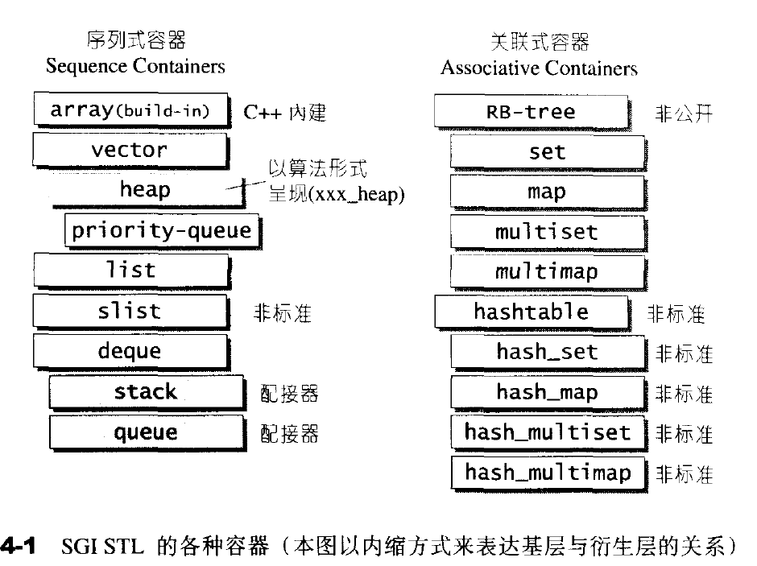

第四章主要讲述序列容器

### 4.2 vector

#### 4.2.1 vector概述

vector与array非常想死，但是array是静态空间，一旦配置了就不嫩改变，vector是动态空间，可以自己动态增长；

vector本质还是使用的allocator来进行内存空间的分配，因此它的内存模式是由allocator来决定的。所以vector是一个连续的空间，但是每次分配的过于小的时候，会造成数据的搬移，比较浪费时间。而vector的迭代器是普通的指针。([指针和引用的区别](https://www.cnblogs.com/LLD-3/p/9664100.html);[C++中指针和引用区别---详解版](https://blog.csdn.net/qq_39539470/article/details/81273179));

**数据结构**

vector所采用的数据结构非常简单：线性连续空间。它以两个迭代器start和finish分别指向配置得来的连续空间中目前已经被使用的范围，并以迭代器end_of_storage指向整块连续空间(含备用空间)的尾端，并且为了方便扩充，vector实际配置的大小(capacity)可能比客户端需求更大一些，以备将来可能的扩充。vector的容量永远大于或等于其大小。一旦容量等于大小，便是满载，下次再有新增元素，整个vector就要进行搬移。即capacity>size永远成立

```c++
template <class T,class Alloc=alloc>
class vector
{
    ...
protected:
    //目前使用的空间的头部

    iterator start;
    //目前使用的空间的尾部

    iterator finish;
    //目前可用空间的尾部

    iterator end_of_storage;  

}
```
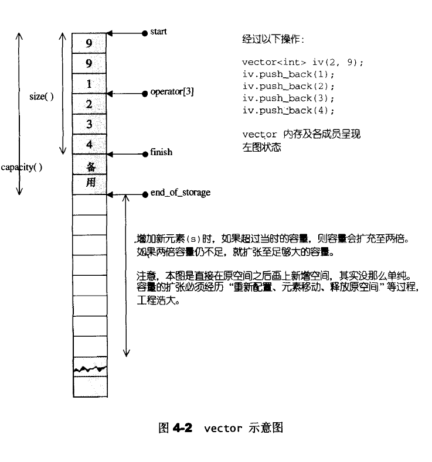


这里内存分配的关键函数代码如下
```c++
template <class T,class Alloc>
void vector<T,Alloc>::insert_aux(iterator position,const T& x)
{   
    //检查是否还有备用空间

    if(finish!=end_of_storage){
        //在备用空间起始处构造一个元素，并以vector最后一个元素为其初始值

        construct(finish,*(finish-1));
        //移动finish指针
        
        ++finish;
        //拷贝内容

        T x_copy=x;
        //执行拷贝

        copy_backward(position,finish-2,finish-1);
        *position=x_copy；
    }else {
        //进入这里表示已经不存在可用空间

        const size_type old_size=size();
        //决定分配空间的大小

        const size_type len=old_size!=0?2*old_size:1;
        //实际分配

        iterator new_start=data_allocator::allocate(len);
        iterator new_finish=new_start;
        try{
            //拷贝元素

            new_finish=uninitialized_copy(start,position,new_start);
            //为新元素设定初值x
            
            construct(new_finish,x);
            //调整指针位置

            ++new_finish;
            //将备用空间中的内容拷贝过来，这里主要是为了，后面的容量指针和相关信息

            new_finish=uninitialized_copy(position,finish,new_finish);
        }catch(...){
            destroy(new_start,new_finish);
            data_allocator::deallocate(new_start,len);
            throw;
        }
        //释放原来的内存
        destroy(begin(),end());
        deallocate();

        //调整迭代器，指向新vector
        start=new_start;
        finish=new_finish;
        end_of_storage=new_start+len;
    }
}
```

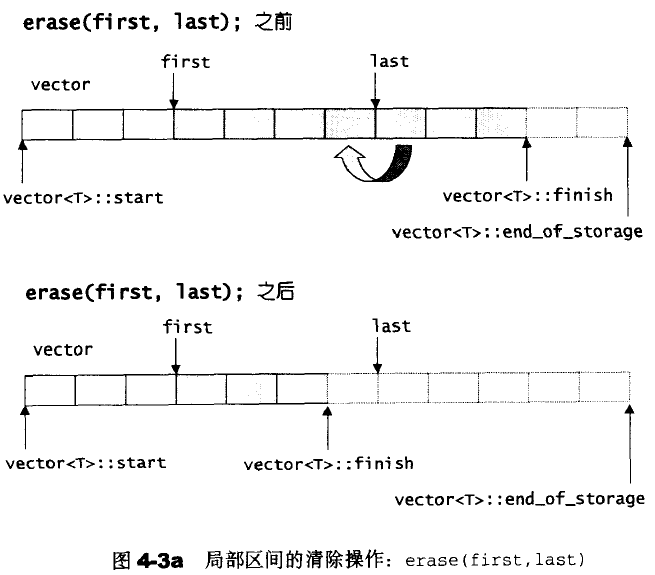

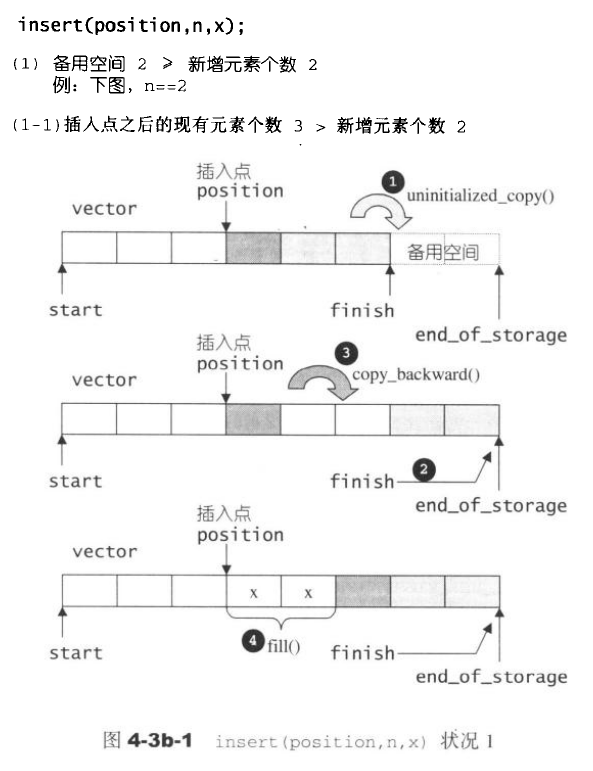

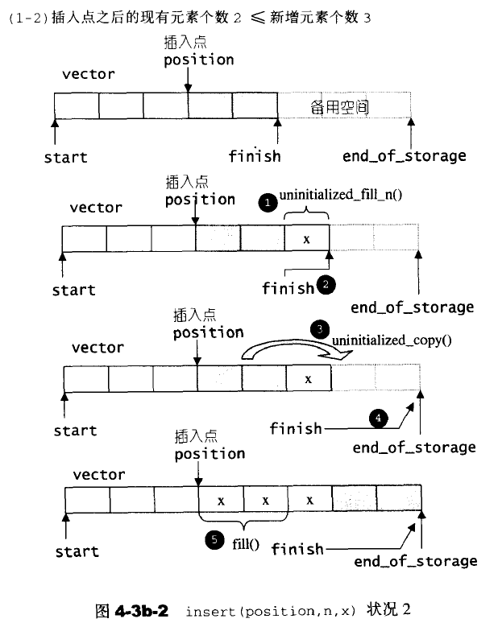

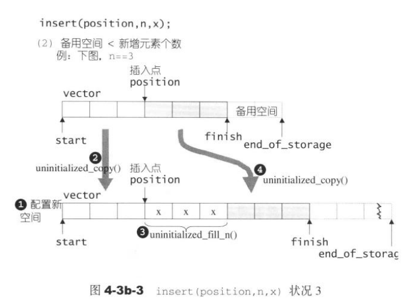

注意这里的迭代器失效。

### 4.3 list

相较于vector的连续线性空间，list相对复杂很多，但是，它的好处是每次插入或者删除一个元素就配置或者释放一个元素空间，因此list对空间的运用有绝对的精准，一点也不浪费。并且任何元素的插入或者删除，list永远是常数运行时间。

list不能像vector那样使用普通指针作为迭代器，因为其节点不保证子啊存储空间中连续存在。迭代器在递增时指向下一个节点，递减时指向上一个节点。

list的插入和接合(splice)都不会造成原有的list迭代失效，这在vector中是不成立的。但是它会使得操作指向的迭代器失效。

SGI的list不仅是一个双向链表，而且还是一个环状双向链表。

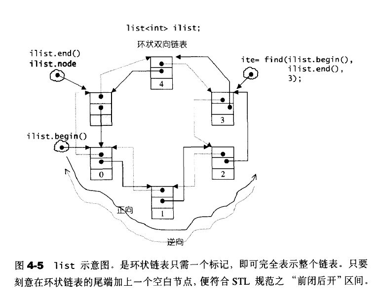

**list的构造和内存管理**

list为了方便空间配置器，额外定义了一个list_node_allocator，为的就是更方便地以节点大小为配置单位；

```c++
protected:
    //配置一个节点并传回

    link_type get_node() {return list_node_allocator::allocate();}
    //释放一个节点

    void put_node(link_type p){list_node_allocator::deallocate(p);}
    //产生(配置并构造)一个节点，带有元素值

    link_type create_node(const T& x)
    {
        link_type p=get_node();
        //全局函数，构造/析构函数

        construct(&p->data,x);
        return p;
    }
    //销毁一个节点

    void destroy_node(link_type p)
    {
        //析构函数

        destroy(&p->data);
        put_node(p);
    }
```
list提供多个构造函数，default constructor允许我们不指定任何参数做出一个空的list出来。

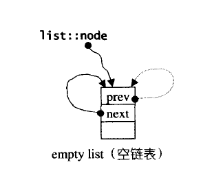

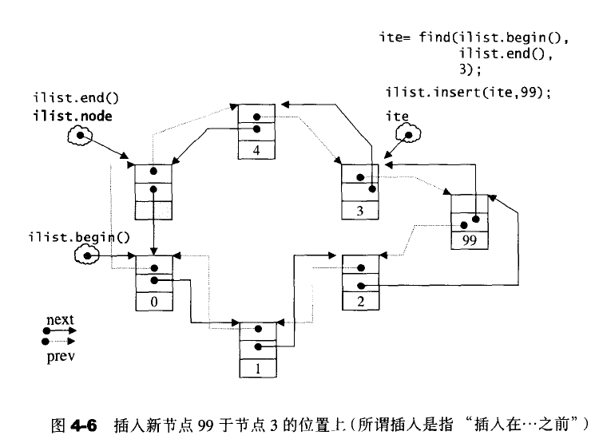

注意这里的插入是先产生在插入，并且是头插法。这样可以避免尾部迭代器的变动，减少工作量。

list内部提供一个transfer操作；将某个连续范围的元素迁移到某个特定位置之前。操作比较复杂。

```c++
//transfer

// typedef list_node* link_type;
void transfer(iterator position,iterator first,iterator last)
{
    if(position!=last)
    {
        (*(link_type((*last.node).prev))).next=position.node;
        (*(link_type((*first.node).prev))).next=last.node;
        (*(link_type((*position.node).prev))).next=first.node;
        link_type tmp=link_type((*position.node).prev);
        (*last.node).prev=(*first.node).prev;
        (*first.node).prev=tmp;
    }
}

```

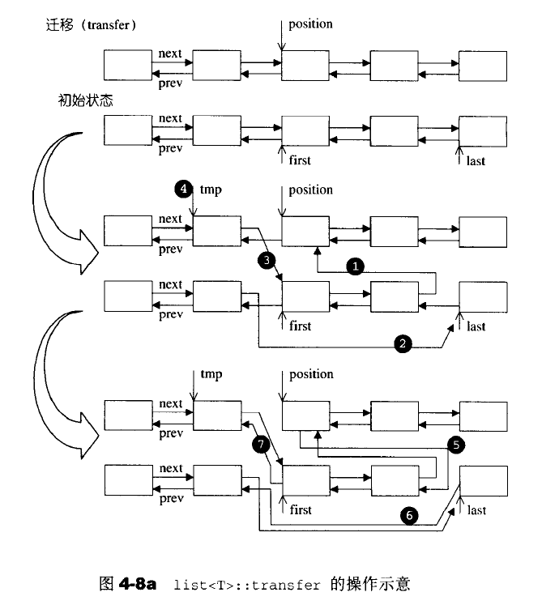

list的splice()结合函数，有许多版本，便便指针的重新链接；但是因为链表的链接特性，因此链表无法使用sort()算法，必须使用自己的sort()

### 4.4 deque

deque是双向开口的连续性空间；

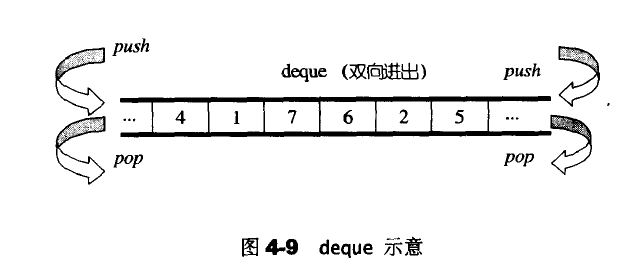

deque允许常数时间内对端进行匀速的插入或者移除操作，并且没有所谓的容量(capacity)的概念，因为他是动态地以分段连续空间组合而成的，随时可以增加一段新的空间并链接起来。因此deque的迭代器并不是普通的指针；因此除非必要，我们应该尽可能选择使用vector而非deque，为了操作的高效，可将deque先完整复制到一个vector身上，将vector排序后，再复制回去。

deque避开了vector中的反复内存搬移，但是迭代器架构却异常复杂。

deque采用一块所谓的map(一小块连续内存空间)作为主空。其中每个元素都是指针，指向另外一段较大的连续线性空间，称为缓冲区，缓冲区才是deqeue的存储空间主体。

```c++
protected:
    //指向元素的指针

    typedef pointer* map_pointer;

protected:
    //指向的map节点指针

    map_pointer map;
    //map指针数量

    size_type map_size;
```