> 2019-08-02 16:09:52

## 算法

### 算法总览和分类

**STL算法总览**


**算法分类**

- 质变算法：会改变操作对象之值；如copy、swap、replace、fill、remove、permutation、aprtition、random shuffling、sort等
- 非质变算法：不改变操作对象之值：find、search、count、for_each、equal、mismatch、max、min等

**STL算法的一般形式**

质变算法一半提供两个版本：in-place--就地改变操作对象;copy--将操作对象的内容复制一份副本(通常以_copy结尾)，操作后返回。

### 6.3 数值算法<stl_numeric.h>

数值算法一般包含在表头<numeric>中，实现是在<stl_numeric.h>文件中

- accumulate 关键操作: init=init+*i(第一版本)、init=binary_op(init,*i*)(第二个版本)
- adjacent_difference:计算相邻元素的差额关键代码： *i-*(i-1)；
- inner_product:能够计算一般内积，`result=result+(*i)**(first2+(i-first))`
- partial_sum计算局部总和
- power:计算指数([C++中位运算的使用方法](https://blog.csdn.net/a1351937368/article/details/77746574/);[
STL源码分析之power算法](https://blog.csdn.net/u012062760/article/details/46401115);[快速计算x的n次幂](https://blog.csdn.net/MoreWindows/article/details/7174143))

```c++
T power(T x,Integer n,Monoidoperation op)
{
    if(n==0){
        return identity_element(op);
    }else{
        //进行位运算直到为偶数，这里主要是为了过滤掉低位的0

        while((n&1)==0){
            n>>=1;
            x=op(x,x);
        }
        //重新计算x，n变为偶数

        T result=x;
        n>>=1;
        //

        while(n!=0)
        {
            x=op(x,x);
            //发现是奇数;将奇数去除，即乘一个x

            if((n&1)!=0){
                result=op(result,x);
            }
            //除以2

            n>>=1;
        }
        return result;
    }
}
/*

第一步判断n是否为0；
第一个while循环，尽可能的将底数变的更大，更好进行后续的计算，经过第一个while之后，n肯定是一个奇数了，再进入第二个循环，如果是1，则直接返回。
第二个while循环感觉就是求当前底数（x的偶数次平方，y）的奇数（m）次平方的过程，也就是求m的二进制各个位是否为1的过程，如果当前位M为1，则结果额外乘以y的2^M次方~

*/

```

在这里顺道测试了一下GCC的stl的性能，发现结果比较感人啊，迷之编译器优化。。。。

```c++

#include<bits/stdc++.h>
#include<cmath>
using namespace std;
//朴素算法
long pusu(int x,int n)
{
    long num=1;
    for(int i=0;i<n;i++)
    {
        num*=x;
    }
    return num;
}
//分治算法----快速幂
long fenzhi(int x,int n)
{
    long num=1;
    while(n)
    {
        if((n&1)!=0)
        {
            num*=x;
            n--;
        }
        x*=x;
        n/=2;
    }
    return num;
}
//stl算法
long stl_pow(int x,int n)
{
    if (n == 0)
    {
        return 1;
    }
    else
    {
        while ((n & 1) == 0)
        {
            n >>= 1;
            x *= x;
        }
    }
    long result = x;
    n >>= 1;
    while (n != 0)
    {
        x *= x;
        if ((n & 1) != 0)
            result *= x;
        n >>= 1;
    }
    return result;
}
int main()
{
    int x=3,n=5,k=2;
    //cin>>x>>n;
   for(int i=0;i<k;++i){
    ++x; 
  for(int j=0;j<k;++j){
    ++n;
    long result;
    clock_t start_time=clock();
    long temp1=pusu(x,n);
    cout<<"朴素算法结果:"<<temp1<<endl;
    clock_t end_time=clock();
    printf("Running time is: %lfms\n",static_cast<double>(end_time-start_time)/CLOCKS_PER_SEC*1000);
    clock_t start_time1=clock();
    long temp2=fenzhi(x,n);
    cout<<"分治算法结果:"<<temp2<<endl;
    clock_t end_time1=clock();
    printf("Running time is: %lfms\n",static_cast<double>(end_time1-start_time1)/CLOCKS_PER_SEC*1000);
    clock_t start_time2=clock();
   cout<<"STL_power:"<<stl_pow(x,n)<<endl;    
   clock_t end_time2=clock();
   printf("Running time is: %lfms\n",static_cast<double>(end_time2-start_time2)/CLOCKS_PER_SEC*1000);
   clock_t start_time3=clock();
   cout<<"STL结果:"<<std::pow(x,n)<<endl; 
   clock_t end_time3=clock();
   printf("Running time is: %lfms\n",static_cast<double>(end_time3-start_time3)/CLOCKS_PER_SEC*1000);
   printf("x %d,n %d \n",x,n);
   printf("--------------------\n");
    }
}
return 0;
}
/* 结果

朴素算法结果:4096
Running time is: 0.097000ms
分治算法结果:4096
Running time is: 0.006000ms
STL_power:4096
Running time is: 0.009000ms
STL结果:4096
Running time is: 0.025000ms
x 4,n 6 
--------------------
朴素算法结果:16384
Running time is: 0.006000ms
分治算法结果:16384
Running time is: 0.005000ms
STL_power:16384
Running time is: 0.007000ms
STL结果:16384
Running time is: 0.009000ms
x 4,n 7 
--------------------
朴素算法结果:390625
Running time is: 0.005000ms
分治算法结果:390625
Running time is: 0.007000ms
STL_power:390625
Running time is: 0.007000ms
STL结果:390625
Running time is: 0.009000ms
x 5,n 8 
--------------------
朴素算法结果:1953125
Running time is: 0.006000ms
分治算法结果:1953125
Running time is: 0.007000ms
STL_power:1953125
Running time is: 0.006000ms
STL结果:1.95312e+06
Running time is: 0.009000ms
x 5,n 9 
--------------------

*/


```

### 6.4 基本算法

基本常用算法定义在<stl_algobase.h>中，其它算法定义于<stl_algo.h>

基本函数有: equal,fill,fill_n,iter_swap,lexicographical_compare,max,min,mismatch,swap;这些在之前的c++primer阅读笔记中有介绍，不再过多赘述。

lexicographical_compare：字典排列方式对两个序列，进行比较

- 如果第一序列的元素较小，返回true,否则返回false
- 如果达到last1而尚未达到last2,返回true
- 如果达到last2而尚未达到last1,返回false
- 同时达到，返回false


当复制位置的起点在复制区间内时，将会发生错误。为了防止上述错误的发生，一般都会先把目标区段使用memmove()复制下来，再进行操作。


copy改变的是[result,result+(last-first))中的迭代器所指对象，而并非更改迭代器本身。它会为输出区间的元素赋予新值，而不是产生新的元素。它不能改变输出区间的迭代器个数。因此不能将元素插入空容器中。

**copy_backward 反向拷贝**


### 6.5 set 相关算法

STL提供了四种set(集合)相关的算法，分别是并集(union),交集(intersection)，差集(difference)、对称集(symmetic difference)

set_union:求并集--set_union(first1,last1,first2,last2,ostream_iterator<int>(cout,""));

比较的关键代码：

```c++
template <class InputIterator1,class InputIterator2,class OutputIterator>
OutputIterator set_union(InputIterator1 first1,InputIterator1 last1,
                        InputIterator2 first2,InputIterator2 last2)
{
    while(first1!=last1&&first2!=last2) {
        //在两个区间之内分别移动迭代器，首先将元素较小者(假设为A区)记录于目标区域；然后移动A区迭代器使之前进；同时另一个迭代器不懂，然后进行新一次的比较大小、记录值、迭代器、迭代器移动，直到两区中有一个区达到尾端。如果元素相等，取S1者记录于目标区，并同时移动两个迭代器

        if(*first1<*first2){
            *result=*first1;
            ++first1;
        }else if(*first2<*first1){
            *result=*first2;
            ++first2;
        //*first2==*first1

        }else{
            *result=*first1;
            ++first1;
            ++first2;
        }
        ++result;
    }
}

```


#### 6.5.2 set_intersection构造交集

基本上就是上面的条件判断反过来了，当相等时迭代器才增加。


#### 6.5.3 set_difference


#### 6.5.4 set_symmetric_difference 构造对称差集


### 6.7 其它算法

**find_end:查找最后一次出现的点**

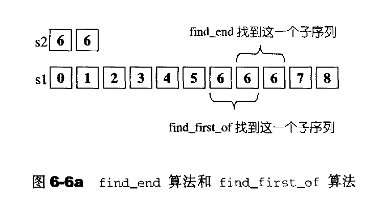

**includes(应用于有序区间)**

判断序列s2是否“涵盖于”序列s1。

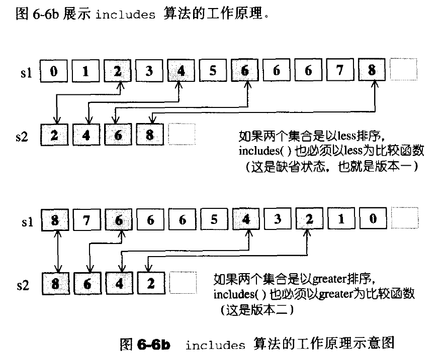

**merge**
将两个经过排序的集合S1和S2，合并起来置于另一段空间。所得结果也是一个有序(sorted)序列。

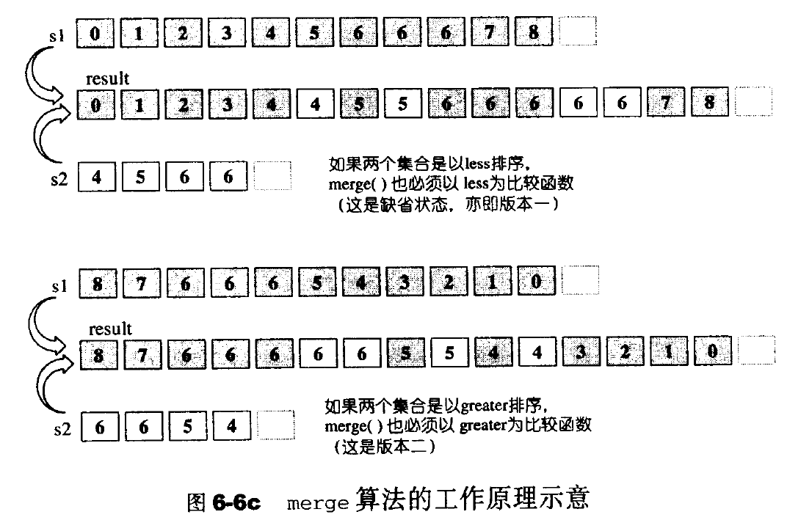

**paritition** 
将区间中的元素重新排列，通过条件进行筛选。这个算法并不保证保留元素的原始相对位置，如果需要保留原始相对位置，应该使用stable_partition

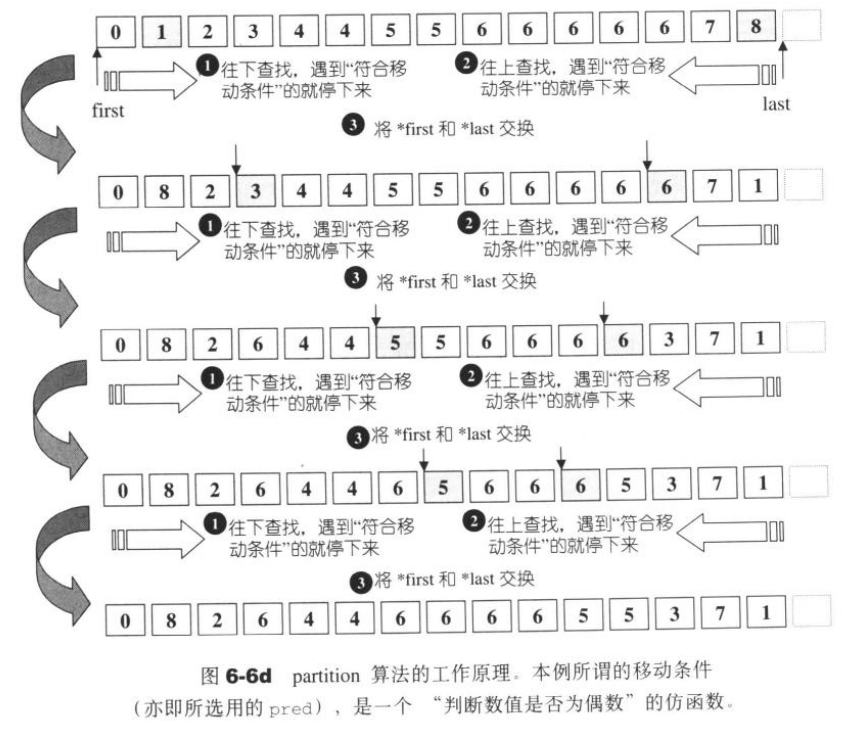

**remove**

remove并不真正的删除这个元素，而是将每一个不与value相等的匀速轮番赋值给first之后的空间。返回值表示重新整理之后的最后元素的下一个位置。例如{0,1,0,2,0,3,0,4};执行remove(0)；最终结果为{1,2,3,4,0,3,0,4};返回的Forwarallterator指向第五个位置。如果要进行删除需要使用erase()来将迭代器后面的数据进行删除。注意array不适合使用remove()和remove_if()；因为它无法缩小尺寸，导致残余数据永远存在。应该使用remove_copy()和remove_copy_if();

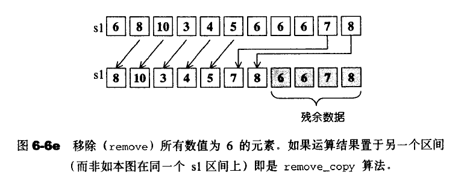

**rotate**

rotate可以实现非对称的位置交换。

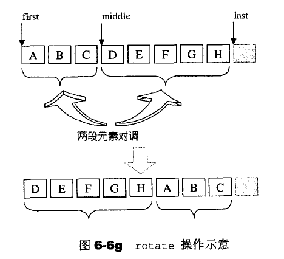
关键代码：

```c++

template <class ForwardIterator,class Distance>
void __rotate(ForwardIterator first,ForwardIterator middle,ForwardIterator last,Distance*,forward_iterator_tag)
{
    for(ForwardIterator i=middle;;)
    {
        //前段后段的元素一一交换

        iter_swap(first,i);
        //双双前景

        ++first;
        ++i;
        //判断那个先行结束

        //前段先行结束

        if(first==middle)
        {
            //后段同时结束，整个就结束了

            if(i==last) return;
            //调整位置，对新的前后段再做交换

            middle=i;
            //后段先结束

        }else if(i==last){
            //调整，准备对新的前后段再做交换

            i=middle;
        }
    }
}

```
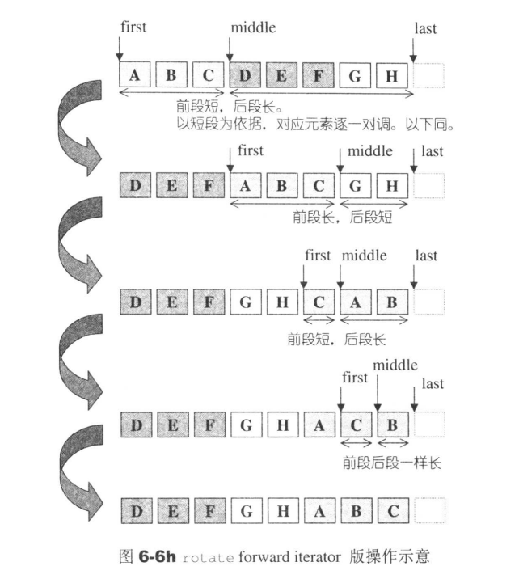

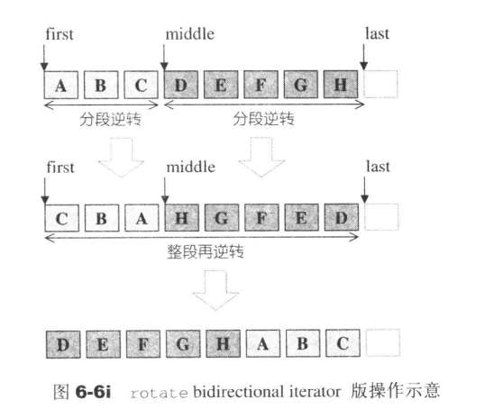

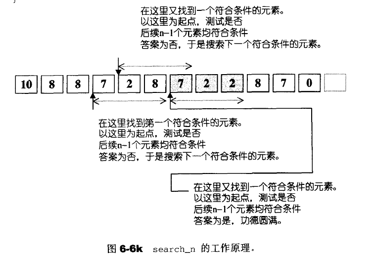

**unique**移除重复的元素

注意:unique只移除相邻的重复元素，如果你想移除所有重复元素，必须先行排序。
所有保留下来的元素，其原始值相对次序不变

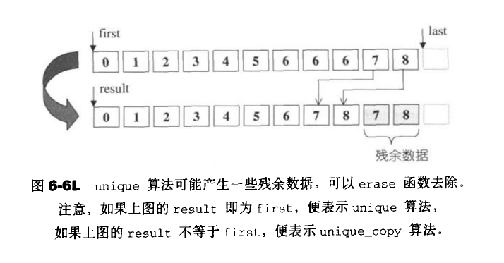

**lower_bound/upper_bound(应用于有序区间)**

这个是二分查找的一种版本，试图在已经排序的[first,last)中寻找匀速value。返回满嘴条件的第一个元素。upper_bound是返回最后一个值

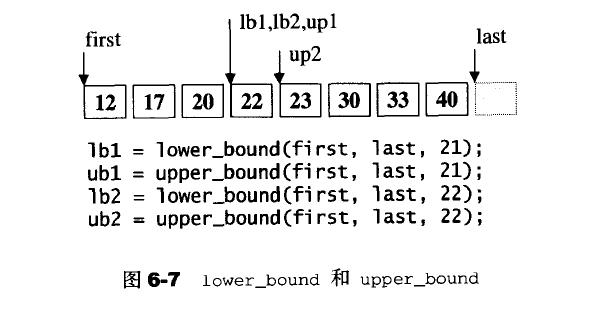

**next_permutation**

取得[first,last)所标示的下一个排列组合，有就返回true,否则返回false。

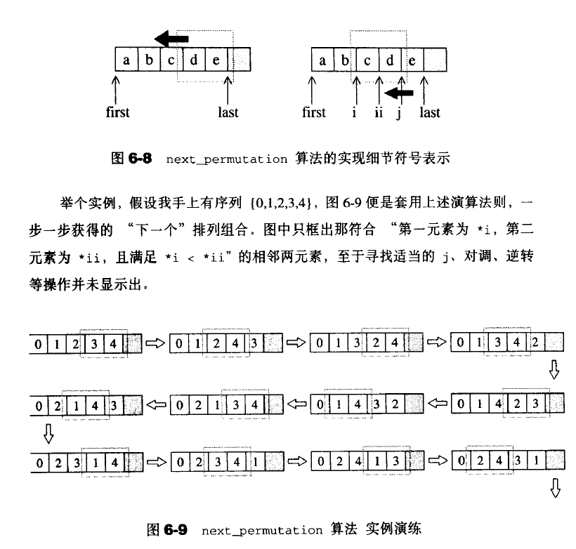

**next_permutation**
与上面基本相同

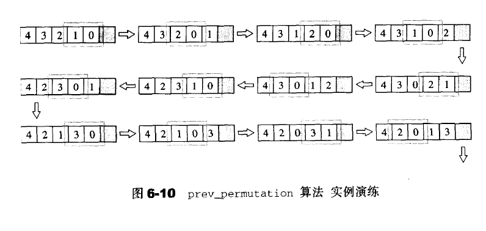

**random_shuffle**

将元素次序随机重排。

#### 6.7.9 sort

这个算法接受两个RandomAccesslterators(随机存取迭代器)，然后将区间内的所有元素以渐增方式由小到大重新排列。并且存在允许用户使用仿函数来进行排序。STL的所有关系型容器都拥有自动排序功能(底层采用RB-tree)；所以不需要用到这个sort算法。序列式容器中的stack,queue,priority-queue都有特定的出入口，不允许用户对元素排序。vector和dequeue适合使用sort算法。list的迭代器鼠疫Bldirectionaltterators不适合使用sort算法。

STL的sort算法数据量大的时候采用Quick Sort(现在已经开始使用IntroSort 最坏算法复杂度为O(NlogN)) ;数据量小的时候使用Insertion Sort。主要是因为插入排序在数据量很小的时候有不错的效果。并且没有额外的开销和负荷。

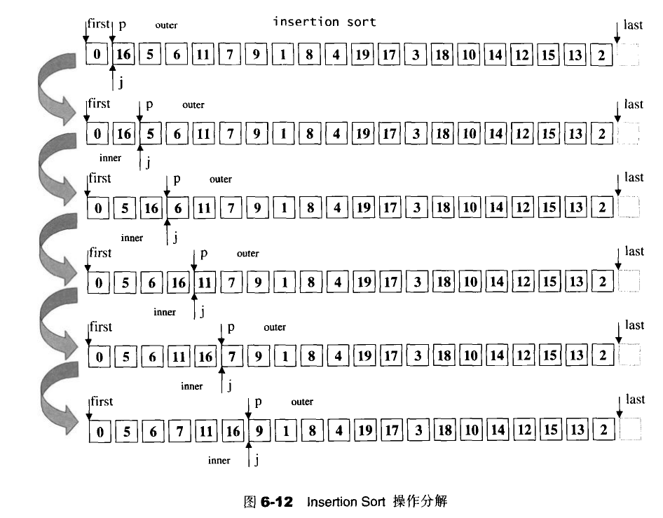

注意:这里是采用交换的方式进行的排序，不是链表的指直接插入。

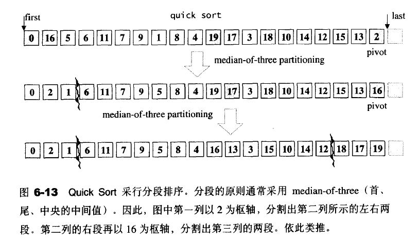

快速排序的一般流程

1. 如果S的元素个数为0或者1，结束
2. 取S中的任何一个元素，当做轴(pivot)v。
3. 将s分割为L,R；两段，使得L内的每一个元素都小于或者等于v,R内的每一个元素都大于或等于v。
4. 对L,R递归执行Quick Sort

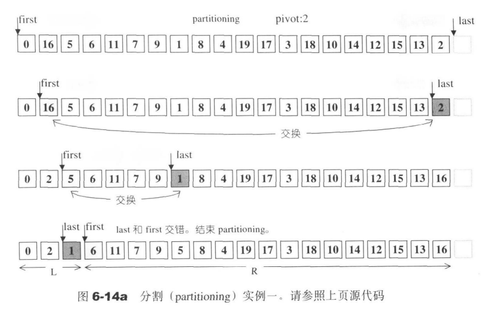

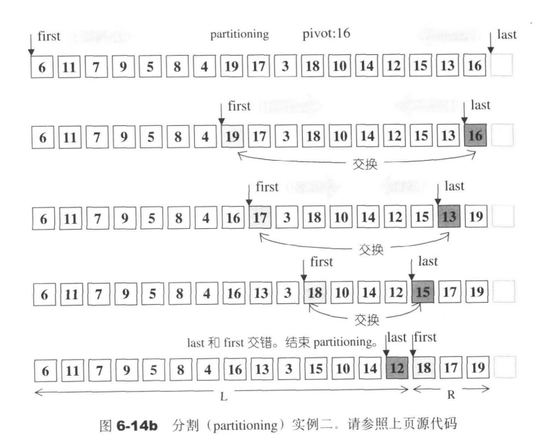


下面是快速排序的具体代码

```c++
template <class RandomAccessIterator>
inline void sort(RandomAccessIterator first,
                RandomAccessIterator last
                )
{
    if(first!=last){
        __introsort_loop(first,last,value_type(first),__lg(last-first)*2);
        __final_insertion_sort(first,last);
    }
}
//__lg()用来控制分割恶化的情况

//找出2^k<=n的最大值K,例如n=7,k=2,n=20,k=4;

template <class Size>
inline Size __lg(Size n)
{
    Size k;
    for(k=0;n>1;n>>=1) ++k;
        return k;
}
//返回a,b，c之间的居中者
template <class T>
inline const T& __median(const T& a,const T& b,const T& c)
{
    if(a<b){
        if(b<c){
            return b;
        }else if(a<c){
            return c;
        }else{
            return a;
        }
    }else if(a<c){
        return a;
    }else if(b<c){
        return c;
    }else {
        return b;
    }
}
//数组分割返回分割后的右段的第一个位置
template <class RandomAccessIterator,class T>
RandomAccessIterator __unguarded_partition(
                                            RandomAccessIterator first,
                                            RandomAccessIterator last,
                                            T pivot)
{
    while(true){
        //找到>=pivot的元素就停下来

        while(*first<pivot){++ first;}
        //调整指针位置

        --last;
        //找到<=pivot的元素就停下来。

        while(pivot<*last) --last;
        //注意一下只适用于 random iterator
        //交错，结束循环

        if(!(first<last)) return first;
        //大小值交换

        iter_swap(first,last);
        //调整

        ++first;
    }
}

//当匀速个数为40时，__introsoft_loop()的最后一个参数将是5*2，意思是最多允许分割10层。IntroSort算法如下：

template <class RandomAccessIterator,class T,class Size>
void __introsort_loop(RandomAccessIterator first,
                      RandomAccessIterator last,
                      T*,
                      Size depth_limit)
{
    //__stl_threshold是一个全局常数，稍早定义为const int 16

    while(last-first>__stl_threshold) {
        if(depth_limit==0){
            //分割恶化，改用heapsort

            partial_sort(first,last,last);
            return;
        }
        --depth_limit;
        //选择一个够好的轴枢并决定分割点,并赋值给cut

        RandomAccessIterator cut=__unguarded_partition(first,last,T(__median(*first,*(first+(last-first)/2),*(last-1))));
        //根据cut对右半段递归进行sort

        __introsort_loop(cut,last,value_type(first),depth_limit);
        last=cut;

        //这里是回到while循环，准备对左半段递归进行sort
    }
}

```
#### 6.7.10 equal_range(应用于有序区间)

是二分查找法的一个版本。试图在已排序的[first,last)中寻找value。它返回一对迭代器i和j,i是在不破坏次序的前提下，value可以插入的第一个位置，j则是最后一个。因此i-j内都是value。


#### 6.7.11 inplace_merge(应用于有序区间)

将两个已经有序的序列重新结合成为一个新的有序序列。注意，这个算法会使用额外的内存空间(暂时缓冲区)。

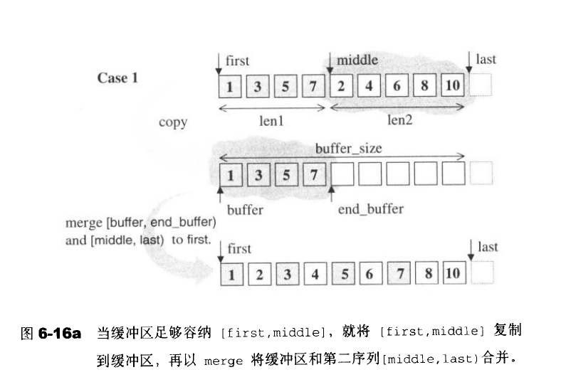


#### 6.7.12 nth_element

重新排列，使得迭代器nth所指的元素，与整个迭代队列完整排序之后，同一位置的元素同值。同时保证[nth,last)内没有任何一个元素不大于[first,nth)；但对于[first,nth)和[nth,last)两个子区间内的元素次序则无任何保证。

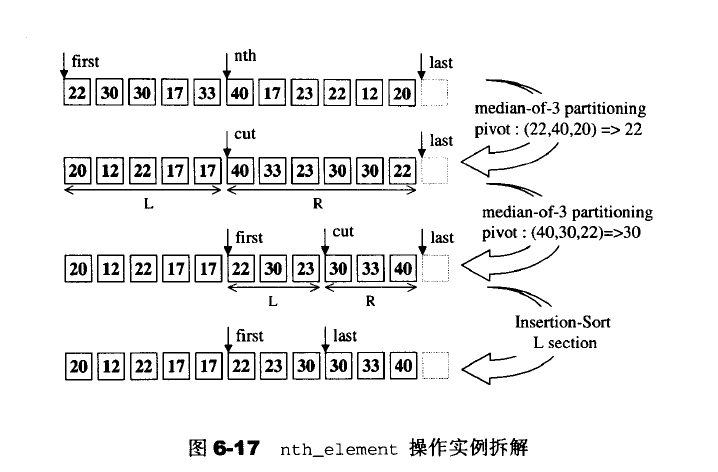

#### 6.7.13 merge sort

利用分治思想，以各个击破的方式来对区间进行排序：

- 将区间对半分开，左右两段各自排序。
- 使用inplace_merge重新组合为一个完整的有序序列
- 递归对半操作，直到每一小段的长度为0或者1.


