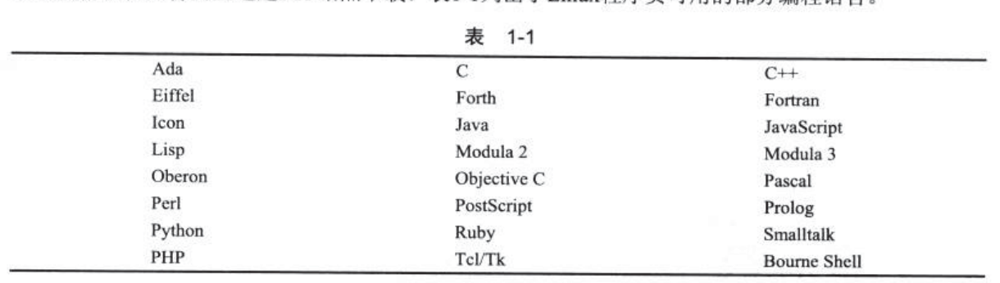
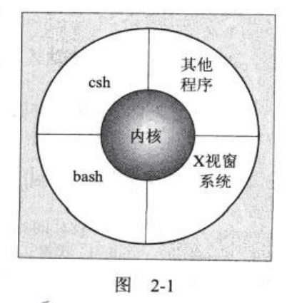
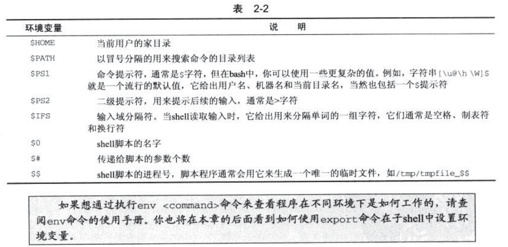
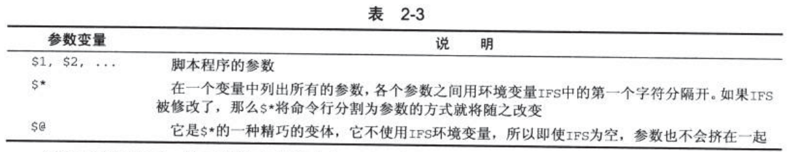
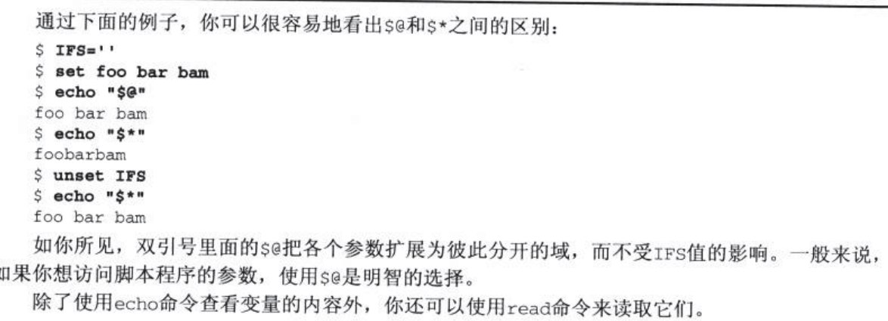
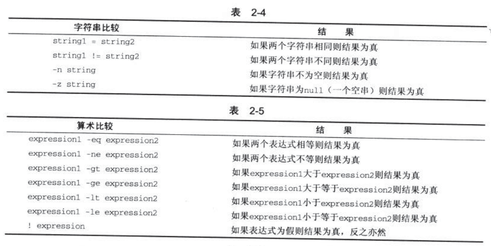
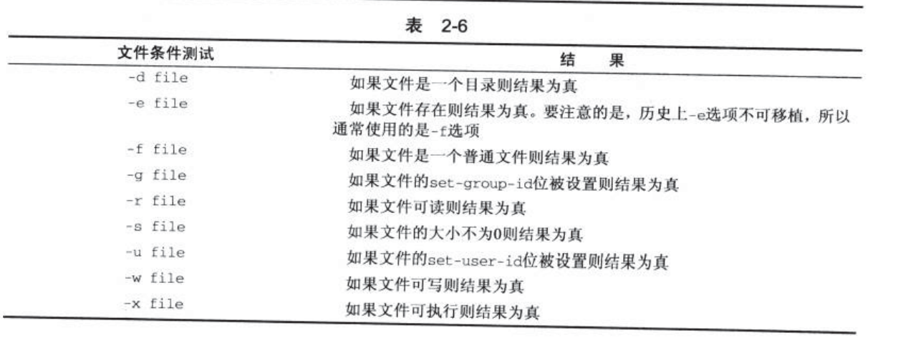

# Linux 程序设计 阅读笔记

## 参考链接：

- [Linux内核文档首页](https://www.kernel.org/doc/Documentation/)
- [Linux文档](https://linux.die.net/)
- [Linux c 开发手册](https://legacy.gitbook.com/book/wizardforcel/linux-c-api-ref/details)
- [书中代码地址](http://www.wrox.com/WileyCDA/WroxTitle/Beginning-Linux-Programming-4th-Edition.productCd-0470147628,descCd-DOWNLOAD.html)


## 第一章 入门

#### 1.1.1  unix
_参考链接：_ [POSIX标准总体分析](https://blog.csdn.net/novagx/article/details/2077561);[POSIX](https://baike.baidu.com/item/POSIX/3792413?fr=aladdin)

unix系统特点

- 简单性：
- 集中性：
- 可重用组件
- 过滤器
- 开放的文件格式
- 灵活性

几乎所有的UNIX编写的程序都可以在Linux上编译运行

GNU项目软件：

- GCC:GNU编译器集，包括GUN c
- G++：c++编译器，是GCC的一部分。
- GDB:源代码级别的调试器
- GNU make:NUIX make李明亮的免费版本
- Bison:与UNIX yacc兼容的语法分析生成器。
- bash:命令与解释器
- GNU Emacs:文本编辑器计环境

linux支持的编程语言：



普通用户可执行程序搜索路径

- `/bin`：二进制文件目录，用于存放启动系统时用到的程序
- `/usr/bin`：用户二进制文件目录，用于存放启动系统时用到的程序
- `/usr/local/bin`：本地二进制目录，用于存放软件安装的程序
- `/usr/sbin`或`/sbin`：root登录后的PATH变量和程序存在的路径
- `/opt`:第三方应用程序，可能被安装的目录。

注意当操作系统升级的时候，只有目录`/opt`和`/usr/local`里面的内容需要保留，对于系统级应用程序，建议放在`/usr/local`中，个人应用程序放在`home`文件夹中。

#### 1.2.4 开发系统引导
_参考链接：_ [Linux系统目录结构说明](https://blog.csdn.net/mzl87/article/details/79673012);[Linux 系统目录结构](https://www.runoob.com/linux/linux-system-contents.html);[ubuntu获取源码方法](https://blog.csdn.net/Oliverlyn/article/details/55272286)


头文件位置:/usr/include,特定版本依赖，一般都在`/usr/include/sys`或者`/usr/include/linux`中

库文件:一般存储在`/lib`和`/usr/lib`目录中。包括`.a`静态函数库和`.so`动态函数库。

注意：当静态库被多个应用程序使用时，内存中就会存在同一函数的多个副本，将大量消耗内存和磁盘空间。

额外的搜索路径可以在/etc/ld.so.conf中配置。

## 第二章 shell程序设计

Linux中一般工具的开发都是先用shell实现，当追求速度时，再使用c/c++,Perl或者其它语言实现。



shell中*匹配字符串，`?`匹配单个字符，`[]`和`{}`匹配多个字符串。

```shell
more `grep -l POSIX`

#等价于

more ${grep -l POSIX *}
```
脚本中第一行的`#!/bin/bash`告诉脚本它的执行软件。注意绝对路径不要超过32个字符，因为老版本的识别不了。

shell中变量直接声明，使用时使用`$`，赋值时等号两边不能有空格。
shell中"'"只是输出字符串，"""进行变量解析。

**环境变量**



**参数变量**
当脚本运行时带有参数时，一些额外的变量就会被创建。环境变量`$#`始终存在，只是当无参数传递时为0；





注意：$#是未知变量的个数

下面是简单的测试脚本程序

```shell
#!/bin/bash

#shell file name try_var

salutation="hello"
echo $salutation
echo "The parameter 0 is : $0"
echo "The parameter 1 is : $1"
echo "The parameter 2 is : $2"
echo "The parameter list is : $*"
echo "The parameter list is : $@"
echo "The user's home directory is $HOME "

echo "Please enter a new greeting "
read salutation
echo $salutation
echo "The script is now complete"
exit 0


```
输入： ./try_var.sh 1 2 3
输出：
```
hello
The parameter 0 is : ./try_var.sh
The parameter 1 is : 1
The parameter 2 is : 2
The parameter list is : 1 2 3
The user's home directory is /home/wangpengcheng 
Please enter a new greeting 
123
123
The script is now complete
```

#### 2.6.2 条件

`test`或`[`命令，使用`[`时，通常以`]`符号来结尾。`test`用的较少。例如：

```shell
#!/bin/bash
#检查是否存在文件
if test -f fred.c
then
    ...
fi

#还可以写成下面这样

if [ -f fred.c ]
then
...
fi
```

注意命令使用时后面必须存在空格。

**常见比较表达式**





#### 2.6.3 控制结构

```shell

if condition
then 
    statements1
elif condition
    statements2
else
    statements3
fi


```
注意对百年来那个字符串进行比较时，最好使用`""`让变量初始化。

可以使用`printf`代替`echo`就可以自定义，换行符。

**for语句**

```shell
for variable in value
do
    statements
done
```

示例：
```shell
#!/bin/bash

for file in $(ls f*.sh);
do
    lpr $file
done
exit 0

```
**while语句**
```shell

while condition do
    statements
done
```

**untill语句**

循环执行，直到满足条件

```shell

until [[ condition ]]; do
    statements
done
```

**case语句**

```shell

case variable in
    pattern [ | pattern ] ...) statements;;
    pattern [ | pattern ] ...) statements;;
    ...
esac
```

注意每个模式都应该以双分号结尾。

使用示例:
```shell
#!/bin/bash

echo "Is it morning? Please answer yes or no"
read timeofday

case "$timeofday" in
    yes | y | Yes | TES )   
        echo "test"
        echo "Good morning";;
    n* | N* )               echo "Good Afternoon";;
    * )                     echo "Sorry,answer not reconized";;
esac
exit 0
```
**列表命令**

- AND 列表：`&&`执行and条件，注意前后有空格
- OR 列表： `|| `直到有一条命令成功运行。

**语句块**

使用`{}`来构造执行语句块。

#### 2.6.4 函数
