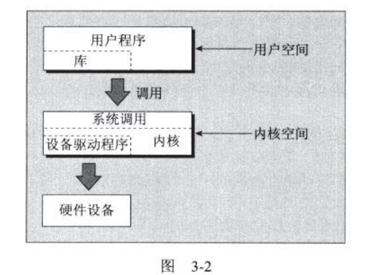
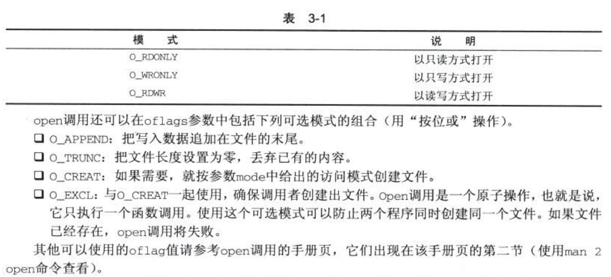
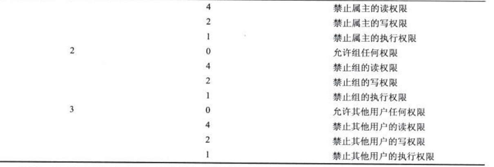
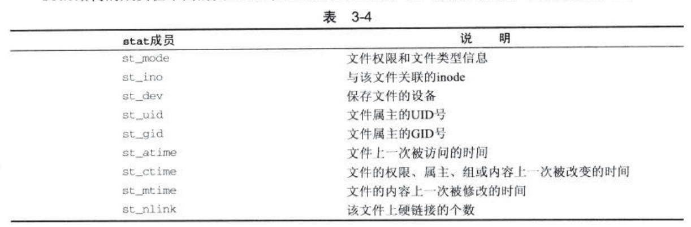
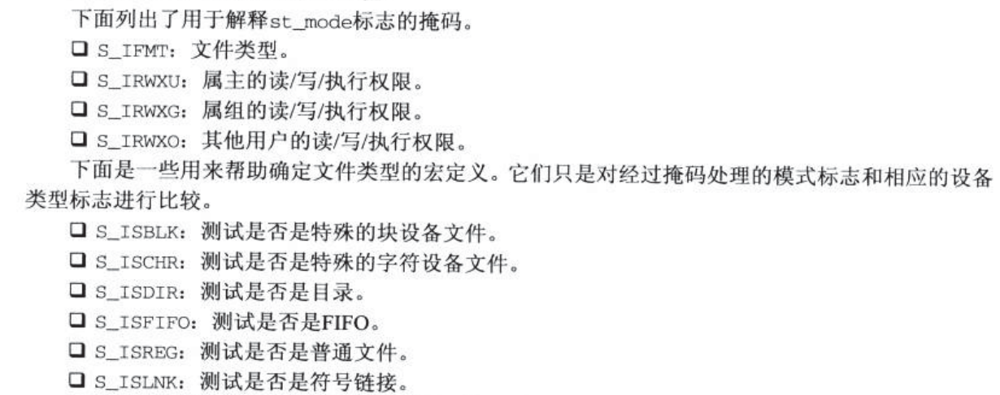
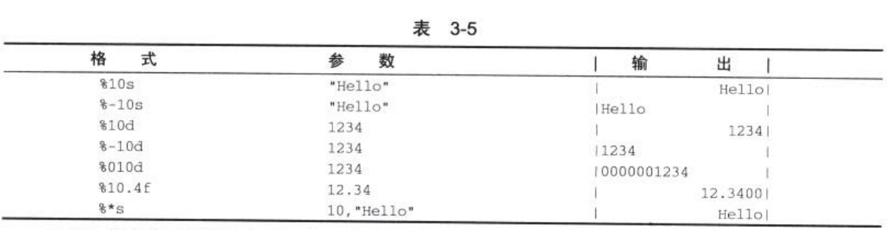

## 第三章 文件操作

### 3.1 linux文件结构
_参考链接：_　[每天进步一点点——Linux中的文件描述符与打开文件之间的关系](https://blog.csdn.net/cywosp/article/details/38965239)；[Linux文件读写机制及优化方式](https://blog.csdn.net/u014743697/article/details/52663975);[【Linux学习笔记】标准IO缓冲：行缓冲、全缓冲、无缓冲](https://blog.csdn.net/LYJwonderful/article/details/80646602)

linux中一切皆是文件。

文件除了本身的文件内容外，还有文件的附属管理信息，这些保存在`inode`节点中。目录是用于保存其他文件的节点号和节点名字的文件，目录文件中的每个数据项都是指向某个文件节点的链接，删除文件名就是删除与之对应的链接。
删除文件时，就是删除了文件的目录项，并且指向该文件的链接数目-1。文件中的数据仍然能够通过其它指向链接访问到。被链接数为0时，才会被正真删除。

引文linux中一切皆是文件的思想，其中硬件设备都是文件，可以使用，mount进行设备的挂载：

```
mount -t iso9660 /dev/hdc/ /mnt/cdrom
cd /mut/cdrom
```

重要的控制设备目录有三个：

- /dev/console:控制台设备
- /dev/tty: 控制终端
- /dev/null: 空设备，所有向这个设备中的输出都将被丢弃。

操作系统的内核是一组 **设备驱动程序**；内核提供了用于访问设备驱动程序的底层函数(系统调用)：open、read、write、close、ioctl等相关信息。

输入输出底层系统调用的效率非常低。
- 会影响系统性能：linux需要从用户态，切换到内核状态。因此应该每次读写大量的数据而不是每次仅仅读写一个字符。
- 硬件会限制对底层系统调用一次能读写的数据块的大小。

针对上述情况，linux提供了标准的函数接口`stdio.h`。



#### 3.4.1 write调用

格式：
```
#include <unistd.h>

size_t write(int fildes,const void *buf,size_t nbytes);
```

将缓冲区buf的前nbytes个字节写入文件描述符`fildes`关联的文件中返回实际的字节数，如果存在错误，返回的实际字节数可能小鱼`nbytes`。

#### 3.4.2 read系统调用

```c
#include <unistd.h>

size_t read(int fildes,void *buf, size_t nbytes);

```

和上面基本相同只是变成了读取

```c

#include <unistd.h>
#include <stdlib.h>

int main()
{
    char buffer[128];
    int nread;

    nread = read(0, buffer, 128);
    if (nread == -1)
        write(2, "A read error has occurred\n", 26);

    if ((write(1,buffer,nread)) != nread)
        write(2, "A write error has occurred\n",27);

    exit(0);
}

# input : hello there | ./simple_read
# output :hello there
```

#### 3.4.3 open 系统调用

```c
#include <fcntl.h>
#include <sys/types.h>
#include <sys/stat.h>

int open(const char *path,int oflags);
int open(const char *path,int oflags,mode_t mode);

```
open建立了一条文件或者设备的访问方式。调用成功，返回一个可以被read、write和其它系统调用的文件描述符fildes。这个不会和其它正在运行中的进程共享。即便是同一文件，不同进程，也会产生不同的共享访问符号。因此文件同时读写的时候，会相互副高。一般使用文件锁来防止出现冲突。



POSIX规范还标准化了一个creat调用，相当于`oflags=O_CREAT|O_WONLY|O_TRUNC`

#### 3.4.4 访问权限设置


使用`O_CREAT`标志的open滴啊用来创建文件时，需要用3个参数格式的open调用。第三个参数mode是几个标志按位或后得到的。

- S_IRUSR:读权限，文件属主。
- S_IWUSR:写权限，文件属主。
- S_IXUSR:执行权限，文件属主。
- S_IRGRP:读权限，文件所属组。
- S_IWGRP:写权限，文件所属组。
- S_IXGRP:执行权限，文件所属组。
- S_IROTH:读权限，其它用户。
- S_IWOTH:写权限，其它用户。
- S_IXOTH:执行权限，其它用户。

示例：
```c

open("myfile",O_CREAT,S_IRUSR|S_IXOTH);

```
##### 3.4.4.1 umask

这里的权限设置，实际上海市发送权限请请求，是否被设置，取决于当时umask的值。




chmod操作也就是在直接更改umask的值。

##### 3.4.4.2 close系统调用

```c
#include <unistd.h>

int close(int fildes);

```
这里使用close主要是滴啊用终止文件描述符fildes与文件之间的关联。文件描述符被释放能够重新使用。返回正确为0，返回错误为-1

注意：对于网络文件系统，可能不会在关闭文件之前报告文件写操作中出现的错误。因为在执行写操作时，数据可能未被确认写入。

##### 3.4.4.3 ioctl系统调用

```c
#include <unistd.h>

int ioctl(int fildes,int cmd,...); 
```

提供了一个用于控制设备及其描述符行为和配置服务的借口。

#### 3.4.5 其它文件管理有关的系统调用

##### 3.4.5.1 lseek系统调用

对文件描述符`fildes`的读写指针进行设置，可以用来设置文件的下一个读写位置。位置可以是文件中的绝对位置，也可以使相对于当前位置或者文件尾部的某个而相对位置。

```c
#includ <unistd.h>

#includ <sys/types.h>

off_t lseek(int fildes,off_t offset,int whence);

```
whence是一个枚举值，用来定义该值便宜的用法：

- SEEK_SET: offset是一个绝对值
- SEEK_CUR: offset是相对于当前位置的一个相对位置。
- SEEK_END: offset是相对于文件尾的一个相对位置。

##### 3.4.5.2 fstat、stat、和lstat系统调用

这些是文件描述符相关的问价状态信息，该信息将会写到一个buf结构中，buf的地址以参数形式传递给fstat。其原型如下：

```
#include <unistd.h>

#include <sys/stat.h>

#include <sys/types.h>

int fstat(int fildes,struct stat *buf);
int stat(const char *path,struct stat *buf);
int lstat(const char *path,struct stat *buf);

```

stat和lstat返回的是通过文件名查找到的状态信息。但是当文件是符号链接时，lstat返回符号链接本身信息，stat返回 **符号链接指向的信息**。stat结构成员内容如下：



st_mode关键字定义在头文件`sys/stat.h`中。这些宏包括对访问权限、问价类型标志以及一些用于帮助测试特定类型和权限的掩码的定义。

- S_IFBLK: 文件是一个特殊的块设备。
- S_IFDIR: 文件是一个目录
- S_IFCHR: 文件是一个特殊的字符设备
- S_IFIFO: 文件是一个FIFO(命名管道)
- S_IFREG: 文件是一个普通文件。
- S_FLNK: 文件是一个链接符号。

其它模式标志：

- S_ISUID:文件设置了SUID位。
- S_ISGID:文件设置了SGID位。



##### 3.4.5.3 dup和dup2系统调用

```c
#include <unistd.h>

int dup(int fildes);
int dup2(int fildes,int fildes2);
```

上面主要是复制文件描述符，可以通过更多的文件描述符访问同一个文件。

### 3.5 标准I/O库

_参考链接：_ [Linux下标准I/O缓冲机制](https://blog.csdn.net/gkzscs/article/details/83033337)

与c标准I/O相同，但是与C++中的输入和书而出流不同，c++中是单独的输出流模型，同时为了兼容C，与C的输入输出同步，会比较慢，因此可以使用`ios::sync_with_stdio(false);`,这样c++流会块很多。

其中的主要函数有：

- fopen:
- fclose:
- fread:
- fwrite:
- fflush:将文件流中的所有未写出的数据立刻写处理啊，确保程序继续执行前数据都已经被写到磁盘上了，flclose中隐含了一次fflush调用。
- fseek:与lseek对应的文件流函数。为下一次读写操作指定位置。
```
#include <stdio.h>

int fseek(FILE *stream,long int offset, int whence);

```
- fgetc,getc,getchar:fgetc和getc基本相同，都是从文件流中取出一个字符返回，当它达到文件文件末尾过着出现错误时返回EOF；getchar相当于get(stdin),从标准输入里读取下一个字符。

- fputc、putc和putchar和基本一致，不过多了输出字符参数`c`。
- fgets和gets：前者从文件流stream中读取一个字符串，遇到换行符或者结束文件末尾，将换行符传递到接收字符串中并添加`\n`表示字符串结尾，因此实际输出字符串数目为`n-1`。后者从标准输入中读取数据并丢弃遇到的换行符。在接收字符传的尾部加上一个null字符。

注意： gets对传输字符的个数并没有限制，所以可能会溢出自己的传输缓冲区。因此，你应该避免使用它，并用fgets来代替。([[Linux]标准IO全缓冲和行缓冲](https://www.cnblogs.com/yiyide266/p/10566160.html))


### 3.6 格式化输入和输出

- print、fprintf和sprintf:第一个将其送到标准输出.fprintf将自己输出输送到一个指定的文件流。sprintf将输出和一个结尾空字符写到作为参数传递过来的字符串s里。


- scanf、fscanf、sscanf：与printf基本相同。

- fgetpos:获取当前文件流读写的位置。
- fsetpos:设置文件流的当前读写位置
- ftell:返回文件流当前读写位置的偏移
- freopen:重新使用一个文件流。
- setvbuf:设置文件流的缓冲机制
- remove:相当于unlink函数，如果path是一个目录，则相当于rmdir函数。
- ferror:测试一个文件流的错误标识，如果该标识被设置就返回一个非零值，否则返回0
- feof:测试一个文件流的文件尾标识，被设置则返回非零值。否则返回0.
- clearerr:重新清除错误信息。
- fileno:获取文件流使用的底层文件描述符。失败返回-1
- fdopen:在已经打开的文件描述符上，创建一个新的文件流。实际所用是为一个已经打开的文件描述符提供stdio缓冲区。


### 3.7 文件和目录的维护

- chmod:改变文件或者目录的访问权限
```
#include <sys/types.h>
#include <unistd.h>

int chown(const char *path,uid_t owner,git_t group);
```
- unlink、link和symlink:管理文件链接数目，具体的卡伊参考第二章中内容。
```
#include <unistd.h>

int unlink(const char *path);
int link(const char *path1,const char *path2);
int symlink(cosnt char *path1,const char *path2);
```

- mkdir和rmdir:文件夹的创建与删除。
- chdir和getcwd:访问和文件夹路径，获取当前文件夹路径。
- opendir: 创建一个目录，并返回创建的目录流。如果成功，它返回一个指向DIR结构的指针，可以用于读取目录数据。
- readdir:返回一个指针，结构里，保存一个目录流dirp中下一个目录的资料，直到返回NULL;
- telldir:返回目录流中当前的位置。
- seekdir:设置目录流dirp的目录项指针。loc的值用来设置指针位置。
```
#include <sys/types.h>
#include <dirent.h>

void seekdir(DIR *dirp,long int loc);
```
- closedir：关闭目录流。

一个目录扫描程序
```
#include <unistd.h>
#include <stdio.h>
#include <dirent.h>
#include <string.h>
#include <sys/stat.h>
#include <stdlib.h>

void printdir(char *dir, int depth)
{
    DIR *dp;
    struct dirent *entry;
    struct stat statbuf;

    if((dp = opendir(dir)) == NULL) {
        fprintf(stderr,"cannot open directory: %s\n", dir);
        return;
    }
    chdir(dir);
    while((entry = readdir(dp)) != NULL) {
        lstat(entry->d_name,&statbuf);
        if(S_ISDIR(statbuf.st_mode)) {
            /* Found a directory, but ignore . and .. */
            if(strcmp(".",entry->d_name) == 0 || 
                strcmp("..",entry->d_name) == 0)
                continue;
            printf("%*s%s/\n",depth,"",entry->d_name);
            /* Recurse at a new indent level */
            printdir(entry->d_name,depth+4);
        }
        else printf("%*s%s\n",depth,"",entry->d_name);
    }
    chdir("..");
    closedir(dp);
}

/*  Now we move onto the main function.  */

int main()
{
    printf("Directory scan of /home:\n");
    printdir("/home",0);
    printf("done.\n");

    exit(0);
}

```

### 3.9 错误处理

错误代码存在子啊头文件`errno.h`中，关键内容如下所示：


### 3.10 /proc文件处理系统

linux提供了一个特殊的文件系统procfs，通常以/proc目录的形式呈现。包含了许多特殊文件用来对驱动程序和内核信息进行更高层次的访问。只要有正确的访问权限，就可以通过读写这些文件来获取信息或者设置参数。

proc文件夹中包含以PID命名的文件夹和其它设备文件夹，设备的基本信息就放在其中。可以直接读取这些文件就可以获取其状态信息。例如：`cat /proc/cpuinfo`

输出信息如下：
```
processor   : 0
vendor_id   : GenuineIntel
cpu family  : 6
model       : 94
model name  : Intel(R) Core(TM) i5-6400 CPU @ 2.70GHz
stepping    : 3
microcode   : 0xcc
cpu MHz     : 1652.835
cache size  : 6144 KB
physical id : 0
siblings    : 4
core id     : 0
cpu cores   : 4
apicid      : 0
initial apicid  : 0
fpu     : yes
fpu_exception   : yes
cpuid level : 22
wp      : yes

......

```

可以使用`cat /proc/net/sockstat`获得网络套接字的使用统计。

### 3.11 高级主题 fcnt1和mmap

#### 3.11.1 fcnt1系统调用


