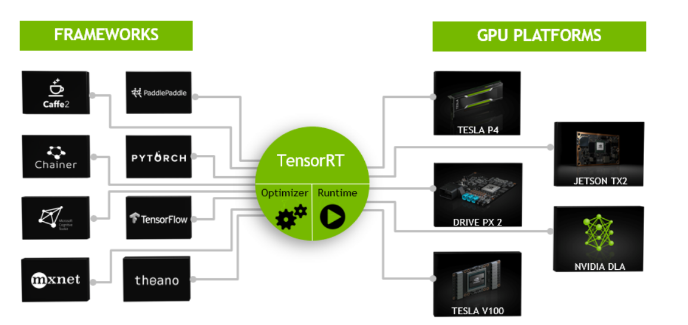

> 2019-08-25 08:44:23

# TensorRT学习笔记
_参考链接：_ 

- [官网指导手册](https://docs.nvidia.com/deeplearning/sdk/tensorrt-developer-guide/index.html);
- [github 开源代码地址](https://github.com/NVIDIA/TensorRT)
- [API](https://docs.nvidia.com/deeplearning/sdk/tensorrt-api/index.html)
## 1 tenosrRT的安装

- [官方指导](https://docs.nvidia.com/deeplearning/sdk/tensorrt-install-guide/index.html)


这里主要是使用Tar 安装,前提是已经安装好cudnn和cuda；

下载文件后指直接解压
### 1.1 动态链接库安装

在~/.bashrc中添加lib目录

```
#settensorrt

export LD_LIBRARY_PATH=$LD_LIBRARY_PATH:/home/wangpengcheng/TensorRT-5.1.5.0/lib

```

### 1.2 python环境安装

```shell
cd TensorRT-5.1.x.x/python
#python2.7
sudo pip2 install tensorrt-5.1.x.x-cp27-none-linux_x86_64.whl

#python3.x
sudo pip3 install tensorrt-5.1.x.x-cp3x-none-linux_x86_64.whl


```

### 1.3 安装Python UFF(tenosrflow)

```
cd TensorRT-5.1.x.x/uff
#python2.7 
sudo pip2 install uff-0.6.3-py2.py3-none-any.whl
#python3.x
sudo pip3 install uff-0.6.3-py2.py3-none-any.whl


```

### 1.4 安装Python graphsurgeon

```shell
cd TensorRT-5.1.x.x/graphsurgeon

#Python2.7
sudo pip2 install graphsurgeon-0.4.1-py2.py3-none-any.whl

#python3.x
sudo pip3 install graphsurgeon-0.4.1-py2.py3-none-any.whl
```

### 1.5 测试

```shell
cd <TensorRT root directory>/samples/sampleMNIST
make 
cd TensorRT-5.1.5.0/bin

./sample_mnist
```
输出：
```
[I] Building and running a GPU inference engine for MNIST
[I] Input:
@@@@@@@@@@@@@@@@@@@@@@@@@@@@
@@@@@@@@@@@@@@@@@@@@@@@@@@@@
@@@@@@@@@@@@@@@@@@@@@@@@@@@@
@@@@@@@@@@@@@@@@@@@@@@@@@@@@
@@@@@@@@@@@@@@@@@@@@@@@@@@@@
@@@@@@@@@@@@@@@@@@@@@@@@@@@@
@@@@@@@%=#@@@@@%=%@@@@@@@@@@
@@@@@@@           %@@@@@@@@@
@@@@@@@           %@@@@@@@@@
@@@@@@@#:-#-.     %@@@@@@@@@
@@@@@@@@@@@@#    #@@@@@@@@@@
@@@@@@@@@@@@@    #@@@@@@@@@@
@@@@@@@@@@@@@:  :@@@@@@@@@@@
@@@@@@@@@%+==   *%%%%%%%%%@@
@@@@@@@@%                 -@
@@@@@@@@@#+.          .:-%@@
@@@@@@@@@@@*     :-###@@@@@@
@@@@@@@@@@@*   -%@@@@@@@@@@@
@@@@@@@@@@@*   *@@@@@@@@@@@@
@@@@@@@@@@@*   @@@@@@@@@@@@@
@@@@@@@@@@@*   #@@@@@@@@@@@@
@@@@@@@@@@@*   *@@@@@@@@@@@@
@@@@@@@@@@@*   *@@@@@@@@@@@@
@@@@@@@@@@@*   @@@@@@@@@@@@@
@@@@@@@@@@@*   @@@@@@@@@@@@@
@@@@@@@@@@@@+=#@@@@@@@@@@@@@
@@@@@@@@@@@@@@@@@@@@@@@@@@@@
@@@@@@@@@@@@@@@@@@@@@@@@@@@@

[I] Output:
0: 
1: 
2: 
3: 
4: 
5: 
6: 
7: **********
8: 
9: 

&&&& PASSED TensorRT.sample_mnist # ./sample_mnist

```

## 2. tensorRT简介

TensorRT是高性能c++推理库。

;


其实类似TensorRT具体工作的有很多，例如[TVM](https://github.com/dmlc/tvm/)、[TC(Tensor Comprehensions)](https://github.com/facebookresearch/TensorComprehensions)，都做了一些类似于TensorRT的工作，将训练好的模型转化为运行在特定端(例如GPU)的进行模型优化等一系列操作后的代码，从而达到快速预测的效果。

推理项目的一般实现过程：

- 模型的训练：主要是数据的预处理，网络的设计，模型的训练，
- 解决方案的设计：算法平台的确定，编程语言，硬件确定;网络的输入和输出等
- 解决方案的实施：使用tensorRT推理框架进行部署。

### 2.1 tensorRT的工作原理

- 网络定义(Network Definition):
- 建立(Builder):建立相关的网络。
- 推理引擎(Engine)：

tenosrRT提供其他的工具可以将，其它的网络模型转换到当前的网络模型中。

- Caffe Parser：
- UFF Parse:
- ONNX Parser:

## 3. TensorRT的一般使用

### 3.1 程序设计的一般流程：

1. 创建网络
```c++
IBuilder* builder = createInferBuilder(gLogger);
INetworkDefinition* network = builder->createNetwork();
```
2. 添加输入数据
```c++
auto data = network->addInput(INPUT_BLOB_NAME, dt, Dims3{1, INPUT_H, INPUT_W});
```
3. 添加卷积层：传递给tensorRT的权重存在在host主机中
```c++
auto conv1 = network->addConvolution(*data->getOutput(0), 20, DimsHW{5, 5}, weightMap["conv1filter"], weightMap["conv1bias"]);
conv1->setStride(DimsHW{1, 1});
```
4. 添加池化层：
```c++
auto pool1 = network->addPooling(*conv1->getOutput(0), PoolingType::kMAX, DimsHW{2, 2});
pool1->setStride(DimsHW{2, 2});
```
5. 添加全连接层
```c++
auto ip1 = network->addFullyConnected(*pool1->getOutput(0), 500, weightMap["ip1filter"], weightMap["ip1bias"]);
auto relu1 = network->addActivation(*ip1->getOutput(0), ActivationType::kRELU);
```
6. 添加SotfMax层
```c++
auto prob = network->addSoftMax(*relu1->getOutput(0));
prob->getOutput(0)->setName(OUTPUT_BLOB_NAME);
```
7. 获取输出层
```
network->markOutput(*prob->getOutput(0));
```

### 3.2 导入外部模型

1. 创建builder和网络
```c++
IBuilder* builder = createInferBuilder(gLogger);
nvinfer1::INetworkDefinition* network = builder->createNetwork();
```
2. 从其他特殊格式文件中创建
```c++
//获取相关网络参数

//ONNX

auto parser = nvonnxparser::createParser(*network, gLogger);
//UFF

auto parser = nvuffparser::createUffParser();
//Caffe

auto parser = nvcaffeparser1::createCaffeParser();


```
3. 获取参数
```c++
parser->parse(args);
```


### 3.3 导入一个caffe模型

```c++
//创建builder

IBuilder* builder=createInferBuilder(gLogger);
INetworkDefinition* network=builder->createNetwork();

//创建caffe参数

ICaffeParser* parser=createCaffeParser();

//从参数中导入模型

const IBlobNameToTensor=parser->parse("deploy_file" , "modelFile", *network, DataType::kFLOAT);

//设置输出参数

for(auto& s:outputs)
{
    network->markOutput(*blobNameToTensor->find(s.c,str()));
}

```
### 3.4 创建一个Engine

#### 3.4.1 使用builder建立一个引擎
```c++
builder->setMaxBatchSize(maxBatchSize);
builder->setMaxWorkspaceSize(1<<20);
ICudaEngine* engine=builder->buildCudaEngine(*network);

```

#### 3.4.2 相关变量的销毁

```c++
parser->destroy();
network->destroy();
builder->destroy();

```
