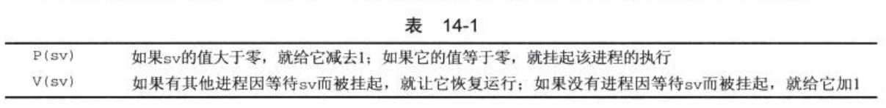
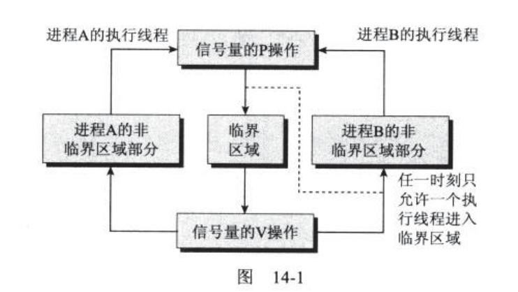
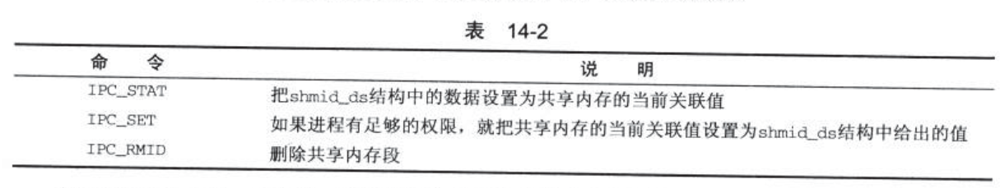

> 2019-09-18: 21:29:53

# Linux 程序设计 阅读笔记(四)

## 参考链接：

- [Linux内核文档首页](https://www.kernel.org/doc/Documentation/)
- [Linux文档](https://linux.die.net/)
- [Linux c 开发手册](https://legacy.gitbook.com/book/wizardforcel/linux-c-api-ref/details)
- [Linux Kernel API](https://www.kernel.org/doc/htmldocs/kernel-api/index.html)
- [书中代码地址](http://www.wrox.com/WileyCDA/WroxTitle/Beginning-Linux-Programming-4th-Edition.productCd-0470147628,descCd-DOWNLOAD.html)
- [POSIX thread (pthread) libraries](https://www.cs.cmu.edu/afs/cs/academic/class/15492-f07/www/pthreads.html)


## 第 12 章 POSIX线程

### 12.1 什么是线程

线程：一个程序中的多个执行线路就叫线程(thread)。或者说线程是一个进程内部的一个控制序列。

当使用fork()函数时，创建一个进程，这个新进程拥有自己的变量和自己的PID.时间调度也是独立的，并且拥有自己的栈。与创建者共享全局变量、文件描述符、信号处理函数和当前目录状态

编写多线程程序时，我们通过定义宏`_REENTRANT`来告诉编译器我们需要可重入功能，这个宏的定义必须位于程序中的任何#include之前。

```c
#include <pthread.h>
//创建利用函数和相关参数创建线程

int pthread_create(pthread_t *thread,pthread_attr_t *attr,void *(*start_rountine)(void *),void *arg);
//终止相关线程

void pthread_exit(void *retval);
//收集子进程信息的wait函数
int pthread_join(pthread_t th,void **thread_return);
```

下面是一个简单的pthread使用示例：

```c
#include <stdio.h>
#include <unistd.h>
#include <stdlib.h>
#include <string.h>
#include <pthread.h>

void *thread_function(void *arg);

char message[] = "Hello World";

int main() {
    int res;
    pthread_t a_thread;
    void *thread_result;
    //创建对应的函数

    res = pthread_create(&a_thread, NULL, thread_function, (void *)message);
    if (res != 0) {
        perror("Thread creation failed");
        exit(EXIT_FAILURE);
    }
    printf("Waiting for thread to finish...\n");
    res = pthread_join(a_thread, &thread_result);
    if (res != 0) {
        perror("Thread join failed");
        exit(EXIT_FAILURE);
    }
    printf("Thread joined, it returned %s\n", (char *)thread_result);
    printf("Message is now %s\n", message);
    exit(EXIT_SUCCESS);
}

void *thread_function(void *arg) {
    printf("thread_function is running. Argument was %s\n", (char *)arg);
    sleep(3);
    strcpy(message, "Bye!");
    pthread_exit("Thank you for the CPU time");
}
```

### 12.4 同时执行

下面来编写一个程序让两个同时进行

```c
#include <stdio.h>
#include <unistd.h>
#include <stdlib.h>
#include <pthread.h>

void *thread_function(void *arg);
int run_now = 1;
char message[] = "Hello World";

int main() {
    int res;
    pthread_t a_thread;
    void *thread_result;
    int print_count1 = 0;
    //创建线程

    res = pthread_create(&a_thread, NULL, thread_function, (void *)message);
    if (res != 0) {
        perror("Thread creation failed");
        exit(EXIT_FAILURE);
    }
    //在这里等待一段时间
    while(print_count1++ < 20) {
        if (run_now == 1) {
            printf("1");
            run_now = 2;
        }
        else {
            sleep(1);//没有则不断检查，这种方式称之为忙等待
        }
    }

    printf("\nWaiting for thread to finish...\n");
    //等待线程完成和结束
    res = pthread_join(a_thread, &thread_result);
    if (res != 0) {
        perror("Thread join failed");
        exit(EXIT_FAILURE);
    }
    printf("Thread joined\n");
    exit(EXIT_SUCCESS);
}

void *thread_function(void *arg) {
    int print_count2 = 0;

    while(print_count2++ < 20) {
        if (run_now == 2) {
            printf("2");
            run_now = 1;
        }
        else {
            sleep(1);
        }
    }

    sleep(3);
}

```
### 12.5 同步

同步的两种基本方法：信号量和互斥量。

#### 12.5.1 用信号量进行同步

信号量函数的名字都以`sem_`开头，而不想大多数线程函数那样以pthread_开头。线程中使用的基本信号量函数有4个，它们都非常简单

```c
#include <semaphore.h>
//初始化sem指向的信号量对象，设置共享量和初始值

int sem_init(sem_t *sem,int pshared,unsigned int value);
//等待传入信号量，以原子操作的方式将信号量-1

int sem_wait(sem_t *sem);
//发射信号量,以原子操作的方式将信号量+1

int sem_post(sem_t *sem);
//在使用玩信号量之后，对其进行销毁

int sem_destroy(sem_t *sem);
```

信号量的简单使用
```c
#include <stdio.h>
#include <unistd.h>
#include <stdlib.h>
#include <string.h>
#include <pthread.h>
#include <semaphore.h>

void *thread_function(void *arg);
sem_t bin_sem;

#define WORK_SIZE 1024
char work_area[WORK_SIZE];

int main() {
    int res;
    pthread_t a_thread;
    void *thread_result;

    res = sem_init(&bin_sem, 0, 0);
    if (res != 0) {
        perror("Semaphore initialization failed");
        exit(EXIT_FAILURE);
    }
    res = pthread_create(&a_thread, NULL, thread_function, NULL);
    if (res != 0) {
        perror("Thread creation failed");
        exit(EXIT_FAILURE);
    }

    printf("Input some text. Enter 'end' to finish\n");
    while(strncmp("end", work_area, 3) != 0) {
      if (strncmp(work_area, "FAST", 4) == 0) {
        sem_post(&bin_sem);
        strcpy(work_area, "Wheeee...");
      } else {
        fgets(work_area, WORK_SIZE, stdin);
      }
      sem_post(&bin_sem);
    }

    printf("\nWaiting for thread to finish...\n");
    res = pthread_join(a_thread, &thread_result);
    if (res != 0) {
        perror("Thread join failed");
        exit(EXIT_FAILURE);
    }
    printf("Thread joined\n");
    sem_destroy(&bin_sem);
    exit(EXIT_SUCCESS);
}

void *thread_function(void *arg) {
    sem_wait(&bin_sem);
    while(strncmp("end", work_area, 3) != 0) {
        printf("You input %d characters\n", strlen(work_area) -1);
        sem_wait(&bin_sem);
    }
    pthread_exit(NULL);
}

```

#### 12.5.2 用互斥量进行同步

它允许程序员锁住某个对象，使得每次只有一个线程访问它。进入这段代码之前锁住一个互斥量，在完成操作之后解锁它

```c
#include <pthread.h>
//初始化互斥量

int pthread_mutex_init(pthread_mutex_t *mutex,const pthread_mutexattr_t);
//互斥量加锁

int pthread_mutex_lock(pthread_mutex_t *mutex);
//互斥量解锁

int pthread_mutex_unlock(pthread_mutex_t *mutex);
//互斥量销毁

int pthread_mutex_destroy(pthread_mutex_t *mutex);

```
注意：互斥量的属性相关值默认为fast，如果一个程序试图对一个已经加了锁的互斥量调用thread_mutex_lock程序就会被阻塞，当互斥量拥有线程被阻塞时，就会形成死锁。

下面是使用的简单示例：

```c
#include <stdio.h>
#include <unistd.h>
#include <stdlib.h>
#include <string.h>
#include <pthread.h>
#include <semaphore.h>

void *thread_function(void *arg);
pthread_mutex_t work_mutex; /* protects both work_area and time_to_exit */

#define WORK_SIZE 1024
char work_area[WORK_SIZE];
int time_to_exit = 0;

int main() {
    int res;
    pthread_t a_thread;
    void *thread_result;
    //初始化信号量

    res = pthread_mutex_init(&work_mutex, NULL);
    if (res != 0) {
        perror("Mutex initialization failed");
        exit(EXIT_FAILURE);
    }
    //创建线程

    res = pthread_create(&a_thread, NULL, thread_function, NULL);
    if (res != 0) {
        perror("Thread creation failed");
        exit(EXIT_FAILURE);
    }
    //线程加锁

    pthread_mutex_lock(&work_mutex);
    //执行操作

    printf("Input some text. Enter 'end' to finish\n");
    //接受输入参数

    while(!time_to_exit) {
        fgets(work_area, WORK_SIZE, stdin);
        pthread_mutex_unlock(&work_mutex);
        //循环等待并加锁

        while(1) {
            pthread_mutex_lock(&work_mutex);
            if (work_area[0] != '\0') {//读到末尾直接解锁
                pthread_mutex_unlock(&work_mutex);
                sleep(1);
            }
            else {
                break;
            }
        }
    }
    //解锁线程
    pthread_mutex_unlock(&work_mutex);
    printf("\nWaiting for thread to finish...\n");
    //等待子线程结束
    res = pthread_join(a_thread, &thread_result);
    if (res != 0) {
        perror("Thread join failed");
        exit(EXIT_FAILURE);
    }
    printf("Thread joined\n");
    //销毁信号量

    pthread_mutex_destroy(&work_mutex);
    exit(EXIT_SUCCESS);
}

void *thread_function(void *arg) {
    sleep(1);
    //互斥量加锁

    pthread_mutex_lock(&work_mutex);
    //当检测到了end函数

    while(strncmp("end", work_area, 3) != 0) {
        printf("You input %d characters\n", strlen(work_area) -1);
        work_area[0] = '\0';
        pthread_mutex_unlock(&work_mutex);
        sleep(1);
        pthread_mutex_lock(&work_mutex);
        while (work_area[0] == '\0' ) {
            pthread_mutex_unlock(&work_mutex);
            sleep(1);
            pthread_mutex_lock(&work_mutex);
        }
    }
    time_to_exit = 1;
    work_area[0] = '\0';
    pthread_mutex_unlock(&work_mutex);
    pthread_exit(0);
}

```
实际工作中我们应该尽量使用信号量来避免出现轮寻的情况。

### 12.6 线程的属性

_参考链接：_ [POSIX thread (pthread) libraries](https://www.cs.cmu.edu/afs/cs/academic/class/15492-f07/www/pthreads.html)


在上一节中我们了解到，线程的属性的存在,我们可以使用。对应的函数对相关的函数进行修改。

```c
#include <pthread.h>
//初始化属性

int pthread_attr_init(pthread_attr_t *attr);
//设置detachedstate属性，是否可以获取另外一个线程的状态。
int pthread_attr_setdetachstate(pthread_attr_t *attr,int detachstate);
int pthread_attr_getdetachstate(const pthread_attr_t *attr,int *detachstate);
//设置schedpolicy线程的调度方式
int pthread_attr_setschedpolicy(pthread_attr_t *attr,int policy);
int pthread_attr_getschedpolicy(const pthread_attr_t *attr,int *policy);
//和上一个属性结合使用。可以对SCHED_OTHER策略运行的线程的调度进行控制
int pthread_attr_setschedparam(pthread_attr_t *attr,const struct sched_param *param);
int pthread_attr_getschedparam(const pthread_attr_t *attr,const struct sched_param *param);
//是否继承其创建者使用的参数。
int pthread_attr_setinheritsched(pthread_attr_t *attr, int inherit);
int pthread_attr_getinheritsched(const pthread_attr_t *attr, int *inherit);
//控制线程调度的计算方式
int pthread_attr_setscope(pthread_attr_t *attr,int scope);
int pthread_attr_getscope(const pthread_attr_t *attr,int *scope);
//控制线程创建栈的大小
int pthread_attr_setstacksize(pthread_attr_t *attr,int scope);
int pthread_attr_getstacksize(const pthread_attr_t *attr,int *scope);
```

下面是一个简单的使用示例

```c
#include <stdio.h>
#include <unistd.h>
#include <stdlib.h>
#include <string.h>
#include <pthread.h>
#include <semaphore.h>

void *thread_function(void *arg);
pthread_mutex_t work_mutex; /* protects both work_area and time_to_exit */

#define WORK_SIZE 1024
char work_area[WORK_SIZE];
int time_to_exit = 0;

int main() {
    int res;
    pthread_t a_thread;
    void *thread_result;
    res = pthread_mutex_init(&work_mutex, NULL);
    if (res != 0) {
        perror("Mutex initialization failed");
        exit(EXIT_FAILURE);
    }
    res = pthread_create(&a_thread, NULL, thread_function, NULL);
    if (res != 0) {
        perror("Thread creation failed");
        exit(EXIT_FAILURE);
    }
    pthread_mutex_lock(&work_mutex);
    printf("Input some text. Enter 'end' to finish\n");
    while(!time_to_exit) {
        fgets(work_area, WORK_SIZE, stdin);
        pthread_mutex_unlock(&work_mutex);
        while(1) {
            pthread_mutex_lock(&work_mutex);
            if (work_area[0] != '\0') {
                pthread_mutex_unlock(&work_mutex);
                sleep(1);
            }
            else {
                break;
            }
        }
    }
    pthread_mutex_unlock(&work_mutex);
    printf("\nWaiting for thread to finish...\n");
    res = pthread_join(a_thread, &thread_result);
    if (res != 0) {
        perror("Thread join failed");
        exit(EXIT_FAILURE);
    }
    printf("Thread joined\n");
    pthread_mutex_destroy(&work_mutex);
    exit(EXIT_SUCCESS);
}

void *thread_function(void *arg) {
    sleep(1);
    pthread_mutex_lock(&work_mutex);
    while(strncmp("end", work_area, 3) != 0) {
        printf("You input %d characters\n", strlen(work_area) -1);
        work_area[0] = '\0';
        pthread_mutex_unlock(&work_mutex);
        sleep(1);
        pthread_mutex_lock(&work_mutex);
        while (work_area[0] == '\0' ) {
            pthread_mutex_unlock(&work_mutex);
            sleep(1);
            pthread_mutex_lock(&work_mutex);
        }
    }
    time_to_exit = 1;
    work_area[0] = '\0';
    pthread_mutex_unlock(&work_mutex);
    pthread_exit(0);
}
```

可以使用`sched_get_priority_max`和`sched_get_priority_min`这两个函数来查找可用的优先级级别。

使用示例如下：

```c
#include <stdio.h>

#include <unistd.h>

#include <stdlib.h>

#include <pthread.h>

void *thread_function(void *arg);

char message[] = "Hello World";
int thread_finished = 0;

int main() {
    int res;
    pthread_t a_thread;
    void *thread_result;
    pthread_attr_t thread_attr;
    //定义一些额外的变量

    int max_priority;
    int min_priority;
    struct sched_param scheduling_value;
    //设置对应的调度策略

    res = pthread_attr_init(&thread_attr);
    if (res != 0) {
        perror("Attribute creation failed");
        exit(EXIT_FAILURE);
    }
    res = pthread_attr_setschedpolicy(&thread_attr, SCHED_OTHER);
    if (res != 0) {
        perror("Setting schedpolicy failed");
        exit(EXIT_FAILURE);
    }
    res = pthread_attr_setdetachstate(&thread_attr, PTHREAD_CREATE_DETACHED);
    if (res != 0) {
        perror("Setting detached attribute failed");
        exit(EXIT_FAILURE);
    }
    res = pthread_create(&a_thread, &thread_attr, thread_function, (void *)message);
    if (res != 0) {
        perror("Thread creation failed");
        exit(EXIT_FAILURE);
    }
    //查找允许的优先级范围

    max_priority = sched_get_priority_max(SCHED_OTHER);
    min_priority = sched_get_priority_min(SCHED_OTHER);
    //设置优先级

    scheduling_value.sched_priority = min_priority;
    res = pthread_attr_setschedparam(&thread_attr, &scheduling_value);
    if (res != 0) {
        perror("Setting schedpolicy failed");
        exit(EXIT_FAILURE);
    }
    (void)pthread_attr_destroy(&thread_attr);
    while(!thread_finished) {
        printf("Waiting for thread to say it's finished...\n");
        sleep(1);
    }
    printf("Other thread finished, bye!\n");
    exit(EXIT_SUCCESS);
}

void *thread_function(void *arg) {
    printf("thread_function is running. Argument was %s\n", (char *)arg);
    sleep(4);
    printf("Second thread setting finished flag, and exiting now\n");
    thread_finished = 1;
    pthread_exit(NULL);
}
```

### 12.7 取消一个线程

```c
#include <pthread.h>
//向线程发送取消信号

int pthread_cancel(pthread_t thread);
//设置线程自己的取消状态,state是接受/忽略取消请求，oldstate指针用于获取先前的取消状态

int pthread_setcancelstate(int state,int *oldstate);
//进入第二个层次设置取消类型

int pthread_setcanceltype(int type,int *oldtype);
```

下面是一个简答的使用示例;
```c
#include <stdio.h>
#include <unistd.h>
#include <stdlib.h>
#include <pthread.h>

void *thread_function(void *arg);

int main() {
    int res;
    pthread_t a_thread;
    void *thread_result;

    res = pthread_create(&a_thread, NULL, thread_function, NULL);
    if (res != 0) {
        perror("Thread creation failed");
        exit(EXIT_FAILURE);
    }
    sleep(3);
    printf("Canceling thread...\n");
    res = pthread_cancel(a_thread);
    if (res != 0) {
        perror("Thread cancelation failed");
        exit(EXIT_FAILURE);
    }
    printf("Waiting for thread to finish...\n");
    res = pthread_join(a_thread, &thread_result);
    if (res != 0) {
        perror("Thread join failed");
        exit(EXIT_FAILURE);
    }
    exit(EXIT_SUCCESS);
}

void *thread_function(void *arg) {
    int i, res, j;
    res = pthread_setcancelstate(PTHREAD_CANCEL_ENABLE, NULL);
    if (res != 0) {
        perror("Thread pthread_setcancelstate failed");
        exit(EXIT_FAILURE);
    }
    res = pthread_setcanceltype(PTHREAD_CANCEL_DEFERRED, NULL);
    if (res != 0) {
        perror("Thread pthread_setcanceltype failed");
        exit(EXIT_FAILURE);
    }
    printf("thread_function is running\n");
    for(i = 0; i < 10; i++) {
        printf("Thread is still running (%d)...\n", i);
        sleep(1);
    }
    pthread_exit(0);
}
```
### 12.8 多线程运行实例

```c
include <stdio.h>
#include <unistd.h>
#include <stdlib.h>
#include <pthread.h>

#define NUM_THREADS 6

void *thread_function(void *arg);

int main() {
    int res;
    pthread_t a_thread[NUM_THREADS];
    void *thread_result;
    int lots_of_threads;

    for(lots_of_threads = 0; lots_of_threads < NUM_THREADS; lots_of_threads++) {

        res = pthread_create(&(a_thread[lots_of_threads]), NULL, thread_function, (void *)&lots_of_threads);
        if (res != 0) {
            perror("Thread creation failed");
            exit(EXIT_FAILURE);
        }
        sleep(1);
    }
    printf("Waiting for threads to finish...\n");
    for(lots_of_threads = NUM_THREADS - 1; lots_of_threads >= 0; lots_of_threads--) {
        res = pthread_join(a_thread[lots_of_threads], &thread_result);
        if (res == 0) {
            printf("Picked up a thread\n");
        }
        else {
            perror("pthread_join failed");
        }
    }
    printf("All done\n");
    exit(EXIT_SUCCESS);
}

void *thread_function(void *arg) {
    int my_number = *(int *)arg;
    int rand_num;

    printf("thread_function is running. Argument was %d\n", my_number);
    rand_num=1+(int)(9.0*rand()/(RAND_MAX+1.0));
    sleep(rand_num);
    printf("Bye from %d\n", my_number);
    pthread_exit(NULL);
}
```

### 第 13 章 进程间通信：管道

_参考链接：_ [Linux进程间通信-管道深入理解](https://www.linuxidc.com/Linux/2018-04/151680.htm);[Linux进程间通信的几种方式总结](https://blog.csdn.net/gatieme/article/details/50908749)

管道通常是把一个进程的输出通过管道连接到另外一个进程的输入。如下所示

`cmd1 | cmd2`
shell负责安排两个命令的标准输入和标准输出

- cmd1的标准输入来自终端键盘
- cmd2的标准输出传递给cmd2,作为它的标准输入
- cmd2的标准输出链接到终端屏幕。


进程间通信的四种方式：

- [管道](https://www.linuxidc.com/Linux/2018-04/151680.htm)
- [命名管道](https://www.linuxidc.com/Linux/2018-04/151681.htm)
- [消息队列](https://www.linuxidc.com/Linux/2018-04/151682.htm)
- [共享内存](https://www.linuxidc.com/Linux/2018-04/151683.htm)

### 13.2 进程管道

进程之间的数据传递方法就是使用popen和pclose函数。使用原型如下所示：

```c
#include <stdio.h>
FILE *popen(const char* command,const char *open_mode);
int pclose(FILE *stream_to_close);
```

popen函数是将一个程序命令来作为一个新进程来启动。可以传递程序名和相关参数给它。open_mode必须是"r"(被调用程序的输出可以被调用程序使用，返回FILE*文件流指针)或"w"(可以使用fwrite调用向被调用程序发送数据)。

程序结束时使用`pclose`函数关闭与之关联的文件流。`pclose`调用只在`popen`启动的进程结束之后才返回。下面是一个简单的实验程序

```c
#include <unistd.h>

#include <stdlib.h>

#include <stdio.h>

#include <string.h>

int main()
{
    FILE *read_fp;
    char buffer[BUFSIZE+1];
    int chars_read;
    memset(buffer,'\0',sizeof(buffer));
    read_fp=popen("uname -a","r");
    if(read_fp!=NULL){
        //读取管道输出的结果

        chars_read=fread(buffer,sizeof(char),BUFSIZ,read_fp);
        if(chars_read>0){
            printf("Output was: -\n%s\n",buffer);
        }
        //关闭管道
        pclose(read_fp);
        exit(EXIT_SUCCESS);
    }
    exit(EXIT_FAILURE);
}
```

输出结果如下所示

```shell
Output was:-
Linux wangpengcheng-Inspiron-3650 4.15.0-50-generic #54~16.04.1-Ubuntu SMP Wed May 8 15:55:19 UTC 2019 x86_64 x86_64 x86_64 GNU/Linux

```

管道的写入如下所示

```c
#include <unistd.h>

#include <stdlib.h>

#include <stdio.h>

#include <string.h>

int main()
{
    FILE *write_fp;
    char buffer[BUFSIZ+1];
    sprintf(buffer,"Once upon a time,there was ...\n");
    write_fp=popen("od -c","w");
    if(write_fp!=NULL){
        fwrite(buffer,sizeof(char),strlen(buffer),write_fp);
        pclose(write_fp);
        exit(EXIT_SUCCESS);
    }
    exit(EXIT_FAILURE);
}
```
执行结果：

```shell
0000000   O   n   c   e       u   p   o   n       a       t   i   m   e
0000020   ,       t   h   e   r   e       w   a   s   .   .   .  \n
0000037
```

#### 13.3.1 传递更多的数据

当数据过大时可以使用buffer来设置块的大小，按照块来进行读取。关键代码如下

```
if(read_fp!=NULL){
    char_read=fread(buffer,sizeof(char),BUFSIZ,read_fp);
    while(chars_read>0){
        buffer[chars_read-1]='\0';
        prinft("Reading %d: -n %s \n",BUFSIZ,buffer);
        chars_read=fread(buffer,sizeof(char),BUFSIZ,read_fp);
    }
    pclose(read_fp);
    exit(EXIT_SUCCESS);
}
```

按照上述执行ps命令输出结果如下所示：

```shell
Reading 819:-
   PID TTY      STAT   TIME COMMAND
    1 ?        Ss     0:10 /sbin/init splash
    2 ?        S      0:00 [kthreadd]
    4 ?        I<     0:00 [kworker/0:0H]
    6 ?        I<     0:00 [mm_percpu_wq]
    7 ?        S      0:19 [ksoftirqd/0]
    8 ?        I      6:06 [rcu_sched]
    9 ?        I      0:00 [rcu_bh]
   10 ?        S      0:00 [migration/0]
   11 ?        S      0:01 [watchdog/0]
   12 ?        S      0:00 [cpuhp/0]
   13 ?        S      0:00 [cpuhp/1]
   14 ?        S      0:01 [watchdog/1]
   15 ?        S      0:00 [migration/1]
   16 ?        S      0:21 [ksoftirqd/1]
   18 ?        I<     0:00 [kworker/1:0H]
   19 ?        S      0:00 [cpuhp/2]
   20 ?        S      0:01 [watchdog/2]
   21 ?        S      0:00 [migration/2]
   22 ?        S      0:17 [ksoftirqd/2]
   24 ?        I<     
Reading 819:-
 :00 [kworker/2:0H]
   25 ?        S      0:00 [cpuhp/3]
   26 ?        S      0:01 [watchdog/3]
   27 ?        S      0:00 [migration/3]
   28 ?        S      0:21 [ksoftirqd/3]
   30 ?        I<     0:00 [kworker/3:0H]
   31 ?        S      0:00 [kdevtmpfs]
   32 ?        I<     0:00 [netns]
   33 ?        S      0:00 [rcu_tasks_kthre]
   34 ?        S      0:00 [kauditd]
   37 ?        S      0:00 [khungtaskd]
   38 ?        S      0:00 [oom_reaper]
   39 ?        I<     0:00 [writeback]
   40 ?        S      0:00 [kcompactd0]
   41 ?        SN     0:00 [ksmd]
   42 ?        SN     0:01 [khugepaged]
   43 ?        I<     0:00 [crypto]
   44 ?        I<     0:00 [kintegrityd]
   45 ?        I<     0:00 [kblockd]
   48 ?        I<     0:00 [ata_sff]
   49 ?        I<     0:00 [md]
   50 ?        I<     0:00
Reading 819:-
 [edac-poller]
   51 ?        I<     0:00 [devfreq_wq]
   52 ?        I<     0:00 [watchdogd]
   55 ?        S      0:58 [kswapd0]
   56 ?        I<     0:00 [kworker/u9:0]
   57 ?        S      0:00 [ecryptfs-kthrea]
   99 ?        I<     0:00 [kthrotld]
  100 ?        I<     0:00 [acpi_thermal_pm]
  104 ?        I<     0:00 [ipv6_addrconf]
  114 ?        I<     0:00 [kstrp]
  131 ?        I<     0:00 [charger_manager]
  178 ?        S      0:00 [scsi_eh_0]
  179 ?        I<     0:00 [scsi_tmf_0]
  180 ?        S      0:00 [scsi_eh_1]
  181 ?        I<     0:00 [scsi_tmf_1]
  182 ?        S      0:00 [scsi_eh_2]
  183 ?        I<     0:00 [scsi_tmf_2]
  184 ?        S      0:00 [scsi_eh_3]
  185 ?        I<     0:00 [scsi_tmf_3]
  190 ?        S      0:00 [nvidia-modeset]
  193 ?        I<     0:11 [kworker
Reading 819:-
 2:1H]
  218 ?        S      0:02 [jbd2/sda12-8]
  219 ?        I<     0:00 [ext4-rsv-conver]
  235 ?        S      0:00 [jbd2/sda14-8]
  236 ?        I<     0:00 [ext4-rsv-conver]
  265 ?        Ss     0:19 /lib/systemd/systemd-journald
  281 ?        I<     0:00 [kworker/0:1H]
  294 ?        I<     0:00 [kworker/1:1H]
  299 ?        Ss     0:01 /lib/systemd/systemd-udevd
  328 ?        S<     0:00 [loop1]
  330 ?        S<     0:00 [loop2]
  331 ?        S<     0:04 [loop3]
  332 ?        I<     0:04 [kworker/3:1H]
  348 ?        S      0:00 [irq/127-mei_me]
  436 ?        I<     0:00 [cfg80211]
  508 ?        I<     0:00 [kworker/u9:1]
  524 ?        S      0:00 [UVM global queu]
  525 ?        S      0:00 [UVM Tools Event]
  558 ?        I<     0:00 [kmemstick]
  620 ?        Sl     0:03 /usr/lib/chromiu
  ....

```

popen的本质还是使用shell进行命令的发送和接收。一次每次执行函数都会调用一次shell执行程序。

### 13.4 pipe调用

这个函数可以在两个程序之间传递数据不需要启动一个shell来解释请求的命令。同时提供了对读写数据的更多控制

```c
#include <unistd.h>

int pipe(int file_descriptor[2]);
```


使用示例：

```c
#include <unistd.h>

#include <stdlib.h>

#include <stdio.h>

#include <string.h>

int main()
{
    int data_processed;
    int file_pipes[2];
    const char some_data[] = "123";
    char buffer[BUFSIZ + 1];
    pid_t fork_result;

    memset(buffer, '\0', sizeof(buffer));

    if (pipe(file_pipes) == 0) {
        fork_result = fork();
        if (fork_result == -1) {
            fprintf(stderr, "Fork failure");
            exit(EXIT_FAILURE);
        }

// We've made sure the fork worked, so if fork_result equals zero, we're in the child process.

        if (fork_result == 0) {
            data_processed = read(file_pipes[0], buffer, BUFSIZ);
            printf("Read %d bytes: %s\n", data_processed, buffer);
            exit(EXIT_SUCCESS);
        }

// Otherwise, we must be the parent process.

        else {
            data_processed = write(file_pipes[1], some_data,
                                   strlen(some_data));
            printf("Wrote %d bytes\n", data_processed);
        }
    }
    exit(EXIT_SUCCESS);
}

```

输出结果：

```shell
Wrote 3 bytes
Read 3 bytes: 123

```

上面先用pipe调用创建一个管道，接着用fork调用创建一个新进程。如果调用fork成功；父进程就写数据到管道中，而子进程从管道中读取数据。

### 13.5 父进程和子进程

使用exec函数来调用子进程，并且无需使用shell
下面是一个程序pipe3调用pipe4的代码示例：

**pipe3:**

```c
#include <unistd.h>

#include <stdlib.h>

#include <stdio.h>

#include <string.h>

int main()
{
    int data_proccessed;
    int file_pipe[2];
    const char some_data[]="123";
    char buffer[BUFSIZ+1];
    pid_t fork_result;
    //分配内存

    memset(buffer,'\0',sizeof(buffer));
    //
    if(pipe(file_pipes)==0){
        fork_result=fork();
        if(fork_result==(pid_t)-1){
            fprintf(stderr,"Fork failure");
            exit(EXIT_FAILURE);
        }
    }
    //成功创建分支

    if(fork_result==0){
        sprintf(buffer,"%d",file_pipes[0]);
        //执行对应的程序和函数

        (void)execl("pip4","pip4",buffer,(char*)0);
        exit(EXIT_FAILURE);
    }else{
        date_processed=write(file_pipes[1],some_data,strlen(some_data));
        printf("%d - wrote %d bytes \n",getpid(),data_processed);
    }
}
```

pip4代码如下所示：

```c
// The 'consumer' program, pipe4.c, that reads the data is much simpler.

#include <unistd.h>

#include <stdlib.h>

#include <stdio.h>

#include <string.h>

int main(int argc, char *argv[])
{
    int data_processed;
    char buffer[BUFSIZ + 1];
    int file_descriptor;

    memset(buffer, '\0', sizeof(buffer));
    sscanf(argv[1], "%d", &file_descriptor);
    data_processed = read(file_descriptor, buffer, BUFSIZ);

    printf("%d - read %d bytes: %s\n", getpid(), data_processed, buffer);
    exit(EXIT_SUCCESS);
}
```

输出结果如下：
```shell
15115 - wrote 3 bytes
15116 - read 3 bytes: 123
```

#### 13.5.1 管道关闭后的读操作

没有数据可以读取时，管道read通常会阻塞。对一个已关闭写数据的管道做read调用将返回0(无效是返回-1)而不是阻塞。当快鱼fork对管道进行调用时，会有两个而不同的文件描述符用于向管道写数据。在子进程中。只有把父子进程中的针对管道的写文件描述符都关闭，管道才会被认为是关闭了。调用read()才会失败。

#### 13.5.2 把管道用作标准输入和标准输出

可以使用dup函数复制管道文件描述符，来进行更简单的管道读取操作。
```
#include <unistd.h>

int dup(int file_descriptor);
int dup2(int file_descriptor_one,int file_descriptor_two);
```


关闭文件描述符，调用dup发生了什么的最简单方法，4个文件描述符的状态在这一个过程中的改变情况。


下面是文件描述符的相关操作

```c
#include <unistd.h>

#include <stdlib.h>

#include <stdio.h>

#include <string.h>

int main()
{
    int data_processed;
    int file_pipes[2];
    const char some_data[] = "123";
    pid_t fork_result;

    if (pipe(file_pipes) == 0) {//在这里创建管道
        //执行fork创建子进程

        fork_result = fork();
        if (fork_result == (pid_t)-1) {
            fprintf(stderr, "Fork failure");
            exit(EXIT_FAILURE);
        }

        if (fork_result == (pid_t)0) {
            //子进程先关闭它的标准输入

            close(0);
            //将与管道读取相关的文件描述符复制为file_pipes[0]，即标准输入

            dup(file_pipes[0]);
            //关闭原来的文件读取描述符

            close(file_pipes[0]);
            //关闭子进程的管道写数据符。此时子进程只有一个与管道关联的文件描述符即标准输入文件描述符0

            close(file_pipes[1]);
            //启动从任何标准输入读取数据的程序

            execlp("od", "od", "-c", (char *)0);
            exit(EXIT_FAILURE);
        }
        else {
            //父进程首先关闭读取端管程通道，

            close(file_pipes[0]);
            //向管道中写入数据

            data_processed = write(file_pipes[1], some_data,
                                   strlen(some_data));
            //关闭管道写入端并退出

            close(file_pipes[1]);
            printf("%d - wrote %d bytes\n", (int)getpid(), data_processed);
        }
    }
    exit(EXIT_SUCCESS);
}
/*
输出结果：
0000000   1   2   3
0000003

*/

```
od成都读取写到管道中的3个字节数据之后，后续的读操作将返回0字节，表示已到达文件末尾，当读操作返回0时，od程序就会退出运行。相当于运行od命令然后Ctrl+D组合键发送文件尾部标志。


**注意:管道的大小最多为64KB**

### 13.6 命名管道：FIFO

使用FIFO文件来实现不相关进程之间的数据交换。通常也被命名为**命名管道(named pipe)**。它是一种特殊的文件，可以使用`mkfifo filename `或者`mknod filename p`来创建命名管道。

然后在程序中使用不同的函数来进行调用

```c
#include <sys/types.h>

#include <sys/stat.h>

int mkinfo(const char *filename,mode_t mode);
int mknod(const char *filename,mode_t mode | S_IFIFO, (dev_t)0);

```

mknod主要用来创建多种类型的特殊文件。

创建的管道文件会，会成为一个特殊文件，文件类型为p。接下来就可以对这个文件进行一系列的共享操作。

可以在两个终端中分别执行下面的语句`cat /temp/my_info`和`echo "Hello Word" > /tmp/my_info`单独执行其中一个都会应为管道中没有数据流动造成阻塞。当另外一个启动时，因为数据的正常流动，因此程序可以正常运行并退出。这里与pipe函数创建的相关进程不同。

注意：

- 使用open打开FIFO文件，不能设置读写模式；只能设置成为单一模式，即:`O_RDONLY`、`O_WRONLY`和`O_NONBLOCK`方式进行。
- 使用`O_NONBLOCK`无文件锁操作时，即便没有另外一个操作也会立即返回。
- 当接受数据过大时：
  - 如果请求写入的数据的长度小于等于PIPE_BUF字节，调用失败，数据不能写入。
  - 如果请求写入的数据的长度大于PIPE_BUF字节，将写入部分数据，返回实际写入的自己数，也可能返回0。
- `PIPE_BUF`通常定义在`limits.h`中。一般是4096B即2KB。
- 当多个进程进行读取或者写入时，由操作系统保证文件操作的原子性

下面是使用FIFO的生产者、消费者示例


```c
//生产者

// Let's start with the header files, a #define and the check that the correct number
// of command-line arguments have been supplied.

#include <unistd.h>
#include <stdlib.h>
#include <stdio.h>
#include <string.h>
#include <fcntl.h>
#include <sys/types.h>
#include <sys/stat.h>

#define FIFO_NAME "/tmp/my_fifo"

int main(int argc, char *argv[])
{
    int res;
    int open_mode = 0;
    int i;

    if (argc < 2) {
        fprintf(stderr, "Usage: %s <some combination of\
               O_RDONLY O_WRONLY O_NONBLOCK>\n", *argv);
        exit(EXIT_FAILURE);
    }

// Assuming that the program passed the test, we now set the value of open_mode
// from those arguments.

    for(i = 1; i < argc; i++) {
        if (strncmp(*++argv, "O_RDONLY", 8) == 0)
             open_mode |= O_RDONLY;
        if (strncmp(*argv, "O_WRONLY", 8) == 0)
             open_mode |= O_WRONLY;
        if (strncmp(*argv, "O_NONBLOCK", 10) == 0)
             open_mode |= O_NONBLOCK;
     }

// We now check whether the FIFO exists and create it if necessary.
// Then the FIFO is opened and output given to that effect while the program
// catches forty winks. Last of all, the FIFO is closed.

    if (access(FIFO_NAME, F_OK) == -1) {
        res = mkfifo(FIFO_NAME, 0777);
        if (res != 0) {
            fprintf(stderr, "Could not create fifo %s\n", FIFO_NAME);
            exit(EXIT_FAILURE);
        }
    }

    printf("Process %d opening FIFO\n", getpid());
    res = open(FIFO_NAME, open_mode);
    printf("Process %d result %d\n", getpid(), res);
    sleep(5);
    if (res != -1) (void)close(res);
    printf("Process %d finished\n", getpid());
    exit(EXIT_SUCCESS);
}

```

消费者程序

```c
//消费者程序

#include <unistd.h>
#include <stdlib.h>
#include <stdio.h>
#include <string.h>
#include <fcntl.h>
#include <limits.h>
#include <sys/types.h>
#include <sys/stat.h>

#define FIFO_NAME "/tmp/my_fifo"
#define BUFFER_SIZE PIPE_BUF
#define TEN_MEG (1024 * 1024 * 10)

int main()
{
    int pipe_fd;
    int res;
    int open_mode = O_WRONLY;
    int bytes_sent = 0;
    char buffer[BUFFER_SIZE + 1];

    if (access(FIFO_NAME, F_OK) == -1) {
        res = mkfifo(FIFO_NAME, 0777);
        if (res != 0) {
            fprintf(stderr, "Could not create fifo %s\n", FIFO_NAME);
            exit(EXIT_FAILURE);
        }
    }

    printf("Process %d opening FIFO O_WRONLY\n", getpid());
    pipe_fd = open(FIFO_NAME, open_mode);
    printf("Process %d result %d\n", getpid(), pipe_fd);

    if (pipe_fd != -1) {
        while(bytes_sent < TEN_MEG) {
            res = write(pipe_fd, buffer, BUFFER_SIZE);
            if (res == -1) {
                fprintf(stderr, "Write error on pipe\n");
                exit(EXIT_FAILURE);
            }
            bytes_sent += res;
        }
        (void)close(pipe_fd); 
    }
    else {
        exit(EXIT_FAILURE);        
    }

    printf("Process %d finished\n", getpid());
    exit(EXIT_SUCCESS);
}

```
#### 13.6.2 高级主题：使用FIFO的客户段/服务器应用程序

一个客户端服务器的例子：
客户端头文件

```c
#include <unistd.h>

#include <stdlib.h>

#include <stdio.h>

#include <string.h>

#include <fcntl.h>

#include <limits.h>

#include <sys/types.h>

#include <sys/stat.h>

#define SERVER_FIFO_NAME "/tmp/serv_fifo"
#define CLIENT_FIFO_NAME "/tmp/cli_%d_fifo"

#define BUFFER_SIZE 20
//定义传输的数据结构

struct data_to_pass_st {
    //客户端id
    
    pid_t  client_pid;
    //传输的信息
    
    char   some_data[BUFFER_SIZE - 1];
};
```
client.cpp

```c
#include "client.h"
#include <ctype.h>

int main()
{
    int server_fifo_fd, client_fifo_fd;
    //声明发送数据

    struct data_to_pass_st my_data;
    int times_to_send;
    char client_fifo[256];
    //打开sever FIFO文件

    server_fifo_fd = open(SERVER_FIFO_NAME, O_WRONLY);
    if (server_fifo_fd == -1) {
        fprintf(stderr, "Sorry, no server\n");
        exit(EXIT_FAILURE);
    }

    my_data.client_pid = getpid();
    //穿件命名管道信息

    sprintf(client_fifo, CLIENT_FIFO_NAME, my_data.client_pid);
    
    if (mkfifo(client_fifo, 0777) == -1) {
        fprintf(stderr, "Sorry, can't make %s\n", client_fifo);
        exit(EXIT_FAILURE);
    }

    //循环5次，每次循环中，客户将数据发送给服务器，然后打开客户FIFO(只读)并读回数据。最后关闭服务器FIFO并将客户端从文件系统中删除

    for(times_to_send = 0; times_to_send < 5; times_to_send++) {
        sprintf(my_data.some_data, "Hello from %d"，my_data.client_pid); 
        printf("%d sent %s, ", my_data.client_pid, my_data.some_data);
        write(server_fifo_fd, &my_data, sizeof(my_data));
        client_fifo_fd = open(client_fifo, O_RDONLY);
        if (client_fifo_fd != -1) {
            //读取数据并输出相关信息

            if (read(client_fifo_fd, &my_data, sizeof(my_data)) > 0) {
                printf("received: %s\n", my_data.some_data);
            }
            close(client_fifo_fd);
        }
    }
    close(server_fifo_fd);
    unlink(client_fifo);
    exit(EXIT_SUCCESS);
}


```

下面是服务器端的相关代码：

```c
//server.

#include "client.h"
#include <ctype.h>

int main()
{
    int server_fifo_fd, client_fifo_fd;
    struct data_to_pass_st my_data;
    int read_res;
    char client_fifo[256];
    char *tmp_char_ptr;
    //创建管程

    mkfifo(SERVER_FIFO_NAME, 0777);
    //打开管程文件

    server_fifo_fd = open(SERVER_FIFO_NAME, O_RDONLY);
    if (server_fifo_fd == -1) {
        fprintf(stderr, "Server fifo failure\n");
        exit(EXIT_FAILURE);
    }

    sleep(10); /* lets clients queue for demo purposes */

    do {
        //读取对应数据

        read_res = read(server_fifo_fd, &my_data, sizeof(my_data));
        if (read_res > 0) {
            //获取对应的char字符串

            tmp_char_ptr = my_data.some_data;
            //处理字符串，变为大写并输出

            while (*tmp_char_ptr) {
                *tmp_char_ptr = toupper(*tmp_char_ptr);
                tmp_char_ptr++;
            }
            //将my_data.client_pid和CLIENT_FIFO_NAME合并到client_fifo并输出

            sprintf(client_fifo, CLIENT_FIFO_NAME, my_data.client_pid);
            //打开客户端管道，将处理过的数据发送回去，最后关闭服务器管道的文件描述符

            client_fifo_fd = open(client_fifo, O_WRONLY);
            if (client_fifo_fd != -1) {
                write(client_fifo_fd, &my_data, sizeof(my_data));
                close(client_fifo_fd);
            }
        }
    } while (read_res > 0);
    //关闭服务器的文件描述符

    close(server_fifo_fd);
    unlink(SERVER_FIFO_NAME);
    exit(EXIT_SUCCESS);
}

```

启动服务器执行下面的指令

```bash
#让服务器在后台运行

./server &
#这里让客户端连续读取5次数据

for i in 1 2 3 4 5
do 
    ./client &
done
```

输出结果如下所示

```bash
28375 sent Hello from 28375, received: HELLO FROM 28375
28377 sent Hello from 28377, received: HELLO FROM 28377
28374 sent Hello from 28374, received: HELLO FROM 28374
28373 sent Hello from 28373, received: HELLO FROM 28373
28376 sent Hello from 28376, received: HELLO FROM 28376
28375 sent Hello from 28375, received: HELLO FROM 28375
28377 sent Hello from 28377, received: HELLO FROM 28377
28373 sent Hello from 28373, received: HELLO FROM 28373
28376 sent Hello from 28376, received: HELLO FROM 28376
28375 sent Hello from 28375, received: HELLO FROM 28375
28374 sent Hello from 28374, received: HELLO FROM 28374
28373 sent Hello from 28373, received: HELLO FROM 28373
28375 sent Hello from 28375, received: HELLO FROM 28375
28376 sent Hello from 28376, received: HELLO FROM 28376
28373 sent Hello from 28373, received: HELLO FROM 28373
28374 sent Hello from 28374, received: HELLO FROM 28374
28375 sent Hello from 28375, received: HELLO FROM 28375
28377 sent Hello from 28377, received: HELLO FROM 28377
28376 sent Hello from 28376, received: HELLO FROM 28376
28374 sent Hello from 28374, received: HELLO FROM 28374
28377 sent Hello from 28377, received: HELLO FROM 28377
28376 sent Hello from 28376, received: HELLO FROM 28376
28377 sent Hello from 28377, received: HELLO FROM 28377
28373 sent Hello from 28373, received: HELLO FROM 28373
28374 sent Hello from 28374, received: HELLO FROM 28374
```

注意这里的数据交互管道基本打开就结束了，服务器持续运行，直到最后一个客户端关闭服务器管道为止。这将使服务器的read调用失败(返回0)，从而跳出循环。

因此需要持续等待客户端时，需要进行修改：

- 对自己的服务器管道打开一个文件描述符，这样read调用将总是阻塞而不是返回0。
- 当read返回0时，关闭并重新打开服务器，使得服务器进程阻塞在open调用处以等待客户的到来。


## 第 14 章 信号量、共享内存和消息队列

### 14.1 信号量

操作系统中存在的临界区域会，造成较大的影响。**临界区域**中代码的更新和执行都是独占式的。

信号量：只允许对它进行等待和发送信号这个两个操作。

- P(信号量变量):用于等待
- V(信号量变量)：用于发送信号

二进制信号(最简单的信号)sv,其pv操作结果如下所示



下面代码展示了简单的临界区工作：

```
semaphore sv=1;
loop forever{
    P(sv);
    critical code section;
    V(sv);
    noncritical code section;
}
```



下面是信号量函数的定义

```c
#include <sys/sem.h>


int semctl(int sem_id,int sem_num,int comman,...);
//创建一个新信号量或者取得一个已有信号量的键，num_sems函数基本都为1

int semget(key_t key,int num_sems,int sem_flags);
//

int semop(int sem_id,struct sembuf *sen_ops,size_t num_sem_ops);
```

上面的key作用很像一个文件名，它代表程序可能要使用的某个资源。不同的进程可以使用它访问同一个信号量。**程序对所有信号量的访问都是间接的，先提供一个键，再生成一个相应的信号量标识符。** 只有semget函数才直接使用信号量。函数使用成功时返回一个正数值，作为**其它信号量函数将用到的信号量标识符**

**2.semop函数**

改变信号量的值，其中`sem_id`是semget返回的信号量标识符。第二个参数sem_ops结构如下所示：

```c
struct sembuf{
    short sem_num;//信号量编号，一般为0
    short sem_op;//信号量需要改变的值
    short sem_flg;//通常为SEM_UNDO，让进程在没有释放该信号量的情况下终止
}
```

**3.semctl函数**

直接控制信号量信息。sem_id是信号量标识符。sem_num参数是信号量编号。对成组信号量需要用到这个，此时会有第四个参数关键结构如下：

```c
union semun{
    int val;
    struct semid_ds *buf;
    unsigned short *array;
}
```
command参数值如下：

- SETVAL:将信号量初始化为一个已知的值。
- IPC_RMID:用于深处一个已经无需继续使用的信号量标识符。

下面是信号量的一个简单使用

```c
#include <unistd.h>

#include <stdlib.h>

#include <stdio.h>

#include <sys/sem.h>

#if defined(__GNU_LIBRARY__) && !defined(_SEM_SEMUN_UNDEFINED)
    /* union semun is defined by including <sys/sem.h> */
#else
    /* according to X/OPEN we have to define it ourselves */
    union semun {
        int val;                    /* value for SETVAL */
        struct semid_ds *buf;       /* buffer for IPC_STAT, IPC_SET */
        unsigned short int *array;  /* array for GETALL, SETALL */
        struct seminfo *__buf;      /* buffer for IPC_INFO */
    };
#endif
//设置静态韩式

static int set_semvalue(void);
static void del_semvalue(void);
static int semaphore_p(void);
static int semaphore_v(void);

static int sem_id;

int main(int argc,char *argv[])
{
    int i;
    int pause_time;
    char op_char='O';

    srand((int)getpid());
    //创建信号量标识符sem_id

    sem_id=semget((key_t)1234,0666|IPC_CREAT);
    //如果程序第一此被调用，带有一个参数argc>1

     printf("pid:%d,sem_id%d \n",getpid(),sem_id);fflush(stdout);
    if(argc>1){
        //成功初始化信号量

        if(set_semvalue()){

            fprintf(stderr,"Failed to initialize semaphore\n");
            exit(EXIT_FAILURE);
        }
        //设置op_char，第一个是使用的X

        op_char='X';
        sleep(2);
    }
    //循环10次不断进入和离开临界区

    for(i=0;i<10;++i){
        //程序进入临界区域时设置信号量以等待进入

        if(!semaphore_p()) exit(EXIT_FAILURE);
        //输出对应值

        printf("%c",op_char);
        //刷新缓冲，立即输出

        fflush(stdcout);
        //睡眠1-3秒

        pause_time=rand()%3;
        sleep(pause_time);
        //离开临界区时，打印一个字符

        printf("%c",op_char);
        fflush(stdout);
        //执行v操作释放临界区域

        if(!semaphore_v()) exit(EXIT_FAILURE);
        pause_time=rand()%2;
        sleep(pause_time);
    }
    printf("\n %d-finished\n ",getpid());
    if(argc>1){
        sleep(10);
        del_semvalue();
    }
    exit(EXIT_SUCCESS);
}
//其它相关函数的定义

static int set_semvalue(void)
{
    union semun sem_union;
    sem_union.val=1;
    //初始化信号量

    if(semctl(sem_id,0,SETVAL,sem_union)==-1) return(0);
    return(1);
}


static int del_semvalue(void)
{
    union semun sem_union;
    sem_union.val=1;
    //删除信号量

    if(semctl(sem_id,0,IPC_RMID,sem_union)==-1) {
        fprintf(stderr,"Failed to delete semaphore\n");
    }
}
//对信号量做减一操作

static int semaphore_p(void)
{
    struct sembuf sem_b;
    sem_b.sem_num=0;
    sem_b.sem_op=-1;
    sem_b.sem_flg=SEM_UNDO;
    if(semop(sem_id,&sem_b,1)==-1){
        fprintf(stderr,"semaphore_p failed\n");
        return(0);
    }
    return(1);
}

//释放操作，信号量+1

static int semaphore_v(void)
{
    struct sembuf sem_b;
    sem_b.sem_num=0;
    sem_b.sem_op=1;
    sem_b.sem_flg=SEM_UNDO;
    if(semop(sem_id,&sem_b,1)==-1){
        fprintf(stderr,"semaphore_p failed\n");
        return(0);
    }
    return(1);
}
```

上述程序可以使用多次启用的方法来进行使用。注意这里的临界区就是输出缓冲。并且在执行时，二者的sem_id相同。

### 14.2 共享内存

_参考链接：_ 
- [进程间通信之-共享内存Shared Memory--linux内核剖析（十一）](https://blog.csdn.net/gatieme/article/details/51005811)
- []()

共享内存允许两个相关的进程访问同一个逻辑内存。共享内存四在两个正在运行的进程之间传递数据的一种非常有效的方式。

共享内存是由IPC为进程创建的一个特殊的地址范围，它将出现在该进程的地址空间中。使用起来好像就是自己分配的一样。但是并未提供同步机制。共享内存的访问同步控制必须由程序员自己来负责


共享内存使用的函数类似于信号量函数，他们的定义如下：

```c
#include <sys/shm.h>

void *shmat(int shm_id,const void *shm_addr,int shmflg);
int shmct1(int shm_id,int cmd,struct shmid_ds *buf);
int shmdt(const void *shm_addr);
int shmget(key_t key,size_t size,int shmflg);
```

#### 14.2.1 shmget函数

`int shmget(key_t key,size_t size,int shmflg);`

使用key可以创建共享内存，并为共享内存段命名。成功执行返回一个内存标识符。shmflg包括9个比特的权限标志。`IPC_CREAT`定义的特殊比特必须和权限标志按位或才能创建一个新的共享内存段。如果失败就返回-1。

#### 14.2.2 shmat函数

`void *shmat(int shm_id,const void *shm_addr,int shmflg);`

内存分配后，不能被任何进程访问。这时需要将其连接到一个进程的地址空间中。这项工作由shmat函数完成。shm_addr指定的是共享内存链接到当前进程中的地址位置。它通常是一个空指针，表示让系统来选择共享内存出现的地址。这个主要是映射共享内存。
shmflg是一组标志，可能取值是`SHM_RND`和`SHM_RDONLY`(内存只读)。调用成功，他返回指向共享内存第一个字节的指针；如果失败，它就返回-1。

#### 14.2.3 shmdt

将共享内存从当前进程中分离。参数是shmat返回的地址指针。成功时返回0，失败时返回-1。这里只是使得共享内存对当前进程不再可用。

#### 14.2.4 shmct1

`int shmct1(int shm_id,int cmd,struct shmid_ds *buf);`

共享内存控制函数，`shmid_ds`结构至少包括一下内容：
```c
struct shmid_da{
    uid_t shm_perm.uid;
    uid_t shm_perm.gid;
    mode_t shm_perm.mode;
}
```
command参数是要采取的动作，它可以取3个值，如下所示：



buf是一个指针，它指向包含共享内存模式和访问权限的结构。成功时返回0，失败时返回-1。通常被删除的共享内存段还能继续使用，直到它从最后一个进程中分离为止。

下面是一段简单的实验代码
**公共头文件，定义共享内存结构**

```c
//file shm_com.h

#define TEXT_SZ 2048

struct shared_use_st{
    int written_by_you;
    char some_text[TEXT_SZ];
}

```
**shm1.c消费者程序**

```c
#include <unistd.h>

#include <stdlib.h>

#include <stdio.h>

#include <string.h>

#include <sys/shm.h>

#include "shm_com.h"

int main()
{
    int running=1;
    //创建内存空指针

    void *shared_memory=(void*)0;
    //定义内存结构体模型
    
    struct shared_use_st *shared_stuff;
    int shmid;

    srand((unsigned int)getpid());
    //进行内存分配

    shmid=shmget((key_t)1234,sizeof(struct shared_use_st),0666|IPC_CREAT);
    if(shmid==-1){
        fprintf(stderr,"shmget failed\n");
        exit(EXIT_FAILURE);
    }
    //将共享内存指向当前进程的指针。

    shared_memory=shmat(shmid,(void*)0,0);
    //内存映射失败，返回错误值

    if(shared_memory==(void*)-1){
        fprintf(stderr,"shmat failed\n");
        exit(EXIT_FAILURE);
    }
    printf("Memory attached at %X\n",(int)shared_memory);
    //将指针中的内存转换为可用的指针格式

    shared_stuff=(struct shared_use_st*)shared_memory;
    share_stuff->written_by_you=0;
    while(running){
        //如果其中的数据被写入

        if(shared_stuff->witten_by_you){
            printf("You wrote:%s",shared_stuff->some_text);
            //休眠一段时间让其它进程等待

            sleep(rang()%4);
            shared_stuff->written_by_you=0;
        }
    }
    //最后分离共享内存

    if(shmdt(shared_memory)==-1){
        fprintf(stderr,"shmdt failed \n");
        exit(EXIT_FAILURE);
    }
    //删除和释放共享内存

    if(shmctl(shmid,IPC_RMID,0)==-1){
        fprintf(stderr,"shmctk(IPC_RMID) faild\n");
        exit(EXIT_FAILURE);
    }
}

```

**shm2.c生产者程序**

向消费者程序输入数据，与shml.c很相似。主要代码如下：

```c
#include <unistd.h>

#include <stdlib.h>

#include <stdio.h>

#include <string.h>

#include <sys/shm.h>

#include "shm_com.h"

int main()
{
    int running=1;
    void *shared_memory=(void*)0;
    struct shared_use_st *shared_stuff;
    //程序缓冲

    char buffer[BUFSIZ];
    //共享内存标识符

    int shmid;
    //注意这里再次分配一块已经存在的内存块，不会创建新的页面，而只会返回一个标识内存块的标识符

    shmid = shmget((key_t)1234, sizeof(struct shared_use_st), 0666 | IPC_CREAT);

    if (shmid == -1) {
        fprintf(stderr, "shmget failed\n");
        exit(EXIT_FAILURE);
    }

    shared_memory = shmat(shmid, (void *)0, 0);
    if (shared_memory == (void *)-1) {
        fprintf(stderr, "shmat failed\n");
        exit(EXIT_FAILURE);
    }

    printf("Memory attached at %X\n", (int)shared_memory);
    //将内存转换为指针

    shared_stuff = (struct shared_use_st *)shared_memory;
    while(running) {
        while(shared_stuff->written_by_you == 1) {
            sleep(1);            
            printf("waiting for client...\n");
        }
        //等待输入

        printf("Enter some text: ");
        fgets(buffer, BUFSIZ, stdin);
        //输入的buffer拷贝到shared_stuff中

        strncpy(shared_stuff->some_text, buffer, TEXT_SZ);
        //重置信号量，表示已经生产了字符

        shared_stuff->written_by_you = 1;
        //buffer后检查到了end字符

        if (strncmp(buffer, "end", 3) == 0) {
                //停止工作

                running = 0;
        }
    }
    //从当前进程中卸载内存。

    if (shmdt(shared_memory) == -1) {
        fprintf(stderr, "shmdt failed\n");
        exit(EXIT_FAILURE);
    }
    exit(EXIT_SUCCESS);
}

```
先后执行shm1和shm2就可以创建简单的读写者程序。其实上面更改为信号量来可能更加合适。


