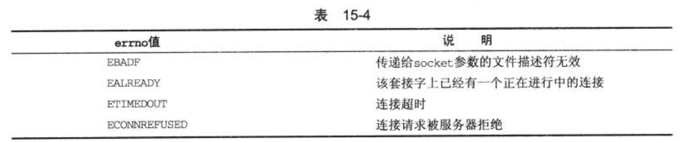

> 2019-09-23: 16:48:53

# Linux 程序设计 阅读笔记(五)

## 参考链接：

- [Linux内核文档首页](https://www.kernel.org/doc/Documentation/)
- [Linux文档](https://linux.die.net/)
- [Linux c 开发手册](https://legacy.gitbook.com/book/wizardforcel/linux-c-api-ref/details)
- [Linux Kernel API](https://www.kernel.org/doc/htmldocs/kernel-api/index.html)
- [书中代码地址](http://www.wrox.com/WileyCDA/WroxTitle/Beginning-Linux-Programming-4th-Edition.productCd-0470147628,descCd-DOWNLOAD.html)
- [POSIX thread (pthread) libraries](https://www.cs.cmu.edu/afs/cs/academic/class/15492-f07/www/pthreads.html)

## 第 15 章 套接字(socket)

socket是管道概念的一个廓镇。使用与管道类似的方法来使用套接字，套接字中还包括了计算机网络中的通信。
本章主要内容：

- 套接字链接的工作原理
- 套接字的属性、地址和通信
- 网络信息和互联网守护进程(inetf/xinetd)
- 客户和服务器

### 15.1 什么是套接字

套接字(socket)是一种通信机制，客户端/服务器系统的开发工作既可以在本地进行，也可以跨网络进行。socket明确的将客户端与服务器区分开来，这也是socket区别于管道通信的地方。

### 15.2 socket连接

1. 服务器应用程序用系统调用socket来创建一个socket套接字。它是系统分配个该服务器进程的类似文件描述符的资源，不能与其它进行共享。
2. 服务器会给socket起一个名字，本地socket名称是Linux文件系统中的文件名。一般放在/tmp或者/usr/tmp目录中。Linux将进入的特定端口号的连接转接到正确的拂去其进程。服务器系统使用bind来给套接字命名，然后服务器进程就开始等待客户连接到命名套接字。系统使用listen创建一个队列并将其用于存放来自客户端的接入连接。条用accept来接受客户端的连接。
3. 服务器调用accept时，新建一个与特定客户端相关的新的套接字来方便通信。

下面是一个简单的本地客户端

```c
/*  Make the necessary includes and set up the variables.  */

#include <sys/types.h>

#include <sys/socket.h>

#include <stdio.h>

#include <sys/un.h>

#include <unistd.h>

#include <stdlib.h>

int main()
{
    //声明sockfd文件描述索引

    int sockfd;
    int len;
    //声明地址

    struct sockaddr_un address;
    int result;
    char ch = 'A';
    //创建socket

    sockfd = socket(AF_UNIX, SOCK_STREAM, 0);

    //设置socket名称，作为服务器请求和答应

    address.sun_family = AF_UNIX;
    strcpy(address.sun_path, "server_socket");
    len = sizeof(address);
    //将我们的套接字连接到服务器的套接字上

    result = connect(sockfd, (struct sockaddr *)&address, len);

    if(result == -1) {
        perror("oops: client1");
        exit(1);
    }
    //通过sockfd进行读写
    write(sockfd, &ch, 1);
    read(sockfd, &ch, 1);
    //输出获取的信息

    printf("char from server = %c\n", ch);
    //关闭连接

    close(sockfd);
    exit(0);
}

```

**server1.c服务器创建**

```c
/*  Make the necessary includes and set up the variables.  */

#include <sys/types.h>

#include <sys/socket.h>

#include <stdio.h>

#include <sys/un.h>

#include <unistd.h>

#include <stdlib.h>

int main()
{
    int server_sockfd, client_sockfd;
    int server_len, client_len;
    //服务器address

    struct sockaddr_un server_address;
    //客户端地址

    struct sockaddr_un client_address;
    //这里删除以前的套接字，为服务器创建一个未命名的套接字

    unlink("server_socket");

    server_sockfd = socket(AF_UNIX, SOCK_STREAM, 0);
    //对套接字进行命名

    server_address.sun_family = AF_UNIX;
    strcpy(server_address.sun_path, "server_socket");
    server_len = sizeof(server_address);
    bind(server_sockfd, (struct sockaddr *)&server_address, server_len);
    //创建一个连接队列，开始等待客户进行连接

    listen(server_sockfd, 5);
    //循环等待

    while(1) {
        char ch;
        printf("server waiting\n");
        //获取client长度

        client_len = sizeof(client_address);
        //接收一个client客户端请求，并产生一个套接字文件

        client_sockfd = accept(server_sockfd,(struct sockaddr *)&client_address, &client_len);
        //client_sockfd套接字上的客户端进行读写操作。

        read(client_sockfd, &ch, 1);
        ch++;
        write(client_sockfd, &ch, 1);
        //关闭客户端连接

        close(client_sockfd);
    }
}
```
使用如下命令在启动客户端和服务器`./server1 &` 和`./clinet1`。输出结果如下：

```bash
server waiting
char from server = B

```
注意用完一个套接字后，就应该把它删除掉，即使是在程序因接受到一个信号而异常终止的情况下。

#### 15.2.1 套接字(socket)属性

socket的主要属性如下：

1. 域(domain):指定socket通信中使用的网络介质。常见的套接字域是`AF_INET`，表示Internet网络协议。其底层的协议--网际协议(IP)只有一个地址族。常用服务端口号通常小于1024,有:打印机缓冲队列进程(515)、rlogin(513)、ftp(21)和httpd(80)等。小鱼1024的端口都是为系统服务保留的。并且所有服务的进程必须具有超级用户权限。在netdb.h中定义了一个常量`IPPORT_RESERVED`，代表保留端口号的最大值。也可以使用`AF_UNIX`表示UNIX文件系统域
2. 类型(type):因为Internet网中提供了两种不同的通信机制:流(stream)和数据报(datagram)，因此这里也提供了两种截然不同的套接字类型。
   1. 流套接字:提供一个有序、可靠、双向字节流的连接。发送出去的数据可以确保不会丢失、复制或者乱序到达。错误不会被显示。主要由`SOCK_STREAM`指定，在AF_INET域中，通过TCP/IP连接实现。
   2. 数据报套接字：由`SOCK_DGRAM`指定，不建立和维持一个连接。数据报长度有限制，数据报作为一个单独的网络消息被传输。存在错误。主要由UDP/IP连接实现的。但是开销小。不需要维持网络连接。速度较快。
3. 协议(protocol):底层传输机制，允许不止一个协议来提供要求的套接字类型。


#### 15.2.2 创建套接字

```c
#include <sys/types.h>

#include <sys/socket.h>

int socket(int domain,int type,int protocol);
```
`domain`指定协议族(INET/UNIX)，type参数指定通信类型(SOCK_STREAM/SOCK_DGRAM);protocol指定协议类型

domain参数可以指定的协议族如下：


#### 15.2.3 套接字地址

`AF_UNIX`地址结构由`sockaddr_un`来描述，该结构定义子啊头文件`sys/un.h`中

```c
struct sockaddr_un
  {
    sa_family_t sun_family;
    /* Path name.  */

    char sun_path[];
  };
//下面是Ubuntu16.04 中的相关定义

struct sockaddr_un
  {
    __SOCKADDR_COMMON (sun_);
    /* Path name.  */

    char sun_path[108];
  };
```

如上所示Linux规定长度是108个字符。

在`AF_INET`中，地址结构由`sockaddr_in`来指定，该结构定义在头文件`netinet/in.h`中，它至少包括以下几项：

```c
struct sockaddr_in{
    short int           sin_family;     /*AF_INET*/
    unsigned short int  sin_port;       /*Port number*/
    struct in_addr      sin_addr;       /*Internet address*/
}
```
ip地址结构定义如下:

```c
typedef uint32_t in_addr_t;
struct in_addr
  {
    in_addr_t s_addr;
  };
```

#### 15.2.4 命名套接字

使用bind函数可以让创建的套接字可以被其它进程使用，服务器程序必须给套接字命名。这样`AF_UNIX`套接字就会关联到一个文件系统的路径名。AF_INET就会关联到一个IP端口号。

```c
#include <sys/socket.h>

int bind(int socket,const struct sockaddr *address,size_t address_len);
```
bind将address中的地址分配给与文件描述符socket关联的未命名套接字。地址长度由address_len传递。

**地址的长度和格式取决于地址族**，然后bind调用一个特定的地址结构指针转换为指向通用的地址类型(struct sockaddr*);调用成功返回0，失败返回-1，并设置errno为表15-2中的一个值


#### 15.2.5 创建套接字队列

服务器程序必须创建一个队列来保存未处理的请求。使用`listen`系统调用来完成这项工作。
```c
int listen(int socket,int backlog)
```

backlog设置接收队列长度的值。Linux系统中也对可以容纳的未处理连接的最大数目做出限制。多出的连接将被拒绝。常用参数值是5。

#### 15.2.6 接受连接

服务器通过accept接受来自客户的等待队列的事件处理和连接:

```c
int accept(int socket,struct sockaddr *address,size_t *address_len);
```

accept只有当排队的第一个未处理程序，试图连接到由socket参数指定的套接字上时才返回。accept函数将创建一个新套接字来与该客户进行通信，并返回新套接字的描述符。新套接字的类型和服务器监听套接字类型是一样的。

**注意：套接字必须事先bind调用命名，并且由listen调用分配给它一个连接队列。** 连接客户段的之地将被放入address参数指向的sockaddr结构中。也可以将其指定为空。

参数address_len指定客户地址结构的长度，超过则会被截断。因此address_len必须被设置为预期的地址长度。当调用返回时，长度会被设置成客户地址结构的实际长度。

如果等待队列为空，贼accept将会阻塞(程序将暂停)直到有客户建立连接为止。我们可以通过对套接字文件描述符设置`O_NONBLOCK`标志来改变这个行为。

```c
int flags=fcntl(socket,F_GETFL,0);
fcntl(socket,F_SETFL,O_NONBLOCK|flags);
```

当有未处理的客户连接时，accept函数将返回一个新的套接字文件描述符。发生错误时返回-1，`O_NONBLOCK`对应`EWOULDBLOCK`错误，后者是当进程阻塞在accept调用时，执行被中断而产生的错误。

#### 15.2.7 请求连接

客户端使用未命名套接字和服务器监听套接字之间建立连接的方法来连接到服务器。它们通过connect调用来完成这个工作。

```c
#include <sys/socket.h>

int connect(int socket,const struct sockaddr *address,size_t address_len);
```
socket指定的套接字是通过socket调用获得的一个有效的文件描述符。connect调用成功返回0，失败返回-1.可能的错误代码如下：



如果不能立刻建立连接，connect将调用阻塞一段不确定的时间。一旦超过这个时间到达，连接将被放弃。connect调用失败。但如果连接被信号中断，该信号又得到了处理，connect调用还是会失败，但是连接尝试并不会被放弃。而是以异步的方式继续建立。

#### 15.2.8 关闭套接字

使用close来关闭套接字。服务器read返回0时关闭套接字;但如果套接字是一个面向连接类型的，并且设置了SOCK_LINGER选项，close调用会在该套接字还有未传输数据时阻塞。

#### 15.2.9 套接字通信

应该尽量使用网络socket，文件系统的socket的缺点是，操作系统创建的套接字将创建子啊服务器程序的当前目录下。对于网路socket只需要选择一个未被使用的端口号即可。

端口号以及它们提供的服务通常都列在系统文件`/etc/services`中。

下面是一个修改过的客户端程序client2.c，它通过回路网络连接到一个网络套接字。这个程序有一个硬件相关的细微错误，我们将在本章的后面再讨论它

```c
#include <sys/types.h>

#include <sys/socket.h>

#include <stdio.h>

#include <netinet/in.h>

#include <arpa/inet.h>

#include <unistd.h>

#include <stdlib.h>

int main()
{
  int sockfd;
  int len;
  struct sockaddr_in address;
  int result;
  char ch='A';
  //为客户创建一个socket

  sockfd=socket(AF_INET,SOCK_STREAM,0);
  //命名套接字，与服务器保持一致

  address.sin_family=AF_INET;
  address.sin_addr.s_addr=inet_addr("127.0.0.1");
  address.sin_port=9734;
  len=sizeof(address);
}
```

这个程序会查找本地的9734端口。

服务器端(server2.c)需要添加的设置如下：

```c
#include <sys/types.h>

#include <sys/socket.h>

#include <stdio.h>

#include <netinet/in.h>

#include <arpa/inet.h>

#include <unistd.h>

#include <stdlib.h>

int main()
{
  int server_sockfd,client+sockfd;
  int server_len,client_len;
  struct sockaddr_in server_address;
  struct sockaddr_in client_address;
  //创建一个未命名的套接字

  server_sockfd=socket(AF_INET,SOCK_STREAM,0);
  //设置套接字名字

  server_address.sin_family=AF_INET;
  server_address.sin_addr.s_addr=inet_addr("127.0.0.1");
  server_address.sin_port=9734;
  server_len=sizeof(server_address);
  bind(server_socked,(struct sockaddr *)&server_address,server_len);

}

```
