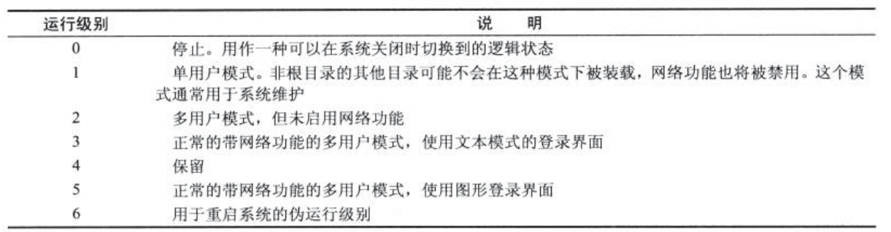
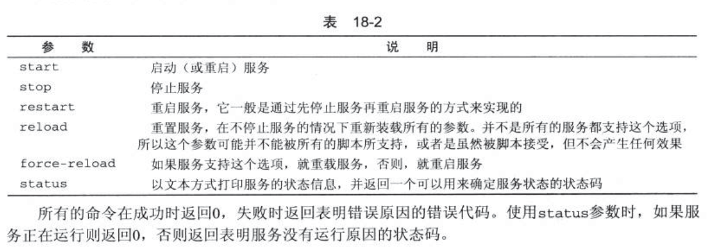
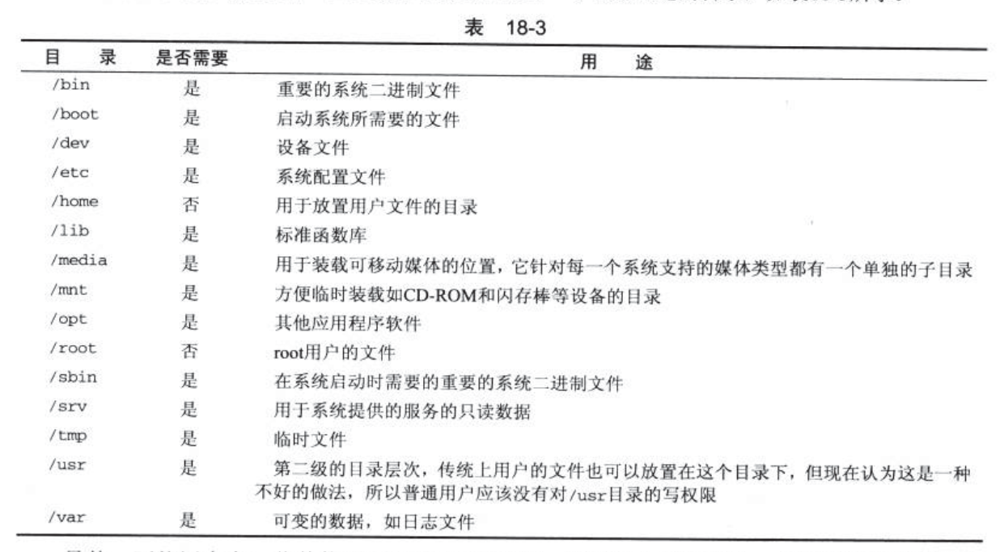

> 2019-09-23: 16:48:53

# Linux 程序设计 阅读笔记(五)

## 参考链接：

- [Linux内核文档首页](https://www.kernel.org/doc/Documentation/)
- [Linux文档](https://linux.die.net/)
- [Linux c 开发手册](https://legacy.gitbook.com/book/wizardforcel/linux-c-api-ref/details)
- [Linux Kernel API](https://www.kernel.org/doc/htmldocs/kernel-api/index.html)
- [书中代码地址](http://www.wrox.com/WileyCDA/WroxTitle/Beginning-Linux-Programming-4th-Edition.productCd-0470147628,descCd-DOWNLOAD.html)
- [POSIX thread (pthread) libraries](https://www.cs.cmu.edu/afs/cs/academic/class/15492-f07/www/pthreads.html)

## 第 15 章 套接字(socket)

socket是管道概念的一个廓镇。使用与管道类似的方法来使用套接字，套接字中还包括了计算机网络中的通信。
本章主要内容：

- 套接字链接的工作原理
- 套接字的属性、地址和通信
- 网络信息和互联网守护进程(inetf/xinetd)
- 客户和服务器

### 15.1 什么是套接字

套接字(socket)是一种通信机制，客户端/服务器系统的开发工作既可以在本地进行，也可以跨网络进行。socket明确的将客户端与服务器区分开来，这也是socket区别于管道通信的地方。

### 15.2 socket连接

1. 服务器应用程序用系统调用socket来创建一个socket套接字。它是系统分配个该服务器进程的类似文件描述符的资源，不能与其它进行共享。
2. 服务器会给socket起一个名字，本地socket名称是Linux文件系统中的文件名。一般放在/tmp或者/usr/tmp目录中。Linux将进入的特定端口号的连接转接到正确的拂去其进程。服务器系统使用bind来给套接字命名，然后服务器进程就开始等待客户连接到命名套接字。系统使用listen创建一个队列并将其用于存放来自客户端的接入连接。条用accept来接受客户端的连接。
3. 服务器调用accept时，新建一个与特定客户端相关的新的套接字来方便通信。

下面是一个简单的本地客户端

```c
/*  Make the necessary includes and set up the variables.  */

#include <sys/types.h>

#include <sys/socket.h>

#include <stdio.h>

#include <sys/un.h>

#include <unistd.h>

#include <stdlib.h>

int main()
{
    //声明sockfd文件描述索引

    int sockfd;
    int len;
    //声明地址

    struct sockaddr_un address;
    int result;
    char ch = 'A';
    //创建socket

    sockfd = socket(AF_UNIX, SOCK_STREAM, 0);

    //设置socket名称，作为服务器请求和答应

    address.sun_family = AF_UNIX;
    strcpy(address.sun_path, "server_socket");
    len = sizeof(address);
    //将我们的套接字连接到服务器的套接字上

    result = connect(sockfd, (struct sockaddr *)&address, len);

    if(result == -1) {
        perror("oops: client1");
        exit(1);
    }
    //通过sockfd进行读写
    write(sockfd, &ch, 1);
    read(sockfd, &ch, 1);
    //输出获取的信息

    printf("char from server = %c\n", ch);
    //关闭连接

    close(sockfd);
    exit(0);
}

```

**server1.c服务器创建**

```c
/*  Make the necessary includes and set up the variables.  */

#include <sys/types.h>

#include <sys/socket.h>

#include <stdio.h>

#include <sys/un.h>

#include <unistd.h>

#include <stdlib.h>

int main()
{
    int server_sockfd, client_sockfd;
    int server_len, client_len;
    //服务器address

    struct sockaddr_un server_address;
    //客户端地址

    struct sockaddr_un client_address;
    //这里删除以前的套接字，为服务器创建一个未命名的套接字

    unlink("server_socket");

    server_sockfd = socket(AF_UNIX, SOCK_STREAM, 0);
    //对套接字进行命名

    server_address.sun_family = AF_UNIX;
    strcpy(server_address.sun_path, "server_socket");
    server_len = sizeof(server_address);
    bind(server_sockfd, (struct sockaddr *)&server_address, server_len);
    //创建一个连接队列，开始等待客户进行连接

    listen(server_sockfd, 5);
    //循环等待

    while(1) {
        char ch;
        printf("server waiting\n");
        //获取client长度

        client_len = sizeof(client_address);
        //接收一个client客户端请求，并产生一个套接字文件

        client_sockfd = accept(server_sockfd,(struct sockaddr *)&client_address, &client_len);
        //client_sockfd套接字上的客户端进行读写操作。

        read(client_sockfd, &ch, 1);
        ch++;
        write(client_sockfd, &ch, 1);
        //关闭客户端连接

        close(client_sockfd);
    }
}
```
使用如下命令在启动客户端和服务器`./server1 &` 和`./clinet1`。输出结果如下：

```bash
server waiting
char from server = B

```
注意用完一个套接字后，就应该把它删除掉，即使是在程序因接受到一个信号而异常终止的情况下。

#### 15.2.1 套接字(socket)属性

socket的主要属性如下：

1. 域(domain):指定socket通信中使用的网络介质。常见的套接字域是`AF_INET`，表示Internet网络协议。其底层的协议--网际协议(IP)只有一个地址族。常用服务端口号通常小于1024,有:打印机缓冲队列进程(515)、rlogin(513)、ftp(21)和httpd(80)等。小鱼1024的端口都是为系统服务保留的。并且所有服务的进程必须具有超级用户权限。在netdb.h中定义了一个常量`IPPORT_RESERVED`，代表保留端口号的最大值。也可以使用`AF_UNIX`表示UNIX文件系统域
2. 类型(type):因为Internet网中提供了两种不同的通信机制:流(stream)和数据报(datagram)，因此这里也提供了两种截然不同的套接字类型。
   1. 流套接字:提供一个有序、可靠、双向字节流的连接。发送出去的数据可以确保不会丢失、复制或者乱序到达。错误不会被显示。主要由`SOCK_STREAM`指定，在AF_INET域中，通过TCP/IP连接实现。
   2. 数据报套接字：由`SOCK_DGRAM`指定，不建立和维持一个连接。数据报长度有限制，数据报作为一个单独的网络消息被传输。存在错误。主要由UDP/IP连接实现的。但是开销小。不需要维持网络连接。速度较快。
3. 协议(protocol):底层传输机制，允许不止一个协议来提供要求的套接字类型。


#### 15.2.2 创建套接字

```c
#include <sys/types.h>

#include <sys/socket.h>

int socket(int domain,int type,int protocol);
```
`domain`指定协议族(INET/UNIX)，type参数指定通信类型(SOCK_STREAM/SOCK_DGRAM);protocol指定协议类型

domain参数可以指定的协议族如下：


#### 15.2.3 套接字地址

`AF_UNIX`地址结构由`sockaddr_un`来描述，该结构定义子啊头文件`sys/un.h`中

```c
struct sockaddr_un
  {
    sa_family_t sun_family;
    /* Path name.  */

    char sun_path[];
  };
//下面是Ubuntu16.04 中的相关定义

struct sockaddr_un
  {
    __SOCKADDR_COMMON (sun_);
    /* Path name.  */

    char sun_path[108];
  };
```

如上所示Linux规定长度是108个字符。

在`AF_INET`中，地址结构由`sockaddr_in`来指定，该结构定义在头文件`netinet/in.h`中，它至少包括以下几项：

```c
struct sockaddr_in{
    short int           sin_family;     /*AF_INET*/
    unsigned short int  sin_port;       /*Port number*/
    struct in_addr      sin_addr;       /*Internet address*/
}
```
ip地址结构定义如下:

```c
typedef uint32_t in_addr_t;
struct in_addr
  {
    in_addr_t s_addr;
  };
```

#### 15.2.4 命名套接字

使用bind函数可以让创建的套接字可以被其它进程使用，服务器程序必须给套接字命名。这样`AF_UNIX`套接字就会关联到一个文件系统的路径名。AF_INET就会关联到一个IP端口号。

```c
#include <sys/socket.h>

int bind(int socket,const struct sockaddr *address,size_t address_len);
```
bind将address中的地址分配给与文件描述符socket关联的未命名套接字。地址长度由address_len传递。

**地址的长度和格式取决于地址族**，然后bind调用一个特定的地址结构指针转换为指向通用的地址类型(struct sockaddr*);调用成功返回0，失败返回-1，并设置errno为表15-2中的一个值


#### 15.2.5 创建套接字队列

服务器程序必须创建一个队列来保存未处理的请求。使用`listen`系统调用来完成这项工作。
```c
int listen(int socket,int backlog)
```

backlog设置接收队列长度的值。Linux系统中也对可以容纳的未处理连接的最大数目做出限制。多出的连接将被拒绝。常用参数值是5。

#### 15.2.6 接受连接

服务器通过accept接受来自客户的等待队列的事件处理和连接:

```c
int accept(int socket,struct sockaddr *address,size_t *address_len);
```

accept只有当排队的第一个未处理程序，试图连接到由socket参数指定的套接字上时才返回。accept函数将创建一个新套接字来与该客户进行通信，并返回新套接字的描述符。新套接字的类型和服务器监听套接字类型是一样的。

**注意：套接字必须事先bind调用命名，并且由listen调用分配给它一个连接队列。** 连接客户段的之地将被放入address参数指向的sockaddr结构中。也可以将其指定为空。

参数address_len指定客户地址结构的长度，超过则会被截断。因此address_len必须被设置为预期的地址长度。当调用返回时，长度会被设置成客户地址结构的实际长度。

如果等待队列为空，贼accept将会阻塞(程序将暂停)直到有客户建立连接为止。我们可以通过对套接字文件描述符设置`O_NONBLOCK`标志来改变这个行为。

```c
int flags=fcntl(socket,F_GETFL,0);
fcntl(socket,F_SETFL,O_NONBLOCK|flags);
```

当有未处理的客户连接时，accept函数将返回一个新的套接字文件描述符。发生错误时返回-1，`O_NONBLOCK`对应`EWOULDBLOCK`错误，后者是当进程阻塞在accept调用时，执行被中断而产生的错误。

#### 15.2.7 请求连接

客户端使用未命名套接字和服务器监听套接字之间建立连接的方法来连接到服务器。它们通过connect调用来完成这个工作。

```c
#include <sys/socket.h>

int connect(int socket,const struct sockaddr *address,size_t address_len);
```
socket指定的套接字是通过socket调用获得的一个有效的文件描述符。connect调用成功返回0，失败返回-1.可能的错误代码如下：


如果不能立刻建立连接，connect将调用阻塞一段不确定的时间。一旦超过这个时间到达，连接将被放弃。connect调用失败。但如果连接被信号中断，该信号又得到了处理，connect调用还是会失败，但是连接尝试并不会被放弃。而是以异步的方式继续建立。

#### 15.2.8 关闭套接字

使用close来关闭套接字。服务器read返回0时关闭套接字;但如果套接字是一个面向连接类型的，并且设置了SOCK_LINGER选项，close调用会在该套接字还有未传输数据时阻塞。

#### 15.2.9 套接字通信

应该尽量使用网络socket，文件系统的socket的缺点是，操作系统创建的套接字将创建子啊服务器程序的当前目录下。对于网路socket只需要选择一个未被使用的端口号即可。

端口号以及它们提供的服务通常都列在系统文件`/etc/services`中。

下面是一个修改过的客户端程序client2.c，它通过回路网络连接到一个网络套接字。这个程序有一个硬件相关的细微错误，我们将在本章的后面再讨论它

```c
#include <sys/types.h>

#include <sys/socket.h>

#include <stdio.h>

#include <netinet/in.h>

#include <arpa/inet.h>

#include <unistd.h>

#include <stdlib.h>

int main()
{
  int sockfd;
  int len;
  struct sockaddr_in address;
  int result;
  char ch='A';
  //为客户创建一个socket

  sockfd=socket(AF_INET,SOCK_STREAM,0);
  //命名套接字，与服务器保持一致

  address.sin_family=AF_INET;
  address.sin_addr.s_addr=inet_addr("127.0.0.1");
  address.sin_port=9734;
  len=sizeof(address);
}
```

这个程序会查找本地的9734端口。

服务器端(server2.c)需要添加的设置如下：

```c
#include <sys/types.h>

#include <sys/socket.h>

#include <stdio.h>

#include <netinet/in.h>

#include <arpa/inet.h>

#include <unistd.h>

#include <stdlib.h>

int main()
{
  int server_sockfd,client+sockfd;
  int server_len,client_len;
  struct sockaddr_in server_address;
  struct sockaddr_in client_address;
  //创建一个未命名的套接字

  server_sockfd=socket(AF_INET,SOCK_STREAM,0);
  //设置套接字名字

  server_address.sin_family=AF_INET;
  server_address.sin_addr.s_addr=inet_addr("127.0.0.1");
  server_address.sin_port=9734;
  server_len=sizeof(server_address);
  bind(server_socked,(struct sockaddr *)&server_address,server_len);

}

```

### 15.2.10 主机字节序和网络字节序

可以使用`netstat`命令来查看网络连接状况。

### 15.3 网络信息

一般可以通过网络信息函数决定应该使用的地址和端口号

可以将自己的服务添加到/etc/services文件中的已知服务列表中。并且在这个文件中为端口号分配一个名字，使用户可以使用符号化的服务名字而不是端口号的名字。

主句地址映射函数定义在netdb.h中，函数接口如下所示：

```c
#include <netdb.h>
//查询host地址

struct hostent *gethostbyaddr(const void *addr,size_t len,int type);
struct hostent *gethostbyname(const char *name);
/*查询端口号相关信息*/

struct servent *getservbyname(const char *name,const char *proto);
struct servent *getservbyport(int port,const char *proto);
```

返回的hostnet和event结构中至少包含一下几个成员:

```c
struct hostent{
  char *h_name;
  char **h_aliases;
  int h_addrtype;
  int h_length;
}

struct servent{
  char *s_name;
  char **s_aliases;
  int s_port;
  char *s_proto;
}
```

要把返回的地址列表转换为正确的地址类型，并用函数`inet_ntoa`将它们从网络字节序转换为可打印的字符。函数`inet_ntoa`的定义如下。

```c
#include <arpa/inet.h>
//将一个intel主机地址转换为一个点四元组格式的字符串，它在失败时返回-1,

char *inet_ntoa(struct in_addr in);

#include <unistd.h>
//将当前主机的名字写入name指向的字符串中。主机名以null结尾。参数namelength指定了字符串name的长度。如果主机名太长会被截断

int gethostname(char *name,int namelength);
```

下面使用getname.c来获取一台主机的信息

```c
/*  As usual, make the appropriate includes and declare the variables.  */

#include <netinet/in.h>
#include <arpa/inet.h>
#include <unistd.h>
#include <netdb.h>
#include <stdio.h>
#include <stdlib.h>

int main(int argc, char *argv[])
{
    char *host, **names, **addrs;
    struct hostent *hostinfo;

/* 将host变量设置为getname程序所提供的命令行参数，或默认设置为用户主机的主机名 */

    if(argc == 1) {
        char myname[256];
        gethostname(myname, 255);
        host = myname;
    }
    else
        host = argv[1];

/* 调用gethostname,如果未找到相应的信息就报告一条错误 */

    hostinfo = gethostbyname(host);
    if(!hostinfo) {
        fprintf(stderr, "cannot get info for host: %s\n", host);
        exit(1);
    }

/* 显示主机名和它可能有的所有别名 */

    printf("results for host %s:\n", host);
    printf("Name: %s\n", hostinfo -> h_name);
    printf("Aliases:");
    names = hostinfo -> h_aliases;
    while(*names) {
        printf(" %s", *names);
        names++;
    }
    printf("\n");

/* 如果查询的主机不是一个IP主机，就发出警告并退出 */

    if(hostinfo -> h_addrtype != AF_INET) {
        fprintf(stderr, "not an IP host!\n");
        exit(1);
    }

/* 否则，显示它的所有IP地址 */

    addrs = hostinfo -> h_addr_list;
    while(*addrs) {
        printf(" %s", inet_ntoa(*(struct in_addr *)*addrs));
        addrs++;
    }
    printf("\n");
    exit(0);
}


```

下面是连接到标准服务，查看服务器的当前日期和时间

```c

/* 准备必要的头文件 */

#include <sys/socket.h>

#include <netinet/in.h>

#include <netdb.h>

#include <stdio.h>

#include <unistd.h>

#include <stdlib.h>

int main(int argc, char *argv[])
{
    char *host;
    int sockfd;
    int len, result;
    struct sockaddr_in address;
    struct hostent *hostinfo;
    struct servent *servinfo;
    char buffer[128];

    if(argc == 1)
        host = "localhost";
    else
        host = argv[1];

/* 查找host对应的信息 */

    hostinfo = gethostbyname(host);
    if(!hostinfo) {
        fprintf(stderr, "no host: %s\n", host);
        exit(1);
    }

/* 查找主机时间服务信息 */

    servinfo = getservbyname("daytime", "tcp");
    if(!servinfo) {
        fprintf(stderr,"no daytime service\n");
        exit(1);
    }
    printf("daytime port is %d\n", ntohs(servinfo -> s_port));

/* 创建一个socket */

    sockfd = socket(AF_INET, SOCK_STREAM, 0);

/* 设置对应的连接参数 */

    address.sin_family = AF_INET;
    address.sin_port = servinfo -> s_port;
    address.sin_addr = *(struct in_addr *)*hostinfo -> h_addr_list;
    len = sizeof(address);

/* 连接并且获取相关信息 */

    result = connect(sockfd, (struct sockaddr *)&address, len);
    if(result == -1) {
        perror("oops: getdate");
        exit(1);
    }

    result = read(sockfd, buffer, sizeof(buffer));
    buffer[result] = '\0';
    printf("read %d bytes: %s", result, buffer);

    close(sockfd);
    exit(0);
}
```

#### 15.3.1 因特网守护进程(xineted/inetd)

超级服务程序同时监听许多端口地址上的连接。当有客户端连接到某项服务时，守护进程就运行相应的服务器。这使得针对各项网络服务的服务器不需要一直运行着。可以在需要时启动。

因特网守护进程在现代linux系统中是通过xinetd来实现的。xinetd实现方式取代了原来的UNIX的inetd。可以直接修改`/etc/xinetd.conf`和`/etc/xinetd.d`目录中的文件来进行配置。

#### 15.3.2 套接字选项

可以使用`setsocket`函数用于控制这些选项。它的定义如下：

```c
#include <sys/socket.h>

int setsocket(int socket,int level,int option_name,const void *option_value,size_t option_len);
```

level是相关的协议等级，想要正常使用，必须设置对应的编号。option_name和option_value分别指向需要设置参数名称和值。level设置参数如下


#### 15.4.1 select系统调用

在编写Linux程序时，经常会遇到需要检查键盘等设备的输入而不得不进行忙等待循环。这种比较消耗CPU时间。

select系统调用允许程序同时在多个底层文件描述符上等待输入的到达。主要是对数据结构`fd_set`进行操作，它是由打开的文件描述符构成的集合。有一组定义好的宏可以来控制这个集合。

```c

#include <sys/types.h>

#include <sys/time.h>

/* 将fd_set初始化为空 */
void FD_ZERO(fd_set *fdset);
/* 清除传递的文件符 */
void FD_CLR(int fd,fd_set *fdset);
/* 设置传递的文件符 */
void FD_SET(int fd,fd_set *fdset);
/* 检查fd设置的文件描述符是否是fdset集合中的元素 */
void FD_ISSET(int fd,fd_set *fdset);
```

select函数可以设置一个超值来防止无限期的阻塞。这个超时值由一个timeval结构给出。这个结构定义在头文件`sys/time.h`中，它由以下几个成员组成:

```c
struct timeval{
    time_t tv_sec; /* seconds */
    long   tv_usec; /* microseconds */
}
```

select系统调用的原型如下：

```c
#include <sys/types.h>

#include <sys/time.h>

int select(int nfds,fd_set *readfds,fd_set *writefds, fd_set *errorfds,struct timeval *timeout);
```

nfds指定需要测试的文件描述符数目，测试的描述符范围从0到nfds-1。3个描述符集合都可以被设置为空指针，这表示不执行相应的测试。

select函数会在以下情况时返回:
- readfds集合中有描述符可读
- writefds集合中有描述符可写
- errorfds集合中有描述符遇到错误条件

如果以上三种条件都没有发生，select将在timeout指定的超时时间经过后返回。如果timeout参数是一个空指针并且套接字上也没有任何活动，这个调用将一直阻塞下去。

下面是一个简单的select调用实验：

```c
/* 开始和必要的头文件 */

#include <sys/types.h>

#include <sys/time.h>

#include <stdio.h>

#include <fcntl.h>

#include <sys/ioctl.h>

#include <unistd.h>

#include <stdlib.h>

int main()
{
    char buffer[128];
    int result, nread;

    fd_set inputs, testfds;
    struct timeval timeout;

    FD_ZERO(&inputs);
    FD_SET(0,&inputs);

/*  设置标准输入最多等待输入2.5s  */

    while(1) {
        testfds = inputs;
        timeout.tv_sec = 2;
        timeout.tv_usec = 500000;
        /* 进行选择等待输入 */
        result = select(FD_SETSIZE, &testfds, (fd_set *)0, (fd_set *)0, &timeout);

/*  经过这段时间之后，对result进行测试。如果没有输入，程序将再次循环，出现一个错误，程序将退出运行  */

        switch(result) {
        case 0:
            printf("timeout\n");
            break;
        case -1:
            perror("select");
            exit(1);

/* 如果在等待期间，对文件描述符采取了一些动嘴，程序将读取标准输入stdin上的输入，并在接收到行尾字符之后将他们都回显到屏幕上。ctrl+D，就退出程序 */

        default:
            if(FD_ISSET(0,&testfds)) {
                ioctl(0,FIONREAD,&nread);
                if(nread == 0) {
                    printf("keyboard done\n");
                    exit(0);
                }
                nread = read(0,buffer,nread);
                buffer[nread] = 0;
                printf("read %d from keyboard: %s", nread, buffer);
            }
            break;
        }
    }
}
```

#### 15.4.2 多客户端

服务器可以让select调用同时检查监听套接字和客户端的连接套接字。一旦select调用指示有活动发生，就可以用FD_ISSET来遍历所有可能的文件描述符，以检查是哪个上面有活动发生。然后调用accept而不用担心发生阻塞的可能。如果是一个客户描述符，则该描述符上有一个客户端请求需要我们读取和处理。如果读取返回0个字节，这表示有一个客户进程已经结束，你可以关闭该套接字并把它从集合中删除。

下面是一个简单的使用示例：

```c
/*  For our final example, server5.c, 
    we include the sys/time.h and sys/ioctl.h headers in place of signal.h
    in our last program and declare some extra variables to deal with select.  */

#include <sys/types.h>

#include <sys/socket.h>

#include <stdio.h>

#include <netinet/in.h>

#include <sys/time.h>

#include <sys/ioctl.h>

#include <unistd.h>

#include <stdlib.h>

int main()
{
    int server_sockfd, client_sockfd;
    int server_len, client_len;
    struct sockaddr_in server_address;
    struct sockaddr_in client_address;
    int result;
    fd_set readfds, testfds;

    /* 为服务器创建一个socket描述符 */

    server_sockfd = socket(AF_INET, SOCK_STREAM, 0);
    //
    server_address.sin_family = AF_INET;
    server_address.sin_addr.s_addr = htonl(INADDR_ANY);
    server_address.sin_port = htons(9734);
    server_len = sizeof(server_address);

    bind(server_sockfd, (struct sockaddr *)&server_address, server_len);

/*  创建一个连接队列，初始化readfds以处理来自server_sockfd的输入  */

    listen(server_sockfd, 5);

    FD_ZERO(&readfds);
    FD_SET(server_sockfd, &readfds);

/* 在while循环中等待客户和请求的到来。 */

    while(1) {
        char ch;
        int fd;
        int nread;

        testfds = readfds;

        printf("server waiting\n");
        /* 注意这里timeout参数传递的是一个空指针，因此select调用将不会发生超时状况 */

        result = select(FD_SETSIZE, &testfds, (fd_set *)0, 
            (fd_set *)0, (struct timeval *) 0);

        if(result < 1) {
            perror("server5");
            exit(1);
        }

 /* 一旦有活动发生，可以使用FD_ISSET来依次检查每个描述符，以发现活动发生在那个描述符上 */

        for(fd = 0; fd < FD_SETSIZE; fd++) {
            if(FD_ISSET(fd,&testfds)) {

/* 活动发生在server_sockfd上，它肯定是一个新的连接请求，将相关client_sockfd添加到描述符集合中 */

                if(fd == server_sockfd) {
                    client_len = sizeof(client_address);
                    client_sockfd = accept(server_sockfd, 
                        (struct sockaddr *)&client_address, &client_len);
                    FD_SET(client_sockfd, &readfds);
                    printf("adding client on fd %d\n", client_sockfd);
                }

/*  没有发生在服务器socket server_sockfd上,则是一个新的连接请求生成相关的client_sockfd添加到描述符集合中 */

                else {
                    ioctl(fd, FIONREAD, &nread);
                    //判断是否是离开的请求，如果是就直接将其文件描述符删除

                    if(nread == 0) {
                        close(fd);
                        FD_CLR(fd, &readfds);
                        printf("removing client on fd %d\n", fd);
                    }
                    //否则直接进行读取和输出

                    else {
                        read(fd, &ch, 1);
                        sleep(5);
                        printf("serving client on fd %d\n", fd);
                        ch++;
                        write(fd, &ch, 1);
                    }
                }
            }
        }
    }
}

```

### 15.5 数据报(UDP)

UDP使用的是不稳定链接，因此不需要进行过多的更改和连接状态的确定。UDP在局域网中非常可靠。一样使用套接字和close系统调用，但是需要使用**sendto和recvfrom**来代替原来使用在套接字上的read和write调用。下面是一个修改过的getdate.c版本

```c
#include <sys/socket.h>

#include <netinet/in.h>

#include <netdb.h>

#include <stdio.h>

#include <unistd.h>

#include <stdlib.h>

int main(int argc,char *argv[])
{
    //host主机地址

    char *host;
    int sockfd;
    int len,result;
    struct sockaddr_in address;
    struct hostent *hostinfo;

    struct servent *serinfo;
    //缓冲buffer队列

    char buffer[128];
    if(argc==1)
        host="localhost";
    else
        host=argv[1];
    /* 通过名字在host中查找对用的ip地址和信息 */
    hostinfo=gethostbyname(host);

    if(!hostinfo){
        fprintf(stderr,"no host: %s\n",host);
        exit(1);
    }
    /* 确认服务器时钟 */
    servinfo=getservbyname("daytime","udp");
    if(!servinfo){
        fprintf(stderr,"no daytime service \n");
        exit(1);
    }
    printf("daytime port is %d \n",ntohs(servinfo->s_port));
    /* 创建一个udp socket */

    sockfd=socket(AF_INET,SOCK_DGRAM,0);
    /* 设置address相关参数 */
    address.sin_family=AF_INEF;
    address.sin_port=servinfo->s_port;
    address.sin_addr=*(struct in_addr*)*hostinfo->h_addr_list;
    len=sizeof(address);
    /* 进行消息发送 */
    result=sendto(sockfd，buffer,1,0,(struct sockaddr*)&address,len);
    /* 返回接收的最后位置 */
    result=recvfrom(sockfd,buffer,sizeof(buffer),0),(struct sockaddr*)&address,&len);
    buffer[result]='\0';
    printf("read %d bytes:% s".result,buffer);
    close(sockfd);
    exit(0);
}
```

UDP关键函数如下：

```c
/* 这里的flags参数一般被设置为0 */

int sendto(int sockfd,void *buffer,size_t len,int flags,struct sockaddr *to,socklen_t tolen);

int recvfrom(int sockfd,void *buffer,size_t len,int flags,struct sockaddr *from,socklent_t *fromlen);
```

上述失败时会返回-1,并设置errno，可能错误表如下所示：


## 第 16 章 使用GTK+进行gnome编程

### 16.1 x视窗系统简介

X服务，运行在用户的本地机器上，在屏幕上完成底层的绘图工作。X服务通过鼠标和键盘监听用户输入，将键盘按键和鼠标点击传输给X客户端应用程序。这个被称为(event)事件。

#### 16.1.2 X客户端

X客户端可以以X视窗作为GUI的任何程序。X客户端不需要和X服务运行在同一台机器上。

#### 16.1.3 X协议

X服务器与X客户端之间使用X协议进行通信。这使得客户端和服务器可以通过网络进行分离。

#### 16.1.4 Xlib库

Xlib是X客户端间用于产生X协议消息的库。

#### 16.1.5 X工具包
X工具包是一个GUI库，X客户端可以利用它来极大地简化窗口、菜单和按钮等的创建。

#### 16.1.6 窗口管理器

X中负责定位屏幕上的窗口。窗口管理器通常支持独立的“工作区域”，这些工作区将桌面分割，增大用户可以互交的区域。常见窗口管理器有如下内容:

- Metacity:GNOME桌面的默认窗口管理器
- KWin:KDE桌面的默认窗口管理器
- Openbox:旨在节约资源，用于较老的、较慢的系统中。
- Enlightenment:一个有着出色图形和效果的窗口管理器。

### 16.2 GTX+简介

GTK+是一个函数库，提供了一组已经制作好的被成为构建的组件。可以使用逻辑组合，极大地简化了GUI的创建。主要函数模块如下：

- GLib:提供底层数据结构、类型、线程支持、事件循环和动态加载
- GObject:使用c语言而不是C++语言实现了一个面向对象系统
- Pango:支持文本渲染和布局
- ATK:用来创建可访问引用程序，并允许用户使用屏幕阅读器和其它协助工具来运行你的程序。
- GDK(GIMP绘图工具包)：在Xlib之上处理底层图形渲染。
- GdkPixbuf:在GTK+程序中帮助处理图像。
- Xlib:在linux和UNIX系统上提供底层图形

### 16.2.3 GNOME简介

GTK+之上的一个扩展图像桌面

### 16.3 事件、信号和回调函数

这个是所有GUI中都存在的必然相关程序。具体的不再过多赘述。

### 16.4 组装盒构建

与QTGUI布局相似，存在`gtk_hbox_new`和`gtk_vbox_new`等函数。

### 16.5 GTK+中的对应构件

_参考连接：_

- [GTK+中的构件II(Widgets)](https://www.cnblogs.com/xchsp/p/4322028.html)
- [GTK+中的构件（GTK+ Widgets）](https://www.cnblogs.com/boer-utopia/articles/2261422.html)
- [GTK+构件](https://blog.csdn.net/u012150792/article/details/50607723)


GTK+主要构件列表和API如下表：

- GtxWindow:窗口基本元素，用来持有构件

- GtkEntry:单行文本输入构件，用于输入简单的文本信息。

- GtkSpinButton:可选数字输入框

- GtkButton:按钮选项
  
    1. GtkToogleButton：
    
    2. GtkCheckButton:单选确认框
     
    3. GtkRadioButton:圆形按钮
    
- GtkTreeView:树状结构;
    
    其主要组成部分如下：
    - GtkTreeView:树和列表视图
    - GtkTreeViewColumn:代表一个列表或树的列
    - GtkCellRenderer:控制绘图单元
    - GtkTreeModel:代表树和列表数据
  
### 16.7 GNOME菜单
就是Qt中的QMenu选项，主要结构和内容如下：


### 16.8 对话框

#### 16.8.1 GtkDialog
GtkDialog是GtkWindow的一个子类，继承了其所有函数和属性：


#### 16.8.2 模式对话框

设置GTK_DIALOG_MODEAL标记和调用gtk_widget_show函数，将一个对话框转变为模式对话框。可以使用gtk_dialog_run通过阻止程序的进一步执行。返回对应的选择的结果类型。

#### 16.8.3 非模式对话框

不使用gtk_dialog_run而是使用GtkDialog的“response”信号(按钮按下或窗口被关闭时发出)。将回调函数连接到信号，但是存在一个额外的response参数。

#### 16.8.4 GtkMessageDialog

一个简单对话框


还可以选择一个GTK_MESSAGE_OTHER值如下


## 第 17 章 使用Qt进行KDE编程

这个不需要多说了,看参考连接。。。。

_参考连接：_

- [Qt Documentation](https://doc.qt.io/qt-5/reference-overview.html)

## 第 18 章 Linux标准

### 18.1 C语言编程标准

没什么好说的

### 18.2 接口和LSB

c语言之上，高一个层次由操作系统提供的接口(系统接口)。

权威文档是[LSB](https://www.linuxbase.org)。

Linux中的常见系统运行级别表



`/etc/init.d/`目录下存在不同的脚本，提供其服务相关联的名字



### 18.3 文件系统层次结构标准

[层次结构标准](https://www.pathname.com/fhs/),主要目的是定义Linux文件系统的标准路径。
下面是一些顶级目录结构和一些必须存在的子目录和一小部分可选目录



### 18.4 更多标准

查看一下参考连接获取相关资料

- [事物标准化](http://www.openi18n.org/)
- [GNU网站](http://www.gnu.org)s