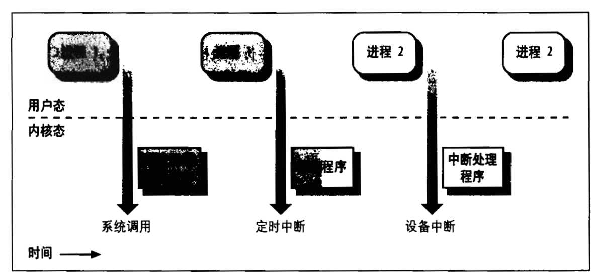
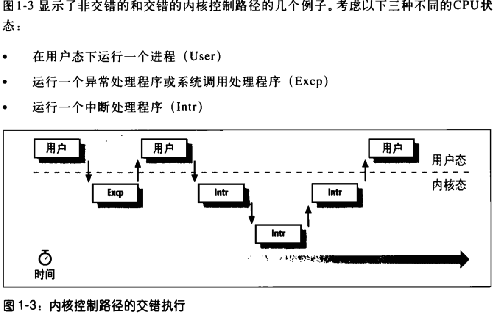
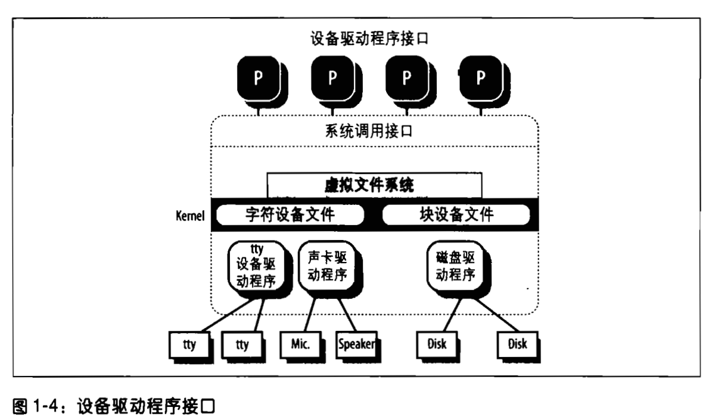

# 深入理解Linux内核

_参考链接：_

- [Linux kernel下载地址](http://www.kernel.org)

> 2019-09-28: 13:48:53

## 第一章 绪论

本书的支持版本是Linux内核2.6.11的正式版

Linux包括的现代操作系统特点：

- 虚拟存储
- 虚拟文件系统
- 轻量级进程(线程)
- Unix信号量
- SVR4进程间通信
- 支持对称多处理器

Linux kernel为了支持不同的硬件在arch和include目录下包含了23个子目录。以对应Linux所支持的不同硬件平台。这些平台的标准名字如下：

- alpha:HP的alpha工作站
- arm,arm26: 基于arm处理器的计算机和嵌入式设备
- cris:精简代码指令集主板中，用在诸如Web摄像机或开发主板中
- frv:基于FR-v系列微处理器的嵌入式系统中
- h8300:一款特别的处理器
- ia64
- m32r
- m68k,m68knommu
- mips
- parisc
- pcc,ppc64
- s390
- sh,sh64
- sparc,sparc64
- um
- v850
- x86_64:AMD的64位微处理器。

## 1.4 操作系统的基本概念

操作系统是一系列程序的集合。在这个集合中，最重要的程序是内核。它在操作系统启动时，直接被装入RAM中。操作系统必须完成两个主要目标：

- 与硬件部分互交，为包含在硬件平台上的所有底层可编程部件提供服务
- 为运行在计算机系统上的应用程序(用户程序)提供执行环境

为了实现上述机制，现代操作系统依靠特殊的硬件特性来禁止用户直接与地层硬件互交，或者禁止直接访问任意的物理地址。硬件为CPU引入了至少两种模式:用户程序的非特权模式(用户态)和用户的特权模式(内核态)([用户态和内核态的区别](https://www.cnblogs.com/gizing/p/10925286.html);[cpu的用户态和内核态和内存的用户空间内核空间](https://www.cnblogs.com/libertylife/p/9619387.html))。

大部分Unix是单块结构：每一个内核层都被集成到整个内核程序中，并代表当前进程在内核态下运行。操作系统的学术研究都是面向微内核的，但是这个样的操作系统一般比单块内核的效率低，因为操作系统不同层次之间显式的消息调用和传递会花费一定的时间。微内核程序模块化、便于移植、RAM利用率高、不需要执行的程序被调出。

Linux为了达到微内核理论上的优点而不影响性能，Linux内核提供了模块(module)，一个简单的目标文件；其代码在运行时链接到内核或从内核解除链接。**模块不是作为一个特殊的进程执行的，它代表当前进程在内核状态下执行**

模块的主要优点如下：

- 模块化方法
- 平台无关性
- 节省内存使用
- 无性能损失

### 1.2 Unix文件概述

大多数文件系统对文件名的长度都有限制，通常不能超过255个字符。Unix的每个进程都有一个当前工作目录，它属于进程执行上下文，标识出进程所用的当前目录。

硬链接限制：

- 不允许给目录创建硬链接。因为可能将目录树变为环形图。
- 只有同意文件系统中的文件之间才能创建链接，

为了克服上述限制，因此存在了软链接技术。

Unix文件类型如下：

- 普通文件(regular file)
- 目录(dir)
- 符号链接(link)
- 面向块的设备文件(block-otiented device file)
- 面向字符的设备文件(character-oriented device file)
- 管道(pipe)和命名管道(named pipe)(FIFO)
- 套接字(socket)

文件索引节点基本属性和内容：

- 文件类型
- 与文件相关的硬链接个数
- 以字节为单位的文件长度
- 设备标识符(即包含文件的设备的标识符)
- 在文件系统中标识文件的索引节点
- 文件拥有者的UID
- 文件的用户ID
- 几个时间戳，标识索引节点状态改变的时间、最后访问时间及最后修改时间
- 访问权限和文件模式。

**文件系统是硬盘分区物理组织的用户级视图，每个实际的文件必须在内核状态下运行**

unlink函数可以减少文件链接数目，删除了相应的目录项。只有当链接为0时,文件才会正真被删除。

### 1.3 Unix内核概述

内核本身并不是一个进程，而是一个进程的管理者。

Unix系统还包括内核新城的特权进程，他们具有一下特点：

- 以内核态运行在内核地址空间([Linux内核地址空间的内存分布及分配](https://blog.csdn.net/abc3240660/article/details/81484984);[Linux用户空间与内核空间](https://blog.csdn.net/f22jay/article/details/7925531))
- 不与用户直接互交，因此不需要终端设备
- 在系统启动时创建，然后一直处于活跃状态，直到系统关闭。
  
激活内核状态的几种方法：

- 进程调用系统调用
- 正在执行进程的CPU发出一个异常(exception)信号，异常是一些反常情况
- 外围设备发送一个CPU中断信号，通知一个时间的发生。
- 内核线程被执行

#### 1.3.2 进程实现

每个内核有一个进程描述符，包有关进程当前状态的信息。方便内核管理进程

当内核暂停一个进程的执行时，就把几个相关处理器寄存器的内容保存在进程描述符中。这些寄存器包括：

- 程序寄存器(PC)和栈指针(SP)寄存器
- 通用寄存器
- 浮点寄存器
- 包含CPU状态信息的处理控制寄存器(处理器状态字，Process Status Word)
- 用来跟踪进程对RAM访问的内存管理寄存器

内核重新来执行中断的程序时，它用进程描述符中适合的字段来装载CPU寄存器。

#### 1.3.3 可重入内核

所有的Unix内核都是可重入的，因此若干个进程可以同时在内核状态下执行。当发生下述事件之一时，CPU交错执行内核控制路径

- 运行在用户态下的进程调用一个系统调用，，并且这个请求无法马上被满足
- 运行一个内核控制路径时，CPU检测到一个异常(缺页中断)。
- CPU正在运行一个启用了中断的内核控制路径时，一个硬件中断发生。第一个还没执行完，CPU开始执行另外一个内核控制路径，在这种情况下，两个内核控制路径运行在同一进程的可执行上下文中，所花费的系统CPU时间都算给这个进程。
- 支持抢占式的内核中，CPU正在运行，一个更高优先级的进程加入就绪队列，则中断发生。

#### 1.3.4 进程空间地址

每个进程拥有自己的私有地址空间，内核可以重入，每个内核控制路径都引用它自己的私有栈内核。进程间可以共享部分地址空间，以实现一种进程间通信。

Linux支持mmap()系统调用，该系统调用允许存在在块设备上的文件或信息一部分映射到进程的部分地址空间。内存映射为为正常的读写传输数据方式提供了一个选择。

#### 1.3.5 同步和临界区

全局变量的安全访问通过原子操作来保证。**临界区是这样的一段代码，进入这段代码的进程必须完成，之后另外一个进程才能进入**

#### 1.3.6 自旋锁

多处理器系统中，信号量并不总是解决同步问题的最佳方案。为了防止不同CPU上的内核数据拷贝，造成低效，并且防止不同CPU内核控制路径已经释放了信号量。操作系统使用了**自旋锁(spin lock);它与信号量非常相似但是没有进程链表；当其发现锁被另外一个进程锁住时，就不停的旋转，直到锁打开**。当内核控制路径因为正在修改受保护的数据结构而没有机会继续执行时，也没有机会释放这个自旋锁。最后的结果可能是系统挂起

#### 1.3.7 进程管理

exec()函数则是装入一个新程序。当系统调用执行后，就在所装入的全新地址空间恢复运行。

调用fork()的进程是父进程，而新进程是它的子进程，父子进程能相互访问，**因为，每个进程包含指向其父进程和子进程的指针**

fork()系统调用就是将父进程的数据和代码都赋值，并将这个拷贝赋予进程。这会相当费时。因此一般都是极爱那个页的赋值延迟到最后一刻(直到父或子进程需要时才写进页)

_exit()函数，告诉内核通过释放进程所拥有的资源，并向父进程发送SIGCHILD信号来实现

#### 1.3.8 僵尸进程(zombie process)

父进程使用wait()等待时，将一直停留在这种状态，直到子进程结束。但是当父进程提前终止时，子进程信息占用资源，可以使用init系统进程，**它在系统初始化的时候被创建。当一个进程终止时，改变所有子进程的描述符指针，使这些子进程成为init的子进程，init监控所有子进程的执行。**

### 1.4 内存管理

迄今Unix内核中最复杂的活动。

#### 1.4.1 虚拟内存

即逻辑内存，处于应用程序的内存请求与硬件内存管理单元(MMU)之间，虚拟内存优点如下：

- 若干个进程可以并发的执行
- 应用程序所需内存大于可用物理内存时也可以运行
- 程序只有部分代码装入内存时进程可以执行它
- 允许每个进程访问物理内存的子集
- 进程可以共享函数或程序的一个单独内存印象
- 程序是可以重定位的，也就是说，可以把程序放在物理内存的任何地方
- 程序员可以编写与机器无关的代码，因为他们不必关心有物理内存的组织结构

#### 1.4.2 随机访问存储器(RAM)的使用

将RAM划分为两个部分，存储内核映像(内核代码和内核静态数据结构)。其余部分使用虚拟内存系统来处理，并且存在一下可能的使用方面:

- 满足内核对缓冲区、描述符及其它动态内核数据结构的请求
- 满足进程对一般内存区的请求及对文件内存映射的请求
- 借助于高速缓存从磁盘及其它缓冲设备获得较好的性能

虚拟内存主要解决的问题是内存碎片

#### 1.4.3 内核内存分配器(KMA)

是一个子系统，满足系统所有部分对内存的请求。基于不同的算法技术，提出了几种KMA

- 资源图分配算法(allocator)
- 2的幂次方空闲链表
- McKusick-Karels分配算法
- 伙伴(Buddy)系统
- Mach的区域(Zone)分配算法
- Dynix分配算法
- Solaris的Slab分配算法

## 第二章 内存寻址

