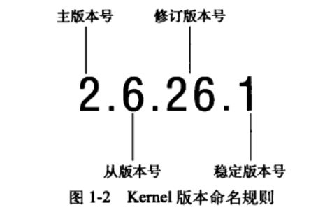
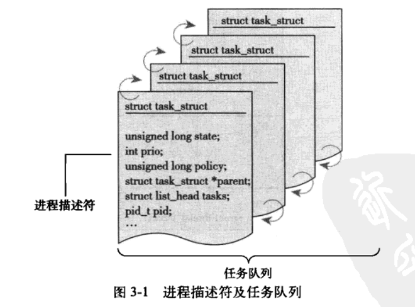
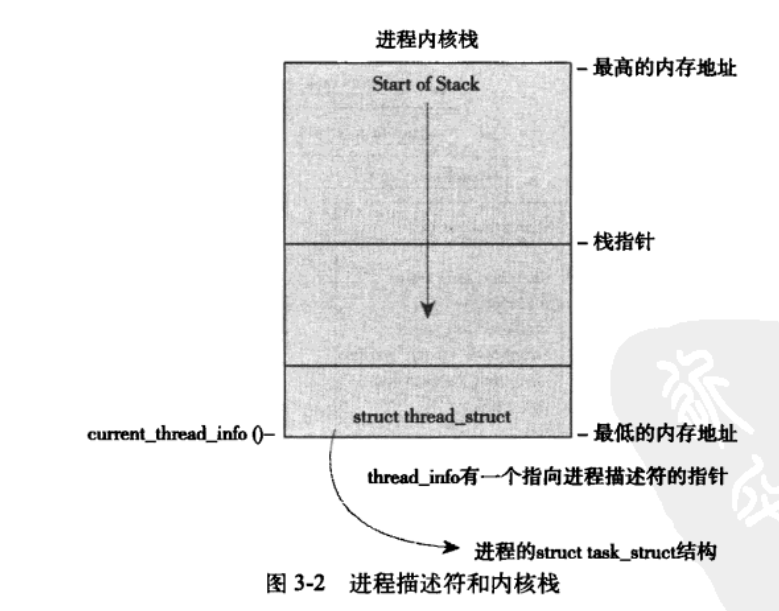
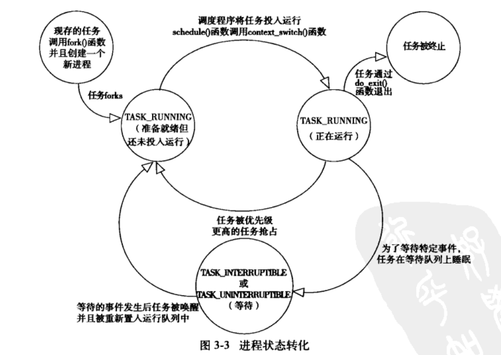
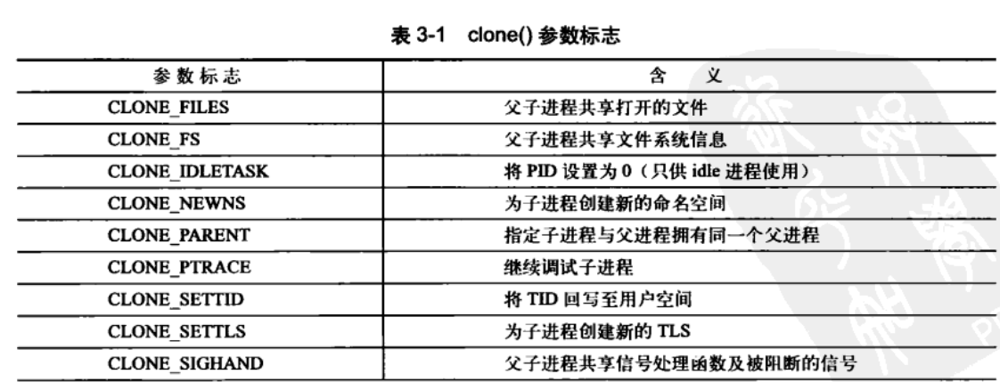
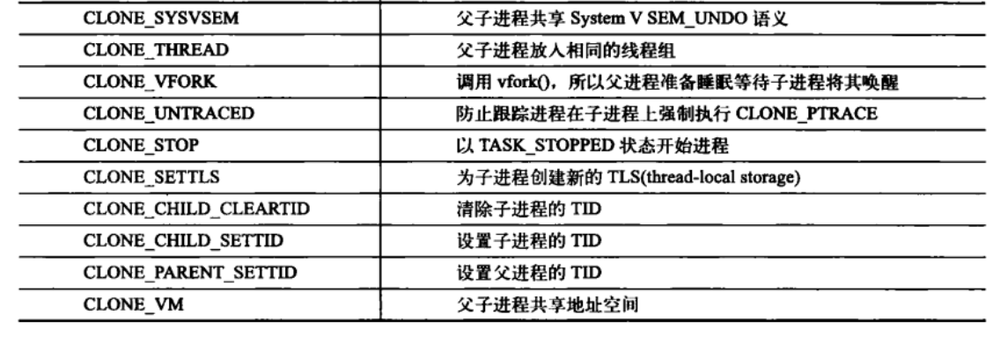

> 2019-09-29 19:39:56

# Linux内核设计与实现(第三版) 学习笔记

_参考连接：_

## 第1章 Linux 内核简介

linux内核版本号如下：



## 第 2 章 从内核出发

可以从[内核网站](https://www.kernel.org/)中下载Linux的内核源码。可以使用`uname -r`查看内核release版本号。

也可以使用如下命令查看最新的版本源代码

```bash
git clone git://git.kernel.org/pub/scm/linux/kernel/git/torvalds/linux-2.6.git
#更新到最新版本
git pull
```
也可以直接使用如下命令直接clone最新版本。然后使用`git checkout`来切换分支

```bash
 git clone git://git.kernel.org/pub/scm/linux/kernel/git/stable/linux-stable.git
```

#### 2.1.3 使用补丁

Linux中一般使用补丁的形式对发布的代码进行修改，增量补丁可以作为版本转移的桥梁。使用如下代码在内部源码树开始进行增量补丁的添加

```bash
patch -p1 < .../patch-x.y.z
```

### 2.2 内核源码树

内核雨那么树由很多目录组成，而大多数目录又包含更多的子目录。源码树的根目录及其子目录如下表所示：

|目录|描述|
|:------|:--------|
|arch|特定体系结构的源码如：ARM，AMD64|
|block|块设备I/O层|
|crypto|加密API|
|Documentation|内核源码文档|
|drivers|设备驱动程序|
|firmware|使用某些驱动程序而需要的设备的固件|
|fs|VFS和各种文件系统|
|include|内核头文件|
|init|内核引导和初始爱护|
|ipc|进程间通信代码|
|kernel|调度程序核心子系统|
|lib|通用内核函数|
|mm|内存管理子系统和VM|
|net|网络子系统|
|samples|示例，示范代码|
|scripts|编译内核所用的脚本|
|security|Linux安全模块|
|sound|语音子系统|
|usr|早期用户空间代码(所谓的initramfs)|
|tools|在Linux开发中有用的工具|
|virt|虚拟化基础结构|

COPYING是内个许可证，CREDITS是内核开发者列表。MAINTAINERS是维护者列表

### 2.3 编译内核

一般使用make命令来进行

```bash
#使用命令行选项

make menuconfig
#基于gtk+的图形工具

make gconfig
#使用默认体系结构配置

make defconfig

```

也可以使用如下的命令，将电脑中已有的配置文件作为编译配置选项

```bash
#将配置文件内容，添加到.config文件中

zcat /proc/config.gz > .config
#使用配置文件编译

make oldconfig

make 进行编译
```

### 2.3.2 减少编译的垃圾信息

```bash
#使用如下命令，进行垃圾信息重定向到文件

make > .. /detritus
#直接扔掉信息

make > /dev/null
```

接下来运行如下命令，进行内核模块的安装
```bash
make modules_install
```

### 2.4 内核开发的特点

- 内核编程时既不能访问c库也不能访问标准的c头文件:
  - 完整的C库太大太低效，因此不方便使用
  - 基本头文件在顶级目录下的include目录中，体系结构相关的头文件在arch/<architecture>/include/asm目录下使用`#include <asm/ioctl.h>`进行头文件的包含。
- 内核编程时必须使用GNU C((GNU C 、ANSI C、标准C、标准c++区别和联系)[http://blog.sae.sina.com.cn/archives/749])
  - GNU C 支持inline内联函数
  - 使用`asm volatile("rdtsc":"=a" (low),"=d" (high))`嵌入汇编代码
- 内核编程时缺乏像用户空间那样的内存保护机制
  - 用户进程中进行非法内存访问，内核会发现错误并发送SIGSEGV信号，结束整个进程。内核自己访问非法内存往往会造成内核死去。
  - 内核中的内存都不分页，没用掉一个字节，物理内存就减少一个字节
- 内核编程时难以执行浮点运算
  - 用户空间中的浮点操作，内核会完成浮点数到整数的转换。因此内核并不能完美的支持浮点数操作，因为它本身不能陷入。
- 内核给每个进程只有一个很小的定长堆栈
  - 内核栈的准确大小随着体系结构而改变，内核栈的大小是两页，32位是8KB,64位是16KB。
- 内核支持异步中断、抢占和SMP(対称多处理器结构)，因此必须时刻注意同步和并发
  - 同时在大于两核处理器上执行内核代码，可能会同时访问共享的同一个资源
  - 中断是异步到来的，完全不顾及当前正在执行的代码
  - 内核可抢占，没有保护，可能导致几段代码同时访问相同的资源，通常使用自旋锁和信号量来解决
- 要仔细考虑可移植的特性
  - 注意保持字节序、64位对齐、不假定字长和页面长度等一系列准则等


## 第 3 章 进程管理

### 3.1 进程

**每一个线程都拥有一个独立的程序计数器、进程栈、一组进程寄存器**。_内核调度的对象是线程，而不是进程_ ([从进程和线程了解浏览器的工作原理](https://www.jianshu.com/p/8ff15d3a1dfd))；在Linux中对线程和进程的区分度不是很大。线程之间共享虚拟内存，但是每个线程都拥有自己独立的虚拟处理器

### 3.2 进程描述符及任务结构

_参考链接：_ [Linux进程描述符task_struct结构体详解](https://blog.csdn.net/gatieme/article/details/51383272);[文件描述符（File Descriptor）简介](https://segmentfault.com/a/1190000009724931)

内核通过任务队列的(双向循环链表)来存放和管理进程列表。其中存放的数据类型是`task_struct`，即进程描述符，定义在<linux/sched.h>文件中，包含有：打开的文件、进程的地址空间、挂起的信号、进程的状态等信息



#### 3.2.1 分配进程描述符

Linux 通过slab分配器分配task_struct结构。slab董涛生成一个task_struct,只需要在栈底(向下增长的栈)或栈顶(向上增加的栈)创建一个新的结构struct_info(定义在<asm/thread_info.h>)中内容如下：

```c
struct thread_info{
    struct task_struct  *task;
    struct exec_domain  *exec_domain;
    __u32               flags;
    __u32               status;
    __u32               cpu;
    int fd              preempt_count;
    mm_segment_t        addr_limit;
    struct restart_block    restart_block;
    void                    *sysenter_return;
    int                     uaccess_err;
}

```



每个任务的thread_info结构在它的内核栈的尾端分配，结构中task域中存放的是指该任务实际task_struct的指针

#### 3.2.2 进程描述符

内核中的访问任务，通常需要获取其指向task_struct的指针。一般是通过current宏来查找当前正在运行进程的task_struct。不同的硬件体系结构实现的方式不同。一般都是汇编配合专用寄存器来实现的。

#### 3.2.3 进程状态

进程描述符中的state域描述了当前集成的状态。必然是下面的5种情况之一

- TASK_RUNNING(运行):进程可执行或者正在执行
- TASK_INTERRUPTIBLE(可中断):进程正在睡眠状态(也就是说它被阻塞)，等待某些条件的达成。就可以从状态回到运行态
- TASK_UNINTERRUPTIBLE(不可中断):就算接收到信号也不会被唤醒或准备
- __TASK_TRACED:被其它进程跟踪的进行，例如通过ptrace对调试程序进行跟踪
- __TASK_STOPPED(停止)：进程停止执行；进程没有投入运行也不能投入运行。



#### 3.2.4 设置当前进程状态

内核可以使用set_task_state(task,state)或set_current_state(state)函数来更改和设置进程的状态

#### 3.2.6 进程家族树

Linux和unix中所有的进程都是PID为1的init进程的后代。内核在系统启动的最后阶段启动init进程。init进程读取系统的初始化脚本(initscript)并执行其它程序，最终完成系统启动的整个过程。

每个task_struct都包含一个指针指向其父进程task_struct的parent指针。也有一个children的子进程链表。可以通过如下代码依次访问父进程和子进程

```c++
//获取父进程

struct task_struct *my_parent=current->parent;
//依次访问子进程

struct task_struct* task;
struct list_head *list;
list_for_each(list,&current->children){
    task=list_entry(list,struct task_struct,siblings);
}
```
init进程的进程描述符是作为init_task静态分配的。下面的代码可以很好的演示所有进程之间的关系:

```c++

struct task_struct *task;
//一直指向直到查找到init进程

for(task==current;task!=&init_task;task=task->parent){

}

//获取链表的下一个进程

list_entry(task->task.next,struct task_struct task);
//获取前一个进程

list_entry(task->task.prev,struct task_struct task);
```

### 3.3 创建进程

#### 3.3.1 写拷贝

linux d fork()使用写时拷贝(copy-on-write)页实现。fork()时内核并不复制整个进程地址空间，而是让父进程和子进程共享一个拷贝。只有在需要写入的时候，数据才会被复制。之前都是以只读方式共享。因此fork()的实际开销在于复制父进程的页表以及给子进程创建唯一的进程描述符。

#### 3.3.2 fork()

fork()函数调用clone()系统调用，再由clone()去调用do_fork(),do_fork()调用copy_process()函数，然后让进程开始运行。copy_process()完成的工作内容如下：

1. 调用dup_task_struct()为新进程创建一个内核栈、thread_info结构和task_struct，这些值与当前进程的值相同。此时，子进程和父进程的描述符是完全相同的
2. 检查确认子进程后，确认当前用户所拥有的进程数目没有超出它分配的资源
3. 子进程开始设置与父进程的差异值。进程描述符中许多成员都要被清0或者重新初始化
4. 子进程状态被设置为TASK_UNINTERRUPTIBLE，防止被投入运行
5. copy_process()调用copy_flags()以更新task_struct的flags成员。
6. 调用alloc_pid()为新进程分配一个有效的pid
7. 根据clone()函数接收到的参数，为copy_process()拷贝或共享打开的文件、文件系统信息、信号处理函数、进程地址空间和命名空间等
8. 最后，copy_process()做扫尾工作，并返回一个指向子进程的指针。

最终层层调用回归，kernel会优先选择执行子进程，因为一般子进程都会马上调用exec()函数。避免额写拷贝开销。如果父进程先执行，则可能会开开始向地址空间中写入。

#### 3.3.3 vfork()

vfork()不拷贝父进程的页表项，其它基本相同；子进程作为父进程的一个单独的线程在它的地址空间中运行。不过现在基本没什么作用了。

### 3.4 线程在Linux中的实现

Linux中将所有的线程都当做进程来实现，内核并没有准备特别的线程调度算法或特定数据结构。线程仅仅被视为一个与其它进程共享某些资源的进程。每个线程都拥有唯一一个task_struct。(Windows或者Solaris都在内核中提供了专门的线程支持机制--轻量级进程)

#### 3.4.1 创建线程

创建线程与进程相似，不过是在调用clone时需要传递参数来指明需要共享的资源。

```c
//普通fork实现

clone(SIGCHLD,0);
//vfork()实现

clone(CLONE_VFORK|CLONE_VM|SIGCHLD,0);
```
clone的标志位可选内容如下：




### 3.4.2 内核线程

内核中也是存在线程，称为内核线程。内核线程没有独立的地址空间(实际上指向地址空间的mm指针被设置为NULL)。他们只在内核空间运行，从来不切换到用户空间去。使用`ps -ef`可以查看到内核线程。

从现有内核中创建一个新的内核线程的方法如下：

```c
struct task_struct *kthread_create(int (*threadfn)(void *data),void *data,const char namefmt[],...)

struct task_struct *kthread_run(int(*threadfn)(void *data),void data,const char namefmt[],...)
```

新创建的进程不会主动运行。需要使用kthread_run()函数来让进程运行起来。kthread_run()是以宏实现的具体实现代码如下：

```c
#define kthread_run(threadfn,data,namefmt,...)                      \
{                                                                   \
    struct task_struct *k;                                          \
    k=kthread_create(threadfn,data,namefmt,##__VA_ARGS__);          \
    if(!IS_ERR(k))                                                  \
        wake_up_process(k);                                         \
    k;                                                              \
}                                                                   \
```

### 3.5 进程终结

一般进程的析构是自身引起的，发生在exit()被调用时。C语言编译器会在main函数的return 之后调用exit()函数。exit()函数的主要任务由do_exit()来完成。主要完成下面的几个工作：

1. 将task_struct中的标志成员设置为PF_EXITING;
2. 调用del_timer_sync()删除任一内核定时器。取消CPU排队。
3. 如果BSD()的进程记账功能是开启的，会调用acct_update_integrals()来输出记账信息。
4. 调用exit_mm()来释放进程占用的mm_struct。内存没有被共享就彻底释放他们。
5. 调用sem_exit()函数。取消正在等待的IPC信号队列
6. 调用exit_files()和exit_fs()，分别递减文件描述符、文件系统数据的引用计数。计数为0释放资源
7. 将存放在task_struct中的exit_code成员中的退出代码设置为exit()提供的退出代码。供父进程随时检索
8. 调用exit_notify()向父进程发送信号，并给子进程重新虚招养父(线程组中的其它线程或者init进程)，把进程状态(task_struct结构中的exit_state)设置为EXIT_ZOMBIE。
9. 调用schedule()切换到新的进程。处于EXIT_ZOMBIE状态的进程不会再被调度。

上述操作之后，进程存在的唯一目的就是向它的父进程提供信息。父进程检索到信息之后(或通知内核子进程信息是无关信息后)。进程持有的剩余内存(task_struct)被释放。所有资源回归给系统。

#### 3.5.1 删除进程描述符


