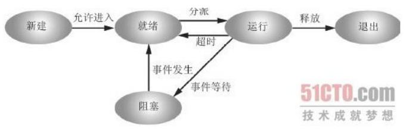
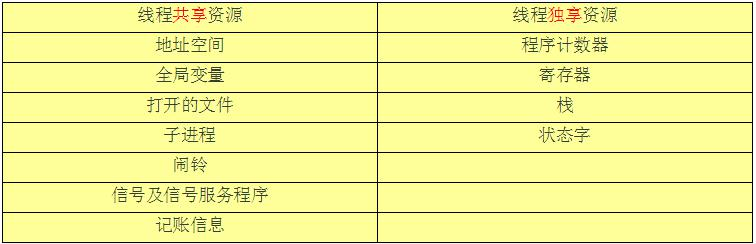
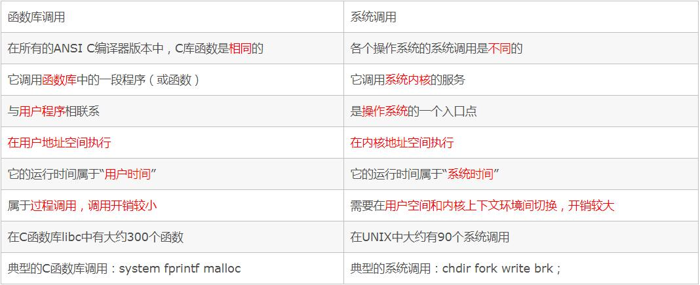

>> T:2019/12/1  W:零 10:18:52
[HTML]: @[TOC](面经汇总 操作系统再探)

# 操作系统

## 1. 操作系统特点
- 并发性、共享性、虚拟性、不确定性。


## 2. 什么是进程
- 进程是指在系统中正在运行的一个应用程序，程序一旦运行就是进程；
- 进程可以认为是程序执行的一个实例，进程是系统进行资源分配的最小单位，且每个进程拥有独立的地址空间；
- 一个进程无法直接访问另一个进程的变量和数据结构，如果希望一个进程去访问另一个进程的资源，需要使用进程间的通信，比如：管道、消息队列等
- 线程是进程的一个实体，是进程的一条执行路径；比进程更小的独立运行的基本单位，线程也被称为轻量级进程，一个程序至少有一个进程，一个进程至少有一个线程；

## 3. 进程
- 进程是程序的一次执行，该程序可以与其他程序并发执行；
- 进程有运行、阻塞、就绪三个基本状态；
- 进程调度算法：先来先服务调度算法、短作业优先调度算法、非抢占式优先级调度算法、
- 抢占式优先级调度算法、高响应比优先调度算法、时间片轮转法调度算法；
## 4. 进程与线程的区别
- 同一进程的线程共享本进程的地址空间，而进程之间则是独立的地址空间；
- 同一进程内的线程共享本进程的资源，但是进程之间的资源是独立的；
- 一个进程崩溃后，在保护模式下不会对其他进程产生影响，但是一个线程崩溃整个进程崩溃，所以多进程比多线程健壮；
- 进程切换，消耗的资源大。所以涉及到频繁的切换，使用线程要好于进程；
- 两者均可并发执行；
- 每个独立的进程有一个程序的入口、程序出口。但是线程不能独立执行，必须依存在应用程序中，由应用程序提供多个线程执行控制。
## 5. 进程状态转换图

- 新状态：进程已经创建
- 就绪态：进程做好了准备，准备执行，等待分配处理机
- 执行态：该进程正在执行；
- 阻塞态：等待某事件发生才能执行，如等待I/O 完成；
- 终止状态
## 6. 进程的创建过程？需要哪些函数？需要哪些数据结构?
- fork 函数创造的子进程是父进程的完整副本，复制了父亲进程的资源，包括内存的内容task_struct 内容；
- vfork 创建的子进程与父进程共享数据段，而且由vfork 创建的子进程将先于父进程运行；
- linux 上创建线程一般使用的是pthread 库，实际上linux 也给我们提供了创建线程的系统调用，就是clone；
## 7. 进程创建子进程,fork 详解
- 函数原型
- `pid_t fork(void); //void 代表没有任何形式参数`
- 除了0 号进程（系统创建的）之外，linux 系统中都是由其他进程创建的。创建新进程的进程，即调用fork 函数的进程为父进程，新建的进程为子进程。
- fork 函数不需要任何参数，对于返回值有三种情况：
    - 对于父进程，fork 函数返回新建子进程的pid；
    - 对于子进程，fork 函数返回0；
    - 如果出错， fork 函数返回-1。
    ```cpp
    int pid=fork();
    if(pid < 0){
        //失败，一般是该用户的进程数达到限制或者内存被用光了
        ........
    } else if(pid == 0){
    //子进程执行的代码
        ......
    } else {
        //父进程执行的代码
        .........
    }
    ```
## 8. 子进程和父进程怎么通信？
- 在Linux 系统中实现父子进程的通信可以采用pipe()和fork()函数进行实现；
- 对于父子进程，在程序运行时首先进入的是父进程，其次是子进程，在此我个人认为，在创建父子进程的时候程序是先运行创建的程序，其次在复制父进程创建子进程。fork()函数主要是以父进程为蓝本复制一个进程，其ID 号和父进程的ID 号不同。对于结果fork 出来的子进程的父进程ID 号是执行fork()函数的进程的ID 号。
- 管道：是指用于连接一个读进程和一个写进程，以实现它们之间通信的共享文件，又称pipe 文件。
- 写进程在管道的尾端写入数据，读进程在管道的首端读出数据。
## 9. 进程和作业的区别？
- 进程是程序的一次动态执行，属于动态概念；
- 一个进程可以执行一个或几个程序，同一个程序可由几个进程执行；
- 程序可以作为一种软件资源长期保留，而进程是程序的一次执行；
- 进程具有并发性，能与其他进程并发执行；
- 进程是一个独立的运行单位；
## 10. 死锁是什么？必要条件？如何解决？
所谓死锁，是指多个进程循环等待它方占有的资源而无限期地僵持下去的局面。很显然，如果没有外力的作用，那麽死锁涉及到的各个进程都将永远处于封锁状态。当两个或两个以上的进程同时对多个互斥资源提出使用要求时，有可能导致死锁。
- 互斥条件。即某个资源在一段时间内只能由一个进程占有，不能同时被两个或两个以上的进程占有。这种独占资源如CD-ROM 驱动器，打印机等等，必须在占有
该资源的进程主动释放它之后，其它进程才能占有该资源。这是由资源本身的属性所决定的。如独木桥就是一种独占资源，两方的人不能同时过桥。
- 不可抢占条件。进程所获得的资源在未使用完毕之前，资源申请者不能强行地从资源占有者手中夺取资源，而只能由该资源的占有者进程自行释放。如过独木桥的人不能强迫对方后退，也不能非法地将对方推下桥，必须是桥上的人自己过桥后空出桥面（即主动释放占有资源），对方的人才能过桥。
- 占有且申请条件。进程至少已经占有一个资源，但又申请新的资源；由于该资源已被另外进程占有，此时该进程阻塞；但是，它在等待新资源之时，仍继续占用已占有的资源。还以过独木桥为例，甲乙两人在桥上相遇。甲走过一段桥面（即占有了一些资源），还需要走其余的桥面（申请新的资源），但那部分桥面被乙占有（乙走过一段桥面）。甲过不去，前进不能，又不后退；乙也处于同样的状况。
- 循环等待条件。存在一个进程等待序列{P1，P2，...，Pn}，其中P1 等待P2 所占有的某一资源，P2 等待P3 所占有的某一源，......，而Pn 等待P1 所占有的的某一资源，形成一个进程循环等待环。就像前面的过独木桥问题，甲等待乙占有的桥面，而乙又等待甲占有的桥面，从而彼此循环等待。死锁的预防是保证系统不进入死锁状态的一种策略。它的基本思想是要求进程申请资源时遵循某种协议，从而打破产生死锁的四个必要条件中的一个或几个，保证系统不会进入死锁状态。

---

- 打破互斥条件。即允许进程同时访问某些资源。但是，有的资源是不允许被同时访问的，像打印机等等，这是由资源本身的属性所决定的。所以，这种办法并无实用价值。
- 打破不可抢占条件。即允许进程强行从占有者那里夺取某些资源。就是说，当一个进程已占有了某些资源，它又申请新的资源，但不能立即被满足时，它必须释放所占有的全部资源，以后再重新申请。它所释放的资源可以分配给其它进程。这就相当于该进程占有的资源被隐蔽地强占了。这种预防死锁的方法实现起来困难，会降低系统性能。
- 打破占有且申请条件。可以实行资源预先分配策略。即进程在运行前一次性地向系统申请它所需要的全部资源。如果某个进程所需的全部资源得不到满足，则不分配任何资源，此进程暂不运行。只有当系统能够满足当前进程的全部资源需求时，才一次性地将所申请的资源全部分配给该进程。由于运行的进程已占有了它所需的全部资源，所以不会发生占有资源又申请资源的现象，因此不会发生死锁。
- 打破循环等待条件，实行资源有序分配策略。采用这种策略，即把资源事先分类编号，按号分配，使进程在申请，占用资源时不会形成环路。所有进程对资源的请求必须严格按资源序号递增的顺序提出。进程占用了小号资源，才能申请大号资源，就不会产生环路，从而预防了死锁
死锁避免：银行家算法
## 11. 鸵鸟策略
假设的前提是，这样的问题出现的概率很低。比如，在操作系统中，为应对死锁问题，可以采用这样的一种办法。当系统发生死锁时不会对用户造成多大影响，或系统很少发生死锁的场合采用允许死锁发生的鸵鸟算法，这样一来可能开销比不允许发生死锁及检测和解除死锁的小。如果死锁很长时间才发生一次，而系统每周都会因硬件故障、编译器错误或操作系统错误而崩溃一次，那么大多数工程师不会以性能损失或者易用性损失的代价来设计较为复杂的死锁解决策略，来消除死锁。鸵鸟策略的实质：出现死锁的概率很小，并且出现之后处理死锁会花费很大的代价，还不如不做处理，OS 中这种置之不理的策略称之为鸵鸟策略（也叫鸵鸟算法）。
## 12. 银行家算法
在避免死锁的方法中，所施加的限制条件较弱，有可能获得令人满意的系统性能。在该方法中把系统的状态分为安全状态和不安全状态，只要能使系统始终都处于安全状态，便可以避免发生死锁。银行家算法的基本思想是分配资源之前，判断系统是否是安全的；若是，才分配。它是最具有代表性的避免死锁的算法。设进程cusneed 提出请求REQUEST [i]，则银行家算法按如下规则进行判断。
(1)如果REQUEST [cusneed] [i]<= NEED[cusneed][i]，则转（2)；否则，出错。
(2)如果REQUEST [cusneed] [i]<= AVAILABLE[i]，则转（3)；否则，等待。
(3)系统试探分配资源，修改相关数据：
```cpp
AVAILABLE[i]-=REQUEST[cusneed][i];
ALLOCATION[cusneed][i]+=REQUEST[cusneed][i];
NEED[cusneed][i]-=REQUEST[cusneed][i];
```
(4)系统执行安全性检查，如安全，则分配成立；否则试探险性分配作废，系统恢复原
状，进程等待。
## 13. 进程间通信方式有几种，他们之间的区别是什么？
- 管道
管道，通常指无名管道。
1 半双工的，具有固定的读端和写端；
2 只能用于具有亲属关系的进程之间的通信；
3 可以看成是一种特殊的文件，对于它的读写也可以使用普通的read、write 函数。但是它不是普通的文件，并不属于其他任何文件系统，只能用于内存中。
4 Int pipe(int fd[2]);当一个管道建立时，会创建两个文件文件描述符，要关闭管道只需将这两个文件描述符关闭即可。
- FiFO（有名管道）
1 FIFO 可以再无关的进程之间交换数据，与无名管道不同；
2 FIFO 有路径名与之相关联，它以一种特殊设备文件形式存在于文件系统中；
3 Int mkfifo(const char* pathname,mode_t mode);
- 消息队列
1 消息队列，是消息的连接表，存放在内核中。一个消息队列由一个标识符来标识；
2 消息队列是面向记录的，其中的消息具有特定的格式以及特定的优先级；
3 消息队列独立于发送与接收进程。进程终止时，消息队列及其内容并不会被删除；
4 消息队列可以实现消息的随机查询
- 信号量
1 信号量是一个计数器，信号量用于实现进程间的互斥与同步，而不是用于存储进程间通信数据；
2 信号量用于进程间同步，若要在进程间传递数据需要结合共享内存；
3 信号量基于操作系统的PV 操作，程序对信号量的操作都是原子操作；
- 共享内存
1 共享内存，指两个或多个进程共享一个给定的存储区；
2 共享内存是最快的一种进程通信方式，因为进程是直接对内存进行存取；
3 因为多个进程可以同时操作，所以需要进行同步；
4 信号量+共享内存通常结合在一起使用。
## 14. 线程同步的方式？怎么用？
- 线程同步是指多线程通过特定的设置来控制线程之间的执行顺序，也可以说在线程之间通过同步建立起执行顺序的关系；
- 主要四种方式，临界区、互斥对象、信号量、事件对象；其中临界区和互斥对象主要用于互斥控制，信号量和事件对象主要用于同步控制；
- 临界区：通过对多线程的串行化来访问公共资源或一段代码，速度快、适合控制数据访问。在任意一个时刻只允许一个线程对共享资源进行访问，如果有多个线程试图访问公共资源，那么在有一个线程进入后，其他试图访问公共资源的线程将被挂起，并一直等到进入临界区的线程离开，临界区在被释放后，其他线程才可以抢占。
- 互斥对象：互斥对象和临界区很像，采用互斥对象机制，只有拥有互斥对象的线程才有访问公共资源的权限。因为互斥对象只有一个，所以能保证公共资源不会同时被多个线程同时访问。当前拥有互斥对象的线程处理完任务后必须将线程交出，以便其他线程访问该资源。
5) 信号量：它允许多个线程在同一时刻访问同一资源，但是需要限制在同一时刻访问此资源的最大线程数目。在用CreateSemaphore()创建信号量时即要同时指出允许的最大资源计数和当前可用资源计数。一般是将当前可用资源计数设置为最大资源计数，每增加一个线程对共享资源的访问，当前可用资源计数就会减1 ，只要当前可用资源计数是大于0 的，就可以发出信号量信号。但是当前可用计数减小到0 时则说明当前占用资源的线程数已经达到了所允许的最大数目，不能在允许其他线程的进入，此时的信号量信号将无法发出。线程在处理完共享资源后， 应在离开的同时通过ReleaseSemaphore （）函数将当前可用资源计数加1 。在任何时候当前可用资源计数决不可能大于最大资源计数。
6) 事件对象：通过通知操作的方式来保持线程的同步，还可以方便实现对多个线程的优先级比较的操作。
## 15. 页和段的区别？
1) 页是信息的物理单位，分页是由于系统管理的需要。段是信息的逻辑单位，分段是为了满足用户的要求。
2) 页的大小固定且由系统决定，段的长度不固定，决定于用户所编写的程序，通常由编译程序在对源程序紧进行编译时，根据信息的性质来划分。
3) 分页的作业的地址空间是一维的，程序员只需要利用一个记忆符，即可表示一个地址。分段的作业地址空间则是二维的，程序员在标识一个地址时，既需要给出段名，又需要给出段的地址值。
## 16. 孤儿进程和僵尸进程的区别？怎么避免这两类进程？守护进程？
1、一般情况下，子进程是由父进程创建，而子进程和父进程的退出是无顺序的，两者之间都不知道谁先退出。正常情况下父进程先结束会调用wait 或者waitpid 函数等待子进程完成再退出，而一旦父进程不等待直接退出，则剩下的子进程会被
init(pid=1)进程接收，成会孤儿进程。（进程树中除了init 都会有父进程）。
2、如果子进程先退出了，父进程还未结束并且没有调用wait 或者waitpid 函数获取子进程的状态信息，则子进程残留的状态信息（ task_struct 结构和少量资源信息）会变成僵尸进程。子进程退出时向父进程发送SIGCHILD 信号，父进程处理SIGCHILD 信号。在信号处理函数中调用wait 进行处理僵尸进程。原理是将子进程成为孤儿进程，从而其的父进程变为init 进程，通过init 进程可以处理僵尸进程。
3、守护进程（ daemon) 是指在后台运行，没有控制终端与之相连的进程。它独立于控制终端，通常周期性地执行某种任务。守护进程脱离于终端是为了避免进程在执行过程中的信息在任何终端上显示并且进程也不会被任何终端所产生的终端信息所打断。
## 17. 守护进程是什么？怎么实现？
- 1. 守护进程（Daemon）是运行在后台的一种特殊进程。它独立于控制终端并且周期性地执行某种任务或等待处理某些发生的事件。守护进程是一种很有用的进程。
- 2. 守护进程特点
1) 守护进程最重要的特性是后台运行。
2) 守护进程必须与其运行前的环境隔离开来。这些环境包括未关闭的文件描述符，控制终端，会话和进程组，工作目录以及文件创建掩模等。这些环境通常是守护进程从执行它的父进程（特别是shell）中继承下来的。
3) 守护进程的启动方式有其特殊之处。它可以在Linux 系统启动时从启动脚本/etc/rc.d 中启动，可以由作业规划进程crond 启动，还可以由用户终端（shell）执行。
- 3. 实现
1) 在父进程中执行fork 并exit 推出；
2) 在子进程中调用setsid 函数创建新的会话；
3) 在子进程中调用chdir 函数，让根目录”/” 成为子进程的工作目录；
4) 在子进程中调用umask 函数，设置进程的umask 为0；
5) 在子进程中关闭任何不需要的文件描述符
## 18. 线程和进程的区别？线程共享的资源是什么？
1) 一个程序至少有一个进程，一个进程至少有一个线程
2) 线程的划分尺度小于进程，使得多线程程序的并发性高
3) 进程在执行过程中拥有独立的内存单元，而多个线程共享内存，从而极大地提高了程序的运行效率
4) 每个独立的线程有一个程序运行的入口、顺序执行序列和程序的出口。但是线程不能够独立执行，必须依存在应用程序中，由应用程序提供多个线程执行控制
5) 多线程的意义在于一个应用程序中，有多个执行部分可以同时执行。但操作系统并没有将多个线程看做多个独立的应用，来实现进程的调度和管理以及资源分配
6) 一个进程中的所有线程共享该进程的地址空间，但它们有各自独立的（/私有的）栈(stack)，Windows 线程的缺省堆栈大小为1M。堆(heap)的分配与栈有所不同，一般是一个进程有一个C 运行时堆，这个堆为本进程中所有线程共享，windows 进程还有所谓进程默认堆，用户也可以创建自己的堆。

线程私有：线程栈，寄存器，程序寄存器
共享：堆，地址空间，全局变量，静态变量
进程私有：地址空间，堆，全局变量，栈，寄存器
共享：代码段，公共数据，进程目录，进程ID
## 19. 线程比进程具有哪些优势？
1) 线程在程序中是独立的，并发的执行流，但是，进程中的线程之间的隔离程度要小；
2) 线程比进程更具有更高的性能，这是由于同一个进程中的线程都有共性：多个线程将共享同一个进程虚拟空间；
3) 当操作系统创建一个进程时，必须为进程分配独立的内存空间，并分配大量相关资源；
## 20. 什么时候用多进程？什么时候用多线程？
1) 需要频繁创建销毁的优先用线程；
2) 需要进行大量计算的优先使用线程；
3) 强相关的处理用线程，弱相关的处理用进程；
4) 可能要扩展到多机分布的用进程，多核分布的用线程；
## 21. 协程是什么？
1) 是一种比线程更加轻量级的存在。正如一个进程可以拥有多个线程一样，一个线程可以拥有多个协程；协程不是被操作系统内核管理，而完全是由程序所控制。
2) 协程的开销远远小于线程；
3) 协程拥有自己寄存器上下文和栈。协程调度切换时，将寄存器上下文和栈保存到其他地方，在切换回来的时候，恢复先前保存的寄存器上下文和栈。
4) 每个协程表示一个执行单元，有自己的本地数据，与其他协程共享全局数据和其他资源。
5) 跨平台、跨体系架构、无需线程上下文切换的开销、方便切换控制流，简化编程模型；
6) 协程又称为微线程，协程的完成主要靠yeild 关键字，协程执行过程中，在子程序内部可中断，然后转而执行别的子程序，在适当的时候再返回来接着执行；
7) 协程极高的执行效率，和多线程相比，线程数量越多，协程的性能优势就越明显；
8) 不需要多线程的锁机制；
## 22. 递归锁？
1) 线程同步能够保证多个线程安全访问竞争资源，最简单的同步机制是引入互斥锁。互斥锁为资源引入一个状态：锁定/非锁定。某个线程要更改共享数据时，先将其锁定，此时资源的状态为“锁定”，其他线程不能更改；直到该线程释放资源，将资源的状态变成“非锁定”，其他的线程才能再次锁定该资源。互斥锁保证了每次只有一个线程进行写入操作，从而保证了多线程情况下数据的正确性。
2) 读写锁从广义的逻辑上讲，也可以认为是一种共享版的互斥锁。如果对一个临界区大部分是读操作而只有少量的写操作，读写锁在一定程度上能够降低线程互斥产生的代价。
3) Mutex 可以分为递归锁(recursive mutex)和非递归锁(non-recursive mutex)。可递归锁也可称为可重入锁(reentrant mutex)，非递归锁又叫不可重入锁(non-reentrantmutex)。二者唯一的区别是，同一个线程可以多次获取同一个递归锁，不会产生死锁。而如果一个线程多次获取同一个非递归锁，则会产生死锁。
## 23. 用户态到内核态的转化原理？
1) 系统调用
这是用户态进程主动要求切换到内核态的一种方式，用户态进程通过系统调用申请使用操作系统提供的服务程序完成工作，比如前例中fork()实际上就是执行了一个创建新进程的系统调用。而系统调用的机制其核心还是使用了操作系统为用户特别开放的一个中断来实现，例如Linux 的int 80h 中断。
2) 异常
当CPU 在执行运行在用户态下的程序时，发生了某些事先不可知的异常，这时会触发由当前运行进程切换到处理此异常的内核相关程序中，也就转到了内核态，比如缺页异常。
3) 外围设备的中断
当外围设备完成用户请求的操作后，会向CPU 发出相应的中断信号，这时CPU 会暂停执行下一条即将要执行的指令转而去执行与中断信号对应的处理程序，如果先前执行的指令是用户态下的程序，那么这个转换的过程自然也就发生了由用户态到内核态的切换。比如硬盘读写操作完成，系统会切换到硬盘读写的中断处理程序中执行后续操作等。
## 24. 中断的实现与作用，中断的实现过程？
1 关中断，进入不可再次响应中断的状态，由硬件实现。
2 保存断点，为了在中断处理结束后能正确返回到中断点。由硬件实现。
3 将中断服务程序入口地址送PC，转向中断服务程序。可由硬件实现，也可由软件实现。
4 保护现场、置屏蔽字、开中断，即保护CPU 中某些寄存器的内容、设置中断处理次序、允许更高级的中断请求得到响应，实现中断嵌套。由软件实现。
5 设备服务，实际上有效的中断处理工作是在此程序段中实现的。由软件程序实现
6 退出中断。在退出时，又应进入不可中断状态，即关中断、恢复屏蔽字、恢复现场、开中断、中断返回。由软件实现。
## 25. 系统中断是什么，用户态和内核态的区别
1) 内核态与用户态是操作系统的两种运行级别,当程序运行在3 级特权级上时，就可以称之为运行在用户态，因为这是最低特权级，是普通的用户进程运行的特权级，大部分用户直接面对的程序都是运行在用户态；反之，当程序运行在0 级特权级上时，就可以称之为运行在内核态。运行在用户态下的程序不能直接访问操作系统内核数据结构和程序。当我们在系统中执行一个程序时，大部分时间是运行在用户态下的，在其需要操作系统帮助完成某些它没有权力和能力完成的工作时就会切换到内核态。
2) 这两种状态的主要差别是： 处于用户态执行时，进程所能访问的内存空间和对象受到限制，其所处于占有的处理机是可被抢占的； 而处于核心态执行中的进程，则能访问所有的内存空间和对象，且所占有的处理机是不允许被抢占的。
## 26. CPU 中断
1) CPU 中断是什么
1 计算机处于执行期间；
2 系统内发生了非寻常或非预期的急需处理事件；
3 CPU 暂时中断当前正在执行的程序而转去执行相应的事件处理程序；
4 处理完毕后返回原来被中断处继续执行；
2) CPU 中断的作用
1 可以使CPU 和外设同时工作，使系统可以及时地响应外部事件；
2 可以允许多个外设同时工作，大大提高了CPU 的利用率；
3 可以使CPU 及时处理各种软硬件故障。
## 27. 执行一个系统调用时，OS 发生的过程，越详细越好
1．执行用户程序(如:fork)
2． 根据glibc 中的函数实现，取得系统调用号并执行int $0x80 产生中断。
3． 进行地址空间的转换和堆栈的切换，执行SAVE_ALL。（进行内核模式）
4． 进行中断处理，根据系统调用表调用内核函数。
5． 执行内核函数。
6． 执行RESTORE_ALL 并返回用户模式
## 28. 函数调用和系统调用的区别？
1) 系统调用
1 操作系统提供给用户程序调用的一组特殊的接口。用户程序可以通过这组特殊接口来获得操作系统内核提供的服务；
2 系统调用可以用来控制硬件；设置系统状态或读取内核数据；进程管理，系统调用接口用来保证系统中进程能以多任务在虚拟环境下运行；
3 Linux 中实现系统调用利用了0x86 体系结构中的软件中断；
2) 函数调用
1 函数调用运行在用户空间；
2 它主要是通过压栈操作来进行函数调用；
3) 区别

## 29. 经典同步问题解法：生产者与消费者问题，哲学家进餐问题，读
者写者问题。
## 30. 虚拟内存？使用虚拟内存的优点？什么是虚拟地址空间？
1) 虚拟内存，虚拟内存是一种内存管理技术，它会使程序自己认为自己拥有一块很大且连续的内存，然而，这个程序在内存中不是连续的，并且有些还会在磁盘上，在需要
时进行数据交换;
2) 优点：可以弥补物理内存大小的不足；一定程度的提高反应速度；减少对物理内存的读取从而保护内存延长内存使用寿命；
3) 缺点：占用一定的物理硬盘空间；加大了对硬盘的读写；设置不得当会影响整机稳定性与速度。
4) 虚拟地址空间是对于一个单一进程的概念，这个进程看到的将是地址从0000 开始的整个内存空间。虚拟存储器是一个抽象概念，它为每一个进程提供了一个假象，好像每一个进程都在独占的使用主存。每个进程看到的存储器都是一致的，称为虚拟地址空间。从最低的地址看起：程序代码和数据，堆，共享库，栈，内核虚拟存储器。大多数计算机的字长都是32 位，这就限制了虚拟地址空间为4GB。
## 31. 线程安全？如何实现？
1) 如果你的代码所在的进程中有多个线程在同时运行，而这些线程可能会同时运行这段代码。如果每次运行结果和单线程运行的结果是一样的，而且其他的变量的值也和预期的是一样的，就是线程安全的。
2) 线程安全问题都是由全局变量及静态变量引起的。
3) 若每个线程中对全局变量、静态变量只有读操作，而无写操作，一般来说，这个全局变量是线程安全的；若有多个线程同时执行写操作，一般都需要考虑线程同步，否则的话就可能影响线程安全。
4) 对于线程不安全的对象我们可以通过如下方法来实现线程安全：
1 加锁利用Synchronized 或者ReenTrantLock 来对不安全对象进行加锁，来实现线程执行的串行化，从而保证多线程同时操作对象的安全性，一个是语法层面的互斥锁，一个是API 层面的互斥锁.
2 非阻塞同步来实现线程安全。原理就是：通俗点讲，就是先进性操作，如果没有其他线程争用共享数据，那操作就成功了；如果共享数据有争用，产生冲突，那就再采取其他措施(最常见的措施就是不断地重试，知道成功为止)。这种方法需要硬件的支持，因为我们需要操作和冲突检测这两个步骤具备原子性。通常这种指令包括CAS SC,FAI TAS 等。
3 线程本地化，一种无同步的方案，就是利用Threadlocal 来为每一个线程创造一个共享变量的副本来（副本之间是无关的）避免几个线程同时操作一个对象时发生线程安全问题。
## 32. linux 文件系统
- 层次分析
1) 用户层，日常使用的各种程序，需要的接口主要是文件的创建、删除、读、写、关闭等；
2) VFS 层，文件相关的操作都有对应的System Call 函数接口，接口调用VFS 对应的函数；
3) 文件系统层，用户的操作通过VFS 转到各种文件系统。文件系统把文件读写命令转化为对磁盘LBA 的操作，起了一个翻译和磁盘管理的工作；
4) 缓存层；
5) 块设备层，块设备接口Block Device 是用来访问磁盘LBA 的层级，读写命令组合之后插入到命令队列，磁盘的驱动从队列读命令执行；
6) 磁盘驱动层；
7) 磁盘物理层；
- 读取文件过程
1) 根据文件所在目录的inode 信息，找到目录文件对应数据块；
2) 根据文件名从数据块中找到对应的inode 节点信息；
3) 从文件inode 节点信息中找到文件内容所在数据块块号；
4) 读取数据块内容
## 33. 常见的IO 模型，五种？异步IO 应用场景？有什么缺点？
1) 同步
就是在发出一个功能调用时，在没有得到结果之前，该调用就不返回。也就是必须一件一件事做,等前一件做完了才能做下一件事。就是我调用一个功能，该功能没有结束前，我死等结果。
2) 异步
当一个异步过程调用发出后，调用者不能立刻得到结果。实际处理这个调用的部件在完成后，通过状态、通知和回调来通知调用者。就是我调用一个功能，不需要知道该功能结果，该功能有结果后通知我（回调通知）
3) 阻塞
阻塞调用是指调用结果返回之前，当前线程会被挂起（线程进入非可执行状态，在这个状态下，cpu 不会给线程分配时间片，即线程暂停运行）。函数只有在得到结果之后才会返回。对于同步调用来说，很多时候当前线程还是激活的，只是从逻辑上当前函数没有返回而已。就是调用我（函数），我（函数）没有接收完数据或者没有得到结果之前，我不会返回。
4) 非阻塞
指在不能立刻得到结果之前，该函数不会阻塞当前线程，而会立刻返回。就是调用我（函数），我（函数）立即返回，通过select 通知调用者。
1) 阻塞I/O
应用程序调用一个IO 函数，导致应用程序阻塞，等待数据准备好。如果数据没有准备好，一直等待….数据准备好了，从内核拷贝到用户空间,IO 函数返回成功指示。
2) 非阻塞I/O
我们把一个SOCKET 接口设置为非阻塞就是告诉内核，当所请求的I/O 操作无法完成时，不要将进程睡眠，而是返回一个错误。这样我们的I/O 操作函数将不断的测试数据是否已经准备好，如果没有准备好，继续测试，直到数据准备好为止。在这个不断测试的过程中，会大量的占用CPU 的时间。
3) I/O 复用
I/O 复用模型会用到select、poll、epoll 函数，这几个函数也会使进程阻塞，但是和阻塞I/O 所不同的的，这三个函数可以同时阻塞多个I/O 操作。而且可以同时对多个读操作，多个写操作的I/O 函数进行检测，直到有数据可读或可写时，才真正调用I/O操作函数。
4) 信号驱动I/O
首先我们允许套接口进行信号驱动I/O,并安装一个信号处理函数，进程继续运行并不阻塞。当数据准备好时，进程会收到一个SIGIO 信号，可以在信号处理函数中调用I/O操作函数处理数据。
5) 异步I/O
当一个异步过程调用发出后，调用者不能立刻得到结果。实际处理这个调用的部件在完成后，通过状态、通知和回调来通知调用者的输入输出操作。
## 34. IO 复用的原理？零拷贝？三个函数？epoll 的LT 和ET 模式的理
解。
1) IO 复用是Linux 中的IO 模型之一，IO 复用就是进程预先告诉内核需要监视的IO 条件，使得内核一旦发现进程指定的一个或多个IO 条件就绪，就通过进程进程处理，从而不会在单个IO 上阻塞了。Linux 中，提供了select、poll、epoll 三种接口函数来实现
IO 复用。
2) Select
select 的缺点：
1 单个进程能够监视的文件描述符的数量存在最大限制，通常是1024。由于select采用轮询的方式扫描文件描述符，文件描述符数量越多，性能越差；
2 内核/用户空间内存拷贝问题，select 需要大量句柄数据结构，产生巨大开销；
3 Select 返回的是含有整个句柄的数组，应用程序需要遍历整个数组才能发现哪些句柄发生事件；
4 Select 的触发方式是水平触发，应用程序如果没有完成对一个已经就绪的文件描述符进行IO 操作，那么每次select 调用还会将这些文件描述符通知进程。
3) Poll
与select 相比，poll 使用链表保存文件描述符，一你才没有了监视文件数量的限制，但其他三个缺点依然存在
4) Epoll
上面所说的select 缺点在epoll 上不复存在，epoll 使用一个文件描述符管理多个描述符，将用户关系的文件描述符的事件存放到内核的一个事件表中，这样在用户空间和内核空间的copy 只需一次。Epoll 是事件触发的，不是轮询查询的。没有最大的并发连接限制，内存拷贝，利用mmap（）文件映射内存加速与内核空间的消息传递。
区别总结：
1) 支持一个进程所能打开的最大连接数
1 Select 最大1024 个连接，最大连接数有FD_SETSIZE 宏定义，其大小是32 位整数表示，可以改变宏定义进行修改，可以重新编译内核，性能可能会影响；
2 Poll 没有最大连接限制，原因是它是基于链表来存储的；
3 连接数限数有上限，但是很大；
2) FD 剧增后带来的IO 效率问题
1 因为每次进行线性遍历，所以随着FD 的增加会造成遍历速度下降，效率降低；
2 Poll 同上；
3 因为epool 内核中实现是根据每个fd 上的callback 函数来实现的，只有活跃的socket 才会主动调用callback，所以在活跃socket 较少的情况下，使用epoll没有前面两者的现象下降的性能问题。
3) 消息传递方式
1 Select 内核需要将消息传递到用户空间，都需要内核拷贝；
2 Poll 同上；
3 Epoll 通过内核和用户空间共享来实现的。
epoll 的LT 和ET 模式的理解：
epoll 对文件描述符的操作有两种模式：LT(level trigger)和ET(edge trigger)，LT是默认模式。
区别：
LT 模式：当epoll_wait 检测到描述符事件发生并将此事件通知应用程序，应用程序可以不立即处理该事件。下次调用epoll_wait 时，会再次响应应用程序并通知此事件。
ET 模式：当epoll_wait 检测到描述符事件发生并将此事件通知应用程序，应用程序必须立即处理该事件。如果不处理，下次调用epoll_wait 时，不会再次响应应用程序并通知此事件。
## 35. Linux 是如何避免内存碎片的
1) 在固定式分区分配中, 为将一个用户作业装入内存, 内存分配程序从系统分区表中找出一个能满足作业要求的空闲分区分配给作业, 由于一个作业的大小并不一定与分区大小相等, 因此, 分区中有一部分存储空间浪费掉了. 由此可知, 固定式分区分配中存在内碎片.
2) 在可变式分区分配中, 为把一个作业装入内存, 应按照一定的分配算法从系统中找出一个能满足作业需求的空闲分区分配给作业, 如果这个空闲分区的容量比作业申请的空间容量要大, 则将该分区一分为二, 一部分分配给作业, 剩下的部分仍然留作系统的空闲分区。由此可知，可变式分区分配中存在外碎片.
3) 伙伴系统
4) 据可移动性组织页避免内存碎片
## 36. 递归的原理是啥？递归中遇到栈溢出怎么解决
1) 基本原理
第一：每一级的函数调用都有它自己的变量。
第二：每一次函数调用都会有一次返回，并且是某一级递归返回到调用它的那一级，而不是直接返回到main()函数中的初始调用部分。
第三：递归函数中，位于递归调用前的语句和各级被调函数具有相同的执行顺序。例如在上面的程序中，打印语句#1 位于递归调用语句之前，它按照递归调用的顺序被执行了4 次，即依次为第一级、第二级、第三级、第四级。
第四：递归函数中，位于递归调用后的语句的执行顺序和各个被调函数的顺序相反。例如上面程序中，打印语句#2 位于递归调用语句之后，其执行顺序依次是：第四级、第三级、第二级、第一级。（递归调用的这种特性在解决涉及到反向顺序的编
程问题中很有用，下文会说到）
第五：虽然每一级递归都有自己的变量，但是函数代码不会复制。
第六：递归函数中必须包含终止递归的语句。通常递归函数会使用一个if 条件语句或其他类似语句一边当函数参数达到某个特定值时结束递归调用，如上面程序的
if(n > 4)。
2) 用递归实现算法时，有两个因素是至关重要的：递归式和递归边界；
3) 函数调用时通过栈（Stack）来实现的，每当调用一个函数，栈就会加一层栈帧，函数返回就减一层栈帧。而栈资源有限，当递归深度达到一定程度后，就会出现意想不到的结果，比如堆栈溢出；
4) 利用循环函数或者栈加while 循环来代替递归函数。
## 37. ++i 是否是原子操作
i++的操作分三步：
（1）栈中取出i
（2）i 自增1
（3）将i 存到栈所以i++不是原子操作，上面的三个步骤中任何一个步骤同时操作，都可能导致i 的值不正确自增二.++i在多核的机器上，cpu 在读取内存i 时也会可能发生同时读取到同一值，这就导致两次自增，实际只增加了一次。综上，我认为i++和++i 都不是原子操作。
## 38. 缺页中断，页表寻址
1) 一个进程对应一个页表，分页存储机制，一个进程对应很多页，执行进程时并不是所有页装入内存中，部分装入内存，当需要的那页不存在内存中，将发生缺页中断，将需要的那页从外存中调入内存中；
2) 页表寻址，页分为页号（从0 开始编号）与页内偏移地址，两个寄存器，页表基地址寄存器，页表长度寄存器，块表；页的大小相同，内存中的块与页大小相同，页大小相同，页在逻辑上连续在物理上不连续；
3) 调页算法：先进先出，最佳页面置换算法（OPT），最近最久未使用（NRU），最近最少使用置换算法（LRU），先进先出算法（FIFO）会导致Baley 问题；抖动，页面在内存与外存中的频繁调页；
4) 程序局部性原理，时间局部性、空间局部性；
## 39. LRU 的实现
1) 用一个数组来存储数据，给每一个数据项标记一个访问时间戳，每次插入新数据项的时候，先把数组中存在的数据的时间戳自增，并将新数据时间戳置为0 插入到数组中。每次访问数组中的数据项的时候，将被访问的数据项时间戳置为0。当数组
空间已经满时，将时间戳最大的数据项淘汰；
2) 利用一个链表来实现，每次新插入数据的时候将新数据插入到链表头部；每次缓存命中，则将数据移动到链表头部；那么当链表满时，就将链表尾部的数据丢弃；
3) 利用链表和hashmap。当需要插入新的数据项的时候，如果新数据命中，则把该节点放到链表头部，如果不存在，则将新数据放在链表头部。若缓存满了，则将链表尾部的节点删除。
## 40. 内存分区
1) 固态分区，分区大小固定，但并不一定相同；
2) 可变分区，分区大小动态变化，首先适配、最佳适配、最差适配、下一次适配；
## 41. 伙伴系统相关
1) 伙伴系统是一种经典的内存管理方法。Linux 伙伴系统的引入为内核提供了一种用于分配一组连续的页而建立的一种高效的分配策略，并有效的解决了外碎片问题。
2) Linux 中的内存管理的“页”大小为4KB。把所有的空闲页分组为11 个块链表，每个块链表分别包含大小为1，2，4，8，16，32，64，128，256，512 和1024 个连续页框的页块。最大可以申请1024 个连续页，对应4MB 大小的连续内存。每个页块的第
一个页的物理地址是该块大小的整数倍。
3) 当向内核请求分配(2^(i-1)，2^i]数目的页块时，按照2^i 页块请求处理。如果对应的块链表中没有空闲页块，则在更大的页块链表中找。当分配的页块中有多余的页时，伙伴系统根据多余的页框大小插入到对应的空闲页块链表中。当释放单页的内存时，内核将其置于CPU 高速缓存中，对很可能出现在cache 的页，则放到“快表”的列表中。在此过程中，内核先判断CPU 高速缓存中的页数是否超过一定“阈值”，如果是，则将一批内存页还给伙伴系统，然后将该页添加到CPU 高速缓存中。
当释放多页的块时，内核首先计算出该内存块的伙伴的地址。内核将满足以下条件的三个块称为伙伴：
(1)两个块具有相同的大小，记作b。(2)它们的物理地址是连续的。
(3)第一块的第一个页的物理地址是2*(2^b)的倍数。如果找到了该内存块的伙伴，确保该伙伴的所有页都是空闲的，以便进行合并。内存继续检查合并后页块的“伙伴”并检查是否可以合并，依次类推。

4) 内核将已分配页分为以下三种不同的类型：
不可移动页：这些页在内存中有固定的位置，不能够移动。
可回收页：这些页不能移动，但可以删除。内核在回收页占据了太多的内存时或者内存短缺时进行页面回收。
可移动页：这些页可以任意移动，用户空间应用程序使用的页都属于该类别。它们是通过页表映射的。当它们移动到新的位置，页表项也会相应的更新。
## 42. I/O 控制方式
1) 直接I/O（轮询）
程序查询方式也称为程序轮询方式，该方式采用用户程序直接控制主机与外部设备之间输入/输出操作。CPU 必须不停地循环测试I/O 设备的状态端口，当发现设备处于准备好(Ready)状态时，CPU 就可以与I/O 设备进行数据存取操作。这种方式下的CPU与I/O 设备是串行工作的，输入/输出一般以字节或字为单位进行。这个方式频繁地测试I/O 设备，I/O 设备的速度相对来说又很慢，极大地降低了CPU 的处理效率，并且仅仅依靠测试设备状态位来进行数据传送，不能及时发现传输中的硬件错误。
2) 中断
当I/O 设备结束(完成、特殊或异常)时，就会向CPU 发出中断请求信号，CPU 收到信号就可以采取相应措施。当某个进程要启动某个设备时，CPU 就向相应的设备控制器发出一条设备I/O 启动指令，然后CPU 又返回做原来的工作。CPU 与I/O 设备可以并行工作，与程序查询方式相比，大大提高了CPU 的利用率。但是在中断方式下，同程序查询方式一样，也是以字节或字为单位进行。但是该方法大大降低了CPU 的效率，因为当中断发生的非常频繁的时候，系统需要进行频繁的中断源识别、保护现场、中断处理、恢复现场。这种方法对于以“块”为存取单位的块设备，效率是低下的。
3) DMA
DMA 方式也称为直接主存存取方式，其思想是：允许主存储器和I/O 设备之间通过“DMA 控制器(DMAC)”直接进行批量数据交换，除了在数据传输开始和结束时，整个过程无须CPU 的干预。每传输一个“块”数据只需要占用一个主存周期。
4) 通道
通道(Channel)也称为外围设备处理器、输入输出处理机，是相对于CPU 而言的。是一个处理器。也能执行指令和由指令的程序，只不过通道执行的指令是与外部设备相关的指令。是一种实现主存与I/O 设备进行直接数据交换的控制方式，与DMA 控制方式相比，通道所需要的CPU 控制更少，一个通道可以控制多个设备，并且能够一次进行多个不连续的数据块的存取交换，从而大大提高了计算机系统效率。
## 43. Spooling 技术
1) 假脱机系统； 在联机的情况下实现的同时外围操作的技术称为SPOOLing 技术，或称为假脱机技术。
2) 组成
- 输入井和输出井:输入井和输出井的存储区域是在磁盘上开辟出来的。输入输出井中的数据一般以文件的形式组织管理，这些文件称之为井文件。一个文件仅存放某一个进程的输入或输出数据，所有进程的数据输入或输出文件链接成为一个输入输出
队列。
- 输入缓冲区和输出缓冲区:输入缓冲区和输出缓冲区的存储区域是在内存中开辟出来的。主要用于缓和CPU 和磁盘之间速度不匹配的矛盾。输入缓冲区用于暂存有输入设备传送的数据，之后再传送到输入井；输出缓冲区同理。
- 输入进程和输出进程:输入进程也称为预输入进程，用于模拟脱机输入时的外围控制机，将用户要求的数据从输入设备传送到输入缓冲区，再存放到输入井。当CPU 需要的时候，直接从输入井将数据读入内存。反之，输出的同理。
- 井管理程序:用于控制作业与磁盘井之间信息的交换。
3) 特点
1 提高了I/O 的速度:,对数据执行的I/O 操作，已从对低速I/O 设备执行的I/O 操作演变为对磁盘缓冲区中数据的存取，如同脱机输入输出一样，提高了I/O 速度，缓和了CPU 和低速的I/Os 设备之间速度的不匹配的矛盾。
2 将独占设备改造成了共享设备:因为在假脱机打印机系统中，实际上并没有为任何进程分配设备，而只是在磁盘缓冲区中为进程分配了一个空闲盘块和建立了一张I/O请求表。
3 实现了虚拟设备功能:宏观上，对于每一个进程而言，它们认为是自己独占了一个设备，即使实际上是多个进程在同时使用一台独占设备。也可以说，假脱机系统，实现了将独占设备变换为若干台对应的逻辑设备的功能。
## 44. 通道技术
1) 通道是独立于CPU，专门用来负责数据输入/输出传输工作的处理机，对外部设备实现统一管理，代替CPU 对输入/输出操作进行控制，从而使输入，输出操作可与CPU 并行操作。
2) 引入通道的目的
为了使CPU 从I/O 事务中解脱出来，同时为了提高CPU 与设备，设备与设备之间的并行工作能力
## 45. 共享内存的实现
1) 两个不同进程A、B 共享内存的意思是，同一块物理内存被映射到进程A、B 各自的进程地址空间。进程A 可以即时看到进程B 对共享内存中数据的更新，反之亦然。由于多个进程共享同一块内存区域，必然需要某种同步机制，互斥锁和信号量都可以。
2) 共享内存是通过把同一块内存分别映射到不同的进程空间中实现进程间通信。而共享内存本身不带任何互斥与同步机制，但当多个进程同时对同一内存进行读写操作时会破坏该内存的内容，所以，在实际中，同步与互斥机制需要用户来完成。
（1）共享内存就是允许两个不想关的进程访问同一个内存
（2）共享内存是两个正在运行的进程之间共享和传递数据的最有效的方式
（3）不同进程之间共享的内存通常安排为同一段物理内存
（4）共享内存不提供任何互斥和同步机制，一般用信号量对临界资源进行保护。
（5）接口简单
## 46. 计一个线程池，内存池
1) 为什么需要线程池
大多数的网络服务器，包括Web 服务器都具有一个特点，就是单位时间内必须处理数目巨大的连接请求，但是处理时间却是比较短的。在传统的多线程服务器模型中是这样实现的：一旦有个请求到达，就创建一个新的线程，由该线程执行任务，任务执行完毕之后，线程就退出。这就是”即时创建，即时销毁”的策略。尽管与创建进程相比，创建线程的时间已经大大的缩短，但是如果提交给线程的任务是执行时间较短，而且执行次数非常频繁，那么服务器就将处于一个不停的创建线程和销毁线程的状态。这笔开销是不可忽略的，尤其是线程执行的时间非常非常短的情况。
2) 线程池原理
在应用程序启动之后，就马上创建一定数量的线程，放入空闲的队列中。这些线程都是处于阻塞状态，这些线程只占一点内存，不占用CPU。当任务到来后，线程池将选择一个空闲的线程，将任务传入此线程中运行。当所有的线程都处在处理任务的时候，线程池将自动创建一定的数量的新线程，用于处理更多的任务。执行任务完成之后线程并不退出，而是继续在线程池中等待下一次任务。当大部分线程处于阻塞状态时，线程池将自动销毁一部分的线程，回收系统资源。
3) 线程池的作用
需要大量的线程来完成任务，且完成任务的时间比较短；对性能要求苛刻的应用；对性能要求苛刻的应用
4) 内存池的原理
在软件开发中，有些对象使用非常频繁，那么我们可以预先在堆中实例化一些对象，我们把维护这些对象的结构叫“内存池”。在需要用的时候，直接从内存池中拿，而不用从新实例化，在要销毁的时候，不是直接free/delete，而是返还给内存池。把那些常用的对象存在内存池中，就不用频繁的分配/回收内存，可以相对减少内存碎片，更重要的是实例化这样的对象更快，回收也更快。当内存池中的对象不够用的时候就扩容。
5) 内存池的优缺点
内存池对象不是线程安全的，在多线程编程中，创建一个对象时必须加锁。

# Linux
## 1. Inode 节点
1) Linux 操作系统引进了一个非常重要的概念inode，中文名为索引结点，引进索引接点是为了在物理内存上找到文件块，所以inode 中包含文件的相关基本信息，比如文件位置、文件创建者、创建日期、文件大小等待，输入stat 指令可以查看某个文件的inode 信息；
2) 硬盘格式化的时候，操作系统自动将硬盘分成两个区域，一个是数据区，一个是inode区，存放inode 所包含的信息，查看每个硬盘分区的inode 总数和已经使用的数量，可以用df 命令；
3) 在linux 系统中，系统内部并不是采用文件名查找文件，而是使用inode 编号来识别文件。查找文件分为三个过程：系统找到这个文件名对应的inode 号码，通过inode号码获得inode 信息，根据inode 信息找到文件数据所在的block 读取数据；
4) 除了文件名之外的所有文件信息，都存储在inode 之中。
## 2. Linux 软连接、硬链接，删除了软连接的源文件软连接可用？
1) 软链接可以看作是Windows 中的快捷方式，可以让你快速链接到目标档案或目录。硬链接则透过文件系统的inode 来产生新档名，而不是产生新档案。
2) 软链接（符号链接） ln -s source target 硬链接（实体链接）ln source target
3) 硬链接(hard link)：A 是B 的硬链接（A 和B 都是文件名），则A 的目录项中的inode节点号与B 的目录项中的inode 节点号相同，即一个inode 节点对应两个不同的文件名，两个文件名指向同一个文件，A 和B 对文件系统来说是完全平等的。如果删除了其中一个，对另外一个没有影响。每增加一个文件名，inode 节点上的链接数增加一，每删除一个对应的文件名，inode 节点上的链接数减一，直到为0，inode 节点和对应的数据块被回收。注：文件和文件名是不同的东西，rm A 删除的只是A 这个文件名，而A 对应的数据块（文件）只有在inode 节点链接数减少为0 的时候才会被系统回收。
4) 软链接(soft link)：A 是B 的软链接（A 和B 都是文件名），A 的目录项中的inode节点号与B 的目录项中的inode 节点号不相同，A 和B 指向的是两个不同的inode，继而指向两块不同的数据块。但是A 的数据块中存放的只是B 的路径名（可以根据这个找到B 的目录项）。A 和B 之间是“主从”关系，如果B 被删除了，A 仍然存在（因为两个是不同的文件），但指向的是一个无效的链接。
5) 硬链接
不能对目录创建硬链接；不能对不同的文件系统创建硬链接；不能对不存在的文件创
建硬链接；
6) 软连接
可以对目录创建软连接；可以跨文件系统；可以对不存在的文件创建软连接；
7) 因为链接文件包含有原文件的路径信息，所以当原文件从一个目录下移到其他目录中，再访问链接文件，系统就找不到了，而硬链接就没有这个缺陷，你想怎么移就怎么移；还有它要系统分配额外的空间用于建立新的索引节点和保存原文件的路径。
## 3. Linux 系统应用程序的内存空间是怎么分配的,用户空间多大，内
核空间多大？
1) Linux 内核将这4G 字节的空间分为两部分。将最高的1G 字节（从虚拟地址0xC0000000到0xFFFFFFFF），供内核使用，称为“内核空间”。而将较低的3G 字节（从虚拟地址0x00000000 到0xBFFFFFFF），供各个进程使用，称为“用户空间“。因为每个进程可以通过系统调用进入内核，因此，Linux 内核由系统内的所有进程共享。于是，从具体进程的角度来看，每个进程可以拥有4G 字节的虚拟空间。
## 4. Linux 的共享内存如何实现
1) 管道只能在具有亲缘关系的进程间进行通信；通过文件共享，在处理效率上又差一些，而且访问文件描述符不如访问内存地址方便；
2) mmap 内存共享映射，mmap 本来是存储映射功能，它可以将一个文件映射到内存中，在程序里就可以直接使用内存地址对文件内容进行访问；Linux 的mmap 实现了一种可以在父子进程之间共享内存地址的方式；
3) XSI 共享内存，XSI 是X/Open 组织对UNIX 定义的一套接口标准（X/Open System Interface）。XSI 共享内存在Linux 底层的实现实际上跟mmap 没有什么本质不同，只是在使用方法上有所区别。
4) POSIX 共享内存，Linux 提供的POSIX 共享内存，实际上就是在/dev/shm 下创建一个文件，并将其mmap 之后映射其内存地址即可。
## 5. 文件处理grep,awk,sed 这三个命令必知必会
1) grep
grep (global search regular expression(RE) and print out the line,全面搜索正则表达式并把行打印出来)是一种强大的文本搜索工具，它能使用正则表达式搜索文本，并把匹配的行打印出来。常用来在结果中搜索特定的内容。
2) awk
awk 是一个强大的文本分析工具，相对于grep 的查找，sed 的编辑，awk 在其对数据分析并生成报告时，显得尤为强大。简单来说awk 就是把文件(或其他方式的输入流, 如重定向输入)逐行的读入（看作一个记录集）, 把每一行看作一条记录，以空格(或\t,或用户自己指定的分隔符)为默认分隔符将每行切片（类似字段），切开的部分再进行各种分析处理。
3) sed
sed 更侧重对搜索文本的处理，如修改、删除、替换等等。sed 主要用来自动编辑一个或多个文件；简化对文件的反复操作；编写转换程序等。
## 6. 查询进程占用CPU 的命令
1) top
top 命令可以实时动态地查看系统的整体运行情况，是一个综合了多方信息监测系统性能和运行信息的实用工具。
2) ps
ps 命令就是最基本进程查看命令。使用该命令可以确定有哪些进程正在运行和运行的状态、进程是否结束、进程有没有僵尸、哪些进程占用了过多的资源等等.总之大部分信息都是可以通过执行该命令得到。ps 是显示瞬间进程的状态，并不动态连续；如果想对进程进行实时监控应该用top 命令。
## 7. 一个程序从开始运行到结束的完整过程
1) 预处理，主要处理源代码中的预处理指令，引入头文件，去除注释，处理所有的条件编译指令，宏替换，添加行号。经过预处理指令后生成一个.i 文件；
2) 编译，编译过程所进行的是对预处理后的文件进行语法分析、词法分析、符号汇总，然后生成汇编代码。生成.s 文件；
3) 汇编，将汇编文件转换成二进制文件，二进制文件就可以让机器来读取。生成.o 文件；
4) 链接，由汇编程序生成的目标文件并不能立即就被执行，其中可能还有许多没有解决的问题。
## 8. 一般情况下在Linux/windows 平台下栈空间的大小
windows 是编译器决定栈的大小，记录在可执行文件中，默认是1M。linux 是操作系统来决定的，在系统环境变量中设置， ulimit -s 字节数命令查看修改，但是linux默认栈大小为10M;vs 编译器设置：属性—>设置链接输出栈分配重新设置；
## 9. Linux 重定向
1 重定向符号
> 输出重定向到一个文件或设备覆盖原来的文件
>! 输出重定向到一个文件或设备强制覆盖原来的文件
>> 输出重定向到一个文件或设备追加原来的文件
< 输入重定向到一个程序
2 标准错误重定向符号
2> 将一个标准错误输出重定向到一个文件或设备覆盖原来的文件b-shell
2>> 将一个标准错误输出重定向到一个文件或设备追加到原来的文件
2>&1 将一个标准错误输出重定向到标准输出注释:1 可能就是代表标准输出
>& 将一个标准错误输出重定向到一个文件或设备覆盖原来的文件c-shell
|& 将一个标准错误管道输送到另一个命令作为输入
3 命令重导向示例
在bash 命令执行的过程中，主要有三种输出入的状况，分别是：
- 标准输入；代码为0 ；或称为stdin ；使用的方式为<
- 标准输出：代码为1 ；或称为stdout；使用的方式为1>
- 错误输出：代码为2 ；或称为stderr；使用的方式为2>
## 10. Linux 常用命令
1) ls 命令，不仅可以查看linux 文件包含的文件，而且可以查看文件权限；
2) cd 命令，切换当前目录到dirName
3) pwd 命令，查看当前工作目录路径；
4) mkdir 命令，创建文件夹
5) rm 命令，删除一个目录中的一个或多个文件或目录
6) rmdir 命令，从一个目录中删除一个或多个子目录项，
7) mv 命令，移动文件或修改文件名
8) cp 命令，将源文件复制至目标文件，或将多个源文件复制至目标目录
9) cat 命令，显示文件内容；
10) touch 命令，创建一个文件
11) vim 命令，
12) which 命令查看可执行文件的位置，whereis 查看文件的位置，find 实际搜寻硬盘查询文件名称；
13) chmod 命令，用于改变linux 系统文件或目录的访问权限，421，ewr
14) tar 命令，用来压缩和解压文件。tar 本身不具有压缩功能，只具有打包功能，有关压缩及解压是调用其它的功能来完成。
15) chown 命令，将指定文件的拥有者改为指定的用户或组，用户可以是用户名或者用户ID;
16) ln 命令；
17) grep 命令，强大的文本搜索命令，grep 全局正则表达式搜素；
18) ps 命令，用来查看当前运行的进程状态，一次性查看，如果需要动态连续结果使用top;
19) top 命令，显示当前系统正在执行的进程的相关信息，包括进程ID、内存占用率、CPU 占用率等；
20) kill 命令，发送指定的信号到相应进程。不指定型号将发送SIGTERM（15）终止指定进程。