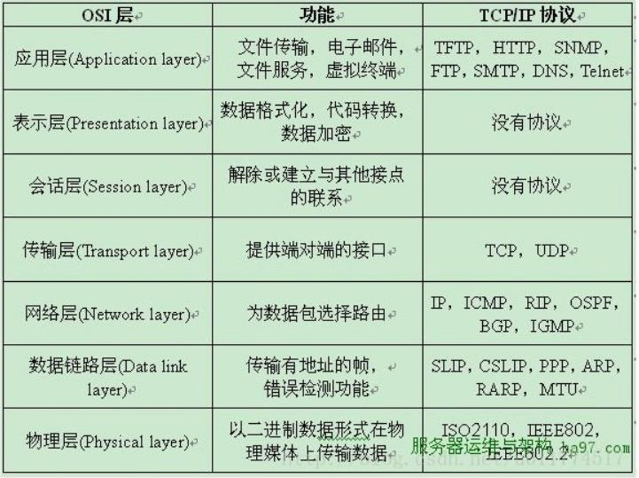

>> T:2019/12/2  W:一 14:57:23

[HTML]: @[TOC](面经汇总 计算机网络再探)

# 物理层
# 数据链路层
# 网络层
## 1. 路由器的功能？
- 路由选择与分组转发
## 2. ip 报文如何从下向上交付
## 3. ip 地址有什么用，ip 地址和mac 地址, 为什么需要IP 地址
- `IP` 地址是在网络上分配给每台计算机或网络设备的`32` 位数字标识。
- 在`Internet`上， 每台计算机或网络设备的`IP` 地址是全世界唯一的。
- `IP` 地址的格式是`xxx.xxx.xxx.xxx`，其中`xxx` 是`0` 到`255` 之间的任意整数。例如，每步站主机的`IP` 地址是`219.134.132.131`。
- `MAC` 地址是数据链路层的地址，如果`mac` 地址不可直达,直接丢弃，在`LAN` 里面，一个网卡的`MAC` 地址是唯一的。
- `MAC` 地址在`arp` 协议里常常用到，`mac` 地址到`ip`地址的相互转化。
- `Mac` 地址是`48` 位的地址。
- `IP` 地址是网络层的地址，如果`ip` 地址不可达，接着转发，在`WAN` 里面，`ip` 地址不唯一，计算机的`ip` 地址可以变动
## 4. ARP 协议的作用
- `ARP`(地址解析)协议是一种解析协议，
- 当主机要发送一个`IP` 包的时候，会首先查一下自己的`ARP` 高速缓存表(最近数据传递更新的`IP-MAC` 地址对应表)，如果查询的`IP－MAC` 值对不存在，
- 那么主机就向网络广播一个`ARP` 请求包，这个包里面就有待查询的`IP` 地址，
- 而直接收到这份广播的包的所有主机都会查询自己的`IP` 地址，如果收到广播包的某一个主机发现自己符合条件，那么就回应一个`ARP` 应答包(将自己对应的`IP-MAC` 对应地址发回主机)，
- 源主机拿到`ARP` 应答包后会更新自己的`ARP` 缓存表。源主机根据新的`ARP`缓存表准备好数据链路层的的数据包发送工作。

## 5. NAT的原理，外网与内网或内网之间的通信中如何区分不同IP的数组包
- 公有`IP` 地址：也叫全局地址，是指合法的`IP` 地址，它是由`NIC`(网络信息中心)或者`ISP`(网络服务提供商)分配的地址，对外代表一个或多个内部局部地址，是全球统一的可寻址的地址。
- 私有`IP` 地址：也叫内部地址，属于非注册地址，专门为组织机构内部使用。因特网分配编号委员会`(IANA)`保留了`3` 块`IP` 地址做为私有`IP` 地址；

- `NAT` 英文全称是`Network Address Translation`，中文意思是“网络地址转换”，它是一个`IETF(Internet Engineering Task Force`, `Internet` 工程任务组)标准，允许一个整体机构以一个公用`IP(Internet Protocol)`地址出现在`Internet` 上。
- 顾名思义，它是一种把内部私有网络地址(`IP` 地址)翻译成合法网络`IP` 地址的技术。
- 因此我们可以认为，`NAT` 在一定程度上，能够有效的解决公网地址不足的问题。

- `NAT` 就是在局域网内部网络中使用内部地址，而当内部节点要与外部网络进行通讯时，就在网关处，将内部地址替换成公用地址，从而在外部公网`(internet)`上正常使用，`NAT` 可以使多台计算机共享`Internet` 连接，这一功能很好地解决了公共`IP` 地址紧缺的问题。
- 通过这种方法，可以只申请一个合法`IP` 地址，就把整个局域网中的计算机接入`Internet` 中。
- 这时，`NAT` 屏蔽了内部网络，所有内部网计算机对于公共网络来说是不可见的，而内部网计算机用户通常不会意识到`NAT` 的存在。

---
- 参考: 
    - [解决外网与内网或内网之间的通信，NAT穿透](./2019-12-2-总结系列-计算机网络-NAT穿透.md)

---

## 6. RIP 路由协议
- 网络中的每一个路由器都要维护从它自己到其他每一个目标网络的距离记录；
- 距离也称为跳数，规定从一路由器到直接连接的网络跳数为`1`，而每经过一个路由器，则距离加`1`；
- `RIP` 认为好的路由就是它通过的路由器数量最少；
- `RIP` 允许一条路径上最多有`15` 个路由器，因为规定最大跳数为`16`；
- `RIP` 默认每`30` 秒广播一次`RIP` 路由更新信息。

- 每一个路由表项目包括三个内容：`目的网络`、`距离`、`下一跳路由器`
- 对地址为`X`的路由器发过来的路由表，先修改此路由表中的所有项目：
    - 把**下一跳**字段中的地址改为`X`，并把所有**距离**字段都加`1`。
    - 对修改后的路由表中的每一个项目，进行以下步骤：
        - 将`X` 的路由表(修改过的)，与`S` 的路由表的目的网络进行对比。若在`X` 中出现，在`S` 中没出现，则将`X` 路由表中的这一条项目添加到`S` 的路由表中。
        - 对于目的网络在`S` 和`X` 路由表中都有的项目进行下面步骤
            - 在`S` 的路由表中，若下一跳地址是`x`则直接用`X` 路由表中这条项目替换`S` 路由表中的项目。
            - 在`S` 的路由表中，若下一跳地址不是`x`, 若`X` 路由表项目中的距离`d` 小于`S` 路由表中的距离，则进行更新。
    - 若`3`分钟还没有收到相邻路由器的更新表，则把此相邻路由器记为不可到达路由器，即把距离设置为`16`。
## 7. 为什么使用IP 地址通信
- 由于全世界存在着各式各样的网络，它们使用不同的`硬件地址`。要使这些异构网络能够互相通信就必须进行非常复杂的硬件地址转换工作，因此几乎是不可能的事。
- 连接到因特网的主机都拥有统一的`IP` 地址，它们之间的通信就像连接在同一个网络上那样简单方便，因为调用`ARP` 来寻找某个路由器或主机的硬件地址都是由计算机软件自动进行的，对用户来说是看不见这种调用过程的。
## 8. 子网掩码有什么用？
- 子网掩码是一种用来指明一个`IP` 地址所标示的主机处于哪个子网中。
- 子网掩码不能单独存在，它必须结合`IP` 地址一起使用。
- 子网掩码只有一个作用，就是将某个`IP` 地址划分成`网络地址`和`主机地址`两部分。
## 9. 子网划分的方法
- 传统子网划分，`ip 地址结构`=`网络号`+`主机号`
- 子网掩码
- `CIDR`，减少了传统分法的`ip`浪费。

---
- 参考: 
    - [CIDR地址块及其子网划分(内含原始IP地址分类及其子网划分的介绍)](https://blog.csdn.net/dan15188387481/article/details/49873923)
    - [IP地址和CIDR](https://www.cnblogs.com/cocowool/p/8303795.html)

---

# 运输层
## 1. TCP 协议有几大计时器？
- 重传计时器
    - 在一个`TCP` 连接中，`TCP` 每发送一个报文段，就对此报文段设置一个超时重传计时器。
    - 若在收到了对此特定报文段的确认之前计时器截止期到，则重传此报文段，并将计时器复位。
- 持续计时器
    - 为了对付零窗口大小通知，`TCP` 需要另一个计时器。
    - 假定接收`TCP` 宣布了窗口大小为零。发送`TCP` 就停止传送报文段，直到接收`TCP` 发送确认并宣布一个非零的窗口大小。
    - 但这个确认可能会丢失。我们知道在`TCP` 中，对确认是不需要发送确认的。
    - 若确认丢失了，接收`TCP` 并不知道，而是会认为它已经完成任务了，并等待着发送`TCP` 接着会发送更多的报文段。
    - 但发送`TCP` 由于没有收到确认，就等待对方发送确认来通知窗口的大小。
    - 双方的`TCP` 都在永远地等待着对方。
    - 要打开这种死锁，`TCP`为每一个连接使用一个坚持计时器。
    - 当发送`TCP` 收到一个窗口大小为零的确认时，就启动坚持计时器。
    - 当坚持计时器期限到时，发送`TCP` 就发送一个特殊的报文段， 叫做探测报文段。这个报文段只有一个字节的数据。
    - 它有一个序号，但它的序号永远不需要确认；
    - 甚至在计算对其他部分的数据的确认时该序号也被忽略。
    - 探测报文段提醒对端：**确认已丢失，必须重传**。
- 保活计时器
    - 保活计时器使用在某些实现中，用来防止在两个`TCP` 之间的连接出现长时期的空闲。
    - 假定客户打开了到服务器的连接，传送了一些数据，然后就保持静默了。也许这个客户出故障了。
    - 在这种情况下，这个连接将永远地处理打开状态。
- 时间等待计时器
    - 时间等待计时器是在连接终止期间使用的。
    - 当`TCP` 关闭一个连接时，它并不认为这个连接马上就真正地关闭了。
    - 在时间等待期间中，连接还处于一种中间过渡状态。
    - 这就可以使重复的`FIN` 报文段(如果有的话)可以到达目的站因而可将其丢弃。
    - 这个计时器的值通常设置为一个报文段的寿命期待值的两倍。
## 2. 详细说一下TCP 协议，三次握手传输的内容？13 种状态

- 第一次握手：建立连接。客户端发送连接请求报文段，将SYN 位置为1，Sequence Number 为x；然后，客户端进入SYN_SEND 状态，等待服务器的确认；
- 第二次握手：服务器收到SYN 报文段。服务器收到客户端的SYN 报文段，需要对这个SYN 报文段进行确认，设置Acknowledgment Number 为x+1(Sequence Number+1)；同时，自己自己还要发送SYN 请求信息，将SYN 位置为1，Sequence Number 为y；服务器端将上述所有信息放到一个报文段（即SYN+ACK 报文段）中，一并发送给客户端，此时服务器进入SYN_RECV 状态；
- 第三次握手：客户端收到服务器的SYN+ACK 报文段。然后将Acknowledgment Number设置为y+1，向服务器发送ACK 报文段，这个报文段发送完毕以后，客户端和服务器端都进入ESTABLISHED 状态，完成TCP 三次握手。
- 四次挥手
- 当客户端和服务器通过三次握手建立了TCP 连接以后，当数据传送完毕，肯定是要断开TCP 连接的啊。那对于TCP 的断开连接，这里就有了神秘的“四次分手”。
- 第一次分手：主机1（可以使客户端，也可以是服务器端），设置Sequence Number和Acknowledgment Number，向主机2 发送一个FIN 报文段；此时，主机1 进入FIN_WAIT_1 状态；这表示主机1 没有数据要发送给主机2 了；
- 第二次分手：主机2 收到了主机1 发送的FIN 报文段，向主机1 回一个ACK 报文段，Acknowledgment Number 为Sequence Number 加1；主机1 进入FIN_WAIT_2 状态；主机2 告诉主机1，我“同意”你的关闭请求；
- 第三次分手：主机2 向主机1 发送FIN 报文段，请求关闭连接，同时主机2 进入LAST_ACK 状态；
- 第四次分手：主机1 收到主机2 发送的FIN 报文段，向主机2 发送ACK 报文段，然后主机1 进入TIME_WAIT 状态；主机2 收到主机1 的ACK 报文段以后，就关闭连接；此时，主机1 等待2MSL 后依然没有收到回复，则证明Server 端已正常关闭，那好，主机1 也可以关闭连接了。
- 六大标志位
    - SYN，同步标志位；
    - ACK 确认标志位；
    - PSH 传送标志位；
    - FIN 结束标志位；
    - RST 重置标志位；
    - URG 紧急标志位；
- seq 序号；
- ack 确认号
## 3. TCP 为啥挥手要比握手多一次？
- 因为当处于LISTEN 状态的服务器端收到来自客户端的SYN 报文(客户端希望新建一个TCP 连接)时，它可以把ACK(确认应答)和SYN(同步序号)放在同一个报文里来发送给客户端。
- 但在关闭TCP 连接时，当收到对方的FIN 报文时，对方仅仅表示对方已经没有数据发送给你了，但是你自己可能还有数据需要发送给对方，则等你发送完剩余的数据给对方之后，再发送FIN 报文给对方来表示你数据已经发送完毕，并请求关闭连接，所以通常情况下，这里的ACK 报文和FIN 报文都是分开发送的。
## 4. 为什么一定进行三次握手？
- 当客户端向服务器端发送一个连接请求时，由于某种原因长时间驻留在网络节点中，无法达到服务器端，由于TCP 的超时重传机制，当客户端在特定的时间内没有收到服务器端的确认应答信息，则会重新向服务器端发送连接请求，且该连接请求得到服务器端的响应并正常建立连接，进而传输数据，当数据传输完毕，并释放了此次TCP 连接。
- 若此时第一次发送的连接请求报文段延迟了一段时间后，到达了服务器端，本来这是一个早已失效的报文段，但是服务器端收到该连接请求后误以为客户端又发出了一次新的连接请求，于是服务器端向客户端发出确认应答报文段，并同意建立连接。
- 如果没有采用三次握手建立连接，由于服务器端发送了确认应答信息，则表示新的连接已成功建立，但是客户端此时并没有向服务器端发出任何连接请求，因此客户端忽略服务器端的确认应答报文，更不会向服务器端传输数据。而服务器端却认为新的连接已经建立了，并在一直等待客户端发送数据，这样服务器端一直处于等待接收数据，直到超出计数器的设定值，则认为服务器端出现异常，并且关闭这个连接。在这个等待的过程中，浪费服务器的资源。
- 如果采用三次握手，客户端就不会向服务器发出确认应答消息，服务器端由于没有收到客户端的确认应答信息，从而判定客户端并没有请求建立连接，从而不建立该连接。
## 5. TCP 与UDP 的区别？应用场景都有哪些？
- TCP 面向连接（如打电话要先拨号建立连接）;UDP 是无连接的，即发送数据之前不需要建立连接
- TCP 提供可靠的服务。也就是说，通过TCP 连接传送的数据，无差错，不丢失，不重复，且按序到达;UDP 尽最大努力交付，即不保证可靠交付Tcp 通过校验和，重传控制，序号标识，滑动窗口、确认应答实现可靠传输。如丢包时的重发控制，还可以对次序乱掉的分包进行顺序控制。
- UDP 具有较好的实时性，工作效率比TCP 高，适用于对高速传输和实时性有较高的通信或广播通信。
- 每一条TCP 连接只能是点到点的;UDP 支持一对一，一对多，多对一和多对多的交互通信
- TCP 对系统资源要求较多，UDP 对系统资源要求较少。
- 若通信数据完整性需让位与通信实时性，则应该选用TCP 协议（如文件传输、重要状态的更新等）；反之，则使用UDP 协议（如视频传输、实时通信等）。
- UDP:DNS SNMP
- TCP 面向字节流，UTP 面向数据包；
## 6. 为什么UDP 有时比TCP 更有优势?
- 网速的提升给UDP 的稳定性提供可靠网络保障，丢包率很低，如果使用应用层重传，能够确保传输的可靠性。
- TCP 为了实现网络通信的可靠性，使用了复杂的拥塞控制算法，建立了繁琐的握手过程，由于TCP 内置的系统协议栈中，极难对其进行改进。
- 采用TCP，一旦发生丢包，TCP 会将后续的包缓存起来，等前面的包重传并接收到后再继续发送，延时会越来越大，基于UDP 对实时性要求较为严格的情况下，采用自定义重传机制，能够把丢包产生的延迟降到最低，尽量减少网络问题对游戏性造成影响。
## 7. UDP 中一个包的大小最大能多大
- 以太网(`Ethernet`)数据帧的长度必须在`46-1500` 字节之间,这是由以太网的物理特性决定的.
- 这个`1500` 字节被称为**链路层**的`MTU`(最大传输单元).
- 但这并不是指链路层的长度被限制在`1500` 字节,其实这这个`MTU` 指的是链路层的数据区.
- 并不包括链路层的首部和尾部的`18` 个字节.
- 所以,事实上,**这个`1500` 字节就是网络层`IP` 数据报的长度限制.**
- 因为`IP` 数据报的首部为`20` 字节,所以`IP` 数据报的数据区长度最大为`1480` 字节.
- 而这个`1480` 字节就是用来放`TCP` 传来的`TCP` 报文段或`UDP` 传来的`UDP` 数据报的.
- 又因为`UDP` 数据报的首部`8` 字节,所以`UDP` 数据报的数据区最大长度为`1472` 字节.
- 这个`1472` 字节就是我们可以使用的字节数。
## 8. TCP 粘包
- 在`socket` 网络程序中，`TCP` 和`UDP` 分别是面向连接和非面向连接的。
- 因此`TCP` 的`socket` 编程，收发两端(客户端和服务器端)都要有成对的`socket`，因此，发送端为了将多个发往接收端的包，更有效的发到对方，使用了优化方法(`Nagle` 算法)，将多次间隔较小、数据量小的数据，合并成一个大的数据块，然后进行封包。
- 这样，接收端，就难于分辨出来了，必须提供科学的拆包机制。
- 对于`UDP`，不会使用块的合并优化算法，这样，实际上目前认为，是由于`UDP` 支持的是一对多的模式，所以接收端的`skbuff`(套接字缓冲区)采用了链式结构来记录每一个到达的`UDP` 包，在每个`UDP` 包中就有了消息头(消息来源地址，端口等信息)，这样，对于接收端来说，就容易进行区分处理了。所以`UDP` 不会出现粘包问题

---
- `TCP` 粘包是指发送方发送的若干包数据到接收方接收时粘成一包，从接收缓冲区看，后一包数据的头紧接着前一包数据的尾；
- 发送方原因: 
- 我们知道，`TCP` 默认会使用`Nagle` 算法。而`Nagle` 算法主要做两件事：
    - 只有上一个分组得到确认，才会发送下一个分组；
    - 收集多个小分组，在一个确认到来时一起发送。
    - 所以，正是`Nagle`算法造成了发送方有可能造成粘包现象。
- 接收方原因
    - `TCP` 接收到分组时，并不会立刻送至应用层处理，或者说，应用层并不一定会立即处理；
    - 实际上，`TCP` 将收到的分组保存至接收缓存里，然后应用程序主动从缓存里读收到的分组。
    - 这样一来，如果`TCP` 接收分组的速度大于应用程序读分组的速度，多个包就会被存至缓存，应用程序读时，就会读到多个首尾相接粘到一起的包。
- 解决方法
    - 发送方
        - 对于发送方造成的粘包现象，我们可以通过关闭`Nagle` 算法来解决，使用`TCP_NODELAY` 选项来关闭`Nagle` 算法。
    - 接收方
        - 遗憾的是`TCP` 并没有处理接收方粘包现象的机制，我们只能在应用层进行处理。
    - 应用层处理
        - 应用层的处理简单易行！并且不仅可以解决接收方造成的粘包问题，还能解决发送方造成的粘包问题。
## 9. 传输层功能的逻辑通信；
## 10. TCP 可靠性保证
- 序号
    - `TCP` 首部的序号字段用来保证数据能有序提交给应用层，`TCP` 把数据看成无结构的有序的字节流。
    - 数据流中的每一个字节都编上一个序号字段的值是指本报文段所发送的数据的第一个字节序号。
- 确认
    - `TCP` 首部的确认号是期望收到对方的下一个报文段的数据的第一个字节的序号；
- 重传
    - 超时重传
    - 冗余`ACK` 重传
- 流量控制
    - `TCP` 采用大小可变的滑动窗口进行流量控制，窗口大小的单位是字节。
    - 发送窗口在连接建立时由双方商定。
    - 但在通信的过程中，接收端可根据自己的资源情况，随时动态地调整对方的发送窗口上限值(可增大或减小)。
- 窗口
    - 接受窗口`rwnd`，接收端缓冲区大小。接收端将此窗口值放在`TCP` 报文的首部中的窗口字段，传送给发送端。
    - 拥塞窗口`cwnd`，发送缓冲区大小。
    - 发送窗口`swnd`, 发送窗口的上限值 = `Min [rwnd, cwnd]`
- 拥塞控制
- 流量控制与拥塞控制的区别
    - 所谓拥塞控制就是防止过多的数据注入到网络中，这样可以使网络中的路由器或链路不致过载。
    - 拥塞控制所要做的都有一个前提，就是网络能承受现有的网络负荷。
    - 流量控制往往指的是点对点通信量的控制，是个端到端的问题。
    - 流量控制所要做的就是控制发送端发送数据的速率，以便使接收端来得及接受。
## 11. 拥塞控制
- 慢开始
    - 发送方维持一个叫做拥塞窗口`cwnd(congestion window`)的状态变量。
    - 拥塞窗口的大小取决于网络的拥塞程度，并且动态地在变化。
    - 发送方让自己的发送窗口等于拥塞窗口，另外考虑到接受方的接收能力，发送窗口可能小于拥塞窗口。
    - 慢开始算法的思路就是，不要一开始就发送大量的数据，先探测一下网络的拥塞程度，也就是说由小到大逐渐增加拥塞窗口的大小。
    - 当然收到单个确认但此确认多个数据报的时候就加相应的数值。
    - 所以一次传输轮次之后拥塞窗口就加倍。
    - 这就是乘法增长，和后面的拥塞避免算法的加法增长比较。
    - 为了防止cwnd 增长过大引起网络拥塞，还需设置一个慢开始门限ssthresh状态变量。
    - ssthresh 的用法如下：
    - 当cwnd<ssthresh 时，使用慢开始算法。
    - 当cwnd>ssthresh 时，改用拥塞避免算法。
    - 当cwnd=ssthresh 时，慢开始与拥塞避免算法任意。
    - 拥塞避免算法让拥塞窗口缓慢增长，即每经过一个往返时间RTT 就把发送方的拥塞窗口cwnd 加1，而不是加倍。
    - 这样拥塞窗口按线性规律缓慢增长。无论是在慢开始阶段还是在拥塞避免阶段，只要发送方判断网络出现拥塞(其根据就是没有收到确认，虽然没有收到确认可能是其他原因的分组丢失，但是因为无法判定，所以都当做拥塞来处理)，就把慢开始门限设置为出现拥塞时的发送窗口大小的一半。
- 然后把拥塞窗口设置为1，执行慢开始算法。
- 如下图：

- 快重传和快恢复
    - 快重传要求接收方在收到一个失序的报文段后就立即发出重复确认（为的是使发送方及早知道有报文段没有到达对方）而不要等到自己发送数据时捎带确认。
    - 快重传算法规定，发送方只要一连收到三个重复确认就应当立即重传对方尚未收到的报文段，而不必继续等待设置的重传计时器时间到期。
- 快重传配合使用的还有快恢复算法，有以下两个要点:
    - 当发送方连续收到三个重复确认时，就执行“乘法减小”算法，把ssthresh门限减半。但是接下去并不执行慢开始算法。
    - 考虑到如果网络出现拥塞的话就不会收到好几个重复的确认，所以发送方现在认为网络可能没有出现拥塞。所以此时不执行慢开始算法，而是将cwnd 设置为ssthresh 的大小，然后执行拥塞避免算法。
- 如下图：

## 12. TCP 流量控制
- 如果发送方把数据发送得过快，接收方可能会来不及接收，这就会造成数据的丢失。
- TCP 的流量控制是利用滑动窗口机制实现的，接收方在返回的ACK 中会包含自己的接收窗口的大小，以控制发送方的数据发送。

---
- 当某个`ACK` 报文丢失了，就会出现`A` 等待`B` 确认，并且`B` 等待`A` 发送数据的死锁状态。
- 为了解决这种问题，`TCP` 引入了持续计时器(`Persistence timer`)，当`A`收到`rwnd=0` 时，就启用该计时器，时间到了则发送一个`1` 字节的探测报文，询问`B` 是很忙还是上个`ACK` 丢失了，然后`B` 回应自身的接收窗口大小，返回仍为`0.`
- (`A` 重设持续计时器继续等待)或者会重发`rwnd=x`。

- ==这里说的是当接收窗口为零之后的恢复过程==

## 13. 流量控制与拥塞控制的区别？
- 拥塞控制就是防止过多的数据注入网络中，这样可以使网络中的路由器或链路不致过载。拥塞控制是一个全局性的过程，和流量控制不同，流量控制指点对点通信量的控制。
- 所谓流量控制就是让发送发送速率不要过快，让接收方来得及接收。利用滑动窗口机制就可以实施流量控制。原理这就是运用TCP 报文段中的窗口大小字段来控制，发送方的发送窗口不可以大于接收方发回的窗口大小。
## 14. time_wait 与close_wait，time_wait 状态持续多长时间？为什么会有time_wait 状态？
- `time_wait`另一边已经初始化一个释放，`close_wait` 连接一端被动关闭；
- 首先调用`close()`发起主动关闭的一方，在发送最后一个`ACK` 之后会进入`time_wait` 的状态，也就说该发送方会保持`2MSL` 时间之后才会回到初始状态。`MSL` 指的是数据包在网络中的最大生存时间。产生这种结果使得这个`TCP` 连接在`2MSL` 连接等待期间，定义这个连接的四元组(客户端`IP` 地址和端口，服务端`IP` 地址和端口号)不能被使用。
- 为什么存在`time_wait`
- `TCP` 协议在关闭连接的四次握手过程中，最终的`ACK` 是由主动关闭连接的一端(后面统称`A` 端)发出的，如果这个`ACK` 丢失，对方(后面统称`B`端)将重发出最终的`FIN`，因此`A` 端必须维护状态信息(`TIME_WAIT`)允许它重发最终的`ACK`。如果`A` 端不维持`TIME_WAIT` 状态， 而是处于`CLOSED` 状态，那么`A` 端将响应`RST` 分节，`B` 端收到后将此分节解释成一个错误。因而，要实现`TCP` 全双工连接的正常终止，必须处理终止过程中四个分节任何一个分节的丢失情况，主动关闭连接的`A` 端必须维持`TIME_WAIT` 状态。

- 为实现`TCP` 全双工连接的可靠释放由`TCP` 状态变迁图可知，假设发起主动关闭的一方(`client`)最后发送的
`ACK` 在网络中丢失，由于`TCP` 协议的重传机制，执行被动关闭的一方(`server`)将会重发其`FIN`，在该`FIN` 到达`client` 之前，`client` 必须维护这条连接状态，也就说这条`TCP` 连接所对应的资源(`client` 方的`local_ip`,`local_port`)不能被立即释放或重新分配，直到另一方重发的`FIN` 达到之后，`client` 重发`ACK` 后，经过`2MSL` 时间周期没有再收到另一方的`FIN` 之后，该`TCP` 连接才能恢复初始的`CLOSED` 状态。如果主动关闭一方不维护这样一个`TIME_WAIT` 状态，那么当被动关闭一方重发的`FIN`到达时，主动关闭一方的`TCP` 传输层会用`RST` 包响应对方，这会被对方认为是有错误发生，然而这事实上只是正常的关闭连接过程，并非异常。

- `TCP segment` 可能由于路由器异常而“迷途”，在迷途期间，`TCP` 发送端可能因确认超时而重发这个`segment`，迷途的`segment` 在路由器修复后也会被送到最终目的地，这个迟到的迷途`segment` 到达时可能会引起问题。在关闭“前一个连接”之后，马上又重新建立起一个相同的`IP` 和端口之间的“新连接”，“前一个连接”的迷途重复分组在“前一个连接”终止后到达，而被“新连接”收到了。为了避免这个情况，`TCP` 协议不允许处于`TIME_WAIT` 状态的连接启动一个新的可用连接，因为`TIME_WAIT` 状态持续`2MSL`，就可以保证当成功建立一个新`TCP` 连接的时候，来自旧连接重复分组已经在网络中消逝。

- 为使旧的数据包在网络因过期而消失
- 为说明这个问题，我们先假设`TCP` 协议中不存在`TIME_WAIT` 状态的限制，再假设当前有一条`TCP` 连接： 
    - (`local_ip`, `local_port`,`remote_ip`,`remote_port`)，因某些原因，我们先关闭，接着很快以相同的四元组建立一条新连接。
    - 本文前面介绍过，`TCP` 连接由四元组唯一标识，因此，在我们假设的情况中，`TCP` 协议栈是无法区分前后两条`TCP` 连接的不同的，在它看来，这根本就是同一条连接，中间先释放再建立的过程对其来说是“感知”不到的。
    - 这样就可能发生这样的情况：
        - 前一条`TCP` 连接由`local peer` 发送的数据到达`remote peer` 后，会被该`remot peer` 的`TCP` 传输层当做当前`TCP` 连接的正常数据接收并向上传递至应用层(而事实上，在我们假设的场景下，这些旧数据到达`remote peer` 前，旧连接已断开且一条由相同四元组构成的新`TCP` 连接已建立，因此，这些旧数据是不应该被向上传递至应用层的)，从而引起数据错乱进而导致各种无法预知的诡异现象。
    - 作为一种可靠的传输协议，`TCP` 必须在协议层面考虑并避免这种情况的发生，这正是`TIME_WAIT` 状态存在的第`2` 个原因。

- 如果`time_wait` 维持的时间过长，主动关闭连接端迟迟无法关闭连接，占用程序资源。
- 如果服务器程序TCP 连接一直保持在CLOSE_WAIT 状态，那么只有一种情况，就是在对方关闭连接之后服务器程序自己没有进一步发出ack 信号。换句话说，就是在对方连接关闭之后，程序里没有检测到，或者程序压根就忘记了这个时候需要关闭连接，于是这个资源就一直被程序占着。
- time_wait 状态如何避免首先服务器可以设置SO_REUSEADDR 套接字选项来通知内核，如果端口忙，但TCP 连接位于TIME_WAIT 状态时可以重用端口。在一个非常有用的场景就是，如果你的服务器程序停止后想立即重启，而新的套接字依旧希望使用同一端口，此时SO_REUSEADDR 选项就可以避免TIME_WAIT 状态。
Close_wait:
- 产生原因
    - 在被动关闭连接情况下，在已经接收到FIN，但是还没有发送自己的FIN 的时刻，连接处于CLOSE_WAIT 状态。通常来讲，CLOSE_WAIT 状态的持续时间应该很短，正如SYN_RCVD 状态。
    - 但是在一些特殊情况下，就会出现连接长时间处于CLOSE_WAIT 状态的情况。
    - 出现大量close_wait 的现象，主要原因是某种情况下对方关闭了socket 链接，但是我方忙与读或者写，没有关闭连接。
    - 代码需要判断socket，一旦读到0，断开连接，read 返回负，检查一下errno，如果不是AGAIN，就断开连接。对方关闭连接之后服务器程序自己没有进一步发出ack 信号。
    - 换句话说，就是在对方连接关闭之后，程序里没有检测到，或者程序压根就忘记了这个时候需要关闭连接，于是这个资源就一直被程序占着。
- 解决方法
    - 要检测出对方已经关闭的socket，然后关闭它。
## 15. Time_wait 为什么是2MSL 的时间长度
- TIME_WAIT 的状态是为了等待连接上所有的分组的消失。
- 单纯的想法，发送端只需要等待一个MSL 就足够了。
- 这是不够的，假设现在一个MSL 的时候，接收端需要发送一个应答，这时候，我们也必须等待这个应答的消失，这个应答的消失也是需要一个MSL，所以我们需要等待2MSL。
## 16. 介绍一下ping 的过程，分别用到了哪些协议
## 17. socket 编程
TCP 过程：
客户端：
1) 创建socket
2) 绑定ip、端口号到socket 字
3) 连接服务器，connect()
4) 收发数据，send()、recv()
5) 关闭连接
服务器端：
1) 创建socket 字
2) 设置socket 属性
3) 绑定ip 与端口号
4) 开启监听，listen()
5) 接受发送端的连接accept()
6) 收发数据send()、recv()
7) 关闭网络连接
8) 关闭监听
对应关系：
客户端的connect()指向服务器端的accept()
客户端、服务器端的send()/recv()是双向箭头的关系。
UDP 过程：

## 18. 客户端为什么不需要bind
## 19. send 和recv 的缺点

# 应用层
## 1. 常用的网络协议？
1) DHCP
动态主机设置协议（Dynamic Host Configuration Protocol, DHCP）是一个局域网的网络协议，使用UDP 协议工作，主要有两个用途：给内部网络或网络服务供应商自动分配IP 地址给用户给内部网络管理员作为对所有计算机作中央管理的手段
2) ARP
将32 位的IP 地址转换为48 位的物理地址。当路由器或主机选择了某条路由时，首先会查找ARP 缓存，若缓存中有对应IP 地址的物理地址，则以此封装以太帧，否则会广播（为二层广播）ARP 报文，每个主机接收到ARP 请求报文后，会缓存发送源的IP——MAC 对到ARP 缓存中，目的主机会发送ARP 回应（此时为单播），当发送源接收到回应时，会将目的方的IP——MAC 对存放在ARP 缓存中。在点到点的物理连接中，是不会用到ARP 报文的，在启动时双方都会通告对方自己的IP 地址，此时物理层的封装不需要MAC 地址。windows 上可以使用arp -a 查看本机的ARP缓存。ARP 缓存中的每个条目的最大存活时间为20 分钟
3) ICMP
ICMP（Internet Control Message Protocol）因特网控制报文协议。它是IPv4 协议族中的一个子协议，用于IP 主机、路由器之间传递控制消息。控制消息是在网络通不通、主机是否可达、路由是否可用等网络本身的消息。这些控制消息虽然不传输用户数据，但是对于用户数据的传递起着重要的作用。ICMP 协议与ARP 协议不同，ICMP 靠IP 协议来完成任务，所以ICMP 报文中要封装IP 头部。它与传输层协议（如TCP 和UDP）的目的不同，一般不用来在端系统之间传送数据，不被用户网络程序直接使用，除了想Ping 和Tracert 这样的诊断程序。
## 2. 网络协议各个层的网络设备？
一、集线器
集线器也称HUB，工作在OSI 七层结构的第一层物理层，属于共享型设备，接收数据广播发出，在局域网内一般都是星型连接拓扑结构，每台工作站都连接到集线器上。由于集线器的带宽共享特性导致网络利用效率极低，一般在大中型的网络中不会使用到集线器。现在的集线器基本都是全双工模式，市面上常见的集线器传输速率普遍都为100Mbps。
二、中继器
中继器（Repeater）工作于OSI 的第一层（物理层），中继器是最简单的网络互联设备，连接同一个网络的两个或多个网段，主要完成物理层的功能，负责在两个网络节点的物理层上按位传递信息，完成信号的复制、调整和放大功能，以此从而增加信号传输的距离，延长网络的长度和覆盖区域，支持远距离的通信。一般来说，中继器两端的网络部分是网段，而不是子网。中继器只将任何电缆段上的数据发送到另一段电缆上，并不管数据中是否有错误数据或不适于网段的数据。大家最常接触的是网络中继器，在通讯上还有微波中继器、激光中继器、红外中继器等等，机理类似，触类旁通。
三、交换机
交换机顾名思义以交换为主要功能，工作在OSI 第二层（数据链路层），根据MAC地址进行数据转发。交换机的每一个端口都属于一个冲突域，而集线器所有端口属于一个冲突域。交换机通过分析Ethernet 包的包头信息（其中包含了源MAC 地址、目标MAC 地址、信息长度等），取得目标MAC 地址后，查找交换机中存储的地址对照表（MAC 地址对应的端口），确认具有此MAC 地址的网卡连接在哪个端口上，然后将信包送到对应端口，有效的抑制IP 广播风暴。并且信息包处于并行状态，效率较高。
交换机的转发延迟非常小，主要的得益于其硬件设计机理非常高效，为了支持各端口的最大数据传输速率，交换机内部转发信包的背板带宽都必须远大于端口带宽，具有强大的整体吞吐率，才能为每台工作站提供更高的带宽和更高的网络利用率，可以满足大型网络环境大量数据并行处理的要求。
四、网桥
网桥和交换机一样都是工作在OSI 模型的第二层（数据链路层），可以看成是一个二层路由器（真正的路由器是工作在网络层，根据IP 地址进行信包转发）。网桥可有效的将两个局域网（LAN）连起来，根据MAC 地址（物理地址）来转发帧，使本地通信限制在本网段内，并转发相应的信号至另一网段，网桥通常用于联接数量不多的、同一类型的网段。
五、路由器
路由器跟集线器和交换机不同，是工作在OSI 的第三层（网络层），根据IP 进行寻址转发数据包。路由器是一种可以连接多个网络或网段的网络设备，能将不同网络或网段之间（比如局域网——大网）的数据信息进行转换，并为信包传输分配最合适的路径，使它们之间能够进行数据传输，从而构成一个更大的网络。路由器具有最主要的两个功能，即数据通道功能和控制功能。数据通道功能包括转发决定、背板转发以及输出链路调度等，一般由特定的硬件来完成；控制功能一般用软件来实现，包括与相邻路由器之间的信息交换、系统配置、系统管理等。
六、网关
网关（Gateway）又叫协议转换器，网关的概念实际上跟上面的设备型不是一类问题，但是为了方便参考还是放到这里一并介绍。
网关是一种复杂的网络连接设备，可以支持不同协议之间的转换，实现不同协议网络之间的互连。网关具有对不兼容的高层协议进行转换的能力，为了实现异构设备之间的通信，网关需要对不同的链路层、专用会话层、表示层和应用层协议进行翻译和转换。所以网关兼有路由器、网桥、中继器的特性。
若要使两个完全不同的网络（异构网）连接在一起，一般使用网关，在Internet 中两个网络也要通过一台称为网关的计算机实现互联。这台计算机能根据用户通信目标计算机的IP 地址，决定是否将用户发出的信息送出本地网络，同时，它还将外界发送给属于本地网络计算机的信息接收过来，它是一个网络与另一个网络相联的通道。为了使TCP/IP 协议能够寻址，该通道被赋予一个IP 地址，这个IP 地址称为网关地址。
所以，网关的作用就是将两个使用不同协议的网络段连接在一起的设备，对两个网络段中的使用不同传输协议的数据进行互相的翻译转换。在互连设备中，由于协议转换的复杂性，一般只能进行一对一的转换，或是少数几种特定应用协议的转换。
## 3. 讲讲浏览器输入地址后发生的全过程，以及对应的各个层次的过程
1、域名解析：浏览器获得URL 地址，向操作系统请求该URL 对应的IP 地址，操作系统查询DNS（首先查询本地HOST 文件，没有则查询网络）获得对应的IP 地址解释：把URL 分割成几个部分：协议、网络地址、资源路径协议：指从该计算机获取资源的方式，常见的是HTTP、FTP网络地址：可以是域名或者是IP 地址，也可以包括端口号，如果不注明端口号，默认是80 端口
如果地址不是一个IP 地址，则需要通过DNS（域名系统）将该地址解析成IP 地址，IP地址对应着网络上的一台计算机，DNS 服务器本身也有IP，你的网络设置包含DNS 服务器的IP，例如，www.abc.com 不是一个IP，则需要向DNS 询问请求www.abc.com 对应的IP，获得IP，在这个过程中，你的电脑直接询问DNS 服务器可能没有发现www.abc.com 对应的IP，就会向它的上级服务器询问，这样依次一层层向上级找，最高可达根节点，直到找到或者全部找不到为止端口号就相当于银行的窗口，不同的窗口负责不同的服务，如果输入www.abc.com:8080/，则表示不使用默认的80 端口，而使用指定的8080 端口2、确认好了IP 和端口号，则可以向该IP 地址对应的服务器的该端口号发起TCP 连接请求
3、服务器接收到TCP 连接请求后，回复可以连接请求，
4、浏览器收到回传的数据后，还会向服务器发送数据包，表示三次握手结束
5、三次握手成功后，开始通讯，根据HTTP 协议的要求，组织一个请求的数据包，里面包含请求的资源路径、你的身份信息等，例如，www.abc.com/images/1/表示的资源路径是images/1/，发送后，服务器响应请求，将数据返回给浏览器，数据可以是根据HTML 协议组织的网页，里面包含页面的布局、文字等等，也可以是图片或者脚本程序等，如果资源路径指定的资源不存在，服务器就会返回404 错误，如果返回的是一个页面，则根据页面里的一些外链URL 地址，重复上述步骤，再次获取
6、渲染页面，并开始响应用户的操作
7、窗口关闭时，浏览器终止与服务器的连接
## 4. http 与https 工作方式
1) http 包含如下动作：
1 浏览器打开一个TCP 连接；
2 浏览器发送HTTP 请求到服务器；
3 服务器发送HTTP 回应信息到服务器；
4 TCP 连接关闭；
2) SSL 包含如下动作：
1 验证服务器端；
2 允许客户端和服务器端选择加密算法和密码，确保双方都支持；
3 验证客户端；
4 使用公钥加密技术来生成共享加密数据；
5 创建一个加密的SSL 连接；
6 基于该SSL 连接传递HTTP 请求；
## 5. http 协议，http 和https 的区别
1) HTTP 和HTTPS 的基本概念
HTTP：是互联网上应用最为广泛的一种网络协议，是一个客户端和服务器端请求和应答的标准（TCP），用于从WWW 服务器传输超文本到本地浏览器的传输协议，它可以使浏览器更加高效，使网络传输减少。
HTTPS：是以安全为目标的HTTP 通道，简单讲是HTTP 的安全版，即HTTP 下加入SSL 层，HTTPS 的安全基础是SSL，因此加密的详细内容就需要SSL。
HTTPS 协议的主要作用可以分为两种：一种是建立一个信息安全通道，来保证数据
传输的安全；另一种就是确认网站的真实性。
2) HTTPS 和HTTP 的区别主要如下：
a) https 协议需要到ca 申请证书，一般免费证书较少，因而需要一定费用。
b) http 是超文本传输协议，信息是明文传输，https 则是具有安全性的ssl 加密传输协议。
c) http 和https 使用的是完全不同的连接方式，用的端口也不一样，前者是80，后者是443。
d) http 的连接很简单，是无状态的；HTTPS 协议是由SSL+HTTP 协议构建的可进行加密传输、身份认证的网络协议，比http 协议安全。
e) 在OSI 模型中，HTTP 工作于应用层，而HTTPS 工作于传输层；
## 6. http 状态码
1) 1XX 信息码，服务器收到请求，需要请求者继续执行操作；
2) 2XX 成功码，操作被成功接收并处理；
3) 3XX 重定向，需要进一步的操作以完成请求；
4) 4XX 客户端错误，请求包含语法错误或无法完成请求；
5) 5XX 服务器错误，服务器在处理请求的过程中发生了错误404 服务器无法根据客户端的请求找到资源（网页）。通过此代码，网站设计人员可设置"您所请求的资源无法找到"的个性页面
## 7. HTTP1.0 与HTTP1.1 的区别？
1) HTTP1.0 需要使用keep-alive 参数来告知服务器要建立一个长连接，而HTTP1.1默认支持长连接；
2) HTTP 1.1 支持只发送header 信息(不带任何body 信息)，如果服务器认为客户端有权限请求服务器，则返回100，否则返回401；
3) HTTP1.0 是没有host 域的，HTTP1.1 才支持这个参数；
4) HTTP2.0 使用了多路复用的技术，做到同一个连接并发处理多个请求，而且并发请求的数量比HTTP1.1 大了好几个数量级；
5) HTTP1.1 不支持header 数据的压缩，HTTP2.0 使用HPACK 算法对header 的数据进行压缩，这样数据体积小了，在网络上传输就会更快；
6) 对支持HTTP2.0 的web server 请求数据的时候，服务器会顺便把一些客户端需要的资源一起推送到客户端，免得客户端再次创建连接发送请求到服务器端获取。这种方式非常合适加载静态资源
## 8. OSI 7 层网络模型中各层的名称及其作用？

## 9. TCP/IP 4 层网络模型名称及其作用？

## 10. OSI 7 层网络中各层的常见协议以及协议作用？设备
第一层：物理层(PhysicalLayer)
规定通信设备的机械的、电气的、功能的和过程的特性，用以建立、维护和拆除物理链路连接。具体地讲，机械特性规定了网络连接时所需接插件的规格尺寸、引脚数量和排列情况等;电气特性规定了在物理连接上传输bit 流时线路上信号电平的大小、阻抗匹配、传输速率距离限制等;功能特性是指对各个信号先分配确切的信号含义，即定义了DTE 和DCE 之间各个线路的功能;规程特性定义了利用信号线进行bit 流传输的一组操作规程，是指在物理连接的建立、维护、交换信息是，DTE 和DCE 双放在各电路上的动作系列。在这一层，数据的单位称为比特(bit)。属于物理层定义的典型规范代表包括：EIA/TIA RS-232、EIA/TIA RS-449、V.35、RJ-45 等。
第二层：数据链路层(DataLinkLayer)
在物理层提供比特流服务的基础上，建立相邻结点之间的数据链路，通过差错控制提供数据帧(Frame)在信道上无差错的传输，并进行各电路上的动作系列。数据链路层在不可靠的物理介质上提供可靠的传输。该层的作用包括：物理地址寻址、数据的成帧、流量控制、数据的检错、重发等。在这一层，数据的单位称为帧(frame)。数据链路层协议的代表包括：SDLC、HDLC、PPP、STP、帧中继等。
第三层是网络层
在计算机网络中进行通信的两个计算机之间可能会经过很多个数据链路，也可能还要经过很多通信子网。网络层的任务就是选择合适的网间路由和交换结点， 确保数据及时传送。网络层将数据链路层提供的帧组成数据包，包中封装有网络层包头，其中含有逻辑地址信息- -源站点和目的站点地址的网络地址。如果你在谈论一个IP 地址，那么你是在处理第3 层的问题，这是“数据包”问题，而不是第2 层的“帧”。IP 是第3层问题的一部分，此外还有一些路由协议和地址解析协议(ARP)。有关路由的一切事情都在这第3 层处理。地址解析和路由是3 层的重要目的。网络层还可以实现拥塞控制、网际互连等功能。在这一层，数据的单位称为数据包(packet)。网络层协议的代表包括：IP、IPX、RIP、OSPF 等。
第四层是处理信息的传输层
第4 层的数据单元也称作数据包(packets)。但是，当你谈论TCP 等具体的协议时又有特殊的叫法，TCP 的数据单元称为段(segments)而UDP 协议的数据单元称为“数据报(datagrams)”。这个层负责获取全部信息，因此，它必须跟踪数据单元碎片、乱序到达的数据包和其它在传输过程中可能发生的危险。第4 层为上层提供端到端(最终用户到最终用户)的透明的、可靠的数据传输服务。所为透明的传输是指在通信过程中传输层对上层屏蔽了通信传输系统的具体细节。传输层协议的代表包括：TCP、UDP、SPX 等。
第五层是会话层
这一层也可以称为会晤层或对话层，在会话层及以上的高层次中，数据传送的单位不再另外命名，而是统称为报文。会话层不参与具体的传输，它提供包括访问验证和会话管理在内的建立和维护应用之间通信的机制。如服务器验证用户登录便是由会话层完成的。
第六层是表示层
这一层主要解决拥护信息的语法表示问题。它将欲交换的数据从适合于某一用户的抽象语法，转换为适合于OSI 系统内部使用的传送语法。即提供格式化的表示和转换数据服务。数据的压缩和解压缩， 加密和解密等工作都由表示层负责。
第七层应用层
应用层为操作系统或网络应用程序提供访问网络服务的接口。应用层协议的代表包括：Telnet、FTP、HTTP、SNMP 等
## 11. OSI 与TCP 模型的区别？
1) TCP/IP 协议中的应用层处理开放式系统互联模型中的第五层、第六层和第七层的功能；
2) TCP/IP 协议中的传输层并不能总是保证在传输层可靠地传输数据包，而开放式系统互联模型可以做到。TCP/IP 协议还提供一项名为UDP(用户数据报协议)的选择。UDP 不能保证可靠的数据包传输。
## 12. DNS 是干什么的？？
1) 主机解析域名的顺序
找缓存、找本机的hosts 文件、找DNS 服务器
2) DNS 协议运行在UDP 协议之上，使用端口号53
3) 根服务器：ISP 的DNS 服务器还找不到的话，它就会向根服务器发出请求，进行递归查询（DNS 服务器先问根域名服务器.com 域名服务器的IP 地址，然后再问.com域名服务器，依次类推）

十个过程：
1 浏览器先检查自身缓存中有没有被解析过这个域名对应的ip 地址；
2 如果浏览器缓存没有命中，浏览器会检查操作系统缓存中有没有对应的已解析过的结果。在windows 中可通过c 盘里hosts 文件来设置；
3 还没命中，请求本地域名服务器来解析这个域名，一般都会在本地域名服务器找到；
4 本地域名服务器没有命中，则去根域名服务器请求解析；
5 根域名服务器返回给本地域名服务器一个所查询域的主域名服务器；
6 本地域名服务器向主域名服务器发送请求；
7 接受请求的主域名服务器查找并返回这个域名对应的域名服务器的地址；
8 域名服务器根据映射关系找到ip 地址，返回给本地域名服务器；
9 本地域名服务器缓存这个结果；
10 本地域名服务器将该结果返回给用户；
## 13. get/post 区别
1) 后退按钮或刷新，Get 无害，post 数据会被重新提交；
2) Get 所使用的URL 可以被设置为书签，而post 不可以；
3) Get 能够被缓存，而post 不可以；
4) Get 参数保留在浏览器历史中，而post 参数不会保留在浏览器历史中；
5) 当发生数据时，get 方法向URL 添加数据，URL 的数据长度是受限的，而post 没有数据长度限制；
6) Get 只允许ASCII 编码，而post 没有限制；
7) Get 安全性没有post 安全性好；
8) Get 数据在URL 中对所有人是可见的，而在post 中数据不会显示在URL 中。
9) Get 产生一个TCP 数据包，post 产生两个TCP 数据包；对于get 方式的请求，浏览器会把header 和data 一并发送出去；对于post，浏览器先发送header 再发送data；
10) GET 和POST 本质上就是TCP 链接，并无差别。但是由于HTTP 的规定和浏览器/服务器的限制，导致他们在应用过程中体现出一些不同；
## 14.说一下网卡从接收到数据后发生了什么
## 15.send 函数什么情况下会阻塞
## 16.常用端口号
FTP 21;TELNET 23;SMTP 25;DNS 53;HTTP 80;HTTPS 443
## 17.https 的过程
