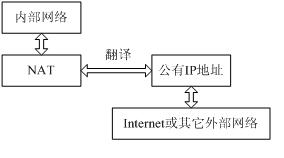
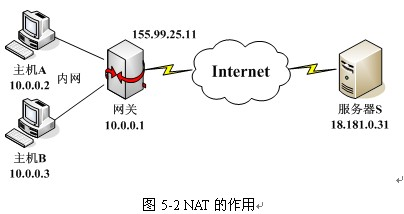
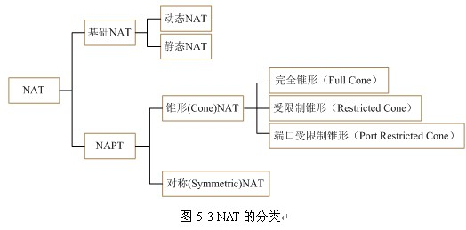
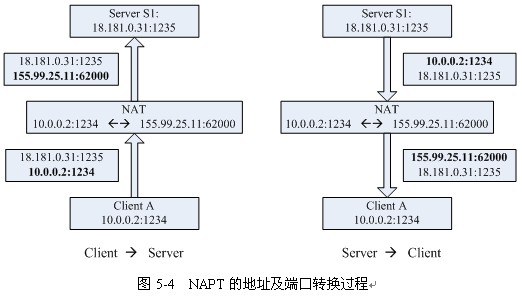
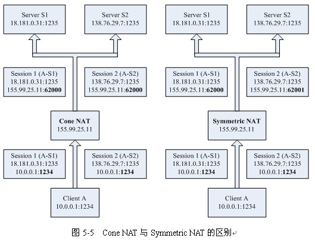
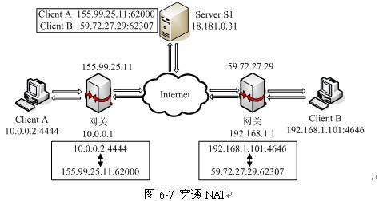

>> T:2019/11/29  W:五 10:34:36

[HTML]: @[TOC](计算机网络 NAT穿透)

---
- 参考链接: 
    - [解决外网与内网或内网之间的通信，NAT穿透](https://blog.csdn.net/ernest201210/article/details/51792353)
---

- 在网络编码中会发现程序在局域网中是可以适用的，但是在外网与内网之间和内网与内网之间就不可行。
- 问题就在于`NAT`。首先介绍下`NAT`。 
- `NAT`的作用`NAT(Network Address Translator)`，网络地址转换。顾名思义，它是一种把内部私有网络`IP`地址翻译成公有网络`IP`地址的技术，如下图所示。`NAT`是在`IP`地址日益缺乏的情况下产生的，它的主要目的是使地址能够重用。 

    

- `IP`地址分为五类：`A`类，`B`类，`C`类，`D`类，`E`类(这里不考虑保留的`IP`地址)。
    - `A`、`B`、`C`类可被计算机作为`IP`地址，
    - `D`类为组播地址，
    - `E`类为特殊用途的地址。
    - `A`、`B`、`C`类中，又可分为公有地址和私有地址，私有地址用于内网，不同的内网，私有地址可重用，从而节省了公网地址，它不可在公网中被路由，所以内网的主机要访问公网的服务器，便要经过`NAT`。
    - 公有地址是全球唯一的，能在公网上被路由。 

    

- 内网主机用私有地址在内网能与其它的内网主机无误地通信，但它不能直接用私有地址访问外网的主机，因为私有地址不能被路由。
- 它要与外网通信，必须经过`NAT`设备(如网关，路由器)，如下图所示。
    - 主机`A`与服务器`S`通信，它须先通过网关，此时网关改变它的数据包地址及端口，把私有地址(`10.0.0.2`)改为公有地址(`155.99.25.11`)，使数据包能在公网上被路由，送至服务器端。
    - 服务器端返回的数据包到达网关后，网关把公网地址改为相应的私有地址，然后转发到主机`A`。
    - 通过这种方法，一个内网只需一个公有`IP`地址，就把整个内网的计算机接入`Internet`，从而解决`IP`地址缺乏的问题。 
- `NAT`功能通常被集成到路由器、防火墙、`ISDN`路由器或者单独的`NAT`设备中。
- 也可通过软件实现这一功能，`Windows 98 SE`、`Windows 2000` 都包含了这一功能。 
- `NAT`的分类及工作原理 

    

- 基本`NAT`与`NAPT`如下图所示，`NAT`分为两大类，
    - 基本的`NAT`
    - `NAPT(Network Address/Port Translator)`。 
- 基本的`NAT`
    - 它仅将内网主机的私有`IP`地址转换成公网`IP`地址，但并不将`TCP/UDP`端口信息进行转换，有动态与静态之区分。
    - 由于现在大部分都属于另一种类型，即`NAPT`，故这里不详细讨论基础`NAT`。 
- 另外一种`NAT`叫做`NAPT(Network Address/Port Translator)`，从名称上我们也可以看得出，
    - `NAPT`不但会改变经过这个`NAT`设备的`IP`数据报的`IP`地址，
    - 还会改变`IP`数据报的`TCP/UDP`端口。`NAPT`的地址及端口的转换过程，
- 请看下图： 

    

- 私有网络中某一主机`Client A(10.0.0.2)`，它的某个进程通过`1234`端口，想访问外网服务器`18.181.0.31`的`1235`端口。
- 那么当数据包通过`NAT`时，这个`NAT`的外网地址是`155.99.25.11`，首先`NAT`会改变这个数据包的原`IP`地址，改为`155.99.25.11`。
- 并分配一个端口(如`62000`)给`Client A`，把数据包的原端口号改为`62000`。
- 所以本来是(`10.0.0.2`:`1234-`>`18.181.0.31`:`1235`)的数据包到了互联网上变为了(`155.99.25.11`:`62000-`>`18.181.0.31`:`1235`)，如图`5-4`左图所示。
- `NAT`会记住`62000`端口对应的是`10.0.0.2`的`1234`端口，以后从外网服务器`18.181.0.31`发送到`62000`端口的数据会被`NAT`自动的改变目的`IP`和端口号，然后转发到`10.0.0.2`上, 如图`5-4`右图所示

- 锥型`NAT`与对称型`NAT` 

    

- `NAPT`又分为锥型(`Cone`)和对称型(`Symmetric`)，如图`5-5`所示，它们的区别在于，
    - 在`NAT`已分配端口号给`Client A`的情况下，如果`Client A`继续用`1235`端口与另一外网服务器通讯，锥型`NAT`还会继续用原来`62000`端口，即所分配的端口号不变。
    - 而对于对等型`NAT`，`NAT`将会分配另一端口号(如`62001`)给`Client A`的`1235`端口。
        - 也就是说，同一内网主机同一端口号，对于锥型`NAT`，无论与哪一外网主机通讯，都不改变所分配的端口号；
        - 而对于对等型`NAT`，同一内网主机同一端口号，每一次与不同的外网主机通讯，就重新分配另一个端口号。 
- 锥型`NAT`可另外分类为
    - 完全锥形(`Full Cone)NAT`，
    - 受限制锥形(`Restricted Cone)NAT`，
    - 端口受限制锥形(`Port Restricted Cone)NAT`
- 完全锥形(`Full Cone)NAT` 
    - 这种`NAT`内部的主机`A`连接过外网主机`C`后，`NAT`会打开一个端口。然后外网的任何发到这个打开的端口的`UDP`数据报都可以到达`A`，不管是不是`C`发过来的。
    - 例如:
        - `A`: `192.168.8.100 NAT:202.100.100.100`, `C`: `292.88.88.88` 
        - `A(192.168.8.100:5000) -> NAT(202.100.100.100:8000)` -> `C(292.88.88.88:2000)`
        - 任何发送到`NAT(202.100.100.100:8000)`的数据都可以到达`A(192.168.8.100:5000)`。 
- 受限制锥形(`Restricted Cone)NAT` 
    - 这种`NAT`内部的主机`A`连接过外网的主机`C`后，`NAT`打开一个端口。然后`C`可以用任何端口和`A`通信，但其他的外网主机不可以。 
    - 例如:
        - `A`: `192.168.8.100 NAT:202.100.100.100`, `C`: `292.88.88.88` 
        - `A(192.168.8.100:5000) -> NAT(202.100.100.100:8000)` -> `C(292.88.88.88:2000)`
        - 任何从`C`发送到`NAT(202.100.100.100:8000`)的数据都可以到达`A(192.168.8.100:5000)`。 
- 端口受限制锥形(`Port Restricted Cone)NAT` 
    - 这种`NAT`内部的主机`A`连接过外网的主机`C`后，`NAT`打开一个端口。然后`C`只能用原来的端口和`A`通信，其他的外网主机不可以。 
    - 例如 
    - `A`: `192.168.8.100 NAT:202.100.100.100`, `C`: `292.88.88.88` 
    - `A(192.168.8.100:5000) -> NAT(202.100.100.100:8000)` -> `C(292.88.88.88:2000)`
    - 只有`C(202.88.88.88:2000)`发送到 `NAT(202.100.100.100:8000)`的数据都可以到达`A(192.168.8.100:5000)`。
- NAT产生的问题 
    - `NAT`很好地解决了地址紧缺的问题，屏蔽了内部网络，但也带来一些问题。
    - 内网的主机向外连接是很容易的(`NAT`相当于透明的，内网的和外网的主机均不用知道`NAT`的情况)。
    - 但如果外部的计算机想访问子网内的计算机就比较困难了，这可以使内网主机先发起连接从而解决问题。
    - 但是如果两台主机都分别位于两不同`NAT`后面时，两台主机无法通信。
    - 当分别位于两不同`NAT(NAT A，NAT B)`后面的两台主机`A`和`B`欲进行通讯时，
    - 若主机`B`主动发起连接(`A`主动连接`B`，结果一样)，它该连哪个地址呢？
        - 第一种情况：
            - 试图直接连到主机`A`的内网私有地址(`10.0.0.2:1234)`肯定会失败，因为`10.0.0.2`根本就不是一个可以在公网上路由的`IP`地址；
        - 第二种情况
            - 试图直接连到`B`的`NAT`公有地址(`155.99.25.11:62000)`，`NAT A`会拒绝这个数据包，因为这个端口并无绑定内网主机的某个端口，或即使有所绑定，但这个端口所绑定的外网地址和端口并不是`B`的地址和端口。
    - 有两种方法解决这个问题。
        - 方法一：通过服务器，服务器作为中间人，转发主机间的数据。但若用户数量到达一定数目时，这方法浪费带宽且给服务器带来很大压力，所以方法不可行。
        - 方法二，还是通过服务器，但服务器只充当“介绍人”，不转发主机间的数据，具体请看下面的`UDP打孔技术` (`UDP hole punching`) 

---
- 穿透NAT——UDP打孔技术 
    - 所谓的“打孔技术”，就是在内网的`NAT`设备上打上一个“孔”(也就是在`NAT`上建立一个会话，绑定地址和端口号)，这个孔不能由外部来打，只能由内网内的主机来打。
    - 而且这个孔可能是有方向的，
        - 比如从内部某台主机(比如：`192.168.0.10`)向外部的某个`IP(`比如：`219.237.60.1`)发送一个`UDP`包，
        - 那么就在这个内网的`NAT`设备上打了一个方向为`219.237.60.1`的“孔”，
        - 以后`219.237.60.1`就可以通过这个孔与内网的`192.168.0.10`联系了。
- 下面就根据`NAT`的各种类型详细解析如何“打孔”，如何穿透`NAT`。
    - 完全锥形`(Full Cone)NAT`
        - 处于不同内网的主机`A`和主机`B`，各自先连接服务器，从而在各自`NAT`设备上打开了一个“孔”，
        - 服务器收到主机`A`和主机`B`的连接后，知道`A`与`B`的公网地址和`NAT`分配给它们的端口号，然后把这些`NAT`地址与端口号告诉`A`与`B`，
        - 由于在完全锥形`NAT`的特点，`A`和`B`给服务器所打开的“孔”，能给别的任何的主机使用。故`A`与`B`可连接对方的公网地址和端口直接进行通信。
        - 服务器在这里充当“介绍人”，告诉`A`与`B`对方的地址和端口号。 
    - 受限制锥形`(Restricted Cone)NAT`
        - `A`和`B`还是要先连接服务器，服务器发送`A`和`B`的地址和端口信息给`A`和`B`，但由于受限制锥形`NAT`的特点，他们所打开的“孔”，只能与服务器通信。
        - 要使他们可以直接通信，解决办法如下： 
            - 假如主机`A`开始发送一个`UDP`信息到主机`B`的公网地址上，与此同时，它又通过服务器中转发送了一个邀请信息给主机`B`，请求主机`B`也给主机`A`发送一个`UDP`信息到主机`A`的公网地址上。
            - 这时主机`A`向主机`B`的公网`IP`发送的信息导致`NAT A`打开一个处于主机`A`的和主机`B`之间的会话，与此同时，`NAT B`也打开了一个处于主机`B`和主机`A`的会话。
            - 一旦这个新的`UDP`会话各自向对方打开了，主机`A`和主机`B`之间就可以直接通信了。 
    - 端口受限制锥形(`Port Restricted Cone)NAT`
        - 对于该类型的`NAT`，解决办法跟上面的方法一样。 
    - 对称型`(Symmetric)NAT`
        - 对称型`NAT`，对于不同的外网主机地址，它都会分配不同的端口号，所以进行`UDP`打孔比较困难，但也可以进行端口预测打孔，不过不能保证成功。 
    - 以上的穿透`NAT`，是对`NAPT`来进行穿透，主要是针对`UDP`协议。
- `TCP`协议也有可能，但是可行性非常小，要求更高。并且，语音视频通信是用`UDP`传输的，故针对`TCP`的`NAT`穿透在这里不作讨论。
- 基础`NAT`不修改经过的数据包的端口号，它们可以看作是完全锥形`NAT`的精简版本，即基础`NAT`也可以被穿透。
- `NAT`设备将在一定时间后关闭`UDP`的一个映射，所以为了保持与服务器能够一直通信，服务器或客户端必须要周期性地发送`UDP`包，保持映射不被关闭。 
- 目前比较常用的`NAT`类型是完全锥型`NAT` 

    

- 如图`6-7`所示，步骤如下： 
    - 客户端`A`发`UDP`数据报经`NAT A`，把数据发送到服务器。`NAT A`分配端口给客户端`A`。服务器接收到信息后，把客户端`A`经`NAT A`后的地址及端口信息记录下来。 
    - 客户端`B`发`UDP`数据报经`NAT B`，把数据发送到服务器。`NAT B`分配端口给客户端`B`。服务器接收到信息后，把客户端`B`经`NAT B`后的地址及端口信息记录下来。 
    - 服务器把客户端`B`的地址及端口信息发送给客户端`A`，把客户端`A`的地址及端口信息发送给客户端`B`，客户端`A`、`B`就可以通过所获得的对方的地址及端口号进行通信了。
