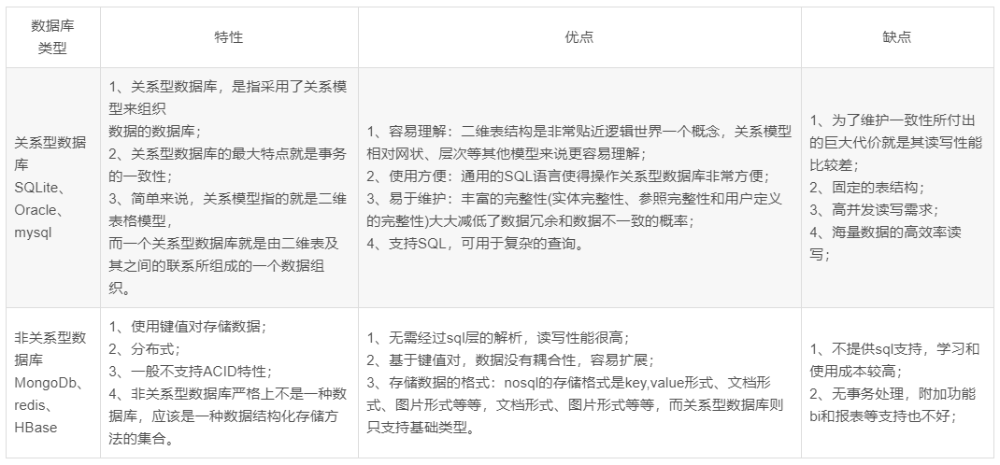

## C++

- 南京场，招银网络科技面经：https://www.nowcoder.com/discuss/125087
    - 一面:基础技术
        - 手写简单的一个线程: 
        ```cpp
        #include <iostream>
        #include<thread>
        using namespace std;
        int main(){
            std::thread demo([](){cout << "hello";});
            demo.join();
            cout << "主线程执行" << endl;
            return 0;
        }
        ```
        - 手写多个线程按顺序执行
        ```cpp
        #include <iostream>
        #include<thread>
        using namespace std;
        int a;
        mutex m;
        int main(){
            std::thread demo([](){cout << "hello";});
            demo.join();
            std::thread demo2([](){cout << "hello";});
            demo2.join();
            cout << "主线程执行" << endl;
            return 0;
        }
        ```
        ```cpp
        #include <iostream>
        #include<thread>
        #include <mutex>
        #include<condition_variable>
        using namespace std;
        mutex mutex_;
        condition_variable convar;
        void threa1(){
            cout << "threa1" << endl;
            convar.notify_one();
        }
        void threa2(){
            unique_lock<mutex> lc(mutex_);
            convar.wait(lc);
            cout << "thre2" <<endl;
        }

        int main(){
            std::thread demo2(threa2);
            std::thread demo1(threa1);
            demo1.join();
            demo2.join();
            cout << "主线程执行" << endl;
            return 0;
        }
        ```
        - 手写一定区间的随机数
        ```cpp
        #include <time.h>
        srand((unsigned)time(NULL));
        cout << rand()%10 <<endl;
        ```
        - 给个序列，告知快排一次之后的序列
        - 手写两个链表合并
        ```cpp
        void merge(ListNode* a, ListNode* b, ListNode* c){
            ListNode ** pre=&c;
            while(a && b){
                if(a->val>b->val) *pre=a, a=a->next, pre = &(a->next);
                else *pre=b, b=b->next, pre = &(b->next);
            }
            if(a) *pre=a;
            if(b) *pre=b;
        }
        ```
        - 手写n*n矩阵中2*2的小正方形最大值
    - 二面
    - 项目
    - 扫码登录整个流程
    - 序列中有一个数出现次数超过了三分之一次，如何快速找到
    - 参考: [算法之找出数组中出现次数大于n/m的元素](https://blog.csdn.net/xuqingict/article/details/40181155)


- 招银软开（C++）三面面经：https://www.nowcoder.com/discuss/115204

- 深信服面筋回馈牛油：https://www.nowcoder.com/discuss/119868
    - 字典树: [字典树详解](https://blog.csdn.net/qq_31964727/article/details/80862805)
    - 什么是字典树?
        - 首先字典树是一种数据结构,用于处理大量字符串. 优点在于利用字符串的公共前缀,在存储时节约存储空间,并在查询时最大限度的减少无谓的字符串比较.
    - 字典树有什么用?
        - 以最节约空间的方式存储大量字符串, 且存好后是有序的; 因为是有序的,故而字典树不仅可用于大量字符串的存储,还可用于大量字符串的排序.
        - 快速查询某字符串s在字典树中是否已存在,甚至出现过几次; 因为当字典树预处理好之后,查询字符串s在当前的出现情况的效率为strlen(s),异常高效,故而常用于搜索引擎等.
    - 字典树实现思路
        - 首先我们已经知道了字典树是一种数据结构,而一个数据结构的重点就在于:
            - 怎么有规则的把数据存储下来
            - 怎么有规则的去高效的得到自己需要的数据

    - 跳表: [跳表](https://blog.csdn.net/jinjiniao1/article/details/97246033)
        - 跳表(skip list) 对应的是平衡树(AVL Tree)，是一种 插入/删除/搜索 都是 O(log n) 的数据结构。
        - 它最大的优势是原理简单、容易实现、方便扩展、效率更高。因此在一些热门的项目里用来替代平衡树，如 redis, leveldb 等。
        - 因此跳表（skip list）表示，我们就不强制要求 1:2 了，一个节点要不要被索引，建几层的索引，都在节点插入时由抛硬币决定。
        - 当然，虽然索引的节点、索引的层数是随机的，为了保证搜索的效率，要大致保证每层的节点数目与上节的结构相当。

- 深信服霸面：https://www.nowcoder.com/discuss/116845
    - 手写memcopy
    ```cpp
    void *my_memcpy_byte(void *dst, const void *src, int n)
    {
        if (dst == NULL || src == NULL || n <= 0)
            return NULL;

        char * pdst = (char *)dst;
        char * psrc = (char *)src;

        if (pdst > psrc && pdst < psrc + n) // 如果出现内存覆盖,则尾使用尾拷贝
        {
            pdst = pdst + n - 1;
            psrc = psrc + n - 1;
            while (n--)
                *pdst-- = *psrc--;
        }
        else
        {
            while (n--)
                *pdst++ = *psrc++;
        }
        return dst;
    }
    ```
    - 进程间通信: 管道, socket, 系统IPC
    - 在TCP报文的画出三次握手的全过程。
    
    - 一道智力题：100层楼，有两个玻璃球，有唯一一层，从该楼层及以下楼层扔下玻璃球不会碎，从该楼层以上扔玻璃球会碎，请用用两个玻璃球找出该层（最小的时间复杂度）。
    - 手写
        - 删除s1中s2出现过的字符；
        - 双向链表创建删除等；
        - 给一个文件，合理匹配大括号小括号和中括号； // 使用栈来进行匹配
    - MYSQL：创建一个表吧，三行三列。
        - 创建表
        ```sql
        CREATE TABLE t_student(
            id INT NOT NULL PRIMARY KEY AUTO_INCREMENT, -- id
            student_name VARCHAR(20), -- 姓名
            age INT(30),  -- 年龄
            sex VARCHAR(10), -- 性别
            birthday DATE, -- 生日
            tel VARCHAR(20)-- 电话号码
        )ENGINE=InnoDB;
        ```
        - 插入行
        ```sql
            -- 单行
            INSERT INTO t_student VALUES(1,"张三",18,'男','2018-05-28','18125864478');
            INSERT INTO t_student(student_name,age,sex,birthday,tel) 
            VALUES("王五",11,'男','2007-05-28','18215864478');  
            -- 多行
            -- 只要每条INSERT语句中的列名和次序相同，也可以使用单条INSERT语句有多组值，每组值用一对圆括号括起来，用逗号分隔：
            INSERT INTO t_student(student_name,age,sex,birthday,tel) 
            VALUES("钱七",11,'男','2007-05-28','18215864478'), ("李八",12,'男','2006-05-28','18215864478');
        ```
        ```sql
        CREATE TABLE stu(
            id INT NOT NULL PRIMARY KEY AUTO_INCREMENT, 
            name VARCHAR(10),
        )ENGIN=InnoDB;
        INSERT INTO stu VALUES(1, "33");
        INSERT INTO stu (id, name)
        VALUES(1, "TT"), VALUES(2, "TT");
        ```

    - ARP用来做什么？滑动窗口是?那个值代表什么意思？
    - linux网络编程熟悉吗？UNIX网络编程那本书你看过吗？
    - 那好我来考考你：服务器端，接收多个客户端发来的数据，如何接收？
    - 参考: [Linux----网络编程(TCP网络通信服务器客户端编程流程与其循环实现)](https://blog.csdn.net/qq_41026740/article/details/83099707)

- 深信服C++开发 一、二、HR面：https://www.nowcoder.com/discuss/116694
    1) 如何用数组实现链表的功能？
        - (数组中存放一个结构体，一个表示数据，另外一个表示其下一个节点在数组中的index，以便于快速插入删除)
    3) linux下有哪些信号?
        - 常见信号

        | 信号英文名 | 信号数字表述 | 信号中文说明                      |
        | ---------- | ------------ | --------------------------------- |
        | SIGHUP     | 1            | 挂断控制终端或进程                |
        | SIGINT     | 2            | 终止进程                          |
        | SIGQUIT    | 3            | 终止进程并阐述dump文件            |
        | SIGKILL    | 9            | 强制终止进程                      |
        | SIGALARM   | 15           | 系统调用alarm超时后产生，终止进程 |
        | SIGTERM    | 16           | 终止进程                          |
        | SIGCHLD    | 18           | 子进程死，默认忽略该信号          |
        | SIGCONT    | 19           | 恢复进程执行，默认忽略该信号      |
        | SIGSTOP    | 20           | 终止进程                          |
        - 信号的来源
            - 非法内存
            - 硬件故障
            - 键盘
        - 信号的处理方式:
            - 默认：如果是系统默认的话，那就会终止这个进程
            - 忽略：信号来了我们不处理，装作没看到   SIGKILL  SIGSTOP 不能忽略
            - 捕获并处理
        - 信号和中断的区别
            - [信号使用 信号和中断区别  linux  signal ](https://blog.csdn.net/qq_38619183/article/details/83097475)
            - [linux信号机制](https://blog.csdn.net/weixin_31916083/article/details/90242575)
    4) https中的pipeline?
        - 多个相同请求的时候一次返回(在一次tcp连接中完成多次请求)
        - [HTTP Pipeline](https://www.cnblogs.com/diantao/p/5336859.html)
    5) 函数指针的作用?
        - 指针, 类型由函数的返回值和参数列表决定
        - 可以通过函数指针实现函数调用, 
        - 可以用作形参进行传递
        - 通过函数指针可以把函数调用者和背调函数分开, 函数调用者不需要知道具体是哪个函数被调用, 它只需要知道背调函数具有某种特定的返回值和形参列表即可
    6) 如何实现一个非定长的结构体? 
        - 在标准C和C++中，长度为0的数组是被禁止使用的。
        - 不过在GNUC中，存在一个非常奇怪的用法，那就是长度为0的数组，比如Array[0];
        - 这个特性是不可移植的
        - 注意长度为0的数组, 并不是指针, 因为它不占用内存空间, 可以后期自己分配空间, 它应该是表示一个偏移量
        - 长度为0的数组(a[0])
        - [struct中长度为0的数组用途与原理](https://blog.csdn.net/tjcwt2011/article/details/80824505)
        
        ```cpp
        struct line {
        int length;
        char contents[0];
        };

        //...ommit code here

        {
            struct line *thisline
            = (struct line *) malloc (sizeof (struct line) +this_length);
            thisline->length = this_length;
        }
        ```
    7) strcpy实现方法及其缺点，strncpy？
    8) 野指针？
    9) linux io和标准io区别？
        - 主要区别：
            - 系统IO：不带缓冲机制，系统IO可以操作普通文件与驱动文件
            - 标准IO：带缓冲机制，标准IO只可以操作普通文件。提供多种的格式的输入输出如（字符串、整形）
            - 参考: [Linux中的系统IO与标准IO](https://blog.csdn.net/laifengyuan1/article/details/86620421)
    10) http网址访问过程，get post区别？
    - 二面:
        - 谈谈io复用，select？
        - 谈谈项目***享内存实现方法？
        - linux 下编译调试方法，如何调试内存泄露问题？
            - 首先命令行工具: ps -aux (VSZ值)
            - 静态代码分析工具: BEAM
            - 动态分析工具: valgrind
            - [Linux平台中调试C/C++内存泄漏方法](https://www.jianshu.com/p/c78c7c2535f1)
        - 给几百万个网址，如何高效找出特定网址是否在其中?
            - (布隆过滤器)布隆过滤器优缺点，如何解决其缺点？
            - [详解布隆过滤器的原理、使用场景和注意事项](https://www.jianshu.com/p/2104d11ee0a2)
            - 什么是布隆过滤器
                - 本质上布隆过滤器是一种数据结构，比较巧妙的概率型数据结构（probabilistic data structure），特点是`高效地插入和查询(不能删除)`，可以用来告诉你 “某样东西一定不存在或者可能存在”。
                - 相比于传统的 List、Set、Map 等数据结构，它更高效、占用空间更少，但是缺点是其返回的结果是概率性的，而不是确切的。
            - 实现原理
                - bit 数组(如果想实现删除,就不能使用bit了)
                - 多个哈希函数族
        - 给一容量较大非法单词词典，如何判断某输入中是否有非法单词?
            - 建立字典树--实现一次遍历就可做出判断

- 深信服面经(中秋居然还面试，牛逼。。。)：https://www.nowcoder.com/discuss/116689
    - 画堆排序过程，复杂度分析。
        - 首先构建大顶堆
        - 然后将堆堆顶元素与末尾元素进行交换，使末尾元素最大。
        - 然后继续调整堆
        - [图解排序算法(三)之堆排序](https://www.cnblogs.com/chengxiao/p/6129630.html)
    - 画平衡二叉树建立过程。
        - 
    - 画红黑树构造过程。(这个不会了。。。)
    - 虚析构作用。
        - 防止内存泄漏
    - 什么叫重载，继承，隐藏。
        - 参数重载
        - 继承/重写/覆盖
        - 隐藏
    - 什么函数不能声明为virtual。
        - 静态函数
        - inline函数
        - 构造函数
    - extern C的作用。
    - 讲一下快排。
        - 采用分治策略，一次排序后，将数据划分为两半，一半比某一个数小，另一半比某个数大。
        - 然后利用递归，完成对数组的排序。
    - 算法题，O(n)内旋转字符串。
    - 算法题，文件中有大量数字，排序并保存到结果文件中。
    - memcpy的实现。
    - TCP快重传。

- 深信服C++面经 攒人品：https://www.nowcoder.com/discuss/116634
    - 一面（30分钟）
        - sizeof 各种基本类型 结构体 类
        - 继承和多态
        - 栈在实际编程的时候有哪些应用场景(深度搜索)
        - 广搜用什么数据结构(queue, 队列)
        - 浮点数判断是否相等
        - 手写代码 
            - 字符串反转 有时间和空间复杂度限制
                - reverse()
            - 字符串循环移位
                - 面试官让优化复杂度 没想出来(要用到上一题的字符串反转)
            - 统计一篇英文文章出现频率最高的十个单词
                - TOP K问题(建堆 make_heap, pop_heap) 
                - [347. 前 K 个高频元素](https://leetcode-cn.com/problems/top-k-frequent-elements/)
        - new和malloc
    - 二面（40分钟）
        - 1.聊了将近20分钟项目
        - 2.实习经历问了10分钟左右
        - 3.给了一张题表 面试官直接点题目号让我回答上面的问题 点了四个问题 都是比较简单的问题 概率 斐波那契数
        - 4.问笔试编程题的一三题，木板那道说了自己的思路有把另外一个老哥用栈解法的思路说一遍，第三题比较简单
        - 5.实现strcpy，要考虑内存重叠和特殊情况处理

- 2018深信服C++面经：https://www.nowcoder.com/discuss/116569
    - Q：象棋中马从一个位置跳到另一个位置的最少步数
    - A：手写BFS
    
    - Q：一次可以上一层台阶，也可以上两层台阶，到第N层有多少种走法
    - A：F[N]=F[N-1]+F[N-2] (动态规划问题)
    
    - Q：一分钟内经过公交车的概率为p，求三分钟内有公交车经过的概率
    - A：P=1-(1-p)^3
    
    - Q：strcpy和memcpy的区别
    - A：复制的内容不同，strcpy无需指定长度，遇到'\0'为止

    - Q：那strncpy呢？
    - A：我没用过

    - Q：你怎么判断两个struct相等？
    - A:我会选择重载==运算符，逐一比较成员变量是否相等

    - Q：那能不能用内存比较memcmp来判断呢？
    - A：不能，涉及字节对齐，可能有内存间隙，这里的值是随机的

    - Q：进程间的通信有哪些方式？
    - A：管道、有名管道、（信号、信号量、）共享内存、消息队列、socket

    - Q：epoll和select/poll的区别
    - A：
        - epoll是实现I/O多路复用的一种方法,有水平触发（level trigger，LT，默认)和边缘触发（edge trigger，ET）两种工作模式，区别在于两种模式的返回就绪状态的时间不同。水平触发和select/poll的方式一样
    - 水平触发
        - 读：缓冲内容不为空返回读就绪
        - 写：缓冲区还不满返回写就绪
    - 边缘触发
        - 读：
            - 缓冲区由不可读变为可读
            - 新数据到达，缓冲区中待读数据变多时
        - 写：
            - 当缓冲区由不可写变为可写
            - 当有旧数据被发送走，即缓冲区中的内容变少的时候
        - epoll之所以高效，是因为epoll将用户关心的文件描述符放到内核里的一个事件表中，而不是像select/poll每次调用都需要重复传入文件描述符集或事件集。比如当一个事件发生（比如说读事件），epoll无须遍历整个被侦听的描述符集，只要遍历那些被内核IO事件异步唤醒而加入就绪队列的描述符集合就行了。

    - Q：在TCP连接中，服务端的socket要做哪些？
    - A：socket->bind->listen->accept->send/recv

    - Q：堆和栈的区别？
    - A：堆是一颗二叉树、栈是一个单向进出的线性结构

    - Q：堆排序和快排的区别？
    - A：快排的思想是分治，每次选择当前范围的第一个数作为标杆，然后再将这个范围的所有比它小的数放到他左边，大的放到他右边，由这个标杆的现在位置划分出两个范围，分别对这两个范围的数再重复这样的*作，直到范围大小为1
    堆排序则是在建堆的时候保证堆顶最小，然后每次取堆顶

    - 下面应该是面试官自己出的一些题目
    - Q:XML是什么结构？
    - A:树

    - Q：用过正则表达式吗？写一个32位IP地址的正则
        - 200-255: 2(5[0-4] | [0-4]\d)
        - 0-100: [0-1]?\d{1,2}
    
    - Q：进程和线程的区别？
    - A：这个没背，只回答上了几句话


- 百度三面面经：https://www.nowcoder.com/discuss/136247
    - 一面
        - new/delete和malloc/free的区别
        - vector的结构？vector拷贝时发生什么
        - 一个数组，只有一个数字出现奇数次，其余数字出现偶数次，如何得到这个数字？如果出现奇数次的数字有2个呢？
            - 对于一个数直接异或
            - 对于两个数首先全部异或, 然后得到的结果为两个值得异或结果, 
            - 然后找到异或结果二进制表示为1的那一位, 意味着在这两个数在这一位上是不同的, 所以我们把数组按照这一位拆分为两个数组进行异或
            - [一组数中，只有两个数只出现了奇数次，其他所有数都是成对出现的，请找出那两个数...](https://blog.csdn.net/weixin_34341117/article/details/92789765)
        - 给定一个ip地址，编码使得ip和32位整数呈双射关系
            - a.b.c.d
            - int t =0;
            - t |= (int)a || (int)b<<8|| (int)c<<16 ||(int)d<< 24
        - 50个红球50个蓝球，放到2个袋子里，从两个袋子各取1个球，让2个都是红球的概率最大，怎么放
            - 两个箱子概率是1/2，选中某个箱子后又有选择的是不是红球的概率，
            - 所以最大概率就是一个红球放在一个箱子里，其余的99个球全放到另一个箱子。
            - 这样抓到红球的概率=0.5+0.5*（49/99）约等于0.75，这样为最大概率。
            - 这样两个都是红球的概率=1*(49/99)=大概约等于0.5
        - 进程和线程的区别
        - 时间复杂度为O(nlogn)的排序算法有哪些？简述快速排序的过程
            - 归并排序,时间复杂度O(nlogn), 空间复杂度o(n)
                - 分治的思想, 按空间位置划分
                - 将数组按照选定值得前一半和后一半划分
                - 然后在前一半中继续迭代, 后一半中继续迭代
                - 然后将两段合并为有序的段(合并过程需要额外的空间)
            - 快速排序,时间复杂度O(nlogn), 空间复杂度o(1)
                - 分治的思想, 按值划分
                - 将大于选定值得分为一段, 将小于等于该值得分为后一段, 
                - 然后在前一段/后一段中继续划分
            - [排序—时间复杂度为O(nlogn)的两种排序算法](https://www.cnblogs.com/zpchya/p/10775866.html)
        - C++内存分布
        - 重载和重写的区别
            - 静态多态
            - 动态多态
        - Linux下删除同一文件夹下所有满足条件的文件
            - `rm -rf $(find ./ -name 'test*')`
        - 介绍项目
    - 二面
        - 1个32位无符号整数，计算二进制格式下有多少个1，不通过循环怎么做
        - `bitset<32>m(a); m.count`
        - cmake和makefile的区别
            - make工具就根据makefile中的命令进行编译和链接的, 但是规则编写比较麻烦,尤其是项目较大的时候
            - cmake是一个输出makefile的工具, 它的配置文件时cmakelist, 规则还比较简单, 一般都是用它来配置项目的编译
        - 简述cmake到可执行文件的过程
            - cmake根据cmakelist, 生成makefile
            - make根据makefile生成exe和库文件
        - 进程和线程的区别
        - git pull和git fetch的区别
            - git fetch是将远程主机的最新内容拉到本地，用户在检查了以后决定是否合并到工作本机分支中。
            - git pull 则是将远程主机的最新内容拉下来后直接合并，即：git pull = git fetch + git merge，这样可能会产生冲突，需要手动解决。
        - 用数据结构模拟浏览器前进后退的操作
            - 栈结构, 后进先出
    - 三面
    - 2g物理内存，new一个3g的数组时发生什么？
        - 内存溢出
    - 平衡二叉树的特性，红黑树的特性，判断是否为平衡二叉树
        - 平衡二叉树
            - 每个节点最多2个子节点
            - 左子树的键值小于根的键值，右子树的键值大于根的键值。
            - 任何节点的两个子树的高度最大差为1
        - 红黑树
            - 除了平衡二叉树外
            - 每个节点非红即黑
            - 根结点为黑, 叶子结点为黑
            - 每个红节点的子节点一定位黑
            - 任意一个节点到它的叶子节点的所有路径拥有相同的黑色节点
    - 虚函数和纯虚函数
        - 
    - 智能指针如何实现
        - 
    - 学过操作系统吗？学过网络吗？没有
    - 进程和线程的区别，多线程和多进程的优缺点
    - 介绍项目亮点
    - A-H中选3个字母，可以重复，求组合数: `8*8*8`

- 百度凉径：https://www.nowcoder.com/discuss/126809
    - 先问项目，把其中一个项目用编程把重要地方实现出来，然后把里面的进程和线程关系理清楚，最好通过图形进行说明一下
    - 进程之间怎么信息共享，相互通信，本人太渣，只回答出两个
    - 问有没有用过shrink_to_fit，说一下作用，为什么用
        - 收缩容器的实际内存空间收缩为现在的真是内存空间, 也就是让capacity()和size()返回值相等
    - 线程与线程之间怎么通信，用的什么机制
        - 临界区
        - 互斥锁
        - 信号量
        - 信号
    - 虚函数的两种情形下怎么用，为什么用虚函数
    - 手撕代码
        - 第一个字符串比较，利用三种方法写的，面试官比较喜欢第三种，说挺好
        - 第二个是链表，用了4种方法，第四种是在面试官的提醒下完成的。
        - 第三个回溯法，本人对回溯法没有了解太深，写的代码太麻烦，想不出第二种


- 度小满金融面经：https://www.nowcoder.com/discuss/115577
    - 一面：
        - 1.进程与区别
        - 2.3次握手与各个状态
        - 3.DNS解析过程
            - 本地到本域名dns, 使用递归查询
            - 如果本域名dns不能找到, 则它作为客户端使用迭代查询
        - 4.ARP解析过程
            - 首先查找自身ARP缓存表
            - 如果没有, 则向直连设备发送一个广播报文, 寻找目标ip
            - 接受者收到之后会进行检查, 如果发现自己是目标, 则以单播的形式将自身mac地址给广播发送者
        - 5.事务特性
            - ACID; 原子性, 一致性, 独立性, 持久性
        - 6.算法：
            - 一个字符串中{}  [ ]  ()匹配问题，好像是leecode上面的~
            - stack计算
    - 二面：
        - 1.TCP ,UDP
            - TCP面向连接, 通信前需要建立连接, 为一对一通信
            - UDP无连接, 可以一对多通信
            - TCP有流量控制, 拥塞控制, 序号, 确认和重传机制, 其为可靠传输, 无差错, 无丢失, 按序到达
            - UDP为尽最大努力传输, 不保证可靠新
            - TCP报文长度为动态报文长度, 可以合并和拆分, 头部为20字节
            - UDP报文无拆分, 不合并, 首部8字节
        - 2.Linux命令，延伸：netstat，top，free -m 都显示了什么有什么含义？
            - top 监控linux系统状况, cpu,内存等
            - netstat 查看内核访问网络相关信息的进程, 还提供TCP链接, tcp,udp监听等功能
            - free -m 查看内存, m表示按m为单位显示
        - 3.进程间通讯，你用过什么？
        - 4.文件系统，文件名和文件权限是存在一块的吗？
            - 不是,,,
            - （innode不存文件名，存权限，访问日期，指向数据的指针等等）
        - 5.一个文件的md5码会因为该文件名而更改吗？
            - md5加密只跟数据区相关,按照LINUX的储存形式上说就是, 文件名和inode的改动不会引起md5发生变化
        - 6.从网上下载的各种 .ios软件包会改变md5码吗？
            - 只要数据没变,就不会
        - 7.a,b两个文件，a文件存url，有1亿行。b文件存域名，有 1万行。  要求：找出a中不在b文件中的？时间复杂度是多少？  没有内存限制。
            - 可以尝试使用布隆过滤器, 但是可能会存在找不全的问题, 因为布隆过滤器是基于概率的, 复杂度为O(k), k为哈希函数的个数
            - hash + 字典树, 
            - 回答：1.先提取a文件的url中的域名（这个不会，是用awk吗？）2.hash+字典树
    - 三面：
        - 1. DNS解析过程
        - 2.输入url的过程，知道的协议都说说，IP路由选路，ARP等等
        - 3.有查看过三次握手中socket状态吗？就是书本上的那些状态有看过吗？


- 百度三面面经，攒人品！！！：https://www.nowcoder.com/discuss/114896
    - 一面：
        - 编写shell脚本  查看一个文件，大小大于10M就删除，否则打印内容
            - rm -rf `ls -al | awk {'if($5>10*1024){print $NF}'}`
        - core dump，出现段错误的原因
            - 访问非法地址空间(不存在地址, 受保护地址)
            - 试图修改只读数据
        - 哈希表 如何实现 冲突解决
            - 一个是线性表(vector)
            - 一个是桶(单链表)
            - 开链法(其他解决方案: 开放寻址法)
        - hash table用什么实现，最差插入时间复杂度o(1)
            - 用开链法实现的
        - 函数值传递一个百万个元素的vector会怎么样？为什么?
            - 值传递?
            - 会存在大量的拷贝构造, 极大的浪费内存, 而且应该会栈溢出
        
        - c 内存分布?
        - 一个二维地图，每个格子有不同分数，求机器人从左下到右上的最大分数的路径。
            - 动态规划
    - 二面
        - 求一个数组逆序对
            - 并归排序, 交换的就是它!
        - 三次握手四次挥手的状态字，为什么3次，为什么4次
        - 求最大连续子数组
            - 状态转换: 当前状态 = max(前面状态+当前值, 当前值);
        - 一次完整的http链接过程，应用层到数据链路层，越详细越好
        - http https区别
        - 设计模式的了解，
            - 单例模式, 懒汉模式, 饿汉模式
        - 数据库。。不太会，谢谢  介绍了b树，b 树，和一些数据库设计优化方法， 具体怎么做。。不
            - B树: 
                - 每个节点中的关键字都按照从小到大的顺序排列，每个关键字的左子树中的所有关键字都小于它，而右子树中的所有关键字都大于它。
                - 所有叶子节点都位于同一层，或者说根节点到每个叶子节点的长度都相同。
                - 每个节点都存有索引和数据，也就是对应的key和value
                - (m阶)根节点的关键字数量范围：1 <= k <= m-1，非根节点的关键字数量范围：m/2 <= k <= m-1
            - B+树: [b+树图文详解](https://blog.csdn.net/qq_26222859/article/details/80631121)
                - 有k个子树的中间节点包含有k个元素(B树中是k-1个元素)，每个元素不保存数据，只用来索引，所有数据都保存在叶子节点。
                - 所有的中间节点元素都同时存在于子节点，在子节点元素中是最大(或最小)元素。
                - 所有的叶子结点中包含了全部元素的信息，及指向含这些元素记录的指针，且叶子结点本身依关键字的大小自小而大顺序链接。
            - 平衡二叉树:
                - 查询二叉树
                - 平衡(每个节点的子树高度差不超过1)
                - 插入删除都是log(N),但是旋转会牺牲掉log(N)的性能,但是相对于搜索二叉树而言已经好很多了
            - 红黑树:
                - 平衡二叉树
                - 红黑
                - 跟为黑, 叶子为黑
                - 红有黑子
                - 每个节点到子节点的路径拥有相同搞得黑色节点
                - 插入删除都是log(N), 而且每次旋转都是1-3次, 不会很多, 是非常稳定个快速的
        - 死锁，死锁预防，死锁避免，死锁检测
            - 死锁检查: 
                - 方法一: 维护进程等待表和资源分配表
                - 方法二: 进程回退法, 为每个进程记录一下中间节点, 当进程发生死锁让这些死锁的进程都回退一下重新执行, 原理为, 死锁是偶发的, 重新跑一下可能不会死锁了
        - 进程同步
            - 信号量
            - 信号
            - 管程
        - 还有一个算法题，忘了
    - 三面
        - 算法 最小生成树
        - cpu调度
            - 非抢占式的先来先服务算法（FCFS）
            - 非抢占式的最短作业优先（SJF）
            - 最短剩余时间优先（SRTN）
            - 最高相应比优先算法（HRRN）
        - 成员函数的前后const
        - 算法 最短路径
        - 会多线程吗？  不会谢谢，介绍了多线程的同步方式，和多进程的区别，进程，线程区别
        - 算法 快排topk
            - 分治思想, 按照值分为两半, 然后把两半再来划分
        - 虚拟内存和物理内存的区别

- 百度C++面试 一/二面 面经：https://www.nowcoder.com/discuss/113601
    - 一面：
        - 2、进程线程区别？
        -    谈谈项目中的多线程和线程池？
        - 3、linux下如何快速将文件每行倒序输出？shell或者编程都行，说了下python和c++实现方法，结果人考的是tac命令
            - cat 顺序输出, tac逆序输出, cat -n 显示行号
            - head 从头开始, tail
            - 最狠的是! 用awk逆序输出
            ```cpp
            {
                line[NR] = $0}
                END {
                    i = NR
                    while(i > 0) {
                        print line[i]
                        i = i - 1
                    }
            }
            ```
            - [tac命令以及各种linux文件查看命令](https://blog.csdn.net/bytxl/article/details/48135311)
        - 4、手撕代码-输出字符串中最长的回文子串长度？写完了不会优化
            - 用状态法, 先找到可能会有回文的地方, 然后进行扩张
        - 5、TCP-UDP区别？
                - 面向连接, 一对一, 一对多
                - 可靠性(无差错, 无重复, 按序到达), 流量控制, 拥塞控制, 序号, 确和重传
                - 动态报文长度, 合并和拆分报文, | 保留边界
                - T头20, U头8
        -   描述四次挥手过程，以及timewait、closewait？
            - closing
            - 客户端发送 SYN | SYN_send
            - 服务器收到 syn, 回复ack+syn | syn_recv
            - 客户端收到ack+syn, 回复 ack | establish
            - 服务器收到 ack | establish
            - 客户端发送 fin | fin_wait_1
            - 服务器收到 fin, 回复ack | close_wait
            - 客户端收到 ack | fin_wait_2
            - 服务器发送 fin | last_ack
            - 客户端收到 fin, 回复 ack | time_wait
            - 服务器收到 ack | close
            - 还有一个客户端可服务器同时发送fin, 则进入closing
        -   timewait过程如果出现过多, 拥塞或者网络不稳定导致很多非正常数据该如何解决？
            - 设置内核配置文件完成: `/etc/sysctl.conf`
                - `net.ipv4.tcp_tw_reuse=1`
                - `net.ipv4.tcp_tw_recycle=1`
                - `net.ipv4.tcp_fin_timeout`
                - 参考: [解决TIME_WAIT过多造成的问题](https://www.cnblogs.com/dadonggg/p/8778318.html)
        -   linux下如何查看特定端口有多少tcp连接？
            -  netstate -ant | grep '80'| wc -l
            -  [Linux查看某个端口的连接数](https://www.cnblogs.com/EasonJim/p/8098532.html)
        - 6、手撕sql查询排序？
        -     如何通过索引优化该sql？
        -     谈谈Innodb中b+树？myisam和Innodb中b树有什么区别？
        - 7、了解数据结构？图如何表示？图广度遍历用什么结构？
            - 邻接矩阵(nxn), 关联矩阵(可能大于nxn)
            - 广度遍历一般用队列queue
        - 8、是否熟悉docker镜像制作？了解docker-compose？
            - 部署, 建立依赖, 尤其是数据库和应用
            - docker-compose up -d
    - 二面：
        - 2、谈谈你熟悉的项目，项目遇到了哪些难点？
        - 3、char (*p) [] 、char *p[]、char (*p)()的区别？
            - []的优先级高于*
            - 第一个数指针指向一个char数组
            - 第二个是素组, 存放的是char*
            - 第三个是函数指针, 返回值为char, 空参数列表
        - 4、熟悉设计模式？手写下单例模式？
        - 5、手撕代码int atoi(char *str)？
            - 注意开头的负号和空格
        - 6、谈谈web上访问网址的过程？
            - 说说DNS如何找到ip和port的？若本地和局域网查找不到，如何向上层查找(DNS服务迭代查询和递归查询的流程)？
            - 谈到socket通信，说说握手过程，为何三次握手？
            - 谈到get、post了，get和post的原理和区别？
            - 直到http和http2区别？
                - 1.HTTP2使用的是二进制传送，HTTP1.X是文本(字符串)传送。
                - 2.HTTP2支持多路复用
                - 3.HTTP2头部压缩
                - 4.HTTP2支持服务器推送
                - 参考: [HTTP2与HTTP1.1的区别](https://blog.csdn.net/zq_king/article/details/80319847)
            - 熟悉https，https中加密实在哪一过程进行了？
                - 首先三次握手之后有一个ssl握手,协商密钥, 以后非明文传输
                - 说说ssl加密原理？
                    - 客户端发送 hello
                    - 服务器恢复 hello,自己的证书
                    - 客户端验证证书, 并生成客户端会话密钥
                    - 客户端发送 自己的公钥,客户端会话密钥公钥; 使用服务器公钥加密
                    - 服务器使用自己的私钥解密, 然后生成服务器回话密钥
                    - 服务器发送 服务器回话密钥, 使用客户端公钥加密
                    - 参考: [HTTPS的加密过程](https://blog.csdn.net/qq_32998153/article/details/80022489)
        - 7、说说select、poll、epoll区别？
        - 8、熟悉句柄么？程序执行后句柄如何处理，如何修改可打开句柄数量？
            - 句柄始于系统资源, 用完之后一定要关闭, 不然也算是资源泄露
            - 临时修改: ulimit -n xxx
            - 永久修改: /etc/sercurity/limits.conf
                ```
                soft　　nofile　　65536
                hard　　nofile　　65536
                // 将最大句柄数改为 65536
                ```
        - 9、数组存中在一个大于n/2次的数，如何以最优方法查找它？
            - 用消除法, 用map保存点, 当map中的关键字大于两个时删除,最终剩下的即是
        - 10、用栈实现队列，用队列实现栈？
            - 栈变队: 双栈法(负负得正)
            - 队变栈: 双队法
        - 11、如何设计一个高并发的分布式服务器？
            - reactor模型
        - 12、64匹马、8赛道，知识多少轮比赛找出速度最快的4匹马？（在提示下优化到12次，最优解为10或者11次）

 


- 百度一面二面经历（体验极差）：https://www.nowcoder.com/discuss/112003
    - 1. 首先是3次握手（已经被问过n多次）。
    - 2. 然后是select，epoll，但是问的很隐晦，大致是在问我TCP接收到报文后内核和上层报文之间怎么交换，但是刚开始没太听懂他在说什么，所以我重复问了一下，但是他自己却把过程说了出来，可能是因为本人是本科生，他觉得我不知道相关知识的缘故吧。
    - 3. 问了一下流量控制，还是很隐晦，当时大概问的是“一个服务器有很多TCP连接，然后某一时刻他可能来不及处理接受到的数据，这时候该怎么办？”。坦白说刚开始听到我是比较懵B的，但是仔细想过之后发现这好像就是流量控制，所以很流利的回答了流量控制，顺道说了一下原理。
    - 4. 然后问了一点有关操作系统方面的知识，shell命令。
    - 5. 开始数据结构，首先是哈希解决冲突的办法。
    - 6. 用拉链法设计一个哈希类，要求把链换成STL中的map。（手写代码），写完之后他说不是线程安全的，让改一下。
    - 7. 开始问map那点破事。
    - 
    - 二面（体验极差，估计是挂了）：其实也够倒霉的，本来我投的是C++/Php，但是二面来面我那哥们是个搞云端产品的。
    - 1. 向一个文科生解释一下指针和引用的差别。。。。。。（我表示很无语，但是一时紧张有却时想不到什么好的解释）。
    - 2. 再解释一下对象和类。。。。。。（和上面一样，不知道从何入手）。
    - 3. 开始了算法，先问我二叉树学过吗，然后让我设计一个节点，再然后让我比较两棵树是否相同（手写代码）。现在我才明白，大概是在考我用递归怎么遍历树，我当时写的居然是以按层遍历的方式去遍历树，然后两棵树逐个节点作对比。
    - 4. 让我反转一个字符串。。。。。。（手写代码）。


- 百度一面凉面面经：https://www.nowcoder.com/discuss/111058
    - D：拿出一张白纸，多路归并排序知道吧，怎么做
    - 先内部排序,然后还用堆排序
    - D：top K知道吧，大根堆还是小根堆，是不是都可以
    - 默认是大根堆, 结果为顺序(虽然出堆是逆序的,但是出堆结果存在最后)
    - D：C、c++什么区别
    - ...
    - D：内核是吧，讲下文件系统实现吧
    - inode区和数据区
    - D：那你讲下进程、内存管理你比较熟悉的
    - 其实应该是进程中的内存管理,也就是c/c++体系的内存管理
    - D：讲下进程间通信
    - ...
    - D：读写锁知道吧，写个多个读者读，阻塞写者的实现。
    - D: SQL了解吧，能写语句吗
    ```sql
    CREATE_TABLE demo(
        id INT NO NULL PRIMARY KEY AUTO_INCREMENT, 
        name VARCHAR(10),
    )
    ```
    - D：讲下关系型数据库和K-V数据库的特点
        - 就是关系数据库和键值对数据库的特点
        - 关系数据库
            - 有点:
                - 关系数据库历史悠久, 技术成熟
                - 关系数据库是基于表的, 重复储存少, 数据更新方便
                - 强一致性
            - 缺点:
                - 处理大量数据的读写有一定障碍(解决方案为: 主从模式, 主数据库负责写, 从数据库负责度)
                - 表结构更改较难, 扩展性较差
                - 查询较慢(很难针对简单查询快速返回)
        - 键值对数据库
            - 优点
                - 成本低, 开源的多
                - 查询速度
                - 数据库储存形式
                - 扩展性
            - 缺点
                - 不支持sql生态
                - 不提供强一致性, 只能保证最终一致性
        - 区别
            - 关系型数据库局域ACID(原子性, 一致性, 独立性, 持久性)模型, 非关系型数据库支持CAP(一致性, 可用性, 分区容忍性)模型
            - 储存形式: 关系型数据库基于表, 修改不方便, 不便于扩展; 非关系数据库支持多种形式的储存, 例如键值对, 图 等,扩展性较强
            - 数据一致性: 非关系型数据库强调最终一致性, 关系型数据库强调强一致性

        - 
    - D：行吧，说下TCP三次握手
    - D：为什么三次不是两次
    - D：行吧，做几个算法,树的深度怎么求
    - D：宽度呢
    - D：用c肯定指针熟吧，写个链表倒转


- 百度一面：https://www.nowcoder.com/discuss/109958
    - 一面
        - 1. 1G内存，4G url，求重复的url
            - 布隆过滤器(可能会有漏, 看设计得好不好了, 适合超大规模), 或则hash+字典树
        - 2. 手写二分
        - 3. Linux命令，find，grep，ps，netstat...
            - find: 支持模糊操作
            - grep: 文件内查找, 支持正则表达式
            - awk: 
            - sed: 
            - cat
            - tac:
            - head:
            - tail:
            - ps: 进程状态
        - 4. Python的tuple
            - 元组, C++11中也有了
        - 5. C 与Cpp的区别
            - ...
        - 6. const/define
            - 首先是预编译阶段实现, 编译阶段生效
            - define可以实现更为丰富的逻辑
            - const定义的是变量, define只是宏替换, 会储存在代码区
            - 作用域不同, const全域, const 变量自身与
        - 7. C语言内存布局
    - 1.1 面：
        - 1. Linux kvm，GPU 直通，SRIOV
        - 2. CPU架构，NUAM，SMP
        - 3. Guest OS发个网络请求，到Host OS，再到硬件的过程
        - 4. CPU ***结构，是否共享
        - 5. TCP握手过程，为啥三次
        - 6. DDOS，怎么解决，如何让Server端收到ACK后在分配资源，不改变Client，不封装IP数据包
            - 小规模DDOS, 可以设置/etc/sysctl.conf中net.ipv4.tcp_syncookies
        - 7. 如果把访问次数过多的IP拉入黑名单，怎么实现，用什么数据结构，写个伪码
        - 8. hash冲突怎么解决
            - 开链发
            - 开放寻址法
        - 9. 多线程操作一个hash表呢？用什么锁？
            - 互斥锁
        - 10. 读写锁说一下，怎么使用
        - 11. C语言const，static
        - 12. C语言volatile，说个应用场景
        - 13. 手写判断大小端的代码
        - 14. C语言内存布局
        - 15. 分段分页机制
        - 16. 逻辑地址到物理地址过程


- 来自小白的百度一面面经：https://www.nowcoder.com/discuss/109318
    - 开始考察数据结构和算法，先让我说了一些排序算法，问我能不能手写快排
    - 1.死锁是怎么产生的
    - 2.有没有写过多线程？
    - 3.调度算法有哪些？
        - 先进先出(FIFO), 队列
        - 最近最不经常访问(LFU), 引用排序
        - 最近最少访问(LRU), 队列(每次访问新激或则把旧的移动到队尾)
    - 4.三次握手四次挥手画图解释一下
    - 5.UDP和TCP区别
        - ...
    - 6.HTTP和HTTPS介绍一下，区别是什么？
        - http
            - 超文本传输协议,用于服务器往浏览器传送传输超文本的传输协议
            - 基于tcp/ip
            - 简单快速, 灵活, 无连接, 无状态
    - 7.HTTPS的安全性是怎么实现的？
        - 加密!
        - 客户端发送hello给服务器
        - 服务器发送hell+证书
        - 客户端验证证书, 并生成客户端通信回话密钥
        - 客户端发送 自己的公钥+客户端回话密钥公钥,使用服务器公钥加密
        - 服务器用自己的私钥解密, 然后生成自己的服务器回话密钥
        - 服务器发送 服务器回话密钥公钥, 使用客户端私钥加密
        - 然后加密通信!
    - 8.HTTP有哪几种操作？
        - post, get, head
        - options, delete, put, connect, trace


- 秋招第一次面试->百度（c++后台岗位）https://www.nowcoder.com/discuss/90069
    - 一面
        - Q：TCP三次握手和断开的完整过程
        - Q：为什么要等2个MSL
        - Q：输入www.baidu.com在浏览器的完整过程，越详细越好
        - A：LRU那种？
        - Q：这个怎么实现同步和互斥，怎么样去加锁
        - Q：c++里面的同步和互斥怎么实现的
        - A：mutex，条件变量之类的说了一下，消费者生产者之类的举了个例子
        - Q：c++里面的常量怎么定义
            - 宏定义
            - const常量
            - enum 定义常量(注意对这玩意儿不能取地址)
            - constexpr 常量表达式, 也可以表达类似的效果, 表示在编译期间可以进行求值的表达式
        - A：const和constexpr（这个面试官可能没见过，然后解释了一下）
        - Q：我主要想说宏
        - Q：c++的智能指针说一下，区别
        - Q：c++怎么实现一个函数先于main函数运行
            - A：用static
            - 如果gcc编译器,还可以用__attribute((constructor)) void befor(){}
        - Q：c++的static的变量的初始化顺序怎么样的
        - 不不不, C++中引入了对象的概念,它的初始化时放在了第一次被调用时,所以所是可以使用变量来初始化c++中的static的
        - Q：如果一个类里面呢？
        - Q：两个文件，两个static变量a和b，怎么让某个变量先于另外一个初始化呢？
        - 两种方式, 
            - 一个是分别定义在两个头文件里面,并且是用定义赋值的方式,通过头文件引用顺序进行调整
            - 另一个是定义在头文件里面,通过控制两个变量的调用顺序来控制初始化顺序
        - A：使用定义的时候就赋予初始化,强行初始化.
        - Q：来一条设计题。百度搜索的智能提示怎么实现，输入两个字，出来一些热搜
        - 感觉应该是哈希+字典树
        - A：字典树+堆吧，然后balabala（第三次。。。感觉面试官不是很满意我的答案)


- 提前批面经C/C++后台开发岗位(持续更新) https://www.nowcoder.com/discuss/94734
    - 百度一面
        - C++拷贝构造函数为什么传引用
            - 值传递会调用拷贝构造函数创建副本, 而这里本来就是实现拷贝构造, 所以如果是值传递就会导致死循环.
            - 实际上编译器也不允许循序拷贝构造函数为值传递.
        - 如何返回值一个类的构造和拷贝构造
            - 应该是返回值优化吧
            - 如果没有开启返回值优化, 只需要返回对象, 就会自动调用拷贝构造函数
            - 如果返回值为内部构造并通过值传递的方式返回主调函数, 则编译器使用返回值优化, 避免拷贝构造函数和析构函数的调用, 具体实现方式为:
            - 函数返回值改为void, 形参列表为返回值类型的引用, 主调函数把即将赋值的参数的引用传入背调函数, 这样就可以只调用一次构造函数.
            - 参考: 
                - [转：C++中临时对象及返回值优化](https://www.cnblogs.com/xkfz007/articles/2506022.html)
                - [2.3 命名返回值优化](https://zhaostu4.github.io/2019/11/28/%E5%AD%A6%E4%B9%A0%E7%AC%94%E8%AE%B0-%E6%B7%B1%E5%BA%A6%E6%8E%A2%E7%B4%A2C++%E5%AF%B9%E8%B1%A1%E6%A8%A1%E5%9E%8B/#23-%E5%91%BD%E5%90%8D%E8%BF%94%E5%9B%9E%E5%80%BC%E4%BC%98%E5%8C%96)
        - 如果声明为私有的，那么是编译时错误还是运行时错误
            - 编译错误
        - vector越界访问下标
            - vector通过下标运算符进行访问, 不会进行越界检查, 如果越界会得到脏数据, 或则段错误
            - 通过at进行访问, 会进行越界检查, 如果越界会报`out_of_range` 异常
        - map越界访问下标
            - 创建这个下标对应的键值对, 值调用默认构造函数进行构造
        - 如何删除map中的奇数节点
            - 直接迭代删除即可, map的迭代器不会失效
        - 指针和引用的区别
            - ...
        - C++中内存泄漏问题
            - 概念: 在程序中申请了资源,但是在不使用时并没有释放, 导致这种资源不能再被利用,从而引起浪费, 甚至系统崩溃
            - 分类:
                - 堆内存泄漏: 申请了对了堆内存未释放, 或则通过基类指针析构子类对象, 但是基类析构函数没有设置为虚函数
                - 内核资源泄漏: 例如打开了文件描述符未管理, 甚至僵尸进程也算是一种内存泄漏
            - 解决方案:
                - 静态代码分析: beam(这个就像编译器一样, 他会对代码进行静态分析, 给出一个报告)
                - 动态分析: valgrind
        - new和malloc的区别
        - TCP断开连接过程，timewait解释
        - HTTP中状态码 302(详细问) 403 400
            - 200 正常
            - 300 可选重定向: 服务器根据请求可执行多种操作。服务器可根据请求者来选择一项操作，或提供操作列表供其选择。
            - 301 永久重定向: 请求的网页已被永久移动到新位置。服务器返回此响应时，会自动将请求者转到新位置。
                - 这是对搜索引擎最友好的一种方式, 搜索引擎会拉取新的地址
            - 302 临时从定向: 服务器目前正从不同位置的网页响应请求，但请求者应继续使用原有位置来进行以后的请求。会自动将请求者转到不同的位置。
                - 这里就有一个网址劫持相关的概念了, 
                - 网址`A`做一个`302`重定向到网址`B`时，主机服务器的隐含意思是网址`A`随时有可能改主意，重新显示本身的内容或转向其他的地方。大部分的搜索引擎在大部分情况下，当收到`302`重定向时，一般只要去抓取目标网址就可以了，也就是说网址`B`。
                - 搜索引擎在遇到302转向时，百分之百的都抓取目标网址B的话，就不用担心网址URL劫持了。
                - 问题就在于，有的时候搜索引擎，尤其是Google，并不能总是抓取目标网址。
                - 为什么呢？比如说，有的时候A网址很短，但是它做了一个302重定向到B网址，而B网址是一个很长的乱七八糟的URL网址，甚至还有可能包含一些问号之类的参数。
                - 很自然的，A网址更加用户友好，而B网址既难看，又不用户友好。这时Google很有可能会仍然显示网址A。
                - 这就造成了网址URL劫持的可能性
                - 一个家伙网址A做一个302重定向到你的网址B，出于某种原因， Google搜索结果所显示的仍然是网址A，但是所用的网页内容却是你的网址B上的内容，这种情况就叫做网址URL劫持。当用户点进去的时候, 调转的确实网址A !!!!!.
                - 参考: [HTTP返回码中301与302的区别](https://blog.csdn.net/qmhball/article/details/7838989)
            - 304 内容未修改, 使用缓存即可
            - 400 客户端错误
            - 403 客户端收到请求,但是拒绝提供服务

            ---
            - 1xx 继续 -- 例如, post的时候先发头, 就会回复这个
            - 2xx 正常 -- 正常, 206是分片
            - 3xx 重定向  -- 更换了地址
            - 4xx 客户端错误 -- 语法错误或则无效请求
            - 5xx 服务器错误 -- 服务器未能完成合法请求
        - 连续子数组最大和问题
            - 动态规划问题
    - 百度二面
        - C++多态，虚表指针在什么时候初始化
            - 无继承时：
                - 1、分配内存
                - 2、初始化列表之前赋值虚表指针
                - 3、列表初始化
                - 4、执行构造函数体
            - 有继承时：
                - 1、分配内存
                - 2、基类构造过程(按照无继承来)
                - 3、初始化子类虚表指针
                - 4、子类列表初始化
                - 5、执行子类构造函数体
            - 参考: [虚表指针初始化顺序](https://blog.csdn.net/jasonLee_lijiaqi/article/details/89073020)
        
        - STL库的容器底层实现
            - 哪个容器撒
        
        - 红黑树的插入效率，为什么相对平衡的红黑树比绝对平衡的AVL适用广
            查找、插入、删除操作的最坏时间复杂度

            | 方法 | 二叉查找树 | 平衡二叉树 | 红黑树  |
            | ---- | ---------- | ---------- | ------- |
            | 查找 | O(n)       | O(logn)    | Olog(n) |
            | 插入 | O(n)       | O(logn)    | Olog(n) |
            | 删除 | O(n)       | O(logn)    | Olog(n) |

            - 二叉查找树因可能退化成链表，故其性能最差。
            - 平衡二叉树和红黑树是带有平衡条件的二叉查找树，故它们的效率也较高。
            - 平衡二叉树的`插入/删除`操作带来的旋转操作可能会达到`logn`次，而红黑树的`插入/删除`操作带来的旋转操作最多为`2到3`次。
            - 所以说，当红黑树出现的时候，平衡二叉树就只能出现在博物馆里了。
            - 即红黑树是最优选择。
        
        - B树和B+树的区别，B+树应用在哪?
            - B树
                - 特性
                    - 每个节点保存数据和索引
                    - 所有的叶子节点处于同一层
                    - 拥有m个子树的根节点拥有1,m-1个内部节点, 中间节点拥有m/2,m-1个内部节点
                    - 内部顺序, 左小,右大
                - 缺点:
                    - 索引和数据一起,查找的时候一次读到的索引较少
                    - 遍历较为麻烦
            - B+数
                - 特性
                    - 内部排序, 左小等, 右大等
                    - k个子树的中间节点拥有k个内部节点, 左侧的子树是最大的, 右侧的是最小的
                    - 叶子节点同一层, 且按序链起来
                    - 数据只储存在叶子节点, 中间节点子储存索引
                - 正好解决了B数的两个问题
        - 哈希表的哈希冲突，解决哈希冲突的几种方法
            - 开链法
            - 开放寻址方式
        - 进程间通信方式，每个都讲一下
            - 管道
            - socket
            - 系统IPC(信号量, 信号, 共享内存, 消息队列)
        - 网编程讲一下。
            - TCP 
                - 服务器: bind, listen, accept, read(recv), write(send)
                - 客户端: connect, write(send), read(recv)
            - UDP recvfrom, sendto
        - select和epoll，epoll底层实现，数据的拷贝方式。
            - select 数组, 每次复制, 限制
            - epoll 红黑树, 不用每次复制, 中断,无限制
                - 水平模式
                - 边缘模式
        - 求一个数开根号（二分）
            - 二分法和牛顿法
        - 讲一下timewait状态，没有timewait有什么问题
        - 滑动窗口和拥塞窗口
        - 慢启动和快重传
        - 实现一个功能，能检测内存泄漏问题，通过一个指令输出整个进程中哪一行哪个函数申请了多少内存，按照顺序排列出来，还有总的内存数
            - (!!!!!!)
    - 百度三面(经理面)
        - 谈实习工作
        - Linux下的内存机制
        - 模板的分离编译
        - 空类的大小，含有成员函数类的大小
        - 链接过程(详细)
            - (!!!!) 链接过程详解 - 简书: https://www.jianshu.com/p/53ccc77abc6a
        - 写个string类
    - 阿里一面
        - 进程、线程、携程的区别
        - 进程创建子进程，fork详解
        - I/O模型介绍，细说slect和epoll。I/O多路转接阻塞?非阻塞？有什么问题?
        - 数据库底层数据结构？说下为什么采用B+树？
            - 遍历快, 查询索引和数据分离, 查询少IO操作
        - 数据库的ACID特性
        - 数据库索引相关
        - 知道那些非关系型数据库？
            - Nosql
            - redis
        - C++中struct和class区别
        - C语言struct和C++struct区别
        - 如何用C语言实现C++的继承
            - 利用函数指针访函数
            - 在子类中,把基类放在最前面
        - inline相关，虚函数可以声明为inline吗？
        - 说下虚表的原理
        - 多重继承的问题，详解，对比一些开源框架中使用的多重继承来说？
            - (!!!!)问题
                - 使用静态变换, 向下变换时会出错
        - 了解RAII？说一下什么是RAII?应用？
            - 资源获取即初始化
            - RTTI是运行时类型检查
        - 智能指针，share_ptr和weak_ptr,细说weak_ptr?可以用原生指针吗？
            - 内存泄漏
        - 了解那些分布式组件？说下Zookeeper和HDFS，说下CAP理论
            - 不了解, 但是知道CAP理论: 一致性, 可用性, 分区容错性
            - (!!!!) zookeeper, hdfs
        - 了解哪些一致性算法
            - (!!!!)Raft
            - Paxos
        - 深度优先遍历和广度优先遍历的应用场景
            - 深度优先找深度
            - 广度优先找宽度
        - 项目中使用网络编程？简单说下？说下cgi？服务器采用什么结构？使用的epoll模型？
            - (!!!!!)
        - 有序的数组，其他数都出现两次，一个数只出现一次？思路(数组无序异或，数组有序采用二分)
            - 有序? 那之间检查前后就可以了啊
            - 无序: 异或


-  百度 提前批C++一面 二面 三面（GG）https://www.nowcoder.com/discuss/96139

- 大佬们新鲜出炉的度秘面经，了解一下~~ https://www.nowcoder.com/discuss/96056

- 京东二面凉面筋：https://www.nowcoder.com/discuss/112228

-  京东提前批C++面试https://www.nowcoder.com/discuss/91590

- 有幸被菜鸟开奖，结束秋招，回馈牛油：https://www.nowcoder.com/discuss/110317

- 阿里、C++三面技术面+ hr面面筋~：https://www.nowcoder.com/discuss/100946

- 【C/C++】阿里-面经-研发工程师（C/C++）：https://www.nowcoder.com/discuss/101607

- 【Java】阿里国际事务部挂经，Java岗https://www.C++nowcoder.com/discuss/96464

- 【后端c++】DJI+阿里巴巴ICBU一面面经（后端C++）https://www.nowcoder.com/discuss/87621

- 阿里-面经-研发工程师（C/C++）：https://www.nowcoder.com/discuss/101607

- 阿里一面面经C++，攒个人品https://www.nowcoder.com/discuss/88501

- 新鲜热乎的百度一面面筋(C++)，攒人品https://www.nowcoder.com/discuss/88852

- 阿里飞猪一面凉经https://www.nowcoder.com/discuss/94080

- 【C++后台开发】 阿里巴巴新零售 一面凉凉（C++后台开发）https://www.nowcoder.com/discuss/90335

- 华为凉经：https://www.nowcoder.com/discuss/121852

- 华为优招-长沙-一二面面经（感觉用处不大）https://www.nowcoder.com/discuss/96528

-  华为优招面经8.20 https://www.nowcoder.com/discuss/96410

- 【c++开发】蚂蚁金服中间件一面和二面面筋（C++开发）https://www.nowcoder.com/discuss/87810

-  秋招提前批面试记录小结https://www.nowcoder.com/discuss/97474

- CVTE武汉面经：https://www.nowcoder.com/discuss/113462

- CVTE一面二面+HR面https://www.nowcoder.com/discuss/89764

- CVTE提前批c++开发一面https://www.nowcoder.com/discuss/89534

- CVTE的电话两面面经https://www.nowcoder.com/discuss/91635

- 美团二面凉经：https://www.nowcoder.com/discuss/108186

- 腾讯面经(一面，二面，hr面）：https://www.nowcoder.com/discuss/118386

- 【C++开发】腾讯面筋https://www.nowcoder.com/discuss/89707

- 腾讯内推面试https://www.nowcoder.com/discuss/93770

-  腾讯IEG凉经https://www.nowcoder.com/discuss/96731

- 一脸懵逼的腾讯面试https://www.nowcoder.com/discuss/96355

- 腾讯云补录一面面经：https://www.nowcoder.com/discuss/140442

- 小米云存储面经：https://www.nowcoder.com/discuss/111718

- 小米面经：https://www.nowcoder.com/discuss/108813

- 中兴武汉面经一面：https://www.nowcoder.com/discuss/112960

- vivo开发( c++)一面面经：https://www.nowcoder.com/discuss/118539

- 8.10 vivo C++软件开发工程师一面面经https://www.nowcoder.com/discuss/93137

- 金山WPS C++岗一面：https://www.nowcoder.com/discuss/118302

- 金山WPS，C++，二面面筋https://www.nowcoder.com/discuss/95219

- 金山C++研发工程师 一面https://www.nowcoder.com/discuss/96606

- 金山 凉经https://www.nowcoder.com/discuss/96286

- wps一面面经https://www.nowcoder.com/discuss/97704

- 金山wps一面https://www.nowcoder.com/discuss/97425

- 金山WPS，C++研发工程师，一面https://www.nowcoder.com/discuss/92322

- 【Java】银联应用开发面经（我是Java，他们也有C++） 西安站https://www.nowcoder.com/discuss/93155

- 8月底的拼多多学霸批面经：https://www.nowcoder.com/discuss/112238

- 拼多多面经：https://www.nowcoder.com/discuss/109638

- 迈瑞面经--C++工程师https://www.nowcoder.com/discuss/90442

- 中国电信it研发中心面筋：https://www.nowcoder.com/discuss/114075

- 今日海康面试体验：https://www.nowcoder.com/discuss/112148

- 海康威视面经：https://www.nowcoder.com/discuss/111844

- 滴滴面经～回忆版：https://www.nowcoder.com/discuss/136818


- 网易雷火平台开发工程师一面：https://www.nowcoder.com/discuss/120667
    - 一面
        - 1. 一个数组，找到top100: 堆
        - 2. 海量url去重 
            - 布隆过滤器, hash+字典树
        - 3. 链表中倒数第k个结点 
            - 反向迭代器, 或则双指针
        - 4. 二叉树的镜像 
            - 递归交换左右子树
        - 5. 老生常谈的HashMap、HashTable、ConcurrentHashMap
            - (!!!!!) ConcurrentHashMap
        - 1. TCP、UDP区别以及适用场景
            - TCP:完整性要求
            - UDP:实时性要求, 完整性不要求
        - 1. 实现多线程有哪些方法
            - 库函数:
                - linux 有pthread
                - stl 有thread
            - stl中:
                - thread
                - feature
                - async
                - packaged_task
                - promise
            - [C++11 多线程 async、future、packaged_task、promise](https://blog.csdn.net/u012507022/article/details/85957219)
        - C++ 并发入门 - GitChat: https://blog.csdn.net/valada/article/details/83784735
        - 1. MySQL、MongoDB区别以及适用场景（这个问题之前有先问我用过哪些数据库）
        - MySQL、MongoDB、Redis 数据库之间的区别 - CatStarXcode的博客: https://blog.csdn.net/CatStarXcode/article/details/79513425
        1.  MySQL有哪些存储引擎以及它们的区别和适用场景
    - (!!!!!)
    - IndoDB:
        - 支持事务, 支持行级锁定, 支持外键
        - 索引(数据和索引在一起)
        - 行数, 不支持FULLTEXT索引
        - 支持CAID特性
    - MyIsam
        - 非事务
        - 不支持外键, 不支持行级锁定个
        - 索引和数据分开
        - 独立于操作系统, 迁移方便


- 网易互娱面经：https://www.nowcoder.com/discuss/114820
1. C++虚函数，我开始向虚函数指针和虚表那块说，中间无意中说出了自己曾经看过虚函数表在elf文件中的位置，遂停止让我介绍虚表。
2. 开始问虚表在elf文件何处以及基本形式，答完之后开始问关于elf文件相关知识。
3. 怎么查看elf文件的头部信息。
4. 开始测汇编能力，问函数调用时会干什么（当时很懵B，随后提示一定会执行什么语句）。
5. 开始问gdb相关知识，大概问了几个调试命令。

6. 开始转战STL，问用过哪些，还有map那点破事。
7. 丢给我一组数让我建一棵红黑树，并询问是否记得红黑树创建规则，向其坦白自己记得不是太熟，他说没啥，就不浪费时间了遂放弃本题。
8. TCP/UDP那点破事，因为本人暑假实习做的是这个相关的，所以它让我用UDP实现可靠数据传输，我说了几点策略，但是不太满意，并反问道你暑假不是作的这个吗？遂向其解释，只是做了一个中间层，底层可靠数据保证是别人github上面的完整工程，并向其道歉，说让他失望了，但是回答的很爽快“没关系”。
9. linux那点破事，大概问了几个命令，最后一点是我没想到的，记录当前资源占用率的文件存放在哪（只是大三做***作系统实验的时候用过，隐约记得是proc，便随口答了）。
10. 问了一个趣味问题。
11. 开始问问题，地图中有一个圆圈，怎么样保证丢的补给可以均匀落到地图各处。
回答1.0，随机生成坐标点（x，y），首先判断是否在园内，在就投递。回应：可以但是需要判断较为麻烦，优化一下。
回答2.0，以圆心为原点，随即生成半径和角度（r ，sieta不知怎么打）。回应：不均匀，圆心处比较密。
回答3.0，以圆心为原点，随即生成半径平方和角度（r^2 ，sieta不知怎么打）。回应：可以，但是证明一下落点是随即的。
。。。想了n久没有想到证明方法，只得坦白刚刚只是直观感觉。
（面无表情，我们换一个问题）。
4. 怎么样均匀洗一副扑克牌。
回答1.0，使用随机数函数，每次生成一个数然后和剩余牌数取余，然后将该下标牌取出。
1. 排瓷砖，经典斐波那契数列问题。
   - 
2. 快速获得一个队列中的最大元素。
    - 堆


- 网易雷火一面（估计已经凉了）：https://www.nowcoder.com/discuss/113819
问：如何实现高平发后台？
答：1、CDN。2、负载均衡。3、数据在内存缓存（Redis、Mem***d等）。
问：http的Get方法和Post方法分别在场景使用？
答：小数据量和大数据量。用我做留言板时举例，为了标志不同的留言板，需要传get参数，这时需要实现“URL语义化”。如果是提交和删除留言，这时候用Post方法。
问：数据表中Primary key和Unique key区别？
答：不太清楚。只知道每条记录的Primary key是不能相同的，Unique key是不能相同的。Primary key数据库会自动给它做索引，所以查询时以Primary key为条件比普通属性快。（面试官告诉我Unique key也会做索引。）
问：数据表设计注意什么？
答：避免数据冗余。如果没有其他需求，尽量实现第三范式。有“多对多”的关系要分表。拿当时比特币测量时的数据库设计举例，另外讲到外键对性能的影响。
问：关系型数据库和NoSQL共同工作。
答：不太清楚，大概要在业务逻辑层面处理数据该往那个数据库存吧？
问：php里intval遇到内容不是数字的字符串，会返回什么值。
---

- 网易互娱-我为自己耽误了面试官的时间而愧疚：https://www.nowcoder.com/discuss/113550

- 很难受的网易互娱研发面经https://www.nowcoder.com/discuss/96710

- 网易初游研面经https://www.nowcoder.com/discuss/96793

- 网易互娱游戏研发面经（两面）：https://www.nowcoder.com/discuss/111976

- 网易互娱校招面经：https://www.nowcoder.com/discuss/111018

- 网易互娱1面 （）经【括号里的字不确定于是先空着】：https://www.nowcoder.com/discuss/106443

- 字节跳动后端一面被一个巨水的面试官给毙了：https://www.nowcoder.com/discuss/128236


---

- 今日头条三面面经：https://www.nowcoder.com/discuss/109167

- 头条1 2 3面经：https://www.nowcoder.com/discuss/99287

- 今日头条三面面经：https://www.nowcoder.com/discuss/102612

-  头条三面（攒一波人品）https://www.nowcoder.com/discuss/93423

- 今日头条c++后台开发 一二面，二面gg https://www.nowcoder.com/discuss/95939

- 平安科技一面又懵逼凉经：https://www.nowcoder.com/discuss/113464

- 2019校招盛大游戏cocos凉经：https://www.nowcoder.com/discuss/109360

- 趋势windows platform developer：https://www.nowcoder.com/discuss/111933

- 【后台C++】360后台C++ 2面凉：https://www.nowcoder.com/discuss/103844

- 360面筋！！：https://www.nowcoder.com/discuss/98392

- 360面经：https://www.nowcoder.com/discuss/97830

- 360一面二面，估计凉https://www.nowcoder.com/discuss/96670

- 刚刚出炉的360一面二面挂经https://www.nowcoder.com/discuss/96310

- 360一面凉经C++ https://www.nowcoder.com/discuss/97182

- 360面经https://www.nowcoder.com/discuss/97830

- 360面经https://www.nowcoder.com/discuss/97741

- 360奇葩挂经https://www.nowcoder.com/discuss/98188

- 贡献一波知乎面经。。：https://www.nowcoder.com/discuss/120463

- 快手提前批面经：https://www.nowcoder.com/discuss/112954

- 美图C++研发工程师（算法落地）面经~：https://www.nowcoder.com/discuss/103212

- 【C++研发岗】贝壳三面面经。：https://www.nowcoder.com/discuss/102429

- 米哈游引擎渲染挂面：https://www.nowcoder.com/discuss/120197

- 微软面经：https://www.nowcoder.com/discuss/136414

- 研发工程师面经（C++）：https://www.nowcoder.com/discuss/126102

- 秋招结束，春招再战！（附面经）：https://www.nowcoder.com/discuss/125248

- offer选择，随便附上秋招面筋头条百度贝壳电信IT研发华为：https://www.nowcoder.com/discuss/123320

- 某菜鸡的头条+百度菜鸡实习面试记录：https://www.nowcoder.com/discuss/118629

- 秋招的面经：百度+中兴+链家+烽火：https://www.nowcoder.com/discuss/123214

- 写个秋招总结C++开发岗：https://www.nowcoder.com/discuss/124174

- 秋招结束，整理一下。内含面筋 ：https://www.nowcoder.com/discuss/124030

- 一个失败者的秋招面经：https://www.nowcoder.com/discuss/123798

- 2018年秋招游戏公司面经+面试准备心得：https://www.nowcoder.com/discuss/123714

- 结束秋招，总结自己的秋招之旅，回馈牛客（面经大礼包）：https://www.nowcoder.com/discuss/123111

- 弱鸡的游戏秋招之路：https://www.nowcoder.com/discuss/123043

- 2018面经总结：https://www.nowcoder.com/discuss/122973

- 终于轮到我了——来自非科班渣硕的秋招之路：https://www.nowcoder.com/discuss/122105

- 非科班985水硕秋招经历：https://www.nowcoder.com/discuss/122056

- 总结一下到目前为止的秋招，发C++面经攒人品：https://www.nowcoder.com/discuss/121780

- 秋招结束，回馈牛友~（建议和面经）：https://www.nowcoder.com/discuss/121478

- 和女朋友都已完成秋招，发出面经回馈牛客：https://www.nowcoder.com/discuss/120275

- 总结一个菜鸡的秋招之路，望博牛油们一乐：https://www.nowcoder.com/discuss/120185

- C++开发渣硕妹纸BAT春招秋招面经：https://www.nowcoder.com/discuss/117644

- 不一样的面经（攒人品）：https://www.nowcoder.com/discuss/116175

- 回馈牛客，渣本的秋招总结（BAT）：https://www.nowcoder.com/discuss/114087

- 腾讯、网易互娱面经：https://www.nowcoder.com/discuss/111543

- 【C++后台研发工程师】C++后台研发工程师2018年BAT华为网易等面经总结：https://www.nowcoder.com/discuss/103939

- 美团，快手面经~：https://www.nowcoder.com/discuss/101667

- 贝壳现场面（C++）+京东技术管培生专业面：https://www.nowcoder.com/discuss/99274

- 【C++/后端】2019秋招C++/后端 今日头条等公司面经 ：https://www.nowcoder.com/discuss/137145

- 2018年秋招面试经验总结 ：https://www.nowcoder.com/discuss/140814

- 秋招总结-奋斗没有结束，这只是一个开始：https://www.nowcoder.com/discuss/138258

- 前来还愿啦，一波面经给需要的人：https://www.nowcoder.com/discuss/137775

- 全凉经：https://www.nowcoder.com/discuss/142903

- 一个非科班普通211硕士如何拿到腾讯、百度等offer：https://www.nowcoder.com/discuss/142151

- 致下一级毕业生：如何将自身强化到斩获国内大厂Offer的水平：https://www.nowcoder.com/discuss/141516

- 非计算机专业苦逼的秋招路：https://www.nowcoder.com/discuss/128187

- 秋招结束，总结一下，说下个人经验：https://www.nowcoder.com/discuss/127797

- 秋招over，回馈牛客网的帮助 ：https://www.nowcoder.com/discuss/122760

- 秋招总结与技巧，回馈与感谢：https://www.nowcoder.com/discuss/122640

- (C++向)从零开始，游戏程序员学习之路(还愿贴)：https://www.nowcoder.com/discuss/121834

- 2018年9月秋招个人总结 ：https://www.nowcoder.com/discuss/121665

- 秋招结束，回馈牛客一波！：https://www.nowcoder.com/discuss/118716

- C++面试题目总结：https://www.nowcoder.com/discuss/124724

- 秋招总结（C++）：https://www.nowcoder.com/discuss/124525