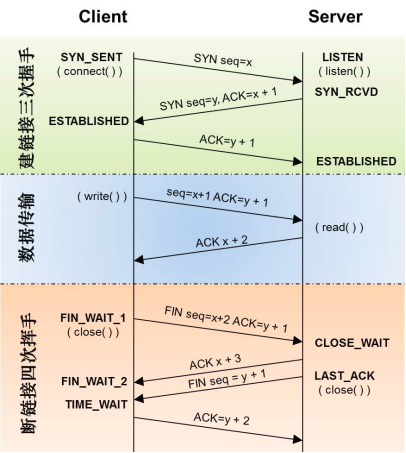

>> T:2019/11/28  W:四 17:0:11

[HTML]: @[TOC](面经汇总 计算机网络)

## 1. 网络通信之缓冲区死锁问题
- 参考: [socket缓冲区死锁问题](http://blog.chinaunix.net/uid-23146151-id-3087644.html)
- 一般情况大于 TCP的最大传输字节为 1448字节

## 2. `TCP`和`UDP`的区别和各自适用的场景
- `TCP`和`UDP`区别
	- 服务对象
		- `TCP`是点对点的两点间服务，即一条`TCP`连接只能有两个端点；
		- `UDP`支持一对一，一对多，多对一，多对多的交互通信。
	- 连接
		- `TCP`是面向连接的传输层协议，即传输数据之前必须先建立好连接。
		- `UDP`无连接。
	- 可靠性
		- `TCP`是可靠交付：无差错，不丢失，不重复，按序到达。
		- `UDP`是尽最大努力交付，不保证可靠交付。
	- 拥塞控制，流量控制
		- `TCP`有拥塞控制和流量控制保证数据传输的安全性。
		- `UDP`没有拥塞控制，网络拥塞不会影响源主机的发送效率。
	- 报文长度
		- `TCP`是动态报文长度，即`TCP`报文长度是根据接收方的窗口大小和当前网络拥塞情况决定的。
		- `UDP`面向报文，不合并，不拆分，保留上面传下来报文的边界。
	- 首部开销
		- `TCP`首部开销大，首部`20`个字节。
		- `UDP`首部开销小，`8`字节。(源端口，目的端口，数据长度，校验和)
	- `TCP`和`UDP`适用场景
		- 从特点上我们已经知道，`TCP `是可靠的但传输速度慢，`UDP `是不可靠的但传输速度快。因此在选用具体协议通信时，应该根据通信数据的要求而决定。
		- 若**通信数据完整性**需让位与**通信实时性**，则应该选用`TCP `协议(如文件传输、重要状态的更新等)；反之，则使用` UDP `协议(如视频传输、实时通信等)。

## 3. `TCP`怎么保证可靠性
- `TCP`保证可靠性：
	- `序列号`、`确认应答`、`超时重传`
		- 数据到达接收方，接收方需要发出一个`确认应答`，表示已经收到该数据段，并且`确认序号`会说明了它**下一次需要接收的数据序列号**。
		- 如果发送发迟迟未收到确认应答，那么可能是发送的数据丢失，也可能是确认应答丢失，这时发送方在等待一定时间后会进行重传。
		- 这个时间一般是`2*RTT(报文段往返时间) + 一个偏差值`。
	- **窗口控制**与**高速重发控制`/`快速重传(重复确认应答)**
		- `TCP`会利用窗口控制来提高传输速度，意思是在一个窗口大小内，不用一定要等到应答才能发送下一段数据，**窗口大小就是无需等待确认而可以继续发送数据的最大值**。
		- 如果不使用窗口控制，每一个没收到确认应答的数据都要重发。使用窗口控制，如果数据段`1001-2000`丢失，后面数据每次传输，确认应答都会不停地发送序号为`1001`的应答，表示我要接收`1001`开始的数据，**发送端如果收到`3`次相同应答，就会立刻进行重发**；
		- 但还有种情况有可能是数据都收到了，但是有的应答丢失了，这种情况不会进行重发，因为发送端知道，如果是数据段丢失，接收端不会放过它的，会疯狂向它提醒 **...**
	- **拥塞控制**
		- 如果把窗口定的很大，发送端连续发送大量的数据，可能会造成网络的拥堵，甚至造成网络的瘫痪。所以`TCP`在为了防止这种情况而进行了拥塞控制。
		- **慢启动**：定义拥塞窗口，一开始将该窗口大小设为`1`，之后每次收到确认应答(经过一个`RTT`)，将拥塞窗口大小`*2`。
		- **拥塞避免**：设置慢启动阈值，一般开始都设为`65536`。拥塞避免是指当拥塞窗口大小达到这个阈值，拥塞窗口的值不再指数上升，而是加法增加(每次确认应答`/`每个`RTT`，拥塞窗口大小`+1`)，以此来避免拥塞。
		- 将报文段的**超时重传**看做拥塞，则一旦发生**超时重传**，我们需要先将**阈值设为当前窗口大小的一半**，并且**将窗口大小设为初值`1`**，然后重新进入**慢启动**过程。
		- **快速重传**：在遇到`3`次重复确认应答(高速重发控制)时，代表收到了`3`个报文段，但是这之前的`1`个段丢失了，便对它进行**立即重传(而不必继续等待设置的重传计数器时间到期)**。然后，先将**阈值设为当前窗口大小的一半**，然后**将拥塞窗口大小设为慢启动阈值`+3`的大小**。
			- 这样可以达到：在`TCP`通信时，网络吞吐量呈现逐渐的上升，并且随着拥堵来降低吞吐量，再进入慢慢上升的过程，网络不会轻易的发生瘫痪。
- 参考: [TCP可靠性的保证机制总结](https://blog.csdn.net/xuzhangze/article/details/80490362)
	- 连接管理机制
	- 校验和以及序列号
	- 确认和重传机制
	- 流量控制
	- 拥塞避免

## 4. TCP 慢启动，拥塞避免，快速重传，快速恢复
- 参考: [TCP 慢启动，拥塞避免，快速重传，快速恢复](https://www.cnblogs.com/never--more/p/7193628.html)
- 慢启动
	- 定义拥塞窗口，一开始将该窗口大小设为`1`，之后每次收到确认应答(经过一个`RTT`)，将拥塞窗口大小`*2`。
- 拥塞避免
	- 设置慢启动阈值，一般开始都设为`65536`。拥塞避免是指当拥塞窗口大小达到这个阈值，拥塞窗口的值不再指数上升，而是加法增加(每次确认应答`/`每个`RTT`，拥塞窗口大小`+1`)，以此来避免拥塞。
- 快速重传
	- 情况:
		- 遇到`3`次重复确认应答`ACK`时，代表接收端收到了`3`个报文段，但是这之前的`1`个段丢失了。此时进行快速重传
	- 反应:
		- 便对它进行**立即重传(而不必继续等待设置的重传计数器时间到期)**。
		- 先, 将**阈值设为当前窗口大小的一半**，
		- 然后, **将拥塞窗口大小设为慢启动阈值`+3`的大小**
		- 最后, 重新进入拥塞避免阶段。
		
		---
		- 后来的“快速恢复”算法是在上述的“快速重传”算法后添加的，当收到`3`个重复`ACK`时，`TCP`最后进入的不是拥塞避免阶段，而是快速恢复阶段。
		- 快速重传和快速恢复算法一般同时使用。
		- 快速恢复的思想是“数据包守恒”原则，即同一个时刻在网络中的数据包数量是恒定的，只有当“老”数据包离开了网络后，才能向网络中发送一个“新”的数据包，如果发送方收到一个重复的`ACK`，那么根据`TCP`的`ACK`机制就表明有一个数据包离开了网络，于是`cwnd`加`1`。
		- 如果能够严格按照该原则那么网络中很少会发生拥塞，事实上拥塞控制的目的也就在修正违反该原则的地方。
	
		---

- 快速恢复: 
	- 当收到`3`个重复`ACK`时，把`阈值`设置为`当前窗口`的一半，把`当前窗口`设置为`阈值`的值加`3`，然后**重传丢失的报文段**，(加`3`的原因是因为收到`3`个重复的`ACK`，表明有`3`个“老”的数据包离开了网络)。
	- 再收到重复的`ACK`时，拥塞窗口增加`1`。
	- 当收到新的数据包的`ACK`时，把`cwnd`设置为第一步中的`ssthresh`的值。**原因是**因为该`ACK`确认了新的数据，说明从重复`ACK`时的数据都已收到，该恢复过程已经结束，可以回到恢复之前的状态了，也即再次进入拥塞避免状态。
	- **快速重传针对的是一个包的重传**, **快速恢复针对的是恢复一个窗口内的多个包丢失的情况**
		
		---
		- 但是可以看出`Reno`的快速重传算法是针对一个包的重传情况的，然而在实际中，一个重传超时可能导致许多的数据包的重传，因此当多个数据包从一个数据窗口中丢失时并且触发快速重传和快速恢复算法时，问题就产生了。
		- 因此`NewReno`出现了，它在`Reno`快速恢复的基础上稍加了修改，可以恢复一个窗口内多个包丢失的情况。
		- 具体来讲就是：
			- `Reno`在收到一个新的数据的`ACK`时就退出了快速恢复状态了，
			- 而`NewReno`需要收到该窗口内所有数据包的确认后才会退出快速恢复状态，从而更一步提高吞吐量。

## 5. `TCP`拥塞控制？以及达到什么情况的时候开始减慢增长的速度？
- 拥塞控制是防止过多的数据注入网络，使得网络中的路由器或者链路过载。
	- **流量控制是点对点的通信量控制，而拥塞控制是全局的网络流量整体性的控制。** 	
	- 发送双方都有一个拥塞窗口 —— `cwnd`。
- 慢开始
	- 最开始发送方的拥塞窗口为`1`，由小到大逐渐增大发送窗口和拥塞窗口。每经过一个**传输轮次(也就是一个`RTT`)**，拥塞窗口`cwnd`加倍。当`cwnd`超过慢开始门限，则使用拥塞避免算法，避免`cwnd`增长过大。
- 拥塞避免
	- 每经过一个**往返时间`RTT`**，`cwnd`就增长`1`。
	- 在慢开始和拥塞避免的过程中，一旦发现网络拥塞(没有按时收到确认,重传计时器超时)，就把慢开始门限设为当前值的一半，并且重新设置`cwnd`为`1`，重新慢启动。`(`乘法减小，加法增大`)`
- 快重传
	- 接收方每次收到一个失序的报文段后就立即发出重复确认，发送方只要**连续收到三个重复确认**就立即重传`(`尽早重传未被确认的报文段`)`。
- 快恢复
	- 当发送方连续收到了三个重复确认，就乘法减半`(`慢开始门限减半`)`，将当前的`cwnd`设置为慢开始门限，并且采用拥塞避免算法`(`连续收到了三个重复请求，说明当前网络可能没有拥塞`)`。
	- **采用快恢复算法时，慢开始只在建立连接和网络超时才使用。**
	
	---
	- 快速恢复:
		- 当收到`3`个重复`ACK`时，把阈值设置为当前窗口的一半，把当前窗口设置为阈值的值加`3`，然后重传丢失的报文段，`(`加`3`的原因是因为收到`3`个重复的`ACK`，表明有`3`个“老”的数据包离开了网络`)`。
		- 再收到重复的`ACK`时，拥塞窗口增加`1`。
		- 当收到新的数据包的`ACK`时，把`cwnd`设置为第一步中的`ssthresh`的值。原因是因为该`ACK`确认了新的数据，说明从重复`ACK`时的数据都已收到，该恢复过程已经结束，可以回到恢复之前的状态了，也即再次进入拥塞避免状态。
		- 快速重传针对的是一个包的重传, 快速恢复针对的是恢复一个窗口内的多个包丢失的情况
	
	---
- 达到什么情况的时候开始减慢增长的速度？
	- 采用慢开始和拥塞避免算法的时候
		-  一旦`cwnd`>慢开始门限，就采用拥塞避免算法，减慢增长速度
		-  一旦出现丢包的情况，就重新进行慢开始，减慢增长速度
	- 采用快恢复和快重传算法的时候
		-  一旦`cwnd`>慢开始门限，就采用拥塞避免算法，减慢增长速度
		-  一旦发送方连续收到了三个重复确认，就采用拥塞避免算法，减慢增长速度

## 6. `TCP`建立连接和断开连接的过程：
- 序列号`seq`：占`4`个字节，用来标记数据段的顺序，
	- `TCP`把连接中发送的所有数据字节都编上一个序号，第一个字节的编号由本地随机产生；
	- 给字节编上序号后，就给每一个报文段指派一个序号；
	- 序列号`seq`就是这个报文段中的第一个字节的数据编号。
	
- 确认号`ack`：占`4`个字节，期待收到对方下一个报文段的第一个数据字节的序号；
	- 序列号表示报文段携带数据的第一个字节的编号；
	- 而确认号指的是期望接收到下一个字节的编号；
	- 因此当前报文段第一个字节的编号`+1`即为确认号。
- 确认`ACK`：占`1`位，仅当`ACK=1`时，确认号字段才有效。`ACK=0`时，确认号无效

- 同步`SYN`：连接建立时用于同步序号。
	- 当`SYN=1`，`ACK=0`时表示：这是一个连接请求报文段。
	- 若同意连接，则在响应报文段中使得`SYN=1`，`ACK=1`。
		- 因此，`SYN=1`表示这是一个连接请求，或连接接受报文。
	- **`SYN`这个标志位只有在`TCP`建产连接时才会被置`1`，握手完成后`SYN`标志位被置`0`**。

- 终止`FIN`：用来释放一个连接。`FIN=1`表示：此报文段的发送方的数据已经发送完毕，并要求释放运输连接
- **`PS`**：
	- `ACK`、`SYN`和`FIN`这些大写的单词表示标志位，其值要么是`1`，要么是`0`；
	- `ack`、`seq`小写的单词表示序号。

## 7. `TCP`的模型，状态转移
- 四层`TCP/IP`模型如下：
	
- 其状态转移图如下：
	

  
## 8. 三次握手

- `三次握手`：
	- `Client`将标志位`SYN`置为`1`，随机产生一个值`seq=J`，并将该数据包发送给`Server`，`Client`进入`SYN_SENT`状态，等待`Server`确认。
	- `Server`收到数据包后由标志位`SYN=1`知道`Client`请求建立连接，`Server`将标志位`SYN`和`ACK`都置为`1`，`ack=J+1`，随机产生一个值`seq=K`，并将该数据包发送给`Client`以确认连接请求，`Server`进入`SYN_RCVD`状态。
	- `Client`收到确认后，
		- 检查`ack`是否为`J+1`，`ACK`是否为`1`，如果正确则将标志位`ACK`置为`1`，`ack=K+1`，并将该数据包发送给`Server`，
		- `Server`检查`ack`是否为`K+1`，`ACK`是否为`1`，如果正确则连接建立成功，
	- `Client`和`Server`进入`ESTABLISHED`状态，完成三次握手，随后`Client`与`Server`之间可以开始传输数据了。

## 9. 四次挥手

- `四次挥手`：
	- 由于`TCP`连接时**全双工**的，因此，每个方向都必须要单独进行关闭，这一原则 **是当一方完成数据发送任务后，发送一个`FIN`来终止这一方向的连接，收到一个`FIN`只是意味着这一方向上没有数据流动了，即不会再收到数据了** ，但是在这个`TCP`连接上仍然能够发送数据，直到这一方向也发送了`FIN`。**首先进行关闭的一方将执行主动关闭，而另一方则执行被动关闭。**
	- 数据传输结束后，客户端的应用进程发出连接释放报文段，并停止发送数据，客户端进入`FIN_WAIT_1`状态，此时客户端依然可以接收服务器发送来的数据。
	- 服务器接收到`FIN`后，发送一个`ACK`给客户端，确认序号为收到的序号`+1`，服务器进入`CLOSE_WAIT`状态。客户端收到后进入`FIN_WAIT_2`状态。
	- 当服务器没有数据要发送时，服务器发送一个`FIN`报文，此时服务器进入`LAST_ACK`状态，等待客户端的确认
	- 客户端收到服务器的`FIN`报文后，给服务器发送一个`ACK`报文，确认序列号为收到的序号`+1`。此时客户端进入`TIME_WAIT`状态，等待`2MSL`(`MSL`：报文段最大生存时间)，然后关闭连接。
		- 虽然按道理，四个报文都发送完毕，我们可以直接进入`CLOSE`状态了，但是我们必须假象网络是不可靠的，有可以最后一个`ACK`丢失。
		- 所以`TIME_WAIT`状态就是用来重发可能丢失的`ACK`报文。
		- 在`Client`发送出最后的`ACK`回复，但该`ACK`可能丢失。 `Server`如果没有收到`ACK`，将不断重复发送`FIN`片段。所以`Client`不能立即关闭，它必须确认`Server`接收到了该`ACK`。`Client`会在发送出`ACK`之后进入到`TIME_WAIT`状态。`Client`会设置一个计时器，等待`2MSL`的时间。如果在该时间内再次收到`FIN`，那么`Client`会重发`ACK`并再次等待`2MSL`。
		- 所谓的`2MSL`是两倍的`MSL(Maximum Segment Lifetime)`。
		- **`MSL`指一个片段在网络中最大的存活时间，`2MSL`就是一个发送和一个回复所需的最大时间。**
		- 如果直到`2MSL`，`Client`都没有再次收到`FIN`，那么`Client`推断`ACK`已经被成功接收，则结束`TCP`连接。
- 参考: [TCP的三次握手与四次挥手理解及面试题](https://blog.csdn.net/qq_38950316/article/details/81087809)

## 10. `TCP`的三次握手和四次挥手的过程及原因
- `TCP`的三次握手过程如下：
	- `C`-> `SYN` -> `S`
	- `S`->`SYN/ACK`->`C`
	- `C`->`ACK`->`S`
- 三次握手的原因：
	- 三次握手可以防止**已失效的连接请求报文突然又传输到服务器端导致的服务器资源浪费**。
		- 例如，客户端先发送了一个`SYN`，但是由于网络阻塞，该`SYN`数据包在某个节点长期滞留。
		- 然后客户端又重传`SYN`数据包并正确建立`TCP`连接，然后传输完数据后关闭该连接。
		- 该连接释放后失效的`SYN`数据包才到达服务器端。
		- 在二次握手的前提下，服务器端会认为这是客户端发起的又一次请求，然后发送`SYN` ，并且在服务器端创建`socket`套接字，一直等待客户端发送数据。
		- 但是由于客户端并没有发起新的请求，所以会丢弃服务端的`SYN` 。
		- 此时服务器会一直等待客户端发送数据从而造成资源浪费。

- `TCP`的四次挥手过程如下：
	- `C`->`FIN`->`S`
	- `S`->`ACK`->`C`
	- `S`->`FIN`->`C`
	- `C`->`ACK`->`S`
- 四次挥手的原因：
	- 由于连接的关闭控制权在应用层，所以被动关闭的一方在接收到`FIN`包时，`TCP`协议栈会直接发送一个`ACK`确认包，优先关闭一端的通信。
	- 然后通知应用层，由应用层决定什么时候发送`FIN`包。
	- 应用层可以使用系统调用函数`read==0`来判断对端是否关闭连接。
	
	---
	- 为什么`TCP`协议终止链接要四次？
		- 主要原因在于`TCP`是双工的,可以理解为, **在客户端和服务器端各自持有一条发往对端的通道, 此通道只能由发送端主动请求关闭**
		- 当客户端发送完数据且服务器已经接收完了，就会发`FIN`给服务器, 表示请求关闭从客户端到服务器端的发送通道。
		- 服务器收到客户端发送的`FIN`，就会发送`ACK`回复, 表示从客户端都服务器的发送通道已经关闭。
		- 但这时候服务器可能还在发送数据，没有不能立即从服务器端到客户端的发送通道，所以服务器的`FIN`与`ACK`不是同时发送的，而是等到服务器数据发送完了，才会发送`FIN`给客户端, 表示请求关闭从服务器端到客户端的发送通道。
		- 客户端收到服务器发来的`FIN`，知道服务器的数据也发送完了，回复`ACK`， 客户端等待`2MSL`以后，没有收到服务器传来的任何消息，知道服务器已经收到自己的`ACK`了，客户端就关闭链接，服务器也关闭链接了。
	- `2MSL`意义：
		- 保证最后一次握手报文能到`B`，能进行超时重传。
		- `2MSL`后，这次连接的所有报文都会消失，不会影响下一次连接。
	
	---

## 11. `TCP`握手为什么两次不可以？为什么不用四次？
- 参考: [TCP的三次握手和四次挥手的过程及原因](https://blog.csdn.net/zzxiaozhao/article/details/103048823#TCP_175)

- 两次不可以：为了防止已经失效的连接请求报文又重新发送到服务器, 造成服务器资源浪费
	- 例如
		- 客户端发送连接请求报文, 但是在网络中滞留了, 然后又重新发送了连接请求报文,连接成功并发送完数据,然后退出
		- 在客户端关闭连接之后, 原先滞留的连接请求报文又发送到了服务器, 此时服务器将打开一个套接字并等待客户端发送数据.

- 不用四次：本来握手应该和挥手一样, 连接的建立和确认都是需要一次握手的, 但是`2` `3`步没有上下的联系，可以将其合并，加快握手效率，所有就变成了3步握手。
	- 本来模型应该是：
		- 1 客户端发送`syn0`给服务器
		- 2 服务器收到`syn0`，回复`ack(syn0+1)`
		- 3 服务器发送`syn1`
		- 4 客户端收到`syn1`，回复`ack(syn1+1)`

## 12. `TCP`三次握手四次挥手的过程，为什么`TCP`连接握手需要三次,` time_wait`状态
- 参考: [TCP的三次握手和四次挥手的过程及原因](https://blog.csdn.net/zzxiaozhao/article/details/103048823#TCP_175)

- 为什么`TCP`协议终止链接要四次？
	- 当客户端确认发送完数据且知道服务器已经接收完了，想要关闭发送数据口(当然确认信号还是可以发)，就会发`FIN`给服务器。
	- 服务器收到客户端发送的`FIN`，表示收到了，就会发送`ACK`回复。
	- 但这时候服务器可能还在发送数据，没有想要关闭数据口的意思，所以服务器的`FIN`与`ACK`不是同时发送的，而是等到服务器数据发送完了，才会发送`FIN`给客户端。
	- 客户端收到服务器发来的`FIN`，知道服务器的数据也发送完了，回复`ACK`， 客户端等待`2MSL`以后，没有收到服务器传来的任何消息，知道服务器已经收到自己的`ACK`了，客户端就关闭链接，服务器也关闭链接了。

- `2MSL`意义：
	- 保证最后一次握手报文能到`B`，能进行超时重传。
	- `2MSL`后，这次连接的所有报文都会消失，不会影响下一次连接。

## 13. `HTTP`协议
- `HTTP`协议：
	- `HTTP`协议是`Hyper Text Transfer Protocol`(超文本传输协议)的缩写，是用于**服务器传输超文本到本地浏览器的传送协议**。
	- `HTTP`是一个基于`TCP/IP`通信协议来传递数据(`HTML `文件，图片文件，查询结果等)。
	- `HTTP`是一个属于应用层的面向对象的协议，由于其简捷、快速的方式，适用于分布式超媒体信息系统。
		- 它于`1990`年提出，经过几年的使用与发展，得到不断地完善和扩展。
		- 目前在`WWW`中使用的是`HTTP/1.0`的第六版，`HTTP/1.1`的规范化工作正在进行之中，而且`HTTP-NG(Next Generation of HTTP)`的建议已经提出。
	- `HTTP`协议工作于`客户端-服务端`架构为上。
		- 浏览器作为`HTTP`客户端通过`URL`向`HTTP`服务端即`WEB`服务器发送所有请求。
		- `Web`服务器根据接收到的请求后，向客户端发送响应信息。

- `HTTP`协议特点
	- 基于`TCP`协议
	- 支持`B/S`及`C/S`模式。

		---
		- 参考: [CS架构和BS架构的区别 - vincent的博客 - CSDN博客](https://blog.csdn.net/qq_36471862/article/details/84780872)
		- `C/S`结构: 即`Client/Server`(客户机`/`服务器)结构
		- `B/S`结构: 即`Browser/Server`(浏览器`/`服务器)结构
		
		---
	- 默认端口:`80`
	- 以及**简单快速**, **灵活**, **无连接**, **无状态**
	
	---
	- 简单快速：
		- 客户向服务器请求服务时，只需传送**请求方法**和**路径**。
		- 请求方法常用的有`GET`、`HEAD`、`POST`。每种方法规定了客户与服务器联系的类型。
		- 由于`HTTP`协议简单，使得`HTTP`服务器的程序规模小，因而通信速度很快。
	- 灵活：
		- `HTTP`允许传输任意类型的数据对象。正在传输的类型由`Content-Type`加以标记。
	- 无连接：
		- **无连接的含义是限制每次连接只处理一个请求。** 服务器处理完客户的请求，并收到客户的应答后，即断开连接。
		- 采用这种方式可以**节省传输时间**。
	- 无状态：
		- `HTTP`协议是无状态协议。
		- **无状态是指协议对于事务处理没有记忆能力。** 
		- 缺少状态意味着
			- 如果后续处理需要前面的信息，则它**必须重传**，这样可能导致每次连接传送的数据量增大。
			- 另一方面，在服务器不需要先前信息时它的应答就较快。

- `HTTP`过程概述：
	- `HTTP`协议定义`Web`客户端如何从`Web`服务器请求`Web`页面，以及服务器如何把`Web`页面传送给客户端。
	- **`HTTP`协议采用了`请求/响应`模型。**
	- 客户端向服务器发送一个**请求报文**，请求报文包含`协议版本`、`请求的方法`、`URL`、`请求头部`和`请求数据`。
	- 服务器以一个状态行作为**响应**，响应的内容包括`协议的版本`、`成功或者错误代码`、`服务器信息`、`响应头部`和`响应数据`。
	
		---
	- **`HTTP `请求`/`响应的步骤如下**：
		- 客户端连接到`Web`服务器
			- 一个`HTTP`客户端，通常是浏览器，与`Web`服务器的`HTTP`端口(默认为`80)`建立一个`TCP`套接字连接。
			- 例如`http://www.baidu.com。`
		- 发送`HTTP`请求
			- 通过`TCP`套接字，客户端向`Web`服务器发送一个文本的请求报文，一个请求报文由**请求行**、**请求头部**、**空行**和**请求数据**`4`部分组成。
		- 服务器接受请求并返回`HTTP`响应
			- `Web`服务器解析请求，定位请求资源。
			- 服务器将资源副本写到`TCP`套接字，由客户端读取。
			- 一个响应由**状态行**、**响应头部**、**空行**和**响应数据**`4`部分组成。
		- 释放连接`TCP`连接
			- 若`connection `模式为`close`，则服务器主动关闭`TCP`连接，客户端被动关闭连接，释放`TCP`连接;
			- 若`connection `模式为`keepalive`，则该连接会保持一段时间，在该时间内可以继续接收请求;
		- 客户端浏览器解析`HTML`内容
			- 客户端浏览器首先解析状态行，查看表明请求是否成功的状态代码。
			- 然后解析每一个响应头，响应头告知以下为若干字节的`HTML`文档和文档的字符集。
			- 客户端浏览器读取响应数据`HTML`，根据`HTML`的语法对其进行格式化，并在浏览器窗口中显示。
		
		---
- 举例：在浏览器地址栏键入`URL`，按下回车之后会经历以下流程：
	- 浏览器向` DNS `服务器请求解析该` URL `中的域名所对应的` IP `地址；
	- 解析出` IP `地址后，根据该` IP `地址和默认端口`80`，和服务器建立`TCP`连接；
	- 浏览器发出读取文件(`URL`中域名后面部分对应的文件)的`HTTP `请求，该请求报文作为` TCP `三次握手的第三个报文的数据发送给服务器；
	- 服务器对浏览器请求作出响应，并把对应的 `html` 文本发送给浏览器；
	- 释放` TCP`连接；
	- 浏览器将该` html `文本并显示内容；

## 14. `HTTP`和`HTTPS`的区别，以及`HTTPS`有什么缺点？
- `HTTP协议`和`HTTPS协议`区别如下：
	-  `HTTP协议`是以明文的方式在网络中传输数据，而`HTTPS协议`传输的数据则是经过`TLS(Transport Layer Security 安全传输层协议)`加密后的，`HTTPS`具有更高的安全性
	- `HTTPS`在`TCP`三次握手阶段之后，还需要进行`SSL(Secure Socket Layer 安全套接层)` 的`handshake`，协商 加密使用的**对称加密密钥**
	- `HTTPS协议`需要服务端申请证书，浏览器端安装对应的根证书
	- `HTTP协议`端口是`80`，`HTTPS`协议端口是`443`

		---
		- 参考: [HTTPS、SSL、TLS三者之间的联系和区别](https://blog.csdn.net/enweitech/article/details/81781405)
		- 参考: [HTTPS 客户端验证 服务端证书流程](https://www.cnblogs.com/kabi/p/6200434.html)
		
		---
- `HTTPS`优点：
	- `HTTPS`传输数据过程中使用密钥进行加密，所以安全性更高
	- `HTTPS`协议可以认证用户和服务器，确保数据发送到正确的用户和服务器
- `HTTPS`缺点：
	- `HTTPS`握手阶段延时较高：由于在进行`HTTP`会话之前还需要进行`SSL`握手，因此`HTTPS`协议握手阶段延时增加
	- `HTTPS`部署成本高：
		- 一方面`HTTPS`协议需要使用证书来验证自身的安全性，所以需要购买`CA`证书；
		- 另一方面由于采用`HTTPS`协议需要进行加解密的计算，占用`CPU`资源较多，需要的服务器配置更高

## 15. `HTTP`返回码
- `HTTP协议`的响应报文由**状态行**、**响应头部**和**响应包体**组成，其响应状态码总体描述如下：
	- `1xx`：指示信息--表示请求已接收，继续处理。
	- `2xx`：成功--表示请求已被成功接收、理解、接受。
	- `3xx`：重定向--要完成请求必须进行更进一步的操作。
	- `4xx`：客户端错误--请求有语法错误或请求无法实现。
	- `5xx`：服务器端错误--服务器未能实现合法的请求。

- 常见状态代码、状态描述的详细说明如下。
	- `200 OK`：客户端请求成功。
	- `206 partial content`:服务器已经正确处理部分`GET`请求，实现断点续传或同时分片下载，该请求必须包含`Range`请求头来指示客户端期望得到的范围
	- `300 multiple choices(可选重定向)`:被请求的资源有一系列可供选择的反馈信息，由浏览器`/`用户自行选择其中一个。
	- `301  moved permanently(永久重定向)`：该资源已被永久移动到新位置，将来任何对该资源的访问都要使用本响应返回的若干个`URI`之一。
	- `302 move temporarily(临时重定向)`：请求的资源现在临时从不同的`URI`中获得，
	- `304`：`not modified `:如果客户端发送一个带条件的`GET`请求并且该请求以经被允许，而文档内容未被改变，则返回`304`,该响应不包含包体(即可直接使用缓存)。
	- `403 Forbidden`：服务器收到请求，但是拒绝提供服务。
	- `404 t Found`：请求资源不存在，举个例子：输入了错误的`URL`。

## 16. `HTTP`协议会话结束标志怎么截出来？
- 看`TCP`连接是否有断开的四步挥手阶段。

## 17. GET和POST的区别
- 概括
	- 对于`GET`方式的请求，浏览器会把`HTTP` `header`和`data`一并发送出去，服务器响应`200`(返回数据)；
	- 而对于`POST`，浏览器先发送`header`，服务器响应`100 continue`，浏览器再发送`data`，服务器响应`200 `(返回数据)
- 区别：
	- `GET`参数通过`URL`传递，`POST`放在`request body`中。
	- `GET`请求只能进行`URL`编码，而`POST`支持多种编码方式。
	- `GET`请求在`URL`中传递的参数是有**长度限制**的，而`POST`没有。
	- `GET`比`POST`更不安全，因为参数直接暴露在`URL`中，所以不能用来传递**敏感信息**。

	- `GET`请求会被浏览器主动`cache`，而`POST`不会，除非手动设置。
	- `GET`请求参数会被完整保留在浏览历史记录里，而`POST`中的参数不会被保留。
	- `GET`产生一个`TCP`数据包；`POST`产生两个`TCP`数据包。
	- `GET`和`POST`本质上就是`TCP`链接，并无差别。
		- 但是由于`HTTP`的规定和`浏览器/服务器`的限制，导致他们在应用过程中体现出一些不同。
		- 例如: 我们也可以给`GET`加上`request body`,但是不同服务器对`GET`的`request body`处理方式是不一样的, 有些服务器会进行处理,有些则直接无视.
	
	---
	- 进阶参考: [GET和POST两种基本请求方法的区别 - 在途中# - 博客园](https://www.cnblogs.com/logsharing/p/8448446.html)
	
	---

## 18. HTTP 请求方法
- `HTTP1.0` 定义了三种请求方法： `GET`, `POST` 和 `HEAD`方法。
- `HTTP1.1` 新增了六种请求方法：`PUT`、`DELETE`、`PATCH`、`OPTIONS`、`TRACE` 和 `CONNECT` 方法。

序号	| 方法	|描述
----- | ----- | -----
1	|GET	|请求指定的页面信息，并返回实体主体。
2	|HEAD	|类似于 GET 请求，只不过返回的响应中没有具体的内容，用于获取报头
3	|POST	|向指定资源提交数据进行处理请求（例如提交表单或者上传文件）。数据被包含在请求体中。POST 请求可能会导致新的资源的建立和/或已有资源的修改。
4	|PUT	|从客户端向服务器传送的数据取代指定的文档的内容。
5	|DELETE	|请求服务器删除指定的页面。
6	|CONNECT	|HTTP/1.1 协议中预留给能够将连接改为管道方式的代理服务器。
7	|OPTIONS	|允许客户端查看服务器的性能。
8	|TRACE	|回显服务器收到的请求，主要用于测试或诊断。
9	|PATCH	|是对 PUT 方法的补充，用来对已知资源进行局部更新 

## 19. 数字证书是什么，里面都包含那些内容

---
- 参考:
	- [公钥和私钥的概念 - zzxiaozhao的博客 - CSDN博客](https://blog.csdn.net/zzxiaozhao/article/details/103086276)
	- [数字证书 - 小 楼 一 夜 听 春 雨 - 博客园](https://www.cnblogs.com/kex1n/p/8367373.html)

---
- 概念：
	- 数字证书在**身份**和**该身份持有者所拥有的`公/私钥对`** 之间建立了联系，由认证中心`(CA)`或者认证中心的下级认证中心颁发的。
	- **根证书**是认证中心与用户建立信任关系的基础。在用户使用数字证书之前必须首先下载和安装。
	- **认证中心是一家能向用户签发数字证书以确认用户身份的管理机构。**
	- 为了防止数字凭证的伪造，认证中心的公共密钥必须是可靠的，认证中心必须公布其公共密钥或由更高级别的认证中心提供一个电子凭证来证明其公共密钥的有效性，后一种方法导致了多级别认证中心的出现。

1) 数字证书颁发过程：
	- **用户产生了自己的密钥对，并将公共密钥及部分个人身份信息传送给一家认证中心。**
	- 认证中心在核实身份后，将执行一些必要的步骤，以确信请求确实由用户发送而来，然后，认证中心将发给用户一个数字证书，该证书内附了用户和他的密钥等信息，同时还附有**对认证中心公共密钥加以确认的数字证书**。
	- 当用户想证明其公开密钥的合法性时，就可以提供这一数字证书。

---
2) 内容：数字证书的格式普遍采用的是`X.509V3`国际标准，一个标准的`X.509`数字证书包含以下一些内容：(`基本信息`, `证书发行机构信息`, `持有人信息`, `有效期`)

	---
	- 证书的**版本信息**；
	- 证书的**序列号**，每个证书都有一个唯一的证书序列号；
	- 证书所使用的**签名算法**；
		
		---
	- **证书发行机构名称**，命名规则一般采用`X.500`格式；
	- **证书发行机构对证书的签名**。
	
		---
	- **证书持有人的名称**，命名规则一般采用`X.500`格式；
	- **证书持有人的公开密钥**；

		---
 	- 证书的**有效期**，通用的证书一般采用`UTC`时间格式；

## 20. `IP地址`作用，以及`MAC地址`作用
- `MAC`地址是一个硬件地址，用来定义网络设备的位置，主要由数据链路层负责。
- 而`IP`地址是`IP`协议提供的一种统一的地址格式，为互联网上的每一个网络和每一台主机分配一个逻辑地址，以此来屏蔽物理地址的差异。

## 21. 操作系统中的中断
- 中断是指`CPU`对系统发生的某个事件做出的一种反应，`CPU`暂停正在执行的程序，**保存现场**后自动去执行相应的**处理程序**，处理完该事件后再返回中断处**继续执行原来的程序**。
- 中断一般三类
	- 一种是由`CPU`外部引起的，如`I/O中断`、`时钟中断`，
	- 一种是来自`CPU`内部事件或程序执行中引起的中断，例如程序`非法操作`，`地址越界`、`浮点溢出`，
	- 最后一种是在程序中使用了`系统调用`引起的。
- 而中断处理一般分为**中断响应**和**中断处理**两个步骤，**中断响应由硬件实施**，**中断处理主要由软件实施**。

	---
	- 中断响应是硬件对中断请求作出响应的过程，包括保留断点，识别中断源，引出中断处理程序等过程。
	
	---

## 22. `OSI七层模型`和`TCP/IP四层模型`，每层列举2个协议
- `OSI七层模型`及其包含的协议如下:
	- 物理层: 通过媒介传输比特,确定机械及电气规范,传输单位为`bit`，主要包括的协议为：`IEE802.3`,` CLOCK`,` RJ45`
	- 数据链路层: 将比特组装成帧和点到点的传递,传输单位为帧,主要包括的协议为`MAC(介质访问控制, Medium Access Control)`,` VLAN(Virtual Local Area Network)`,` PPP(点对点协议, Point to Point Protocol)`
	- 网络层：负责数据包从源到宿的传递和网际互连，传输单位为包,主要包括的协议为`IP`,` ARP(Address Resolution Protocol,地址解析协议)`,` ICMP(Internet Control Message Protocol, 网络控制消息协议)`, `RARP(反地址解析协议)`
	- 传输层：提供端到端的可靠报文传递和错误恢复，传输单位为报文,主要包括的协议为`TCP`,` UDP`
	- 会话层：建立、管理和终止会话，传输单位为`SPDU`，主要包括的协议为`RPC`,` NFS`
	- 表示层: 对数据进行翻译、加密和压缩,传输单位为`PPDU`，主要包括的协议为`JPEG`,` ASCII`
	- 应用层: 允许访问`OSI`环境的手段,传输单位为`APDU`，主要包括的协议为`FTP`,` HTTP`,` DNS`
- `TCP/IP 4 层模型`包括：
	- 网络接口层：`MAC`, `VLAN`
	- 网络层:`IP`, `ARP`, `ICMP`
	- 传输层:`TCP`, `UDP`
	- 应用层:`HTTP`, `DNS`, `SMTP`

	---
	- 参考: 
		- [IP ICMP ARP](https://blog.csdn.net/weixin_44683855/article/details/88328524)
		- [TCP和UDP的最完整的区别](https://www.cnblogs.com/williamjie/p/9390164.html)
	
	---

## 23. 搜索`baidu`，会用到计算机网络中的什么层？每层是干什么的
- 浏览器中输入`URL`
	- 浏览器要将`URL`解析为`IP`地址，
		- 解析域名就要用到`DNS`协议，
			- 首先主机会查询`DNS`的缓存，如果没有就给本地`DNS`发送查询请求。
			- `DNS`查询分为两种方式，一种是递归查询，一种是迭代查询。
				- 如果是迭代查询，本地的`DNS`服务器，向根域名服务器发送查询请求，根域名服务器告知该域名的一级域名服务器，然后本地服务器给该一级域名服务器发送查询请求，然后依次类推直到查询到该域名的`IP`地址。
				- `DNS`服务器是基于`UDP`的，因此会用到`UDP`协议。
					
					---
					- [DNS递归查询与迭代查询](https://www.cnblogs.com/qingdaofu/p/7399670.html)
					
					---
					
	- 得到`IP`地址后，浏览器就要与服务器建立一个`http`连接。
	- 因此要用到`http`协议，`http`协议报文格式上面已经提到。
	- `http`生成一个`get`请求报文，将该报文传给`TCP`层处理，所以还会用到`TCP`协议。
	- 如果采用`https`还会使用`https`协议先对`http`数据进行加密。
	- `TCP`层如果有需要先将`HTTP`数据包分片，分片依据路径`MTU`和`MSS`。
	- `TCP`的数据包然后会发送给`IP`层，用到`IP`协议。
	- `IP`层通过路由选路，一跳一跳发送到目的地址。
	- 当然在一个网段内的寻址是通过以太网协议实现(也可以是其他物理层协议，比如`PPP`，`SLIP`)，以太网协议需要直到目的`IP`地址的物理地址，有需要`ARP`协议。
- 其中：
	- `DNS协议`，`http协议`，`https协议`属于应用层
		- 应用层是体系结构中的最高层。
		- **应用层确定进程之间通信的性质以满足用户的需要。** 这里的进程就是指正在运行的程序。
		- 应用层不仅要提供应用进程所需要的信息交换和远地操作，而且还要作为互相作用的应用进程的用户代理，来完成一些为进行语义上有意义的信息交换所必须的功能。
		- 应用层直接为用户的应用进程提供服务。
	- `TCP/UDP`属于传输层
		- **传输层的任务就是负责主机中两个进程之间的通信。** 因特网的传输层可使用两种不同协议：即面向连接的传输控制协议`TCP`，和无连接的用户数据报协议`UDP`。面向连接的服务能够提供可靠的交付，但无连接服务则不保证提供可靠的交付，它只是“尽最大努力交付”。这两种服务方式都很有用，备有其优缺点。在分组交换网内的各个交换结点机都没有传输层。
	- `IP协议`，`ARP协议`属于网络层
		- **网络层的任务是负责分组交换网上的不同主机之间的通信。** 在发送数据时，网络层将运输层产生的报文段或用户数据报封装成分组或包进行传送。在`TCP/IP体系`中，分组也叫作`IP数据报`，或简称为数据报。**网络层的另一个任务就是要选择合适的路由，使源主机运输层所传下来的分组能够交付到目的主机。**
	- 数据链路层
		- **数据链路层的任务是将在网络层交下来的IP数据报组装成帧，在两个相邻结点间的链路上传送以帧为单位的数据。** 每一帧包括数据和必要的控制信息（如同步信息、地址信息、差错控制、以及流量控制信息等）。控制信息使接收端能够知道—个帧从哪个比特开始和到哪个比特结束。**控制信息还使接收端能够检测到所收到的帧中有无差错。**
	- 物理层
		- **物理层的任务就是透明地传送比特流。** 在物理层上所传数据的单位是比特。传递信息所利用的一些物理媒体，如双绞线、同轴电缆、光缆等，并不在物理层之内而是在物理层的下面。因此也有人把物理媒体当做第0层。

## 24. `TCP/IP`数据链路层的交互过程
- 数据链层用`MAC`地址作为通信目标，数据包到达网络层准备往数据链层发送的时候，
	- 首先会去自己的`ARP`缓存表(存着`IP-MAC`对应关系)去查找改目标`IP`的`MAC`地址，
	- 如果查到了，就讲目标`IP`的`MAC`地址封装到链路层数据包的包头。
	- 如果缓存中没有找到，
		- 会发起一个广播：`who is  ip XXX tell ip XXX`,
		- 所有收到的广播的机器看这个`IP`是不是自己的，
		- 如果是自己的，则以单拨的形式将自己的`MAC`地址回复给请求的主机

## 25. 传递到IP层怎么知道报文该给哪个应用程序，它怎么区分UDP报文还是TCP报文
- 根据端口区分；
- 看`ip`头中的协议标识字段，`17`是`udp`，`6`是`tcp`

## 26.  请问你有没有基于做过socket的开发？具体网络层的操作该怎么做？（其实也是问网络编程的基本步骤）
- 服务端：`socket`-`bind`-`listen`-`accept`
- 客户端：`socket`-`connect`

## 27. `Socket`编程的`send() recv() accept() socket()`函数
- `send`函数
	- 用来向`TCP`连接的另一端发送数据。
	- 客户程序一般用`send`函数向服务器发送请求，而服务器则通常用`send`函数来向客户程序发送应答,
	- **`send`的作用是将要发送的数据拷贝到缓冲区，协议负责传输。**
- `recv`函数
	- 用来从`TCP`连接的另一端接收数据，当应用程序调用`recv`函数时，`recv`先等待`对端`的发送缓冲中的数据被协议传送完毕，然后从缓冲区中读取接收到的内容给应用层。
- `accept`函数
	- 用了接收一个连接，内核维护了半连接队列和一个已完成连接队列，
		- 当队列为空的时候，`accept`函数阻塞，
		- 不为空的时候`accept`函数从上边取下来一个已完成连接，返回一个文件描述符。

---
- 参考: 
	- 理解: [socket函数send和recv函数 - gaoshou_zgt的专栏 - CSDN博客](https://blog.csdn.net/gaoshou_zgt/article/details/78611448)
	- 理解进阶: [TCP之深入浅出send和recv-chaohona-ChinaUnix博客](http://blog.chinaunix.net/uid-24517549-id-4048232.html)
	- recv：[Linux下tcp协议socket的recv函数返回时机分析(粘包)_zlzlei的专栏-CSDN博客_java socket linux recv](https://blog.csdn.net/zlzlei/article/details/7689409)

---

## 28. `socket`编程中服务器端和客户端主要用到哪些函数

- 基于`TCP`的`socket`：
	- 服务器端程序：
		- 创建一个`socket`套接字，用函数`socket()`
		- 绑定`IP地址`、`端口`等信息到`socket`套接字上，用函数`bind()`
		- 将套接字设置为监听套接字并设置允许的最大连接数，用函数`listen()`
		- 接收客户端的连接，用函数`accept()`
		- 收发数据，用函数`send()`和`recv()`，或者`read()`和`write()`
		- 关闭网络连接, `close()`, `showdown()`
	- 客户端程序：
		- 创建一个`socket`套接字，用函数`socket()`
		- 设置要连接的对方的`IP地址`和`端口`等属性
		- 连接服务器，用函数`connect()`
		- 收发数据，用函数`send()`和`recv()`，或`read()`和`write()`
		- 关闭网络连接, `close()`, `showdown()`

## 29. UDP的socket通信

- 参考: ==异步错误== [17-sendto函数和异步错误 - 专注于linux，网络安全 - CSDN博客](https://blog.csdn.net/qq_35733751/article/details/84573715)
	- 对于客户端的`sendto`函数引发的错误，服务端会以一个`port unreachable`(端口不可达)的`ICMP`报文消息响应
	- **遗憾的是这个错误并不会返回给客户端**，我们称这个错误为异步错误`(asyncchronous error)`，
	- **虽然这个错误是由`sendto`引起的，但是`sendto`却返回成功，而不是返回错误。**

---
- 基于`UDP`的`socket`：
	- `UDP`服务器端流程:
		- 建立套接字文件描述符，使用函数`socket()`。
		- 设置服务器地址和侦听端口，初始化要绑定的网络地址结构。
		- 绑定侦听端口，使用`bind()`函数，将套接字文件描述符和一个地址类型变量进行绑定。
		- 接收客户端的数据，使用`recvfrom()`函数接收客户端的网络数据。
		- 向客户端发送数据，使用`sendto()`函数向客户端发送数据。
		- 关闭套接字，使用`close()`函数释放资源。
	- `UDP`客户端流程
		- 建立套接字文件描述符，`socket()`。
		- 设置服务器地址和端口，`struct sockaddr`。
		- 向服务器发送数据，`sendto()`。
		- 接收服务器的数据，`recvfrom()`。
		- 关闭套接字，`close()`。

## 30. `UDP`的`connect`函数

---
- 参考: ==异步错误== [17-sendto函数和异步错误 - 专注于linux，网络安全 - CSDN博客](https://blog.csdn.net/qq_35733751/article/details/84573715)
	- 对于客户端的`sendto`函数引发的错误，服务端会以一个`port unreachable`(端口不可达)的`ICMP`报文消息响应
	- **遗憾的是这个错误并不会返回给客户端**，我们称这个错误为异步错误`(asyncchronous error)`，
	- **虽然这个错误是由`sendto`引起的，但是`sendto`却返回成功，而不是返回错误。**

---
- **除非套接字已连接，否则异步错误是不会返回到`UDP`套接字的**。
	- 我们确实可以给`UDP`套接字调用`connect`，然而这样做的结果却与`TCP`连接不同的是**没有三路握手过程**。
	- **内核只是检查是否存在立即可知的错误(如一个显然不可达的目的地)，记录对端的`IP`地址和端口号，然后立即返回调用进程**。
- 对于已连接`UDP`套接字，与默认的未连接`UDP`套接字相比，发生了三个变化。
	- 一旦`UDP`套接字调用了`connect`系统调用，那么这个`UDP`上的连接就变成一对一的连接，在发送和接受数据时也就可以使用`TCP`那一套系统调用了。 **但是通过这个`UDP`连接传输数据的性质还是不变的，仍然是不可靠的`UDP`连接。**

	- 我们不能给输出操作指定目的`IP`地址和端口号。也就是说，我们**不使用`sendto`，而改用`write`或`send`**。
		- 写到已连接`UDP`套接字上的任何内容都自动发送到由`connect`指定的协议地址。
		- 可以给已连接的`UDP`套接字调用`sendto`，但是不能指定目的地址。
		- `sendto`的第五个参数必须为空指针，第六个参数应该为`0.`
	- 不必使用`recvfrom`以获悉数据报的发送者，而改用`read`、`recv`或`recvmsg`。
		- 在一个已连接`UDP`套接字上，由内核为输入操作返回的数据报只有那些来自`connect`指定协议地址的数据报。
		- 这样就限制一个已连接`UDP`套接字能且仅能与一个对端交换数据报。
- **由已连接`UDP`套接字引发的异步错误会返回给它们所在的进程，而未连接的`UDP`套接字不接收任何异步错误。**

- 来自任何其他`IP`地址或断开的数据报不投递给这个已连接套接字，因为它们要么源`IP`地址要么源`UDP`端口不与该套接字`connect`到的协议地址相匹配。

- `UDP`客户进程或服务器进程只在使用自己的`UDP`套接字与确定的唯一对端进行通信时，才可以调用`connect`。
	-  调用`connect`的通常是`UDP`客户，不过有些网络应用中的`UDP`服务器会与单个客户长时间通信`TFTP(Trivial File Transfer Protocol, 简单文件传输协议)`，这种情况下，客户和服务器都可能调用`connect`。

## 31. 阻塞，非阻塞，同步，异步
- 阻塞和非阻塞：
	- 调用者在事件没有发生的时候，一直在等待事件发生，不能去处理别的任务这是阻塞。
	- 调用者在事件没有发生的时候，可以去处理别的任务这是非阻塞。
- 同步和异步：
	- 调用者必须循环自去查看事件有没有发生，这种情况是同步。
	- 调用者不用自己去查看事件有没有发生，而是等待着注册在事件上的回调函数通知自己，这种情况是异步

---
- 参考: [介绍一下5种IO模型](https://blog.csdn.net/zzxiaozhao/article/details/102990773#5IO_1153)
- 同步`IO`, 异步`IO`, 阻塞`IO`, 非阻塞`IO`区别联系
- 分析
	- 实际上同步与异步是针对应用程序与内核的交互而言的。
		- 同步过程中进程,触发`IO`操作并**等待(也就是阻塞)或者轮询**的去查看`IO`操作(也就是非阻塞)是否完成。 
		- 异步过程中进程触发`IO`操作以后，直接返回，做自己的事情，`IO`交给内核来处理，**完成后内核通知**进程`IO`完成。
	- 同步和异步对应用程序而言关注的是内核与进程中间的协作关系；
	- 阻塞与非阻塞更关注的是单个进程的执行状态。
	- **同步有阻塞和非阻塞之分，异步没有，异步一定是非阻塞的。**
	- **阻塞、非阻塞、多路`IO`复用，都是同步`IO`，异步必定是非阻塞的，所以不存在异步阻塞和异步非阻塞的说法。**
	- 真正的异步`IO`需要内核的深度参与。换句话说，只有用户线程在操作`IO`的时候根本不去考虑`IO`的执行全部都交给内核去完成，而自己只等待一个完成信号的时候，才是真正的异步`IO`。所以，用一个子线程去轮询、去死循环，或者使用`select`,` poll`,` epool`, 都不是异步。
- 结论:
	- **同步**：执行一个操作之后，进程触发`IO`操作并等待(也就是我们说的阻塞)或者轮询的去查看`IO`操作(也就是我们说的非阻塞)是否完成，等待结果，然后才继续执行后续的操作。
	- **异步**：执行一个操作后，可以去执行其他的操作，然后等待通知再回来执行刚才没执行完的操作。
	- **阻塞**：进程给内核传达一个任务之后，一直等待内核处理完成，然后才执行后面的操作。
	- **非阻塞**：进程给内核传达任我后，继续处理后续的操作，隔断时间再来询问之前的操作是否完成。这样的过程其实也叫轮询。

---

## 32. 粘包和半包问题

---
- 参考: [粘包和半包问题总结 - CemB的博客 - CSDN博客](https://blog.csdn.net/qq_28822933/article/details/83713560)

---
- 假设客户端分别发送了两个数据包`D1`和`D2`给服务端，**由于服务端一次读取到的字节数是不确定的**，故可能存在以下4种情况。
	1) 服务端分两次读取到了两个独立的数据包，分别是`D1`和`D2`，没有粘包和拆包；
	2) 服务端一次接收到了两个数据包，`D1`和`D2`粘合在一起，被称为`TCP`粘包；
	3) 服务端分两次读取到了两个数据包，第一次读取到了完整的`D1`包和`D2`包的部分内容，第二次读取到了`D2`包的剩余内容，这被称为`TCP`拆包；
	4) 服务端分两次读取到了两个数据包，第一次读取到了`D1`包的部分内容`D1_1`，第二次读取到了`D1`包的剩余内容`D1_2`和`D2`包的整包。
- 	如果此时服务端`TCP`接收滑窗非常小，而数据包`D1`和`D2`比较大，很有可能会发生第五种可能，即服务端分多次才能将`D1`和`D2`包接收完全，期间发生多次拆包。
- `TCP`粘包发生的原因
	- TCP协议在建立连接之后, 可以持续不断地将多个数据包发往服务器，**如果发送的网络数据包太小，那么他可以选择启用`Nagle`算法对较小的数据包进行合并**(基于此，`TCP`的网络延迟要`UDP`的高些)然后再发送(超时或者包大小足够)。
	- 这样的话，服务器在接收到消息(数据流)的时候就无法区分哪些数据包是客户端自己分开发送的，这样产生了粘包；
	- 服务器在接收到数据后，放到缓冲区中，如果消息没有被及时从缓存区取走，下次在取数据的时候可能就会出现一次取出多个数据包的情况，造成**粘包现象**。

- `UDP`:
	- 本身作为无连接的不可靠的传输协议(适合频繁发送较小的数据包)，他不会对数据包进行合并发送(也就没有`Nagle`算法之说了)，他直接是一端发送什么数据，直接就发出去了，既然他不会对数据合并，每一个数据包都是完整的(`数据+UDP头+IP`头等等发一次数据封装一次)也就没有粘包一说了。
	- 在`UDP`协议的接收端，采用了链式结构来记录每一个到达的`UDP`包，这样接收端应用程序一次`recv`只能从`socket`接收缓冲区中读出一个数据包。

---
- 分包产生的原因
	- 可能是`IP`分片传输导致的，也可能是传输过程中丢失部分包导致出现的半包，还有可能就是一个包可能被分成了两次传输，在取数据的时候，先取到了一部分(还可能与接收的缓冲区大小有关系)，总之就是一个数据包被分成了多次接收。
	- 更具体的原因有三个，分别如下。
		- 应用程序写入数据的字节大小大于套接字发送缓冲区的大小
		- 进行`MSS`大小的`TCP`分段。`MSS`是最大报文段长度的缩写。**`MSS`是`TCP`报文段中的`数据字段`的最大长度**。数据字段加上`TCP首部`才等于整个的`TCP`报文段。所以`MSS`并不是`TCP`报文段的最大长度，而是：`MSS`=`TCP报文段长度`-`TCP`首部长度
		- 以太网的`payload`大于`MTU`进行`IP`分片。`MTU`指：一种通信协议的某一层上面所能通过的最大数据包大小。如果`IP`层有一个数据包要传，而且数据的长度比链路层的`MTU`大，那么`IP`层就会进行分片，把数据包分成托干片，让每一片都不超过`MTU`。注意，`IP`分片可以发生在原始发送端主机上，也可以发生在中间路由器上。
	
	---
	- 分包的原因有三个:
		- (应用层) 写入数据的字节数大于套接字发送缓冲区, 造成分包
		- (传输层) 进行`MSS`大小的`TCP分段`
		- (网络层) 进行`MTU`大小的`IP数据报分段`

---
- 解决粘包半包问题
	- 由于底层的`TCP`无法理解上层的业务数据，所以在底层是无法保证数据包不被拆分和重组的，这个问题只能通过上层的应用协议栈设计来解决，根据业界的主流协议的解决方案，可以归纳如下。
	1) **在包尾增加分割符**，比如回车换行符进行分割，例如`FTP`协议；`linebase`包和`delimiter`包下，分别使用`LineBasedFrameDecoder`和`DelimiterBasedFrameDecoder`，如果超过规定字节长度，会报错。
	2) **消息定长**，例如每个报文的大小为固定长度`200`字节，如果不够，空位补空格；`fixed`包下，使用`FixedLengthFrameDecoder`
	3) **将消息分为消息头和消息体，消息头中包含表示消息总长度(或者消息体长度)的字段**，通常设计思路为消息头的第 一个字段使用`int32`来表示消息的总长度，`LengthFieldBasedFrameDecoder`；。

## 33. HTTP的报文头部
- HTTP请求报文由请求行、请求头、空行和请求内容4个部分构成。

- 参考: [HTTP协议报文结构及示例](https://www.bbsmax.com/A/kjdwbjA25N/)

> HTTP报文格式(请求报文)

“Host”：请求的目标主机
 “Connection:close”：浏览器告诉服务器不希望麻烦地使用持久连接，而是要求服务器在发送完请求后关闭连接
 “User-agent”：用户代理，即向服务器发送请求的浏览器的类型（服务器可以正确地为不同类型的用户代理发送相同对象的不同版本）
 “Accept-language”：用户想得到该对象的语法版本

**方法字段：**

- **GET**：绝大部分HTTP请求报文使用GET方法
- **POST**：用户提交表单时（如向搜索引擎提供关键字），但提交表单不一定要用POST方法
- **HEAD**：类似于GET，区别在于服务器返回的响应报文中不包含请求对象（常用于故障跟踪）
- **PUT**：用于向服务器上传对象
- **DELETE**：用于删除服务器上的对象

> HTTP报文格式(响应报文)

“Connection:close”：告诉客户机在报文发送完后关闭了TCP连接
 “Date”：报文生成、发送时的日期
 “Last-Modified”：web对象最后修改的日期

